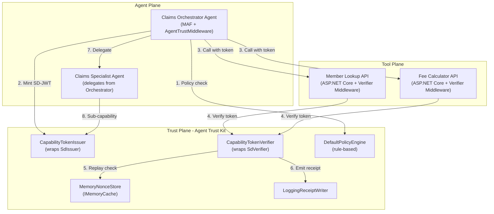
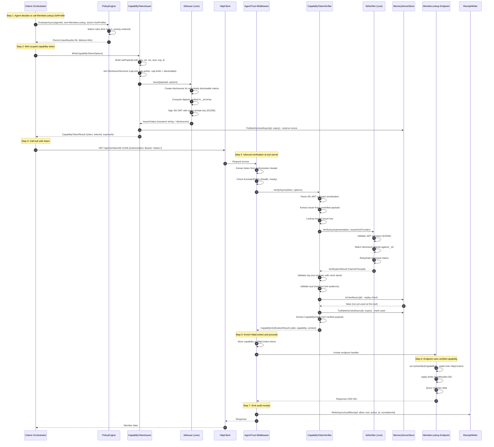

# Agent Trust Kit - End-to-End PoC: Financial Services Agent

## Document Information

| Field   | Value                                               |
| ------- | --------------------------------------------------- |
| Version | 1.0.0                                               |
| Status  | Draft Proposal                                      |
| Created | 2026-03-01                                          |
| Related | [PoC Use Cases](agent-trust-poc-usecases.md)        |
| Goal    | Runnable end-to-end PoC with minimum implementation |

> [!NOTE] > **AI Dependency Clarification:** The core PoC defined in this document focuses strictly on the **trust infrastructure** (SD-JWT minting, verification, policy, receipts). It uses a deterministic programmatic agent and **does NOT require an OpenAI key, Azure subscription, or any AI services to run**.
>
> An **Optional MAF Variant** is provided at the end of this document for teams that have AI API keys and want to test integration with the real Microsoft Agent Framework.

---

## Real-World Scenario

### Business Context

**Contoso Financial Services** operates a multi-agent system for insurance claim processing. The system consists of:

- **Claims Orchestrator Agent** - An MAF-based AI agent that coordinates the claim workflow
- **Member Lookup Tool** - An ASP.NET Core API that returns member profile and fee data
- **Fee Calculator Tool** - An ASP.NET Core API that computes applicable fees
- **Claims Specialist Agent** - A secondary agent that handles complex claim adjudication

**Problem:** Today these services use shared API keys. Any agent can call any tool with any scope. There is no per-action authorization, no audit trail, and a compromised key exposes everything.

**Solution:** Agent Trust Kit mints a scoped SD-JWT capability token for each call, verified at the tool, with audit receipts.

---

## Architecture

### System Diagram



### Project Structure (Minimum PoC)

```text
samples/AgentTrustKit.PoC/
    AgentTrustKit.PoC.sln

    src/
        AgentTrust.Core/                        # Minimum capability token engine
            AgentTrust.Core.csproj
            CapabilityClaim.cs                  # Capability claim model
            CapabilityContext.cs                # Context/correlation model
            CapabilityTokenIssuer.cs            # Wraps SdIssuer
            CapabilityTokenVerifier.cs          # Wraps SdVerifier
            CapabilityTokenResult.cs            # Issuance result
            CapabilityVerificationResult.cs     # Verification result
            INonceStore.cs                      # Replay prevention interface
            MemoryNonceStore.cs                 # In-memory implementation
            AuditReceipt.cs                     # Receipt model
            IReceiptWriter.cs                   # Receipt writer interface
            LoggingReceiptWriter.cs             # Logger-based implementation

        AgentTrust.Policy/                      # Minimum policy engine
            AgentTrust.Policy.csproj
            IPolicyEngine.cs                    # Policy interface
            PolicyRule.cs                       # Rule model
            PolicyDecision.cs                   # Decision result
            DefaultPolicyEngine.cs              # First-match rule engine
            PolicyBuilder.cs                    # Fluent builder

        AgentTrust.AspNetCore/                  # Minimum ASP.NET Core middleware
            AgentTrust.AspNetCore.csproj
            AgentTrustMiddleware.cs             # Verification middleware
            RequireCapabilityAttribute.cs       # Endpoint-level authorization
            HttpContextExtensions.cs            # GetVerifiedCapability()
            ServiceCollectionExtensions.cs      # DI registration

    apps/
        MemberLookupApi/                        # Tool server (ASP.NET Core)
            MemberLookupApi.csproj
            Program.cs
        FeeCalculatorApi/                       # Tool server (ASP.NET Core)
            FeeCalculatorApi.csproj
            Program.cs
        ClaimsOrchestratorAgent/                # Agent (console app, NO AI KEYS REQUIRED)
            ClaimsOrchestratorAgent.csproj
            Program.cs
        ClaimsOrchestratorAgent.Maf/            # Optional: Real MAF integration (OpenAI KEY REQUIRED)
            ClaimsOrchestratorAgent.Maf.csproj
            Program.cs

    tests/
        AgentTrust.Core.Tests/
            CapabilityTokenIssuerTests.cs
            CapabilityTokenVerifierTests.cs
            MemoryNonceStoreTests.cs
        AgentTrust.E2E.Tests/
            EndToEndFlowTests.cs
```

---

## Detailed Workflow: Agent-to-Tool Call

### Workflow Sequence (Step-by-Step)



---

## Minimum Implementation

### 1. CapabilityClaim.cs - Capability Model

```csharp
using System.Text.Json.Serialization;

namespace AgentTrust.Core;

/// <summary>
/// The capability scope embedded in the "cap" claim of an SD-JWT capability token.
/// </summary>
public record CapabilityClaim
{
    [JsonPropertyName("tool")]
    public required string Tool { get; init; }

    [JsonPropertyName("action")]
    public required string Action { get; init; }

    [JsonPropertyName("resource")]
    public string? Resource { get; init; }

    [JsonPropertyName("limits")]
    public CapabilityLimits? Limits { get; init; }

    [JsonPropertyName("purpose")]
    public string? Purpose { get; init; }
}

public record CapabilityLimits
{
    [JsonPropertyName("max_results")]
    public int? MaxResults { get; init; }

    [JsonPropertyName("max_invocations")]
    public int? MaxInvocations { get; init; }
}
```

### 2. CapabilityContext.cs - Correlation Model

```csharp
using System.Text.Json.Serialization;

namespace AgentTrust.Core;

/// <summary>
/// Execution context for workflow tracing. Embedded in the "ctx" claim.
/// </summary>
public record CapabilityContext
{
    [JsonPropertyName("correlation_id")]
    public required string CorrelationId { get; init; }

    [JsonPropertyName("workflow_id")]
    public string? WorkflowId { get; init; }

    [JsonPropertyName("step_id")]
    public string? StepId { get; init; }
}
```

### 3. INonceStore.cs + MemoryNonceStore.cs - Replay Prevention

```csharp
namespace AgentTrust.Core;

/// <summary>
/// Tracks token IDs to prevent replay attacks.
/// </summary>
public interface INonceStore
{
    Task<bool> TryMarkAsUsedAsync(string tokenId, DateTimeOffset expiry,
        CancellationToken ct = default);
    Task<bool> IsUsedAsync(string tokenId, CancellationToken ct = default);
}
```

```csharp
using Microsoft.Extensions.Caching.Memory;

namespace AgentTrust.Core;

/// <summary>
/// In-memory nonce store. Entries auto-evict after token expiry.
/// </summary>
public class MemoryNonceStore : INonceStore
{
    private readonly IMemoryCache _cache;

    public MemoryNonceStore(IMemoryCache cache)
    {
        _cache = cache ?? throw new ArgumentNullException(nameof(cache));
    }

    public Task<bool> TryMarkAsUsedAsync(string tokenId, DateTimeOffset expiry,
        CancellationToken ct = default)
    {
        // TryGetValue + Set is atomic enough for PoC; production needs distributed lock
        if (_cache.TryGetValue(tokenId, out _))
        {
            return Task.FromResult(false); // Already used
        }

        _cache.Set(tokenId, true, expiry);
        return Task.FromResult(true);
    }

    public Task<bool> IsUsedAsync(string tokenId, CancellationToken ct = default)
    {
        return Task.FromResult(_cache.TryGetValue(tokenId, out _));
    }
}
```

### 4. CapabilityTokenIssuer.cs - Wraps SdIssuer

This is the core of the PoC. It wraps the real `SdIssuer` from `SdJwt.Net`:

```csharp
using System.IdentityModel.Tokens.Jwt;
using System.Text.Json;
using Microsoft.Extensions.Logging;
using Microsoft.Extensions.Logging.Abstractions;
using Microsoft.IdentityModel.Tokens;
using SdJwt.Net.Issuer;

namespace AgentTrust.Core;

public record CapabilityTokenOptions
{
    public required string Issuer { get; init; }
    public required string Audience { get; init; }
    public required CapabilityClaim Capability { get; init; }
    public required CapabilityContext Context { get; init; }
    public TimeSpan Lifetime { get; init; } = TimeSpan.FromSeconds(60);
}

public record CapabilityTokenResult
{
    public required string Token { get; init; }
    public required string TokenId { get; init; }
    public required DateTimeOffset ExpiresAt { get; init; }
}

/// <summary>
/// Mints SD-JWT capability tokens by delegating to <see cref="SdIssuer"/>.
///
/// The token payload structure:
///   iss  - agent identity (always visible)
///   aud  - tool/agent audience (always visible)
///   iat  - issued-at (always visible)
///   exp  - expiry (always visible)
///   jti  - unique token ID (always visible)
///   cap  - capability object (selectively disclosable sub-claims)
///   ctx  - context object (selectively disclosable sub-claims)
/// </summary>
public class CapabilityTokenIssuer
{
    private readonly SdIssuer _sdIssuer;
    private readonly INonceStore _nonceStore;
    private readonly ILogger<CapabilityTokenIssuer> _logger;

    public CapabilityTokenIssuer(
        SecurityKey signingKey,
        string signingAlgorithm,
        INonceStore nonceStore,
        ILogger<CapabilityTokenIssuer>? logger = null)
    {
        _sdIssuer = new SdIssuer(signingKey, signingAlgorithm);
        _nonceStore = nonceStore ?? throw new ArgumentNullException(nameof(nonceStore));
        _logger = logger ?? NullLogger<CapabilityTokenIssuer>.Instance;
    }

    public CapabilityTokenResult Mint(CapabilityTokenOptions options)
    {
        ArgumentNullException.ThrowIfNull(options);
        ArgumentException.ThrowIfNullOrWhiteSpace(options.Issuer);
        ArgumentException.ThrowIfNullOrWhiteSpace(options.Audience);

        var now = DateTimeOffset.UtcNow;
        var expires = now.Add(options.Lifetime);
        var jti = Guid.NewGuid().ToString("N");

        // Build the JWT payload with capability and context as nested objects
        var capJson = JsonSerializer.Serialize(options.Capability);
        var ctxJson = JsonSerializer.Serialize(options.Context);

        var claims = new JwtPayload
        {
            { "iss", options.Issuer },
            { "aud", options.Audience },
            { "iat", now.ToUnixTimeSeconds() },
            { "exp", expires.ToUnixTimeSeconds() },
            { "jti", jti },
            { "cap", JsonSerializer.Deserialize<Dictionary<string, object>>(capJson) },
            { "ctx", JsonSerializer.Deserialize<Dictionary<string, object>>(ctxJson) }
        };

        // Make cap sub-claims selectively disclosable:
        // tool and action are always disclosed (tool needs them),
        // resource and limits are disclosable (tool may or may not need them),
        // context sub-claims (workflow_id, step_id) are disclosable.
        var disclosureStructure = new
        {
            cap = new
            {
                resource = options.Capability.Resource != null,
                limits = options.Capability.Limits != null,
                purpose = options.Capability.Purpose != null
            },
            ctx = new
            {
                workflow_id = options.Context.WorkflowId != null,
                step_id = options.Context.StepId != null
            }
        };

        var issuanceOptions = new SdIssuanceOptions
        {
            DisclosureStructure = disclosureStructure
        };

        // Delegate to the real SdIssuer from SdJwt.Net
        var output = _sdIssuer.Issue(claims, issuanceOptions);

        _logger.LogInformation(
            "Minted capability token {Jti} for {Tool}.{Action} -> {Audience}, expires {Expiry}",
            jti, options.Capability.Tool, options.Capability.Action,
            options.Audience, expires);

        return new CapabilityTokenResult
        {
            Token = output.Issuance,
            TokenId = jti,
            ExpiresAt = expires
        };
    }
}
```

### 5. CapabilityTokenVerifier.cs - Wraps SdVerifier

```csharp
using System.IdentityModel.Tokens.Jwt;
using System.Security.Claims;
using System.Text.Json;
using Microsoft.Extensions.Logging;
using Microsoft.Extensions.Logging.Abstractions;
using Microsoft.IdentityModel.Tokens;
using SdJwt.Net.Verifier;

namespace AgentTrust.Core;

public record CapabilityVerificationOptions
{
    public required string ExpectedAudience { get; init; }
    public required IReadOnlyDictionary<string, SecurityKey> TrustedIssuers { get; init; }
    public bool EnforceReplayPrevention { get; init; } = true;
    public TimeSpan ClockSkewTolerance { get; init; } = TimeSpan.FromSeconds(30);
}

public record CapabilityVerificationResult
{
    public bool IsValid { get; init; }
    public string? Error { get; init; }
    public string? ErrorCode { get; init; }
    public CapabilityClaim? Capability { get; init; }
    public CapabilityContext? Context { get; init; }
    public string? TokenId { get; init; }
    public string? Issuer { get; init; }

    public static CapabilityVerificationResult Success(
        CapabilityClaim capability, CapabilityContext context,
        string tokenId, string issuer) => new()
    {
        IsValid = true, Capability = capability, Context = context,
        TokenId = tokenId, Issuer = issuer
    };

    public static CapabilityVerificationResult Failure(
        string error, string errorCode) => new()
    {
        IsValid = false, Error = error, ErrorCode = errorCode
    };
}

/// <summary>
/// Verifies SD-JWT capability tokens by delegating to <see cref="SdVerifier"/>.
/// Performs: signature verification -> claim extraction -> audience check ->
///           expiry check -> replay prevention -> capability extraction.
/// </summary>
public class CapabilityTokenVerifier
{
    private readonly INonceStore _nonceStore;
    private readonly ILogger<CapabilityTokenVerifier> _logger;

    public CapabilityTokenVerifier(
        INonceStore nonceStore,
        ILogger<CapabilityTokenVerifier>? logger = null)
    {
        _nonceStore = nonceStore ?? throw new ArgumentNullException(nameof(nonceStore));
        _logger = logger ?? NullLogger<CapabilityTokenVerifier>.Instance;
    }

    public async Task<CapabilityVerificationResult> VerifyAsync(
        string token,
        CapabilityVerificationOptions options,
        CancellationToken ct = default)
    {
        ArgumentException.ThrowIfNullOrWhiteSpace(token);
        ArgumentNullException.ThrowIfNull(options);

        try
        {
            // Step 1: Parse the SD-JWT to extract the unverified issuer
            // The SD-JWT format is: <jwt>~<disclosure1>~<disclosure2>~...~
            var jwtPart = token.Split('~')[0];
            var unverifiedJwt = new JwtSecurityToken(jwtPart);
            var issuer = unverifiedJwt.Issuer;

            if (string.IsNullOrEmpty(issuer) ||
                !options.TrustedIssuers.TryGetValue(issuer, out var issuerKey))
            {
                return CapabilityVerificationResult.Failure(
                    $"Untrusted issuer: {issuer}", "untrusted_issuer");
            }

            // Step 2: Verify using SdVerifier with the trusted issuer key
            var sdVerifier = new SdVerifier(
                (_, _) => Task.FromResult<SecurityKey>(issuerKey));

            var verificationResult = await sdVerifier.VerifyAsync(token);
            var principal = verificationResult.ClaimsPrincipal;

            // Step 3: Validate audience
            var aud = principal.FindFirst("aud")?.Value;
            if (aud != options.ExpectedAudience)
            {
                return CapabilityVerificationResult.Failure(
                    $"Audience mismatch: expected {options.ExpectedAudience}, got {aud}",
                    "audience_mismatch");
            }

            // Step 4: Validate expiry
            var expClaim = principal.FindFirst("exp")?.Value;
            if (expClaim != null)
            {
                var expiry = DateTimeOffset.FromUnixTimeSeconds(long.Parse(expClaim));
                if (DateTimeOffset.UtcNow > expiry.Add(options.ClockSkewTolerance))
                {
                    return CapabilityVerificationResult.Failure(
                        "Token has expired", "token_expired");
                }
            }

            // Step 5: Replay prevention
            var jti = principal.FindFirst("jti")?.Value;
            if (string.IsNullOrEmpty(jti))
            {
                return CapabilityVerificationResult.Failure(
                    "Token missing jti claim", "missing_jti");
            }

            if (options.EnforceReplayPrevention)
            {
                var expiry = expClaim != null
                    ? DateTimeOffset.FromUnixTimeSeconds(long.Parse(expClaim))
                    : DateTimeOffset.UtcNow.AddMinutes(5);

                var isNew = await _nonceStore.TryMarkAsUsedAsync(jti, expiry, ct);
                if (!isNew)
                {
                    return CapabilityVerificationResult.Failure(
                        "Token has already been used (replay detected)", "token_replayed");
                }
            }

            // Step 6: Extract capability and context claims
            var capClaim = ExtractClaim<CapabilityClaim>(principal, "cap");
            var ctxClaim = ExtractClaim<CapabilityContext>(principal, "ctx");

            if (capClaim == null)
            {
                return CapabilityVerificationResult.Failure(
                    "Token missing capability (cap) claim", "missing_capability");
            }
            if (ctxClaim == null)
            {
                return CapabilityVerificationResult.Failure(
                    "Token missing context (ctx) claim", "missing_context");
            }

            _logger.LogInformation(
                "Verified capability token {Jti}: {Tool}.{Action} from {Issuer}",
                jti, capClaim.Tool, capClaim.Action, issuer);

            return CapabilityVerificationResult.Success(capClaim, ctxClaim, jti, issuer);
        }
        catch (Exception ex)
        {
            _logger.LogError(ex, "Capability token verification failed");
            return CapabilityVerificationResult.Failure(
                ex.Message, "verification_error");
        }
    }

    private static T? ExtractClaim<T>(ClaimsPrincipal principal, string claimType)
        where T : class
    {
        var claimValue = principal.FindFirst(claimType)?.Value;
        if (string.IsNullOrEmpty(claimValue))
            return null;

        try
        {
            return JsonSerializer.Deserialize<T>(claimValue);
        }
        catch
        {
            return null;
        }
    }
}
```

### 6. AuditReceipt.cs - Audit Trail

```csharp
using Microsoft.Extensions.Logging;

namespace AgentTrust.Core;

public enum ReceiptDecision { Allow, Deny }

public record AuditReceipt
{
    public required string TokenId { get; init; }
    public required DateTimeOffset Timestamp { get; init; }
    public required ReceiptDecision Decision { get; init; }
    public required string Tool { get; init; }
    public required string Action { get; init; }
    public required string CorrelationId { get; init; }
    public string? DenyReason { get; init; }
    public long? DurationMs { get; init; }
}

public interface IReceiptWriter
{
    Task WriteAsync(AuditReceipt receipt, CancellationToken ct = default);
}

/// <summary>
/// Writes receipts as structured log entries. Production: swap for DB/event sink.
/// </summary>
public class LoggingReceiptWriter : IReceiptWriter
{
    private readonly ILogger<LoggingReceiptWriter> _logger;

    public LoggingReceiptWriter(ILogger<LoggingReceiptWriter> logger)
    {
        _logger = logger;
    }

    public Task WriteAsync(AuditReceipt receipt, CancellationToken ct = default)
    {
        _logger.LogInformation(
            "AUDIT RECEIPT | Decision={Decision} | Tool={Tool} | Action={Action} | " +
            "TokenId={TokenId} | CorrelationId={CorrelationId} | DenyReason={DenyReason} | " +
            "Duration={DurationMs}ms | Timestamp={Timestamp:O}",
            receipt.Decision, receipt.Tool, receipt.Action,
            receipt.TokenId, receipt.CorrelationId, receipt.DenyReason,
            receipt.DurationMs, receipt.Timestamp);

        return Task.CompletedTask;
    }
}
```

### 7. DefaultPolicyEngine.cs - Rule-Based Authorization

```csharp
using Microsoft.Extensions.Logging;
using Microsoft.Extensions.Logging.Abstractions;

namespace AgentTrust.Policy;

public interface IPolicyEngine
{
    Task<PolicyDecision> EvaluateAsync(PolicyRequest request,
        CancellationToken ct = default);
}

public record PolicyRequest
{
    public required string AgentId { get; init; }
    public required string Tool { get; init; }
    public required string Action { get; init; }
    public string? Resource { get; init; }
}

public record PolicyDecision
{
    public required bool IsPermitted { get; init; }
    public string? DenialReason { get; init; }
    public string? DenialCode { get; init; }
    public int? MaxResults { get; init; }
    public TimeSpan? MaxTokenLifetime { get; init; }

    public static PolicyDecision Permit(int? maxResults = null,
        TimeSpan? maxLifetime = null) => new()
    {
        IsPermitted = true,
        MaxResults = maxResults,
        MaxTokenLifetime = maxLifetime
    };

    public static PolicyDecision Deny(string reason, string code) => new()
    {
        IsPermitted = false,
        DenialReason = reason,
        DenialCode = code
    };
}

public enum PolicyEffect { Allow, Deny }

public record PolicyRule(
    string Name,
    string AgentPattern,
    string ToolPattern,
    string ActionPattern,
    PolicyEffect Effect,
    int? MaxResults = null,
    TimeSpan? MaxTokenLifetime = null,
    int Priority = 0);

/// <summary>
/// Evaluates rules in priority order, first match wins. Default: deny.
/// </summary>
public class DefaultPolicyEngine : IPolicyEngine
{
    private readonly IReadOnlyList<PolicyRule> _rules;
    private readonly ILogger<DefaultPolicyEngine> _logger;

    public DefaultPolicyEngine(
        IReadOnlyList<PolicyRule> rules,
        ILogger<DefaultPolicyEngine>? logger = null)
    {
        _rules = rules.OrderByDescending(r => r.Priority).ToList();
        _logger = logger ?? NullLogger<DefaultPolicyEngine>.Instance;
    }

    public Task<PolicyDecision> EvaluateAsync(PolicyRequest request,
        CancellationToken ct = default)
    {
        foreach (var rule in _rules)
        {
            if (Matches(rule.AgentPattern, request.AgentId) &&
                Matches(rule.ToolPattern, request.Tool) &&
                Matches(rule.ActionPattern, request.Action))
            {
                _logger.LogInformation(
                    "Policy rule '{Rule}' matched: {Agent} -> {Tool}.{Action} = {Effect}",
                    rule.Name, request.AgentId, request.Tool, request.Action, rule.Effect);

                return Task.FromResult(rule.Effect == PolicyEffect.Allow
                    ? PolicyDecision.Permit(rule.MaxResults, rule.MaxTokenLifetime)
                    : PolicyDecision.Deny($"Denied by rule: {rule.Name}", "policy_denied"));
            }
        }

        _logger.LogWarning(
            "No policy rule matched for {Agent} -> {Tool}.{Action}. Default: DENY.",
            request.AgentId, request.Tool, request.Action);

        return Task.FromResult(
            PolicyDecision.Deny("No matching policy rule (default deny)", "no_rule_match"));
    }

    private static bool Matches(string pattern, string value)
    {
        if (pattern == "*") return true;
        if (pattern.EndsWith("*"))
            return value.StartsWith(pattern[..^1], StringComparison.OrdinalIgnoreCase);
        return string.Equals(pattern, value, StringComparison.OrdinalIgnoreCase);
    }
}
```

### 8. AgentTrustMiddleware.cs - ASP.NET Core Inbound Verification

```csharp
using AgentTrust.Core;
using Microsoft.AspNetCore.Http;
using Microsoft.Extensions.Logging;

namespace AgentTrust.AspNetCore;

public record AgentTrustOptions
{
    public required string Audience { get; init; }
    public required CapabilityVerificationOptions VerificationOptions { get; init; }
    public HashSet<string> ExcludedPaths { get; init; } = new() { "/health", "/ready" };
    public string HeaderName { get; init; } = "Authorization";
    public string HeaderPrefix { get; init; } = "SdJwt";
    public bool EmitReceipts { get; init; } = true;
}

public class AgentTrustMiddleware
{
    private readonly RequestDelegate _next;
    private readonly CapabilityTokenVerifier _verifier;
    private readonly IReceiptWriter _receiptWriter;
    private readonly AgentTrustOptions _options;
    private readonly ILogger<AgentTrustMiddleware> _logger;

    private const string CapabilityKey = "AgentTrust.Capability";
    private const string ContextKey = "AgentTrust.Context";
    private const string IssuerKey = "AgentTrust.Issuer";

    public AgentTrustMiddleware(
        RequestDelegate next,
        CapabilityTokenVerifier verifier,
        IReceiptWriter receiptWriter,
        AgentTrustOptions options,
        ILogger<AgentTrustMiddleware> logger)
    {
        _next = next;
        _verifier = verifier;
        _receiptWriter = receiptWriter;
        _options = options;
        _logger = logger;
    }

    public async Task InvokeAsync(HttpContext context)
    {
        var path = context.Request.Path.Value ?? "";

        // Skip excluded paths
        if (_options.ExcludedPaths.Any(p =>
            path.Equals(p, StringComparison.OrdinalIgnoreCase)))
        {
            await _next(context);
            return;
        }

        // Extract token
        var authHeader = context.Request.Headers[_options.HeaderName].FirstOrDefault();
        if (string.IsNullOrEmpty(authHeader) ||
            !authHeader.StartsWith($"{_options.HeaderPrefix} "))
        {
            context.Response.StatusCode = 401;
            await context.Response.WriteAsJsonAsync(new
            {
                error = "missing_capability_token",
                message = "Authorization header with Bearer token required"
            });
            return;
        }

        var token = authHeader[(_options.HeaderPrefix.Length + 1)..];
        var sw = System.Diagnostics.Stopwatch.StartNew();

        // Verify
        var result = await _verifier.VerifyAsync(token, _options.VerificationOptions);
        sw.Stop();

        if (!result.IsValid)
        {
            _logger.LogWarning("Capability token verification failed: {Error}", result.Error);

            if (_options.EmitReceipts && result.TokenId != null)
            {
                await _receiptWriter.WriteAsync(new AuditReceipt
                {
                    TokenId = result.TokenId ?? "unknown",
                    Timestamp = DateTimeOffset.UtcNow,
                    Decision = ReceiptDecision.Deny,
                    Tool = "unknown",
                    Action = "unknown",
                    CorrelationId = "unknown",
                    DenyReason = result.ErrorCode,
                    DurationMs = sw.ElapsedMilliseconds
                });
            }

            context.Response.StatusCode = 403;
            await context.Response.WriteAsJsonAsync(new
            {
                error = result.ErrorCode,
                message = result.Error
            });
            return;
        }

        // Enrich HttpContext
        context.Items[CapabilityKey] = result.Capability;
        context.Items[ContextKey] = result.Context;
        context.Items[IssuerKey] = result.Issuer;

        // Proceed to endpoint
        await _next(context);

        // Emit success receipt
        if (_options.EmitReceipts)
        {
            await _receiptWriter.WriteAsync(new AuditReceipt
            {
                TokenId = result.TokenId!,
                Timestamp = DateTimeOffset.UtcNow,
                Decision = ReceiptDecision.Allow,
                Tool = result.Capability!.Tool,
                Action = result.Capability.Action,
                CorrelationId = result.Context!.CorrelationId,
                DurationMs = sw.ElapsedMilliseconds
            });
        }
    }
}

/// <summary>
/// HttpContext extension methods for accessing verified capability data.
/// </summary>
public static class HttpContextExtensions
{
    public static CapabilityClaim? GetVerifiedCapability(this HttpContext ctx)
        => ctx.Items["AgentTrust.Capability"] as CapabilityClaim;

    public static CapabilityContext? GetCapabilityContext(this HttpContext ctx)
        => ctx.Items["AgentTrust.Context"] as CapabilityContext;

    public static string? GetAgentIssuer(this HttpContext ctx)
        => ctx.Items["AgentTrust.Issuer"] as string;
}
```

### 9. MemberLookupApi - Protected Tool Server

```csharp
// apps/MemberLookupApi/Program.cs
using System.Security.Cryptography;
using AgentTrust.AspNetCore;
using AgentTrust.Core;
using Microsoft.Extensions.Caching.Memory;
using Microsoft.IdentityModel.Tokens;

var builder = WebApplication.CreateBuilder(args);

// Load agent public keys (in production, from JWKS endpoint or config)
var agentPublicKeyJson = builder.Configuration["AgentTrust:OrchestratorPublicKey"]
    ?? throw new InvalidOperationException("Agent public key not configured");
var agentPublicKey = JsonWebKey.Create(agentPublicKeyJson);

// Register services
var nonceStore = new MemoryNonceStore(new MemoryCache(new MemoryCacheOptions()));
var verifier = new CapabilityTokenVerifier(nonceStore);
var receiptWriter = new LoggingReceiptWriter(
    builder.Services.BuildServiceProvider().GetRequiredService<ILogger<LoggingReceiptWriter>>());

var trustOptions = new AgentTrustOptions
{
    Audience = "tool://member-lookup",
    VerificationOptions = new CapabilityVerificationOptions
    {
        ExpectedAudience = "tool://member-lookup",
        TrustedIssuers = new Dictionary<string, SecurityKey>
        {
            ["agent://claims-orchestrator"] = agentPublicKey
        }
    }
};

var app = builder.Build();

// Add Agent Trust verification middleware
app.UseMiddleware<AgentTrustMiddleware>(verifier, receiptWriter, trustOptions,
    app.Services.GetRequiredService<ILogger<AgentTrustMiddleware>>());

// Health check (excluded from verification)
app.MapGet("/health", () => Results.Ok(new { status = "healthy" }));

// Protected endpoint - requires MemberLookup.GetProfile capability
app.MapGet("/api/members/{memberId}", (string memberId, HttpContext ctx) =>
{
    var capability = ctx.GetVerifiedCapability();
    var context = ctx.GetCapabilityContext();
    var agentIssuer = ctx.GetAgentIssuer();

    // Enforce tool+action match
    if (capability?.Tool != "MemberLookup" || capability.Action != "GetProfile")
    {
        return Results.Json(new { error = "insufficient_capability",
            message = $"Required: MemberLookup.GetProfile, got: {capability?.Tool}.{capability?.Action}" },
            statusCode: 403);
    }

    // Enforce limits
    var maxResults = capability.Limits?.MaxResults ?? 100;

    // Simulate member lookup
    var member = new
    {
        MemberId = memberId,
        Name = "Jane Doe",
        Plan = "Gold",
        JoinDate = "2023-01-15",
        Fees = new[]
        {
            new { Type = "Annual", Amount = 250.00m },
            new { Type = "Processing", Amount = 15.00m }
        },
        AgentInfo = new
        {
            RequestedBy = agentIssuer,
            CorrelationId = context?.CorrelationId,
            LimitApplied = maxResults
        }
    };

    return Results.Ok(member);
});

// Protected endpoint - requires MemberLookup.GetFees capability
app.MapGet("/api/members/{memberId}/fees", (string memberId, HttpContext ctx) =>
{
    var capability = ctx.GetVerifiedCapability();

    if (capability?.Tool != "MemberLookup" || capability.Action != "GetFees")
    {
        return Results.Json(new { error = "insufficient_capability" }, statusCode: 403);
    }

    var fees = new[]
    {
        new { Type = "Annual", Amount = 250.00m, DueDate = "2026-03-01" },
        new { Type = "Processing", Amount = 15.00m, DueDate = "2026-03-01" },
        new { Type = "Late Fee", Amount = 25.00m, DueDate = "2026-02-15" }
    };

    var maxResults = capability.Limits?.MaxResults ?? fees.Length;
    return Results.Ok(fees.Take(maxResults));
});

app.Run();
```

### 10. ClaimsOrchestratorAgent - Agent Console App

```csharp
// apps/ClaimsOrchestratorAgent/Program.cs
using System.Security.Cryptography;
using System.Text.Json;
using AgentTrust.Core;
using AgentTrust.Policy;
using Microsoft.Extensions.Caching.Memory;
using Microsoft.Extensions.Logging;
using Microsoft.IdentityModel.Tokens;

// =====================================================
// BOOTSTRAP: Agent identity + key setup
// =====================================================

using var loggerFactory = LoggerFactory.Create(b => b.AddConsole().SetMinimumLevel(LogLevel.Information));
var logger = loggerFactory.CreateLogger<Program>();

logger.LogInformation("=== Claims Orchestrator Agent starting ===");

// Generate agent signing key pair (in production, use HSM/Key Vault)
using var ecdsa = ECDsa.Create(ECCurve.NamedCurves.nistP256);
var agentPrivateKey = new ECDsaSecurityKey(ecdsa) { KeyId = "orchestrator-key-1" };

// Initialize infrastructure
var nonceStore = new MemoryNonceStore(new MemoryCache(new MemoryCacheOptions()));
var receiptWriter = new LoggingReceiptWriter(loggerFactory.CreateLogger<LoggingReceiptWriter>());
var issuer = new CapabilityTokenIssuer(
    agentPrivateKey, SecurityAlgorithms.EcdsaSha256, nonceStore,
    loggerFactory.CreateLogger<CapabilityTokenIssuer>());

// =====================================================
// POLICY: Define what this agent is allowed to do
// =====================================================

var policyRules = new List<PolicyRule>
{
    new("Allow MemberLookup",
        AgentPattern: "agent://claims-orchestrator",
        ToolPattern: "MemberLookup",
        ActionPattern: "*",
        Effect: PolicyEffect.Allow,
        MaxResults: 50,
        MaxTokenLifetime: TimeSpan.FromSeconds(60)),

    new("Allow FeeCalculator reads",
        AgentPattern: "agent://claims-orchestrator",
        ToolPattern: "FeeCalculator",
        ActionPattern: "Calculate",
        Effect: PolicyEffect.Allow,
        MaxTokenLifetime: TimeSpan.FromSeconds(30)),

    new("Block admin tools",
        AgentPattern: "*",
        ToolPattern: "AdminConsole",
        ActionPattern: "*",
        Effect: PolicyEffect.Deny,
        Priority: 100)
};

var policyEngine = new DefaultPolicyEngine(policyRules,
    loggerFactory.CreateLogger<DefaultPolicyEngine>());

var correlationId = Guid.NewGuid().ToString("N")[..12];

// =====================================================
// SCENARIO 1: Successful member lookup
// =====================================================

logger.LogInformation("--- Scenario 1: Agent calls MemberLookup.GetProfile ---");

// Step 1: Check policy
var decision = await policyEngine.EvaluateAsync(new PolicyRequest
{
    AgentId = "agent://claims-orchestrator",
    Tool = "MemberLookup",
    Action = "GetProfile"
});

if (decision.IsPermitted)
{
    logger.LogInformation("Policy: PERMIT (maxResults={Max}, lifetime={Lifetime}s)",
        decision.MaxResults, decision.MaxTokenLifetime?.TotalSeconds);

    // Step 2: Mint capability token
    var tokenResult = issuer.Mint(new CapabilityTokenOptions
    {
        Issuer = "agent://claims-orchestrator",
        Audience = "tool://member-lookup",
        Capability = new CapabilityClaim
        {
            Tool = "MemberLookup",
            Action = "GetProfile",
            Resource = "member:M-12345",
            Limits = new CapabilityLimits { MaxResults = decision.MaxResults }
        },
        Context = new CapabilityContext
        {
            CorrelationId = correlationId,
            WorkflowId = "claim-processing-001",
            StepId = "step-1-member-lookup"
        },
        Lifetime = decision.MaxTokenLifetime ?? TimeSpan.FromSeconds(60)
    });

    logger.LogInformation("Minted token: id={Id}, expires={Exp}",
        tokenResult.TokenId, tokenResult.ExpiresAt);

    // Step 3: Call tool with token
    // In a real deployment, this would be an HTTP call:
    //   httpClient.DefaultRequestHeaders.Add("Authorization", $"Bearer {tokenResult.Token}");
    //   var response = await httpClient.GetAsync("http://member-lookup/api/members/M-12345");

    logger.LogInformation("Token attached to request: Authorization: Bearer <{Len} chars>",
        tokenResult.Token.Length);

    // Step 4: Verify the token (simulating tool-side verification)
    var verifier = new CapabilityTokenVerifier(nonceStore,
        loggerFactory.CreateLogger<CapabilityTokenVerifier>());

    var verifyResult = await verifier.VerifyAsync(tokenResult.Token,
        new CapabilityVerificationOptions
        {
            ExpectedAudience = "tool://member-lookup",
            TrustedIssuers = new Dictionary<string, SecurityKey>
            {
                ["agent://claims-orchestrator"] = agentPrivateKey
            }
        });

    if (verifyResult.IsValid)
    {
        logger.LogInformation("VERIFIED: tool={Tool}, action={Action}, limits.maxResults={Max}",
            verifyResult.Capability!.Tool, verifyResult.Capability.Action,
            verifyResult.Capability.Limits?.MaxResults);

        // Step 5: Emit receipt
        await receiptWriter.WriteAsync(new AuditReceipt
        {
            TokenId = verifyResult.TokenId!,
            Timestamp = DateTimeOffset.UtcNow,
            Decision = ReceiptDecision.Allow,
            Tool = verifyResult.Capability.Tool,
            Action = verifyResult.Capability.Action,
            CorrelationId = verifyResult.Context!.CorrelationId
        });
    }
    else
    {
        logger.LogError("Verification FAILED: {Error}", verifyResult.Error);
    }
}

// =====================================================
// SCENARIO 2: Replay prevention
// =====================================================

logger.LogInformation("--- Scenario 2: Replay prevention ---");

var replayToken = issuer.Mint(new CapabilityTokenOptions
{
    Issuer = "agent://claims-orchestrator",
    Audience = "tool://member-lookup",
    Capability = new CapabilityClaim { Tool = "MemberLookup", Action = "GetProfile" },
    Context = new CapabilityContext { CorrelationId = correlationId },
    Lifetime = TimeSpan.FromSeconds(60)
});

var verifier2 = new CapabilityTokenVerifier(nonceStore,
    loggerFactory.CreateLogger<CapabilityTokenVerifier>());
var opts = new CapabilityVerificationOptions
{
    ExpectedAudience = "tool://member-lookup",
    TrustedIssuers = new Dictionary<string, SecurityKey>
    {
        ["agent://claims-orchestrator"] = agentPrivateKey
    }
};

var firstUse = await verifier2.VerifyAsync(replayToken.Token, opts);
logger.LogInformation("First use: valid={Valid}", firstUse.IsValid);

var replayAttempt = await verifier2.VerifyAsync(replayToken.Token, opts);
logger.LogInformation("Replay attempt: valid={Valid}, error={Error}",
    replayAttempt.IsValid, replayAttempt.ErrorCode);

// =====================================================
// SCENARIO 3: Policy denial
// =====================================================

logger.LogInformation("--- Scenario 3: Policy denies AdminConsole access ---");

var adminDecision = await policyEngine.EvaluateAsync(new PolicyRequest
{
    AgentId = "agent://claims-orchestrator",
    Tool = "AdminConsole",
    Action = "DeleteAll"
});

logger.LogInformation("AdminConsole decision: permitted={P}, reason={R}",
    adminDecision.IsPermitted, adminDecision.DenialReason);

// =====================================================
// SCENARIO 4: Expired token
// =====================================================

logger.LogInformation("--- Scenario 4: Token expiry containment ---");

var shortToken = issuer.Mint(new CapabilityTokenOptions
{
    Issuer = "agent://claims-orchestrator",
    Audience = "tool://member-lookup",
    Capability = new CapabilityClaim { Tool = "MemberLookup", Action = "GetProfile" },
    Context = new CapabilityContext { CorrelationId = correlationId },
    Lifetime = TimeSpan.FromSeconds(1) // Expires in 1 second
});

logger.LogInformation("Waiting 2 seconds for token to expire...");
await Task.Delay(TimeSpan.FromSeconds(2));

var expiredResult = await verifier2.VerifyAsync(shortToken.Token,
    new CapabilityVerificationOptions
    {
        ExpectedAudience = "tool://member-lookup",
        TrustedIssuers = new Dictionary<string, SecurityKey>
        {
            ["agent://claims-orchestrator"] = agentPrivateKey
        },
        ClockSkewTolerance = TimeSpan.Zero // Strict for demo
    });

logger.LogInformation("Expired token: valid={Valid}, error={Error}",
    expiredResult.IsValid, expiredResult.ErrorCode);

logger.LogInformation("=== All scenarios complete ===");
```

---

## Expected Console Output

```text
info: === Claims Orchestrator Agent starting ===

info: --- Scenario 1: Agent calls MemberLookup.GetProfile ---
info: Policy rule 'Allow MemberLookup' matched: agent://claims-orchestrator -> MemberLookup.GetProfile = Allow
info: Policy: PERMIT (maxResults=50, lifetime=60s)
info: Minted capability token abc123 for MemberLookup.GetProfile -> tool://member-lookup, expires 2026-03-01T14:01:00Z
info: Minted token: id=abc123, expires=2026-03-01T14:01:00+00:00
info: Token attached to request: Authorization: Bearer <842 chars>
info: Verified capability token abc123: MemberLookup.GetProfile from agent://claims-orchestrator
info: VERIFIED: tool=MemberLookup, action=GetProfile, limits.maxResults=50
info: AUDIT RECEIPT | Decision=Allow | Tool=MemberLookup | Action=GetProfile | TokenId=abc123 | CorrelationId=a1b2c3d4e5f6

info: --- Scenario 2: Replay prevention ---
info: First use: valid=True
info: Replay attempt: valid=False, error=token_replayed

info: --- Scenario 3: Policy denies AdminConsole access ---
info: Policy rule 'Block admin tools' matched: agent://claims-orchestrator -> AdminConsole.DeleteAll = Deny
info: AdminConsole decision: permitted=False, reason=Denied by rule: Block admin tools

info: --- Scenario 4: Token expiry containment ---
info: Waiting 2 seconds for token to expire...
info: Expired token: valid=False, error=token_expired

info: === All scenarios complete ===
```

---

## What the PoC Proves

| Capability                        | Scenario | How It's Proven                                                                                 |
| --------------------------------- | -------- | ----------------------------------------------------------------------------------------------- |
| SD-JWT capability token minting   | 1        | `CapabilityTokenIssuer.Mint()` delegates to real `SdIssuer.Issue()`                             |
| Selective disclosure              | 1        | `resource`, `limits`, `workflow_id`, `step_id` are disclosable; `tool`, `action` always visible |
| Cryptographic verification        | 1        | `CapabilityTokenVerifier` delegates to real `SdVerifier.VerifyAsync()`                          |
| Audience enforcement              | 1        | Token rejected if `aud` does not match tool identity                                            |
| Per-action authorization          | 1        | Tool checks `capability.Tool` + `capability.Action` match                                       |
| Limits enforcement                | 1        | Tool reads `MaxResults` from verified capability and applies to query                           |
| Policy-driven authorization       | 1, 3     | `DefaultPolicyEngine` allows MemberLookup, denies AdminConsole                                  |
| Replay prevention                 | 2        | `MemoryNonceStore` blocks duplicate `jti` on second use                                         |
| Expiry-based containment          | 4        | Token with 1s lifetime rejected after 2s delay                                                  |
| Audit trail with correlation      | 1        | `LoggingReceiptWriter` emits structured receipt with `CorrelationId`                            |
| Zero changes to existing packages | All      | Implementation uses `SdIssuer`/`SdVerifier` from existing `SdJwt.Net` as-is                     |
| Default-deny security             | 3        | No matching rule results in automatic denial                                                    |

---

## Running the PoC

### Prerequisites

```shell
dotnet --version  # Requires .NET 8.0+
```

### Steps

```shell
# 1. Clone and navigate
cd sd-jwt-dotnet

# 2. Build core library (already exists)
dotnet build src/SdJwt.Net/SdJwt.Net.csproj

# 3. Build and run the agent console app
cd samples/AgentTrustKit.PoC/apps/ClaimsOrchestratorAgent
dotnet run

# 4. (Optional) Start the tool server in a separate terminal
cd samples/AgentTrustKit.PoC/apps/MemberLookupApi
dotnet run --urls "http://localhost:5100"

# 5. (Optional) Run end-to-end tests
cd samples/AgentTrustKit.PoC/tests/AgentTrust.E2E.Tests
dotnet test
```

---

## Estimated Effort

| Component               | Files  | Est. Lines | Est. Time    |
| ----------------------- | ------ | ---------- | ------------ |
| AgentTrust.Core         | 8      | ~450       | 3 days       |
| AgentTrust.Policy       | 3      | ~120       | 1 day        |
| AgentTrust.AspNetCore   | 3      | ~180       | 1.5 days     |
| MemberLookupApi         | 1      | ~80        | 0.5 days     |
| ClaimsOrchestratorAgent | 1      | ~200       | 1 day        |
| ClaimsOrchestrator.Maf  | 1      | ~100       | 0.5 days     |
| Tests                   | 3      | ~300       | 2 days       |
| **Total**               | **20** | **~1430**  | **9.5 days** |

---

## Appendix: Optional MAF Variant (Requires AI Key)

For teams that want to test the Agent Trust Kit with the actual Microsoft Agent Framework (MAF) and a real LLM, an optional project `ClaimsOrchestratorAgent.Maf` can be added.

**Requirements to run this variant:**

- `Microsoft.Extensions.AI` (RC)
- `Microsoft.Extensions.AI.OpenAI`
- An OpenAI API Key (or Azure OpenAI setup)

### Minimum Implementation: `ClaimsOrchestratorAgent.Maf/Program.cs`

This variant demonstrates how `AgentTrustMiddleware` intercepts real LLM tool calls.

```csharp
using System.Security.Cryptography;
using AgentTrust.Core;
using AgentTrust.Maf; // MAF Integration Package
using AgentTrust.Policy;
using Microsoft.Extensions.AI;
using Microsoft.Extensions.Caching.Memory;
using Microsoft.Extensions.DependencyInjection;
using Microsoft.Extensions.Hosting;
using Microsoft.Extensions.Logging;
using Microsoft.IdentityModel.Tokens;
using OpenAI;

// 1. Setup Keys and OpenAI (Requires real API key)
var openAiKey = Environment.GetEnvironmentVariable("OPENAI_API_KEY")
    ?? throw new InvalidOperationException("OPENAI_API_KEY required for MAF variant");

using var ecdsa = ECDsa.Create(ECCurve.NamedCurves.nistP256);
var agentPrivateKey = new ECDsaSecurityKey(ecdsa) { KeyId = "orchestrator-key-1" };

var builder = Host.CreateApplicationBuilder(args);

// 2. Register Agent Trust Services
builder.Services.AddAgentTrust(options =>
{
    options.KeyCustodyProviderType = typeof(InMemoryKeyCustodyProvider);
    options.NonceStoreType = typeof(MemoryNonceStore);
    options.ReceiptWriterType = typeof(LoggingReceiptWriter);
    options.PolicyEngineType = typeof(DefaultPolicyEngine);
});

// Configure local policy (same as base PoC)
builder.Services.AddSingleton<IReadOnlyList<PolicyRule>>(new[]
{
    new PolicyRule("Allow MemberLookup", "agent://claims-orchestrator", "MemberLookup", "*", PolicyEffect.Allow)
});

// 3. Build MAF Agent Pipeline
Console.WriteLine("Building MAF Pipeline...");

// Create the inner LLM client
IChatClient innerClient = new OpenAIClient(openAiKey).AsChatClient(modelId: "gpt-4o-mini");

// Add tools that the LLM can call
var memberLookupTool = AIFunctionFactory.Create(
    async (string memberId) => {
        // In reality, this makes an HTTP call to the MemberLookupApi with the attached SD-JWT
        Console.WriteLine($"[TOOL] MemberLookup called for {memberId}");
        return "{ \"Name\": \"Jane Doe\", \"Plan\": \"Gold\" }";
    }, "MemberLookup.GetProfile", "Looks up a member profile by ID");

var chatOptions = new ChatOptions { Tools = new[] { memberLookupTool } };

// Wrap the LLM client with Agent Trust Middleware
// This middleware intercepts the LLM's request to call `MemberLookupTool`,
// evaluates policy, and mints the SD-JWT capability token BEFORE the tool executes.
var trustClient = new AgentTrustChatClientBuilder(innerClient)
    .UseAgentTrust(options =>
    {
        options.AgentId = "agent://claims-orchestrator";
        options.ToolAudienceMapping = new Dictionary<string, string>
        {
            ["MemberLookup.GetProfile"] = "tool://member-lookup"
        };
        options.EmitReceipts = true;
    })
    .Build();

// 4. Run the Agent
Console.WriteLine("Agent ready. Sending prompt...");

var prompt = "Can you look up the profile for member M-12345?";
Console.WriteLine($"\nUser: {prompt}");

var response = await trustClient.CompleteAsync(prompt, chatOptions);

Console.WriteLine($"\nAgent: {response.Message.Text}");
```

### What the MAF Variant Proves

1. **Transparent Integration**: The LLM decides to call the tool, but the trust middleware automatically handles the security (minting SD-JWTs based on policy) transparently.
2. **AI-Driven Invocation**: The input is natural language, proving the trust kit works identically when driven by an autonomous LLM vs deterministic code.
