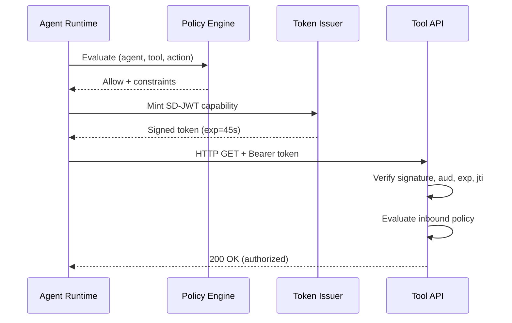

# Agent Trust End-to-End Example

| Field    | Value                                    |
| -------- | ---------------------------------------- |
| Level    | Intermediate                             |
| Maturity | Preview                                  |
| Runnable | Conceptual (paste into a console app)    |
| Packages | AgentTrust.Core, Policy, Maf, AspNetCore |
| Source   | Inline                                   |

> **Preview boundary:** This example uses Agent Trust preview packages. Agent Trust is a project-defined pattern for scoped agent/tool authorization. It is not an IETF, OpenID Foundation, MCP, or OWF standard.

This example demonstrates an end-to-end path:

1. Agent runtime evaluates policy and mints a capability SD-JWT.
2. Agent sends the token to a tool API.
3. Tool API verifies token + policy and authorizes endpoint execution.



---

## 1. Shared Setup

```csharp
using Microsoft.IdentityModel.Tokens;
using SdJwt.Net.AgentTrust.Core;
using SdJwt.Net.AgentTrust.Policy;
using System.Security.Cryptography;

var signingKey = new SymmetricSecurityKey(RandomNumberGenerator.GetBytes(32));
// NOTE: This example uses a symmetric key for brevity.
// Production deployments should use asymmetric keys (e.g. ES256)
// so the tool server never holds the signing key.
var nonceStore = new MemoryNonceStore();

var policyEngine = new DefaultPolicyEngine(
    new PolicyBuilder()
        .Deny("*", "ledger", "Delete")
        .Allow("agent://finance-*", "ledger", "Read", c =>
        {
            c.MaxLifetime(TimeSpan.FromSeconds(45));
            c.Limits(new CapabilityLimits { MaxResults = 100 });
            c.RequireDisclosure("ctx.correlationId");
        })
        .Build());
```

---

## 2. Agent Runtime (Outbound)

```csharp
// McpTrustAdapter lives in the AgentTrust.Maf package (MAF/MCP adapter layer)
using SdJwt.Net.AgentTrust.Maf;

var issuer = new CapabilityTokenIssuer(
    signingKey,
    SecurityAlgorithms.HmacSha256,
    nonceStore);

var mcpAdapter = new McpTrustAdapter(
    issuer,
    policyEngine,
    "agent://finance-eu",
    new Dictionary<string, string> { ["ledger"] = "https://tools.example.com" });

var token = await mcpAdapter.MintForToolCallAsync(
    toolName: "ledger",
    arguments: new Dictionary<string, object> { ["action"] = "Read" },
    context: new CapabilityContext
    {
        CorrelationId = Guid.NewGuid().ToString("N"),
        WorkflowId = "wf-ledger-sync"
    });

using var http = new HttpClient();
http.DefaultRequestHeaders.Add("Authorization", $"Bearer {token.Token}");
var response = await http.GetAsync("https://tools.example.com/ledger/entries");
```

---

## 3. Tool API (Inbound)

```csharp
using Microsoft.IdentityModel.Tokens;
using SdJwt.Net.AgentTrust.AspNetCore;
using SdJwt.Net.AgentTrust.Policy;

var builder = WebApplication.CreateBuilder(args);

builder.Services.AddControllers();
builder.Services.AddSingleton<IPolicyEngine>(policyEngine);
builder.Services.AddAgentTrustVerification(options =>
{
    options.Audience = "https://tools.example.com";
    options.TrustedIssuers = new Dictionary<string, SecurityKey>
    {
        ["agent://finance-eu"] = signingKey
    };
    options.EmitReceipts = true;
});

var app = builder.Build();
app.UseAgentTrustVerification();
app.MapControllers();
app.Run();
```

Controller:

```csharp
using Microsoft.AspNetCore.Mvc;
using SdJwt.Net.AgentTrust.AspNetCore;

[ApiController]
[Route("ledger")]
public sealed class LedgerController : ControllerBase
{
    [HttpGet("entries")]
    [RequireCapability("ledger", "Read")]
    public IActionResult GetEntries()
    {
        var issuer = HttpContext.GetAgentIssuer();
        var context = HttpContext.GetCapabilityContext();
        return Ok(new
        {
            issuer,
            correlationId = context?.CorrelationId,
            entries = new[] { "entry-1", "entry-2" }
        });
    }
}
```

---

## 4. Expected Outcomes

- Token missing/invalid: `401` or `403`
- Capability mismatch: `403`
- Policy deny: `403`
- Valid token + allowed action: `200`

---

## Related

- [MCP Tool Governance Demo](mcp-tool-governance-demo.md) -- full runnable demo
- [Demo Scenarios](demo-scenarios.md) -- scenario catalogue
- [Agent Trust Integration Guide](../../guides/agent-trust-integration.md)
- [Agent Trust Kits](../../concepts/agent-trust-kits.md)

## 5. Hardening Notes

1. Replace in-memory nonce store in production.
2. Keep capability token TTL short.
3. Scope audiences per tool endpoint, not per environment.
4. Persist receipts in centralized observability stack.
5. Use `AgentTrustSecurityMode.Production` to enforce asymmetric keys and proof-of-possession.
6. Use `AttenuationValidator` when delegating between agents to prevent privilege escalation.
