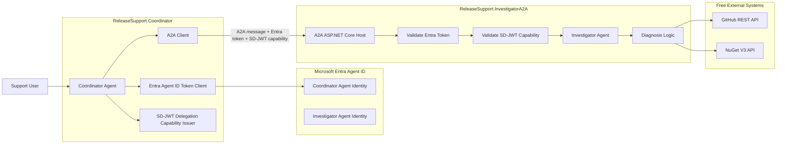

# Entra Agent ID + A2A Release Support Demo

| Field        | Value                                                   |
| ------------ | ------------------------------------------------------- |
| Example type | Runnable demo                                           |
| Maturity     | Preview                                                 |
| Packages     | AgentTrust.Core, Policy, A2A, AspNetCore, OpenTelemetry |
| Requires AI  | Optional (OpenAI key for LLM variant in Phase 4)        |
| Source       | `samples/EntraA2AReleaseSupportDemo/`                   |
| Related      | [MCP Tool Governance Demo](mcp-tool-governance-demo.md) |

> **Preview boundary:** This demo uses Agent Trust preview packages and Microsoft Agent Framework A2A preview hosting packages. Agent Trust is a project-defined pattern for scoped agent delegation authorization. It is not an IETF, OpenID Foundation, MCP, or OWF standard. Microsoft Entra Agent ID requires Microsoft Agent 365 or Microsoft 365 E7 licensing; a dev-fallback mode using standard Entra app registrations is provided.

---

## Overview

This demo showcases governed agent-to-agent delegation using Microsoft Agent Framework, A2A protocol, Microsoft Entra Agent ID, and SD-JWT .NET Agent Trust.

A **Release Support Coordinator Agent** delegates a package publication investigation to a remote **NuGet/GitHub Investigator Agent** over A2A. Microsoft Entra Agent ID authenticates the governed agent identity. SD-JWT Agent Trust constrains the delegated task to one repository, one package, one version, one action, and one short-lived workflow context.

This demo complements the existing MCP Tool Governance Demo:

| Demo                      | Question answered                                                                      |
| ------------------------- | -------------------------------------------------------------------------------------- |
| MCP Tool Governance       | Can this agent call this tool with this action?                                        |
| Entra A2A Release Support | Can this governed enterprise agent delegate this exact task to another governed agent? |

---

## Problem statement

The existing MCP Tool Governance Demo proves per-tool and per-action authorization with SD-JWT capability tokens. However, enterprise agent deployments also require:

- Microsoft Agent Framework as the agent runtime
- A2A protocol as the inter-agent communication boundary
- Microsoft Entra Agent ID as the governed identity layer
- Real external system investigation (GitHub, NuGet)
- Enterprise identity combined with delegated capability

Without governed delegation, any agent that can reach another agent's A2A endpoint can request arbitrary work, with no scoping, no audit trail, and no time-bound constraint.

---

## How delegation works

### The delegation token

The coordinator creates a scoped, time-limited SD-JWT delegation capability:

| Claim            | Purpose                         | Example                                                    |
| ---------------- | ------------------------------- | ---------------------------------------------------------- |
| `iss`            | Delegating agent identity       | `agent://entra/{tenantId}/release-support-coordinator-dev` |
| `aud`            | Delegate agent identity         | `agent://entra/{tenantId}/release-investigator-dev`        |
| `cap.type`       | Delegation type                 | `agent-delegation`                                         |
| `cap.tool`       | Delegated tool                  | `release-investigation`                                    |
| `cap.action`     | Allowed action                  | `InvestigatePackageRelease`                                |
| `cap.repository` | Scoped repository               | `openwallet-foundation-labs/sd-jwt-dotnet`                 |
| `cap.packageId`  | Scoped package                  | `SdJwt.Net`                                                |
| `cap.version`    | Scoped version                  | `1.0.1`                                                    |
| `ctx`            | Correlation metadata            | `{ correlationId, workflowId, purpose }`                   |
| `exp`            | Expiry (seconds to minutes)     | 300 seconds                                                |
| `jti`            | Unique ID for replay prevention | UUID                                                       |

### Dual-token verification (defense in depth)

The investigator verifies two tokens on every inbound A2A message:

1. **Entra Agent ID token** (or dev-fallback app registration token) -- proves caller identity via OAuth 2.0
2. **SD-JWT delegation capability** -- proves scoped authorization for this exact task

Both must pass. A valid Entra token without a matching SD-JWT capability is rejected. A valid capability token from an unexpected Entra caller is rejected.

---

## Architecture



---

## Demo scenarios (scripted client)

### Happy path

| #   | Scenario                      | Action                    | Result                   |
| --- | ----------------------------- | ------------------------- | ------------------------ |
| 1   | Authorized investigation      | InvestigatePackageRelease | Diagnosis returned       |
| 2   | Delegation with scope binding | InvestigatePackageRelease | Correct repo/pkg/version |

### Blocked paths (Phase 3)

| #   | Scenario                   | Action                    | Result           |
| --- | -------------------------- | ------------------------- | ---------------- |
| 3   | Missing SD-JWT capability  | InvestigatePackageRelease | 403 Forbidden    |
| 4   | Wrong package version      | InvestigatePackageRelease | 403 Forbidden    |
| 5   | Dangerous action requested | RerunWorkflow             | Client-side deny |
| 6   | Wrong Entra caller         | InvestigatePackageRelease | 403 Forbidden    |
| 7   | Expired capability         | InvestigatePackageRelease | 403 Forbidden    |
| 8   | Replayed capability token  | InvestigatePackageRelease | 403 Forbidden    |

---

## Running the demo

### Prerequisites

- .NET 9.0+ SDK
- For Entra Agent ID: Microsoft Agent 365 or Microsoft 365 E7 license, or use dev-fallback mode
- For LLM variant (Phase 4): OpenAI API key

### Phase 1: A2A + SD-JWT only (no Entra required)

```pwsh
# Terminal 1: Start the investigator A2A server
dotnet run --project samples/EntraA2AReleaseSupportDemo/ReleaseSupport.InvestigatorA2A

# Terminal 2: Run the coordinator
dotnet run --project samples/EntraA2AReleaseSupportDemo/ReleaseSupport.Coordinator \
  -- --repo openwallet-foundation-labs/sd-jwt-dotnet \
     --package SdJwt.Net \
     --version 1.0.1
```

### Phase 2: With Entra Agent ID

```pwsh
# Configure Entra credentials
$env:AZURE_TENANT_ID = "your-tenant-id"
$env:AZURE_CLIENT_ID = "coordinator-client-id"
$env:AZURE_CLIENT_SECRET = "coordinator-secret"
$env:INVESTIGATOR_AUDIENCE = "api://release-investigator-a2a"

# Terminal 1: Start the investigator A2A server
dotnet run --project samples/EntraA2AReleaseSupportDemo/ReleaseSupport.InvestigatorA2A

# Terminal 2: Run the coordinator with Entra
dotnet run --project samples/EntraA2AReleaseSupportDemo/ReleaseSupport.Coordinator \
  -- --repo openwallet-foundation-labs/sd-jwt-dotnet \
     --package SdJwt.Net \
     --version 1.0.1 \
     --identity-mode RealEntra
```

### Identity modes

| Mode                         | Description                      | Requires            |
| ---------------------------- | -------------------------------- | ------------------- |
| `DevFallbackStatic`          | Static identity, no external IdP | Nothing             |
| `DevFallbackAppRegistration` | Standard Entra app registration  | Entra tenant        |
| `RealEntra`                  | Entra Agent ID                   | Agent 365 / M365 E7 |

---

## Diagnosis rules

The investigator checks four systems and returns a deterministic diagnosis:

| GitHub tag | GitHub release | Workflow | NuGet version | Diagnosis                                                                                  |
| ---------- | -------------- | -------- | ------------- | ------------------------------------------------------------------------------------------ |
| Missing    | Any            | Any      | Missing       | Version was never tagged.                                                                  |
| Exists     | Missing        | Any      | Missing       | Tag exists but GitHub release was not created.                                             |
| Exists     | Exists         | Failed   | Missing       | Release exists but publish workflow failed.                                                |
| Exists     | Exists         | Success  | Missing       | Publish may have skipped the package, used wrong package ID, or NuGet indexing is delayed. |
| Exists     | Exists         | Success  | Exists        | Package is published successfully.                                                         |

---

## External systems

Only free/public APIs are used.

### GitHub checks

```http
GET https://api.github.com/repos/{owner}/{repo}/git/ref/tags/v{version}
GET https://api.github.com/repos/{owner}/{repo}/releases/tags/v{version}
GET https://api.github.com/repos/{owner}/{repo}/actions/workflows
GET https://api.github.com/repos/{owner}/{repo}/actions/workflows/{workflow_id}/runs?per_page=5
```

### NuGet checks

```http
GET https://api.nuget.org/v3/registration5-gz-semver2/{lowercase-package-id}/index.json
```

---

## Security properties demonstrated

| Property                    | How it works                                                       |
| --------------------------- | ------------------------------------------------------------------ |
| **Scoped delegation**       | Capability bound to one repo, one package, one version, one action |
| **Time-limited tokens**     | Delegation capability expires in 5 minutes                         |
| **Single-use tokens**       | JTI-based replay prevention                                        |
| **Audience binding**        | Token `aud` must match investigator agent identity                 |
| **Issuer verification**     | Investigator only accepts tokens from the coordinator              |
| **Dual-token verification** | Both Entra identity and SD-JWT capability must validate            |
| **Action restriction**      | Only `InvestigatePackageRelease` is allowed, not `RerunWorkflow`   |
| **Caller-capability bind**  | Entra caller must match SD-JWT capability issuer                   |

---

## Packages used

| Package                                      | Role                                      |
| -------------------------------------------- | ----------------------------------------- |
| `SdJwt.Net.AgentTrust.Core`                  | Token minting and verification            |
| `SdJwt.Net.AgentTrust.Policy`                | Delegation policy engine                  |
| `SdJwt.Net.AgentTrust.A2A`                   | Delegation issuer                         |
| `SdJwt.Net.AgentTrust.AspNetCore`            | ASP.NET Core verification middleware      |
| `SdJwt.Net.AgentTrust.OpenTelemetry`         | Metrics instrumentation                   |
| `Microsoft.Agents.AI`                        | Agent runtime (Microsoft Agent Framework) |
| `Microsoft.Agents.AI.Hosting.A2A.AspNetCore` | A2A protocol hosting (preview)            |
| `Azure.Identity`                             | Entra credential acquisition              |

---

## Production considerations

| Concern           | Demo approach              | Production approach                               |
| ----------------- | -------------------------- | ------------------------------------------------- |
| Key management    | Shared HS256 key           | ES256 asymmetric keys in Azure Key Vault / HSM    |
| Agent identity    | Static or app registration | Entra Agent ID with blueprints                    |
| Replay prevention | In-memory nonce store      | Distributed store (Redis)                         |
| Policy management | Code-defined rules         | OPA via `SdJwt.Net.AgentTrust.Policy.Opa`         |
| Observability     | Console exporter           | Azure Monitor / Prometheus + Grafana              |
| Multi-tenancy     | Single tenant              | `CapabilityContext.TenantId` with scoped policies |

---

## Further reading

- [MCP Tool Governance Demo](mcp-tool-governance-demo.md) -- agent-to-tool governance
- [Agent Trust End-to-End](agent-trust-end-to-end.md) -- minimal code example
- [Demo Scenarios](demo-scenarios.md) -- scenario catalogue
- [Agent Trust Kits](../../concepts/agent-trust-kits.md) -- architecture overview
- [SD-JWT RFC 9901](https://www.rfc-editor.org/rfc/rfc9901)
- [A2A Protocol](https://a2a-protocol.org/latest/)
- [Microsoft Agent Framework](https://learn.microsoft.com/en-us/agent-framework/)
- [Microsoft Entra Agent ID](https://learn.microsoft.com/en-us/entra/agent-id/what-is-microsoft-entra-agent-id)
