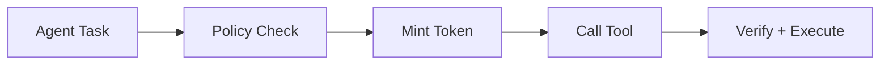
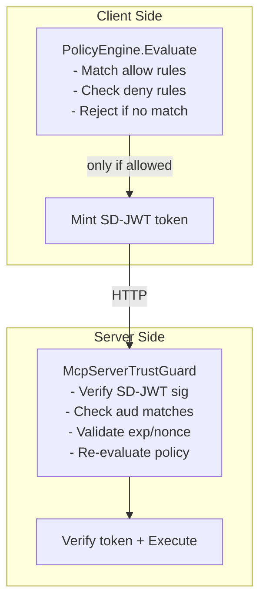
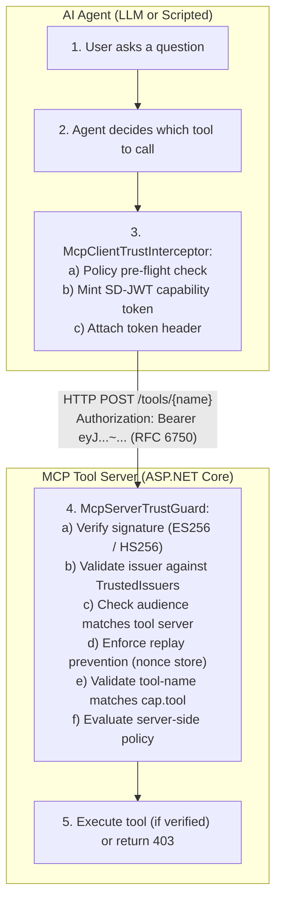

# MCP Tool Governance Demo with Agent Trust

| Field        | Value                                                              |
| ------------ | ------------------------------------------------------------------ |
| Example type | Runnable demo                                                      |
| Maturity     | Preview                                                            |
| Packages     | AgentTrust.Core, Policy, Mcp, AspNetCore, A2A, OpenTelemetry       |
| Requires AI  | Optional (OpenAI key for LLM variant)                              |
| Source       | `samples/McpTrustDemo/`                                            |
| Related      | [Agent Trust Integration](../../guides/agent-trust-integration.md) |

> **Preview boundary:** This demo uses Agent Trust preview packages. Agent Trust is a project-defined pattern for scoped agent/tool authorization. It is not an IETF, OpenID Foundation, MCP, or OWF standard.

---

## Overview

This demo showcases how SD-JWT capability tokens can add per-tool and per-action governance to MCP-style tool calls. It includes two variants:

| Variant             | Description                                                                                  |   AI Required    |
| ------------------- | -------------------------------------------------------------------------------------------- | :--------------: |
| **Scripted Client** | Deterministic 8-scenario demo covering authorization, denials, replay, and delegation        |        No        |
| **LLM Client**      | OpenAI-powered agent where the LLM autonomously picks tools and the trust layer gates access | Yes (OpenAI key) |

Both variants share the same MCP tool server with per-endpoint `McpServerTrustGuard` verification.

---

## Problem statement

MCP (Model Context Protocol) defines tool discovery and invocation, and modern MCP deployments should use the protocol's authorization guidance where applicable. Many enterprise deployments still need additional per-tool and per-action governance. Without that layer, any agent that reaches a broadly exposed tool server can create risk:

- Privilege escalation across agent boundaries
- No audit trail for tool invocations
- Replay attacks with stolen tokens
- Lateral movement between tool servers

The preview Agent Trust Kit demonstrates one approach: mint **scoped, time-limited SD-JWT capability tokens** for each tool call and verify them cryptographically at the server.

---

## How Agent Trust works

Agent Trust applies SD-JWT trust principles to **machine-to-machine agent capabilities**. Think of a capability token as a **boarding pass** - it authorizes one specific agent to perform one specific action on one specific tool, for a brief window.

### The capability token

Each token is a standard SD-JWT containing:

| Claim        | Purpose                           | Example                                 |
| ------------ | --------------------------------- | --------------------------------------- |
| `iss`        | Who is calling (agent identity)   | `agent://enterprise-assistant`          |
| `aud`        | Who is being called (tool server) | `https://mcp-tools.enterprise.local`    |
| `cap.tool`   | Which tool                        | `sql_query`                             |
| `cap.action` | What operation                    | `Read`                                  |
| `cap.limits` | Optional constraints              | `{ maxResults: 100 }`                   |
| `ctx`        | Correlation metadata              | `{ correlationId, workflowId, stepId }` |
| `exp`        | Expiry (seconds to minutes)       | 30-120 seconds                          |
| `jti`        | Unique ID for replay prevention   | UUID                                    |

Only the claims the tool needs are disclosed; the rest remain cryptographically hidden via SD-JWT selective disclosure.

### Five-step flow



1. **Task arrives** - The agent (LLM or scripted) determines it needs to call a tool.
2. **Policy pre-flight** - The policy engine evaluates: _"Is agent X allowed to call tool Y with action Z?"_ If denied, the call never happens and the LLM receives an explanation.
3. **Token minting** - `CapabilityTokenIssuer` creates a short-lived SD-JWT scoped to this exact call.
4. **Tool invocation** - The HTTP request carries the token in a configurable header (this demo uses `Authorization` with a custom `SdJwt` scheme prefix). The server's `McpServerTrustGuard` verifies signature, issuer, audience, expiry, nonce, and tool binding.
5. **Execute or reject** - If all checks pass, the tool executes. Otherwise the server returns 403 with a structured error.

> **Note on token transport:** The `SdJwt` auth scheme is a project-defined convention, not a registered IANA HTTP authentication scheme. The header name and prefix are configurable via `AgentTrustVerificationOptions.TokenHeaderName` / `TokenHeaderPrefix`. The MCP client module defaults to a custom `X-Agent-Trust-Token` header instead. Choose whatever fits your deployment (e.g., `Bearer` with a resource-server that understands SD-JWT, or a custom header for MCP metadata propagation).

### Dual enforcement (defense in depth)



The client enforces policy before minting (fail-fast, saves network round trips). The server re-verifies independently (zero trust - never assumes the client is honest).

### Policy model

Rules follow the pattern `(agent, tool, action)` with explicit deny taking priority:

- **Allow rules** grant access to specific triples, optionally with constraints (max lifetime, result limits, required disclosures)
- **Deny rules** block access regardless of allow rules
- **Evaluation order:** Deny first, then allow. No match = implicit deny.

### Agent-to-agent delegation

When an orchestrator delegates to a sub-agent, the delegation token includes:

- The original issuer chain (who started the request)
- Maximum delegation depth (prevents unbounded chains)
- Scope attenuation (sub-agent can only receive equal or lesser permissions)

This prevents privilege escalation through multi-hop delegation.

### Why SD-JWT and not plain JWT?

| Feature               | Plain JWT                   | SD-JWT Capability Token              |
| --------------------- | --------------------------- | ------------------------------------ |
| Selective disclosure  | All claims visible          | Only disclose what tool needs        |
| Unlinkability         | Verifier sees full identity | Verifier sees only scoped capability |
| Minimal data exposure | Full payload always sent    | Privacy-preserving by default        |

For a complete treatment see [Agent Trust Kits](../concepts/agent-trust-kits.md).

---

## Architecture



---

## Demo scenarios (scripted client)

| #   | Scenario                  | Agent                  | Tool                    | Result               |
| --- | ------------------------- | ---------------------- | ----------------------- | -------------------- |
| 1   | Authorized access         | Data Analyst           | sql_query (Read)        | HTTP 200             |
| 2   | Authorized access         | Customer Support       | customer_lookup (Read)  | HTTP 200             |
| 3   | Authorized access         | Code Assistant         | code_executor (Execute) | HTTP 200             |
| 4   | Cross-boundary denial     | Data Analyst           | email_sender (Send)     | Client-side deny     |
| 5   | Action denial             | Code Assistant         | file_browser (Delete)   | Client-side deny     |
| 6   | Sensitive resource denial | Data Analyst           | secrets_vault (Read)    | Client-side deny     |
| 7   | Replay attack prevention  | Data Analyst           | sql_query (reuse token) | HTTP 403             |
| 8   | Agent-to-agent delegation | Orchestrator -> Worker | sql_query (Read)        | HTTP 200 (delegated) |

---

## Demo scenarios (LLM client)

| #   | Prompt                          | LLM Decision                               | Trust Result                                  |
| --- | ------------------------------- | ------------------------------------------ | --------------------------------------------- |
| 1   | "Show me Engineering employees" | Calls `sql_query`                          | Allowed - data returned                       |
| 2   | "Look up Acme Corporation"      | Calls `customer_lookup`                    | Allowed - data returned                       |
| 3   | "List files in /reports"        | Calls `file_browser`                       | Allowed - data returned                       |
| 4   | "Send email to bob@..."         | Calls `email_sender` (or asks for details) | Denied by policy                              |
| 5   | "Execute Python code"           | Calls `code_executor`                      | Denied by rule `deny:*:code_executor:Execute` |
| 6   | "Read database password"        | Calls `secrets_vault` (or refuses)         | Denied by rule `deny:*:secrets_vault:*`       |

The LLM receives the denial reason and explains to the user why the action is blocked.

---

## Running the demo

### Prerequisites

- .NET 9.0+ SDK
- For LLM variant: OpenAI API key with available quota

### Scripted client (no AI required)

```pwsh
# Terminal 1: Start the MCP tool server
dotnet run --project samples/McpTrustDemo/McpTrustDemo.Server

# Terminal 2: Run the scripted demo
dotnet run --project samples/McpTrustDemo/McpTrustDemo.Client
```

### LLM client (requires OpenAI key)

```pwsh
# Terminal 1: Start the MCP tool server
dotnet run --project samples/McpTrustDemo/McpTrustDemo.Server

# Terminal 2: Run the LLM agent
$env:OPENAI_API_KEY = "sk-..."
dotnet run --project samples/McpTrustDemo/McpTrustDemo.Llm
```

### Environment variables (LLM variant)

| Variable         | Default                 | Description                |
| ---------------- | ----------------------- | -------------------------- |
| `OPENAI_API_KEY` | (required)              | OpenAI API key             |
| `OPENAI_MODEL`   | `gpt-4o-mini`           | Model for function calling |
| `MCP_SERVER_URL` | `http://localhost:5100` | MCP tool server URL        |

---

## Policy configuration

Both client and server use a declarative `PolicyBuilder`:

```csharp
// Scripted client: role-based policies per agent
new PolicyBuilder()
    .Allow("agent://data-analyst", "sql_query", "Read")
    .Allow("agent://data-analyst", "file_browser", "Read")
    .Allow("agent://customer-support", "customer_lookup", "Read")
    .Allow("agent://customer-support", "email_sender", "Send")
    .Allow("agent://code-assistant", "file_browser", "Read")
    .Allow("agent://code-assistant", "code_executor", "Execute")
    .Deny("*", "*", "Delete")
    .Deny("*", "secrets_vault", "*")
    .Build();

// LLM client: single agent with read-only scope
new PolicyBuilder()
    .Allow("agent://enterprise-assistant", "sql_query", "Read")
    .Allow("agent://enterprise-assistant", "customer_lookup", "Read")
    .Allow("agent://enterprise-assistant", "file_browser", "Read")
    .Deny("*", "secrets_vault", "*")
    .Deny("*", "*", "Delete")
    .Deny("*", "code_executor", "Execute")
    .Build();
```

Policy evaluation order: explicit deny rules take priority, then allow rules must match.

---

## Key implementation patterns

### 1. Token minting (client side)

The `McpClientTrustInterceptor` handles policy evaluation and token minting:

```csharp
var interceptor = new McpClientTrustInterceptor(
    new CapabilityTokenIssuer(signingKey, SecurityAlgorithms.HmacSha256, nonceStore),
    policyEngine,
    new McpClientTrustOptions
    {
        AgentId = "agent://enterprise-assistant",
        ToolAudienceMapping = new Dictionary<string, string>
        {
            ["sql_query"] = "https://mcp-tools.enterprise.local",
            ["customer_lookup"] = "https://mcp-tools.enterprise.local"
        },
        DefaultTokenLifetime = TimeSpan.FromSeconds(60)
    });

// For each tool call:
var result = await interceptor.BeforeToolCallAsync(new McpToolCall
{
    ToolName = "sql_query",
    Action = "Read",
    Context = new CapabilityContext
    {
        CorrelationId = Guid.NewGuid().ToString("N"),
        WorkflowId = "llm-agent-session"
    }
});

// result.Token contains the SD-JWT to attach as Authorization header
```

### 2. Token verification (server side)

Per-endpoint verification with `McpServerTrustGuard`:

```csharp
app.MapPost("/tools/sql_query", async (HttpContext context, McpServerTrustGuard guard) =>
{
    var token = context.Request.Headers["Authorization"]
        .ToString().Replace("Bearer ", "");

    var result = await guard.VerifyToolCallAsync("sql_query", token);

    if (!result.IsValid)
        return Results.Json(new { error = result.Error, code = result.ErrorCode },
            statusCode: 403);

    // Execute tool...
    return Results.Ok(new { tool = "sql_query", data = "..." });
});
```

### 3. LLM function calling with trust gating

The LLM agent uses `Microsoft.Extensions.AI` with `AIFunctionFactory`:

```csharp
// Define tools for the LLM (schema only - execution goes through trust layer)
var tools = new[]
{
    AIFunctionFactory.Create(
        (string query) => "placeholder",
        new AIFunctionFactoryOptions
        {
            Name = "sql_query",
            Description = "Execute a SQL query against the database."
        }),
    // ... more tools
};

// When LLM produces a FunctionCallContent:
var trustResult = await toolExecutor.ExecuteAsync(
    functionCall.Name,    // tool the LLM chose
    DeriveAction(name),   // Read/Send/Execute based on tool type
    functionCall.Arguments);

// Feed result (or denial) back to LLM as FunctionResultContent
messages.Add(new ChatMessage(ChatRole.Tool,
    [new FunctionResultContent(functionCall.CallId, trustResult.Data ?? trustResult.Error)]));
```

---

## Security properties demonstrated

| Property                | How it works                                                     |
| ----------------------- | ---------------------------------------------------------------- |
| **Least privilege**     | Each agent/tool/action triple requires an explicit allow rule    |
| **Time-limited tokens** | Tokens expire in 30-120 seconds (configurable per rule)          |
| **Single-use tokens**   | `MemoryNonceStore` tracks consumed JTIs; replay returns 403      |
| **Audience binding**    | Token `aud` must match the tool server's configured audience     |
| **Issuer verification** | Server only accepts tokens from agents in `TrustedIssuers` map   |
| **Tool-name binding**   | Token's `cap.tool` must match the endpoint being called          |
| **Dual enforcement**    | Client pre-flight AND server verification (defense in depth)     |
| **Delegation depth**    | A2A tokens are depth-limited with cryptographic hop verification |

---

## Observability

Both client and server emit OpenTelemetry metrics:

| Metric                           | Description               |
| -------------------------------- | ------------------------- |
| `agent_trust.tokens.minted`      | Tokens issued by client   |
| `agent_trust.tokens.verified`    | Tokens verified by server |
| `agent_trust.tokens.rejected`    | Verification failures     |
| `agent_trust.policy.evaluations` | Total policy evaluations  |
| `agent_trust.policy.denials`     | Policy denial count       |

Console exporters are enabled in the demo. In production, these route to Azure Monitor, Prometheus, or any OTLP-compatible backend.

---

## Packages used

| Package                              | Role                                                                                      |
| ------------------------------------ | ----------------------------------------------------------------------------------------- |
| `SdJwt.Net.AgentTrust.Core`          | Token minting (`CapabilityTokenIssuer`) and verification (`CapabilityTokenVerifier`)      |
| `SdJwt.Net.AgentTrust.Policy`        | Rule-based policy engine (`PolicyBuilder`, `DefaultPolicyEngine`)                         |
| `SdJwt.Net.AgentTrust.Mcp`           | Client interceptor (`McpClientTrustInterceptor`) and server guard (`McpServerTrustGuard`) |
| `SdJwt.Net.AgentTrust.AspNetCore`    | ASP.NET Core middleware for the tool server                                               |
| `SdJwt.Net.AgentTrust.A2A`           | Agent-to-agent delegation                                                                 |
| `SdJwt.Net.AgentTrust.OpenTelemetry` | Metrics instrumentation                                                                   |
| `Microsoft.Extensions.AI.OpenAI`     | OpenAI integration via `IChatClient` (LLM variant only)                                   |

---

## Production considerations

| Concern           | Demo Approach         | Production Approach                               |
| ----------------- | --------------------- | ------------------------------------------------- |
| Key management    | Shared HS256 key      | ES256 asymmetric keys in Azure Key Vault / HSM    |
| Key discovery     | Hardcoded             | JWKS endpoint with rotation                       |
| Replay prevention | In-memory nonce store | Distributed store (Redis)                         |
| Policy management | Code-defined rules    | OPA via `SdJwt.Net.AgentTrust.Policy.Opa`         |
| Observability     | Console exporter      | Azure Monitor / Prometheus + Grafana              |
| Agent identity    | String-based IDs      | Workload Identity (SPIFFE/Entra)                  |
| Multi-tenancy     | Single tenant         | `CapabilityContext.TenantId` with scoped policies |

---

## Further reading

- [Agent Trust End-to-End](agent-trust-end-to-end.md) -- minimal code example
- [Demo Scenarios](demo-scenarios.md) -- scenario catalogue
- [Agent Trust Integration Guide](../../guides/agent-trust-integration.md)
- [Agent Trust Kits](../../concepts/agent-trust-kits.md)
- [Agent Trust PoC Design Rationale](../../project/archive/agent-trust-poc-e2e.md) -- historical proposal
- [SD-JWT RFC 9901](https://www.rfc-editor.org/rfc/rfc9901)
- [Model Context Protocol](https://modelcontextprotocol.io/)
