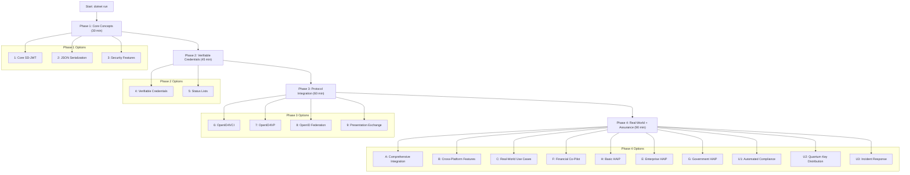

# Getting Started with SD-JWT .NET Samples

This guide walks you through setting up and running the SD-JWT .NET samples, providing a hands-on introduction to selective disclosure and verifiable credentials.

## Prerequisites

### Development Environment

- **.NET SDK 8.0, 9.0, or 10.0**: [Download from Microsoft](https://dotnet.microsoft.com/download)
- **IDE**: Visual Studio 2022/2026, VS Code, or JetBrains Rider
- **Git**: For cloning the repository
- **Command Line**: Terminal, PowerShell, or Command Prompt

### Optional: AI Integration

For the Financial Co-Pilot scenario with real AI responses:

- **OpenAI API Key**: [Get from OpenAI Platform](https://platform.openai.com/)
- **Azure OpenAI** (Alternative): Azure subscription with OpenAI service

## Quick Setup

### 1. Clone and Build

```bash
# Clone the repository
git clone https://github.com/openwallet-foundation-labs/sd-jwt-dotnet.git
cd sd-jwt-dotnet

# Restore dependencies and build
dotnet restore
dotnet build

# Navigate to samples
cd samples/SdJwt.Net.Samples
```

### 2. Run Interactive Samples

```bash
# Start the interactive sample menu
dotnet run
```

You'll see a menu like this:

```txt
==================================================================
                    SD-JWT .NET Sample Explorer
                         Comprehensive Demo
==================================================================

SAMPLE CATEGORIES:

CORE FEATURES:
1. Core SD-JWT Example
2. JSON Serialization Example
3. Security Features Example

VERIFIABLE CREDENTIALS:
4. Verifiable Credentials Example
5. Status Lists Example

PROTOCOL INTEGRATION:
6. OpenID4VCI Example
7. OpenID4VP Example
8. OpenID Federation Example
9. Presentation Exchange Example

ADVANCED FEATURES:
A. Comprehensive Integration Example
B. Cross-Platform Features Example

REAL-WORLD SCENARIOS:
C. Real-World Use Cases
F. Financial Co-Pilot (AI-Powered)

HIGH ASSURANCE (HAIP):
H. Basic HAIP Example
E. Enterprise HAIP Example
G. Government HAIP Example

ADVANCED USE CASES:
U1. Automated Compliance
U2. Quantum Key Distribution
U3. Incident Response

0. Exit

Enter your choice:
```

Note for `U2`:

- The sample runs native `.NET 10` PQC APIs (`MLDsa`, `MLKem`) only when the runtime and crypto provider support them.
- SD-JWT issuance in the same flow remains JOSE-based for interoperability (`ES256` in the sample).
- When PQC APIs are unavailable, the sample falls back to deterministic non-PQC transport-key simulation.

### 3. Start with Basics

Begin with **option 1** (Core SD-JWT Example) to understand fundamental concepts.

## Learning Progression



### Phase 1: Core Concepts (30 minutes)

**Goal**: Understand selective disclosure and basic SD-JWT operations

1. **Core SD-JWT Example (Option 1)**

   - Learn selective disclosure basics
   - See key binding in action
   - Understand presentation creation

2. **JSON Serialization Example (Option 2)**

   - Explore alternative formats beyond compact JWT
   - See Flattened and General JSON serialization
   - Practice round-trip conversions

3. **Security Features Example (Option 3)**
   - Understand cryptographic protections
   - See attack prevention in practice
   - Learn privacy protection patterns

**Key Takeaways:**

- How selective disclosure protects privacy
- Why cryptographic verification matters
- When to use different serialization formats

### Phase 2: Verifiable Credentials (45 minutes)

**Goal**: Apply SD-JWT to real-world credential scenarios

1. **Verifiable Credentials Example (Option 4)**

   - See industry-standard credential formats
   - Learn VC-specific validation
   - Understand different credential types (medical, education, employment)

2. **Status Lists Example (Option 5)**
   - Master revocation and suspension
   - Understand multi-bit status types
   - See high-performance status checking

**Key Takeaways:**

- How to structure verifiable credentials
- Why status management is crucial
- Performance considerations for scale

### Phase 3: Protocol Integration (60 minutes)

**Goal**: Integrate with OpenID standards and modern protocols

1. **OpenID4VCI Example (Option 6)**

   - Learn standardized credential issuance
   - See pre-authorized and authorization code flows
   - Practice batch and deferred issuance

2. **OpenID4VP Example (Option 7)**

   - Master presentation request/response flows
   - Implement cross-device verification
   - Handle complex presentation requirements

3. **Presentation Exchange Example (Option 9)**
   - Use intelligent credential selection
   - Implement complex constraint matching
   - Optimize for multiple credentials

**Key Takeaways:**

- How OpenID protocols enhance interoperability
- Why presentation exchange improves user experience
- When to use different flow types

### Phase 4: Real-World Applications (90 minutes)

**Goal**: Build complete end-to-end scenarios

1. **Real-World Use Cases (Option C)**

   - See complete industry workflows
   - Practice multi-issuer scenarios
   - Handle complex verification requirements

2. **Financial Co-Pilot (Option F)**
   - Experience AI-powered privacy preservation
   - Learn progressive disclosure patterns
   - Understand session-based context management

**Key Takeaways:**

- How to design complete credential ecosystems
- Why privacy-preserving AI is revolutionary
- When to apply different architectural patterns

## Detailed Setup Instructions

### Environment Configuration

#### Windows

```powershell
# Verify .NET installation
dotnet --version

# Set environment variables (optional, for AI features)
$env:OPENAI_API_KEY = "your-api-key"
$env:OPENAI_MODEL = "gpt-4-turbo"

# Run samples
cd samples\SdJwt.Net.Samples
dotnet run
```

#### Linux/macOS

```bash
# Verify .NET installation
dotnet --version

# Set environment variables (optional, for AI features)
export OPENAI_API_KEY="your-api-key"
export OPENAI_MODEL="gpt-4-turbo"

# Run samples
cd samples/SdJwt.Net.Samples
dotnet run
```

#### Docker (Optional)

```bash
# Build container
docker build -t sdjwt-samples .

# Run with environment variables
docker run -e OPENAI_API_KEY="your-key" sdjwt-samples
```

### IDE Setup

#### Visual Studio 2022

1. Open `sd-jwt-dotnet.sln`
2. Set `SdJwt.Net.Samples` as startup project
3. Press F5 or Ctrl+F5 to run
4. Set environment variables in project properties (optional)

#### VS Code

1. Open the `sd-jwt-dotnet` folder
2. Install C# extension
3. Open terminal: `cd samples/SdJwt.Net.Samples`
4. Run: `dotnet run`
5. Set environment variables in `.vscode/launch.json` (optional)

#### JetBrains Rider

1. Open `sd-jwt-dotnet.sln`
2. Set run configuration for `SdJwt.Net.Samples`
3. Configure environment variables in run settings (optional)
4. Click the run button

## **AI Integration Setup (Updated 2026)**

For the Financial Co-Pilot scenario with real AI responses:

- **OpenAI API Key**: [Get from OpenAI Platform](https://platform.openai.com/)
- **Recommended Models**:
  - `gpt-5` (Latest production model for 2025)
  - `gpt-4o` (Balanced cost/performance)
  - `o1-preview` (Advanced reasoning for complex financial scenarios)
- **Azure OpenAI** (Enterprise): Azure subscription with OpenAI service
- **Cost Estimation**: ~$0.01-0.05 per conversation turn with current models

### Azure OpenAI Configuration (Alternative)

```bash
# Azure OpenAI endpoint
export AZURE_OPENAI_ENDPOINT="https://your-resource.openai.azure.com/"

# Your Azure API key
export OPENAI_API_KEY="your-azure-api-key"

# Deployment name (not model name in Azure)
export OPENAI_MODEL="your-gpt4-deployment"
```

### No AI Key? No Problem

The Financial Co-Pilot automatically falls back to high-quality simulated responses that demonstrate all the privacy-preserving patterns without requiring an API key.

## Understanding the Output

### What You'll See

#### Successful Credential Creation

```
Creating SD-JWT credential...
   Issuer: https://university.example.edu
   Subject: did:example:student123
   Claims: name, degree, graduation_date, gpa
   Selective Disclosure: degree, graduation_date (revealed), name, gpa (hidden)
   Key Binding: Enabled
 Credential created successfully
```

#### Presentation Verification

```txt
Verifying presentation...
   Signature validation:  PASSED
   Key binding validation:  PASSED
   Selective disclosure validation:  PASSED
   Disclosed claims: degree=Bachelor of Science, graduation_date=2024-06-15
   Hidden claims: name, gpa (not disclosed)
 Verification successful
```

#### AI-Powered Advice (Financial Co-Pilot)

```txt
INTENT ROUTER: Analyzing query...
     Detected INTENT: CONTRIBUTION_STRATEGY
     Required fields: account_balance, cap_remaining

ORCHESTRATOR: Requesting Verifiable Presentation...
WALLET: Creating selective presentation...
     Presenting data:
       - account_balance: 150000
       - cap_remaining: 10000
     Protected: TFN, full name, address

VERIFIER: Validating presentation...
     Cryptographic verification successful
     Key binding confirmed
     Issuer signatures valid

AI REASONING ENGINE: Processing query...
     ADVICE: Based on your current balance of $150,000 and remaining contribution cap of $10,000,
     salary sacrificing would provide significant tax benefits. You're currently in the 32.5% tax bracket,
     so maximizing your contribution cap could save approximately $3,250 in taxes annually...
```

### Common Output Patterns

#### Success Indicators

- **PASSED**: Operation completed successfully
- **Valid**: Data integrity confirmed
- **Verified**: Cryptographic validation successful
- **Generated**: AI advice created
- **Created**: Credential or presentation generated

#### Information Displays

- **Claims Listed**: What data is available
- **Disclosed Fields**: What data is being shared
- **Protected Fields**: What data remains private
- **Performance Metrics**: Timing information
- **Security Checks**: Validation results

## Troubleshooting

### Common Issues

#### Build Errors

```bash
# Clear build artifacts
dotnet clean

# Restore packages
dotnet restore

# Build with detailed output
dotnet build --verbosity detailed
```

#### Runtime Errors

```bash
# Check .NET version
dotnet --version

# Ensure you're in the correct directory
pwd # Should show: .../sd-jwt-dotnet/samples/SdJwt.Net.Samples

# Run with detailed error information
dotnet run --verbosity detailed
```

#### OpenAI API Issues

```bash
# Check API key format
echo $OPENAI_API_KEY | head -c 20  # Should start with "sk-"

# Test API connectivity (optional)
curl -H "Authorization: Bearer $OPENAI_API_KEY" \
  https://api.openai.com/v1/models

# Run without AI (uses simulation)
unset OPENAI_API_KEY
dotnet run
```

#### Performance Issues

```bash
# Run in Release mode for better performance
dotnet run --configuration Release

# Check available memory
# Windows: Get-ComputerInfo | select TotalPhysicalMemory
# Linux/Mac: free -h
```

### Getting Help

1. **Check Documentation**: Read the sample docs in `samples/SdJwt.Net.Samples/`
2. **Review Code**: Examine the source code under `samples/SdJwt.Net.Samples/`
3. **Run Tests**: Execute unit tests with `dotnet test`
4. **Create Issues**: Report problems on GitHub
5. **Community Support**: Join discussions in project forums
