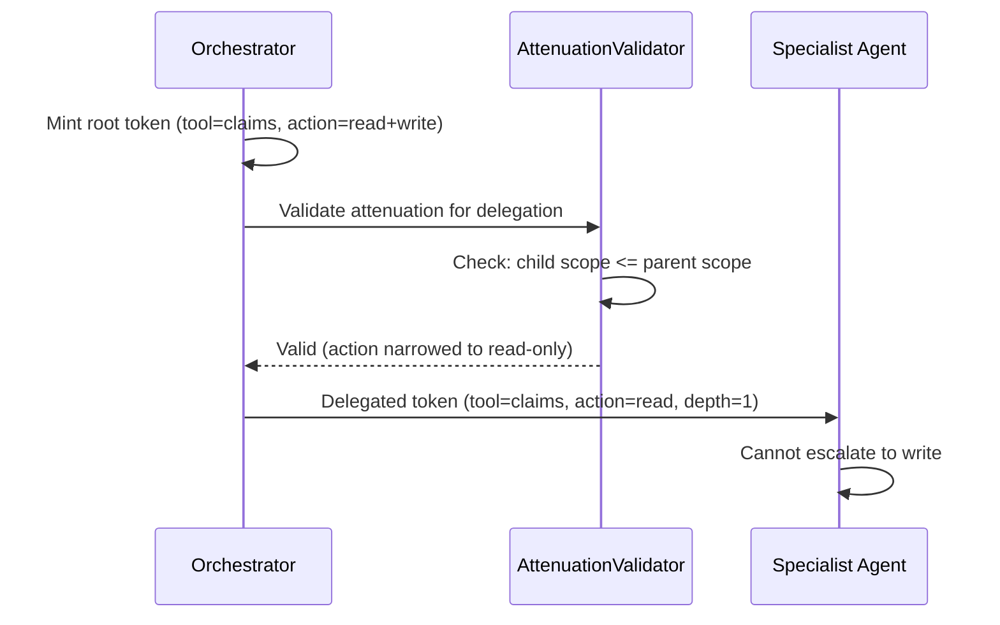

# How to integrate preview Agent Trust into tool APIs

| Field                | Value                                                  |
| -------------------- | ------------------------------------------------------ |
| **Package maturity** | Preview (SdJwt.Net.AgentTrust.\*)                      |
| **Code status**      | Runnable package APIs with illustrative service wiring |
| **Related concept**  | [Agent Trust Kits](../concepts/agent-trust-kits.md)    |

> Agent Trust packages are preview extensions. APIs, token formats, and policy schemas may change in future releases.

|                      |                                                                                                                                                                                                                                                                      |
| -------------------- | -------------------------------------------------------------------------------------------------------------------------------------------------------------------------------------------------------------------------------------------------------------------- |
| **Audience**         | Developers wiring Agent Trust into AI agent runtimes and tool APIs.                                                                                                                                                                                                  |
| **Purpose**          | Walk through an end-to-end flow: defining policy, minting bounded capability tokens in the agent runtime, and verifying them in an ASP.NET Core tool API, using `SdJwt.Net.AgentTrust.*` packages.                                                                   |
| **Scope**            | Policy definition, token minting with MAF adapter, ASP.NET Core middleware/authorization setup, controller-level capability enforcement, and production hardening. Out of scope: architecture and threat model (see [Agent Trust](../concepts/agent-trust-kits.md)). |
| **Success criteria** | Reader can define allow/deny policy rules, mint capability tokens for tool calls, verify tokens via middleware, and enforce per-endpoint capability requirements.                                                                                                    |

## What your application still owns

This guide does not provide: production signing key custody, agent identity attestation, trust anchor governance, audit log storage, rate limiting, or production policy authoring and lifecycle management.

---

## Prerequisites

```bash
dotnet add package SdJwt.Net.AgentTrust.Core
dotnet add package SdJwt.Net.AgentTrust.Policy
dotnet add package SdJwt.Net.AgentTrust.AspNetCore
dotnet add package SdJwt.Net.AgentTrust.Maf
# Optional packages for extended scenarios:
dotnet add package SdJwt.Net.AgentTrust.OpenTelemetry  # Metrics and telemetry
dotnet add package SdJwt.Net.AgentTrust.Policy.Opa     # OPA external policy
dotnet add package SdJwt.Net.AgentTrust.Mcp            # MCP protocol trust
dotnet add package SdJwt.Net.AgentTrust.A2A            # Agent-to-agent delegation
```

---

## 1. Define policy

```csharp
using SdJwt.Net.AgentTrust.Core;
using SdJwt.Net.AgentTrust.Policy;

var rules = new PolicyBuilder()
    .Deny("*", "payments", "Delete")
    .Allow("agent://ops-*", "payments", "Read", c =>
    {
        c.MaxLifetime(TimeSpan.FromSeconds(60));
        c.Limits(new CapabilityLimits { MaxResults = 200 });
        c.RequireDisclosure("ctx.correlationId");
    })
    .Build();

IPolicyEngine policyEngine = new DefaultPolicyEngine(rules);
```

---

## 2. Mint tokens in the agent runtime

```csharp
using Microsoft.IdentityModel.Tokens;
using SdJwt.Net.AgentTrust.Core;
using SdJwt.Net.AgentTrust.Maf;
using System.Security.Cryptography;

// Demo only: symmetric key for local testing.
// For production, use asymmetric keys (e.g. ECDsa P-256) so verifiers
// never need access to the signing secret.
var key = new SymmetricSecurityKey(RandomNumberGenerator.GetBytes(32));
var nonceStore = new MemoryNonceStore();
var issuer = new CapabilityTokenIssuer(key, SecurityAlgorithms.HmacSha256, nonceStore);

var adapter = new McpTrustAdapter(
    issuer,
    policyEngine,
    "agent://ops-eu",
    new Dictionary<string, string> { ["payments"] = "https://tools.example.com" });

var tokenResult = await adapter.MintForToolCallAsync(
    toolName: "payments",
    arguments: new Dictionary<string, object> { ["action"] = "Read" },
    context: new CapabilityContext { CorrelationId = Guid.NewGuid().ToString("N") });
```

Use `tokenResult.Token` in the outbound tool call header:

- Header: `Authorization`
- Value: `Bearer <token>`

---

## 3. Verify tokens in ASP.NET Core tool API

```csharp
using Microsoft.IdentityModel.Tokens;
using SdJwt.Net.AgentTrust.AspNetCore;
using SdJwt.Net.AgentTrust.Policy;

var builder = WebApplication.CreateBuilder(args);
builder.Services.AddControllers();
builder.Services.AddAuthorizationBuilder()
    .AddAgentTrustPolicy("payments.read", "payments", "Read");

builder.Services.AddAgentTrustVerification(options =>
{
    options.Audience = "https://tools.example.com";
    options.TrustedIssuers = new Dictionary<string, SecurityKey>
    {
        ["agent://ops-eu"] = signingKey
    };
});

var app = builder.Build();
app.UseAgentTrustVerification();
app.UseAuthorization();
app.MapControllers();
app.Run();
```

Controller example:

```csharp
using Microsoft.AspNetCore.Authorization;
using Microsoft.AspNetCore.Mvc;
using SdJwt.Net.AgentTrust.AspNetCore;

[ApiController]
[Route("payments")]
public sealed class PaymentsController : ControllerBase
{
    [HttpGet("{id}")]
    [Authorize(Policy = "payments.read")]
    [RequireCapability("payments", "Read")]
    public IActionResult GetPayment(string id)
    {
        var issuer = HttpContext.GetAgentIssuer();
        var ctx = HttpContext.GetCapabilityContext();
        return Ok(new { id, issuer, correlationId = ctx?.CorrelationId });
    }
}
```

---

## 4. Production hardening checklist

1. Replace in-memory key and nonce stores with production implementations.
2. Use short token lifetime and fail-closed behavior for privileged operations.
3. Persist audit receipts for allow/deny decisions.
4. Maintain strict audience mapping per tool/service.
5. Add policy tests for every high-risk tool action.

---

## 5. OpenTelemetry observability

Add metrics for token operations and policy decisions:

```csharp
using SdJwt.Net.AgentTrust.OpenTelemetry;

// In your OpenTelemetry setup
builder.Services.AddOpenTelemetry()
    .WithMetrics(metrics => metrics.AddAgentTrustInstrumentation());

// Use TelemetryReceiptWriter instead of LoggingReceiptWriter
builder.Services.AddSingleton<IReceiptWriter, TelemetryReceiptWriter>();
```

Exposed metrics (per spec Section 24.1):

| Metric                                      | Type      | Description                  |
| ------------------------------------------- | --------- | ---------------------------- |
| `agent_trust.capability.minted`             | Counter   | Tokens successfully minted   |
| `agent_trust.capability.verified`           | Counter   | Tokens successfully verified |
| `agent_trust.capability.rejected`           | Counter   | Token verification failures  |
| `agent_trust.policy.evaluated`              | Counter   | Policy evaluations           |
| `agent_trust.replay.detected`               | Counter   | Replay attempts detected     |
| `agent_trust.pop.failed`                    | Counter   | Proof-of-possession failures |
| `agent_trust.request_binding.failed`        | Counter   | Request binding mismatches   |
| `agent_trust.receipt.written`               | Counter   | Audit receipts written       |
| `agent_trust.mint.duration_ms`              | Histogram | Token minting latency        |
| `agent_trust.verify.duration_ms`            | Histogram | Token verification latency   |
| `agent_trust.policy.evaluation_duration_ms` | Histogram | Policy evaluation latency    |

Distributed tracing activities are available via `AgentTrustActivitySource`.

---

## 6. OPA external policy engine

To externalize policy evaluation to Open Policy Agent:

```csharp
using SdJwt.Net.AgentTrust.Policy.Opa;

builder.Services.AddOpaPolicy(options =>
{
    options.BaseUrl = "http://localhost:8181";
    options.PolicyPath = "/v1/data/agenttrust/allow";
    options.Timeout = TimeSpan.FromSeconds(5);
    options.DenyOnError = true; // fail-closed
});
```

The `OpaHttpPolicyEngine` implements `IPolicyEngine` and sends `PolicyRequest` as JSON to OPA, mapping the response to `PolicyDecision`.

---

## 7. MCP protocol trust

Secure MCP tool calls with capability tokens:

```csharp
using SdJwt.Net.AgentTrust.Mcp;

// Client side - attach tokens to outgoing tool calls
builder.Services.AddMcpClientTrust(options =>
{
    options.AgentId = "agent-billing-001";
    options.ToolAudienceMapping = new Dictionary<string, string>
    {
        ["calculate_invoice"] = "https://billing.example.com",
        ["send_email"] = "https://email.example.com"
    };
});

// Server side - verify tokens on incoming tool executions
builder.Services.AddMcpServerTrust(options =>
{
    options.Audience = "https://billing.example.com";
    options.TrustedIssuers = new Dictionary<string, SecurityKey>
    {
        ["https://agents.example.com"] = issuerKey
    };
});
```

---

## 8. Agent-to-agent delegation

Enable bounded delegation chains between agents:

```csharp
using SdJwt.Net.AgentTrust.A2A;

builder.Services.AddAgentTrustA2A(options =>
{
    options.Issuer = "https://orchestrator.example.com";
    options.Audience = "https://specialist.example.com";
    options.Capability = "process_claims";
    options.MaxDelegationDepth = 3;
    options.Lifetime = TimeSpan.FromMinutes(5);
});
```

The `DelegationChainValidator` checks that each token in a chain is properly ordered, within max depth, and signed by a trusted issuer. The `A2ADelegationIssuer` mints new delegation tokens with policy enforcement and depth control.

The `AttenuationValidator` enforces that each delegation hop narrows or preserves authority:



---

## 9. Security modes

Configure the security mode based on your deployment stage:

```csharp
using SdJwt.Net.AgentTrust.Core;

// Demo mode: symmetric keys allowed, relaxed validation
var demoOptions = new CapabilityTokenOptions
{
    SecurityMode = AgentTrustSecurityMode.Demo
};

// Production mode: asymmetric keys required, PoP enforced
var prodOptions = new CapabilityTokenOptions
{
    SecurityMode = AgentTrustSecurityMode.Production
};
```

| Mode         | Algorithm | PoP required | Token type              |
| ------------ | --------- | ------------ | ----------------------- |
| `Demo`       | HS256 OK  | No           | `agent-cap+sd-jwt+demo` |
| `Pilot`      | HAIP only | Optional     | `agent-cap+sd-jwt`      |
| `Production` | HAIP only | Yes          | `agent-cap+sd-jwt`      |

---

## See also

- [Agent Trust Kits](../concepts/agent-trust-kits.md)
- [Agent Trust Tutorial](../tutorials/intermediate/07-agent-trust-kits.md)
- [Agent Trust Examples](../examples/agent-trust-end-to-end.md)
