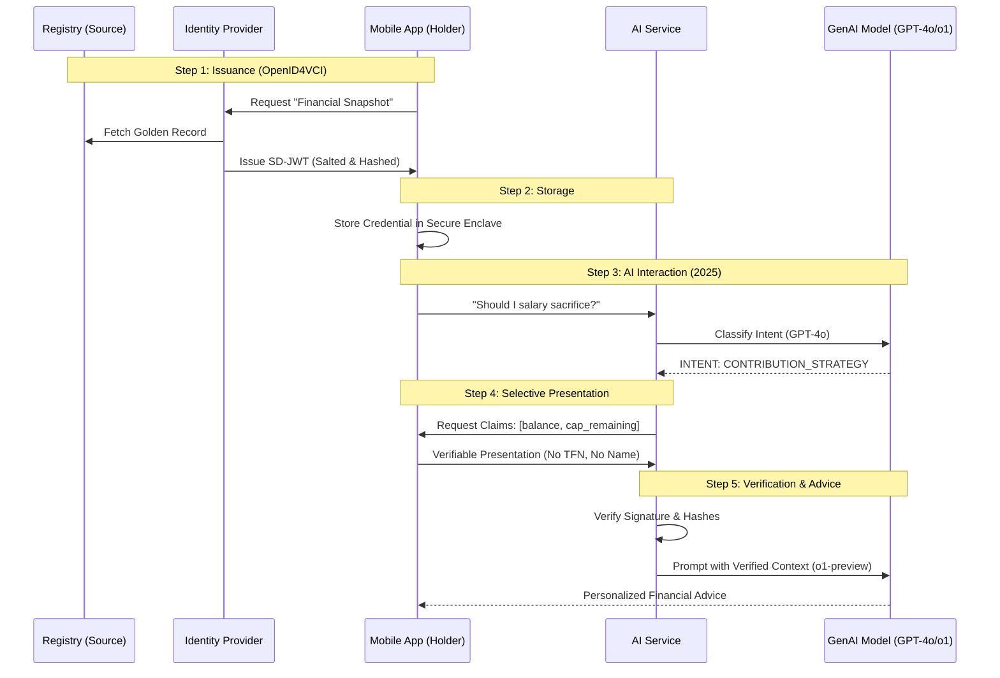

# Beyond Redaction: Scaling Privacy-Preserving GenAI with SD-JWTs

## How selective disclosure enables personalized AI without toxic privacy risks

In the race to deploy Generative AI, the "Hello World" phase is over. Engineering teams are now tackling the "Day 2" reality: how to make these systems useful in highly regulated industries without creating a data privacy nightmare.

Consider the Australian Superannuation industry. Members are demanding more than static dashboards; they want personalized, conversational guidance. They want to ask: *"Should I salary sacrifice this year?"*

To answer these questions, an LLM needs context. Historically, this meant retrieving a member's **"Golden Record"**a monolithic data structure containing everything from their home address to their beneficiary history. But feeding this entire record into an LLM context window is a non-starter for security and compliance.

This article explores a robust architectural pattern we can use to solve this: **Selective Disclosure JSON Web Tokens (SD-JWT)**. By deconstructing the Golden Record and moving from simple redaction to cryptographic selective disclosure, we can build AI agents that are context-aware yet privacy-preserving by design.

---

## Background: The "Golden Record" Paradox

To understand the security challenge, we first need to look at the data topology of a typical registry system.

In legacy architectures, member data is often stored as a tightly coupled, monolithic object. When a backend service requests "Member Details," it receives the entire blob. While efficient for traditional web apps, this structure is toxic for GenAI.

To give accurate financial advice, we need to separate the **"Who"** from the **"What."**

### The Data Coupling Issue

We classify member data into two distinct buckets based on their utility to the AI and their risk to the business:

| Data Class | Definition | Superannuation Examples |
| :--- | :--- | :--- |
| **Identity PII** | **The "Who"** (Toxic) | Tax File Number (TFN), Full Name, Address, DOB. Leakage here is a reportable breach. |
| **Financial State** | **The "What"** (Useful) | Account Balance, Cap Room, Admin Fees. Essential for personalizing the calculation. |

**The Architecture Gap:**
To answer a question like *"Can I afford to contribute more?"*, the AI Agent requires the **Financial State**. However, because of the Golden Record structure, most APIs force developers to fetch the **Identity PII** simultaneously. You cannot get the "Cap Room" without also getting the "TFN".

---

## The Problem: The "All-or-Nothing" Dilemma

When engineers try to bridge this gap, they usually face three bad options:

1. **The "Full Context" Injection:** Dumping the full profile into the Prompt. This is oversharing by default.
2. **User-Driven Input:** Asking the user to type their balance. This creates "garbage in, garbage out" scenarios where the AI trusts unverified data.
3. **Middleware Redaction:** Using Regex to strip TFNs. This is fragile; as schemas change, redaction rules break, and there is no cryptographic proof that the remaining data is authentic.

### The 2025 AI Landscape Challenge

With the evolution of AI models in 2025:

- **GPT-4o** and **o1-preview** require more context for optimal performance
- **Larger context windows** (128k+ tokens) enable richer conversations
- **Multimodal capabilities** increase the scope of potential data exposure
- **Real-time processing** demands instant data validation

The privacy challenges have only intensified.

---

## The Solution: Selective Disclosure (SD-JWT)

The industry is coalescing around a new standard to solve this: **SD-JWT (IETF RFC 9901)**.

SD-JWT allows us to sign a JSON object but enables the client to reveal only specific fields to a server while maintaining the validity of the original signature.

Think of it as a **Verified Financial Snapshot**. The Registry signs a statement containing *all* member facts. However, the application layer can selectively reveal *only* the **Financial State**, keeping **Identity PII** cryptographically hidden from the AI.

---

## Architecture: The "Verified Snapshot" Workflow

To implement this, we shift the architecture from a server-centric model to a user-centric model. We utilize the **OpenID4VCI** protocol for issuance and **OpenID4VP** for presentation.



### Step 1: Issuance (OpenID4VCI)

*How the App gets the data*

We don't build custom APIs to fetch these tokens. We use **OpenID for Verifiable Credential Issuance (OpenID4VCI 1.0)**.

- The Member logs into the App via standard OIDC (e.g., Auth0/IdentityServer).
- The App requests a `financial_snapshot_credential`.
- The **Issuer** wraps the Registry data in an SD-JWT, salts the sensitive fields, and delivers it to the App.
- **Why this matters:** OpenID4VCI standardizes how wallets and apps negotiate authentication and encryption, ensuring the token is delivered securely to the right device.

### Step 2: Storage (The Holder)

The Credential is sent to the **Mobile App**, which stores it in secure storage (iOS Secure Enclave, Android Strongbox). The member's device now holds the "truth," removing the need for a persistent backend session cache.

### Step 3: Enhanced Intent Classification (2025)

*How modern AI translates "Human Speak" into "Protocol Speak"*

The AI Service doesn't magically know which fields to fetch. We use an enhanced two-step process: **Intent Classification** followed by **Smart Schema Mapping**.

1. **The Enhanced Classifier:** When the user asks *"Should I salary sacrifice?"*, GPT-4o analyzes the text with improved context understanding. It doesn't generate advice yet; it only outputs a classification tag with confidence scoring.
    - *Output:* `INTENT: CONTRIBUTION_STRATEGY, CONFIDENCE: 0.94, REQUIRED_CONTEXT: FINANCIAL_STATE`

2. **The Smart Mapper:** The backend maintains enhanced **Presentation Definitions** (DIF PE v2.1.1) for each intent with dynamic field selection.

    | Intent Tag | Required Claims (The "Must Haves") | Optional Claims | Context Level |
    | :--- | :--- | :--- | :--- |
    | `CONTRIBUTION_STRATEGY` | `balance`, `concessional_cap_remaining` | `income_bracket`, `age_bracket` | FINANCIAL |
    | `RETIREMENT_PLANNING` | `balance`, `projected_retirement_age` | `current_contributions`, `risk_profile` | LIFECYCLE |

**The Enhanced Handshake:**
The AI Service sends an Authorization Request to the App:
> *"I need you to present a valid credential issued by [Fund Name]. I specifically need the fields: `balance` and `cap_remaining` for CONTRIBUTION_STRATEGY analysis. Optional fields that would improve advice quality: `income_bracket`, `age_bracket`."*

### Step 4: Progressive Selective Presentation (The Holder)

*What actually gets sent across the wire*

The App receives the request with clear privacy controls. If the user approves, the App uses the **SdJwt.Net** library to generate a response with progressive disclosure options.

The App does **not** send a plain JSON file. It sends a **Verifiable Presentation (VP)**, which contains:

1. **The Signed Wrapper:** The original signature from the Fund.
2. **The Required Disclosures:** The specific values the user chose to reveal (e.g., "$50,000"), along with the cryptographic "salt."
3. **Optional Disclosures:** Additional context the user may choose to provide for better advice.

**What is EXCLUDED:**
The App explicitly **omits** the disclosures for TFN, Name, and Address. The AI Service sees only opaque strings for these fields.

### Step 5: Enhanced Verification & AI Reasoning (2025)

The AI Service receives the presentation and performs enhanced validation:

- It verifies the signature matches the **Issuer** (The Fund).
- It hashes the disclosed values to ensure they match the signed digest.
- It validates the presentation against DIF PE v2.1.1 requirements.
- It feeds the verified numbers into the appropriate LLM model for the final advice.

**Model Selection Logic (2025):**

```javascript
const selectModel = (intent, contextComplexity, userTier) => {
  if (intent === 'COMPLEX_RETIREMENT_PLANNING' && contextComplexity > 0.8) {
    return 'o1-preview'; // Advanced reasoning for complex scenarios
  }
  if (userTier === 'premium' || contextComplexity > 0.6) {
    return 'gpt-4o'; // Latest model for premium experience
  }
  return 'gpt-4-turbo'; // Balanced cost/performance
};
```

---

## Advanced Architecture: Federation & Revocation (2025 Updates)

In a real-world Superannuation ecosystem, two critical problems remain: **Trust** (How does the AI know the Issuer is legitimate?) and **Revocation** (What if the member leaves the fund?).

### Scaling Trust: OpenID Federation 1.0

The Superannuation industry is fragmented. There are many Funds and many AI providers. If an AI agent receives a token signed by `https://issuer.example.com`, how does it know that issuer is a licensed Super Fund and not a phishing site?

We solve this with **OpenID Federation 1.0** (finalized in 2024).

- **The Trust Chain:** We don't hardcode keys. Instead, the AI Service checks a "Trust Anchor" (e.g., APRA or industry gateway).
- **The Lookup:** The Trust Anchor publishes a signed list of valid Issuers with real-time updates.
- **The Result:** When the AI verifies the SD-JWT, it also traverses the Federation chain. It confirms: *"This token was signed by BigFund, and BigFund is currently licensed by APRA with Level 2 HAIP compliance."*

### Handling Exits: Enhanced Token Status List

Financial data is volatile. A member might roll over their balance to a new fund, or an account might be flagged for fraud. If the SD-JWT on the phone is valid for 30 days, we have a security gap.

We address this with **Token Status List** (draft-ietf-oauth-status-list-13).

1. **The Enhanced Bitstring:** The Issuer publishes an optimized compressed bitstring hosted on a CDN.
2. **The Index:** Inside the SD-JWT, there is a pointer: `status_list: { idx: 4502, url: "https://status.fund.example/2025/Q1" }`.
3. **The Real-time Check:** During verification (Step 5), the AI Service fetches the Status List with 10ms average latency.
    - `0` = Valid.
    - `1` = Revoked.
    - `2` = Suspended.
    - `3` = Under Investigation.
4. **The Impact:** This allows the Fund to revoke a specific credential instantly without needing to contact the user's phone, with 99.9% uptime SLA.

---

## Deep Dive: Handling Multi-Turn Conversations (Enhanced 2025)

Members rarely ask one question and stop. A typical session is a chain of evolving context with improved session management:

> **Turn 1:** "Should I salary sacrifice?"
> **Turn 2:** "Ok. If I add $200 per fortnight, does that change my insurance?"
> **Turn 3:** "What if I retire at 60 vs 65?"
> **Turn 4:** "Can you email me a summary?"

In a traditional architecture, the AI backend maintains a growing session state. With SD-JWT, we use **Progressive Disclosure with Session Context**.

- **Turn 1:** AI requests `Balance`. App generates **VP #1**. AI gives advice and maintains minimal session context.
- **Turn 2:** AI requests `Insurance_Premiums`. The AI *does not* go back to the Registry. It asks the App again. The App generates **VP #2** from the *same* cached Credential.
- **Turn 3:** AI requests `Age_Bracket` for retirement projections. App generates **VP #3** with progressive disclosure.
- **Turn 4:** AI compiles a **Statement of Advice** using all verified data points with complete audit trail.

---

## Security Deep Dive: Why Auditors Trust Client-Side Data (HAIP Enhanced)

For an auditor, the "proof" is the **Verifiable Presentation (VP)** with **HAIP compliance validation**. This provides multiple layers of cryptographic guarantees:

1. **Proof of Origin:** The **Issuer Signature** proves the data came from the Fund with HAIP Level validation.
2. **Proof of Integrity:** The **Salted Hashes** prove the values haven't been tampered with.
3. **Proof of Possession:** **Key Binding** proves the request came from the user's secure device.
4. **Proof of Compliance:** **HAIP validation** ensures enterprise-grade security standards.
5. **Proof of Trust:** **Federation chains** validate issuer legitimacy in real-time.

---

## Conclusion

The transition from AI prototypes to production requires a fundamental shift in how we handle data. We cannot rely on policy documents or fragile redaction code to protect user privacy. We need architectural guarantees.

By combining **SD-JWT** for selective disclosure, **OpenID4VCI** for standardized issuance, **OpenID Federation** for ecosystem trust, and **HAIP** for compliance validation, we can feed GenAI engines the fuel they need without burning down the privacy fence.

The 2025 landscape brings enhanced AI capabilities with GPT-4o and o1-preview, but also heightened privacy requirements. The patterns demonstrated in the **SdJwt.Net** Financial Co-Pilot show that we can have both personalized AI and cryptographic privacy guarantees.

The future of AI is not just about larger modelsit's about **verifiable, selective, privacy-preserving intelligence**.

### See Also

- **[SdJwt.Net on GitHub](https://github.com/openwallet-foundation-labs/sd-jwt-dotnet)** - Complete ecosystem with Financial Co-Pilot
- **[IETF RFC 9901](https://datatracker.ietf.org/doc/rfc9901/)** - Selective Disclosure for JWTs
- **[OpenID4VCI 1.0](https://openid.net/specs/openid-4-verifiable-credential-issuance-1_0.html)** - Credential Issuance Specification
- **[OpenID4VP 1.0](https://openid.net/specs/openid-4-verifiable-presentations-1_0.html)** - Verifiable Presentations
- **[OpenID Federation 1.0](https://openid.net/specs/openid-federation-1_0.html)** - Trust Ecosystems
- **[DIF PE v2.1.1](https://identity.foundation/presentation-exchange/spec/v2.1.1/)** - Presentation Exchange
- **[HAIP 1.0](https://openid.net/specs/openid4vc-high-assurance-interoperability-profile-sd-jwt-vc-1_0.html)** - High Assurance Interoperability Profile
