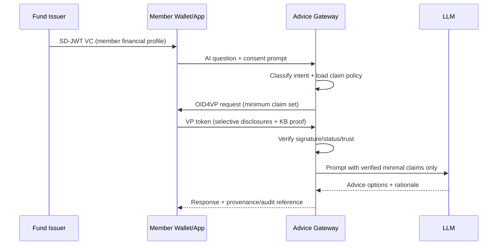

# Verified Advice Context for AI in Superannuation and Finance

## A practical pattern using SD-JWT, OpenID4VCI, and OpenID4VP

Most "AI copilot" projects in financial services fail at the same point: the model needs context, and teams pass too much customer data to get it.

In superannuation, this often means exposing a member's full profile ("golden record") to answer a narrow question like:

`"Should I increase salary sacrifice this quarter?"`

That approach creates avoidable privacy, security, and governance risk.

This paper proposes a simpler and more defensible pattern for this repository ecosystem: **Verified Advice Context (VAC)**.

---

## The Core Idea: Verified Advice Context (VAC)

**VAC** is a short-lived, purpose-specific data envelope for AI.

It is created by combining:

1. **Cryptographic authenticity** (claims are issuer-signed and verifiable).
2. **Selective disclosure** (only required claims are revealed).
3. **Explicit user consent** (holder approves each presentation scope).
4. **Policy-constrained retrieval** (verifier asks only for allowed claims for that intent).

In practice:

1. A super fund (Issuer) creates an SD-JWT VC containing member facts.
2. The member app/wallet (Holder) stores it.
3. An AI service (Verifier) requests only minimum claims needed for a specific intent.
4. The wallet presents only those claims.
5. The AI model receives verified minimal context, not raw profile data.

Result: better personalization with lower data exposure.

---

## Why This Pattern Is Strong for Australia

VAC aligns well with the operating constraints of AU super and finance programs:

- **Privacy Act APP 3**: collect only information that is reasonably necessary.
- **Privacy Act APP 6**: limit use/disclosure to purpose and consent conditions.
- **Privacy Act APP 11**: take reasonable steps to protect personal information.
- **APRA CPS 234**: maintain information security capability commensurate with threats.
- **APRA CPS 230**: operational risk and service provider controls (effective 1 July 2025).
- **APRA SPS 515**: governance and member outcomes discipline for trustees.
- **ASIC REP 798**: AI adoption is rising, but governance maturity is uneven across licensees.

VAC does not automatically make a solution compliant, but it gives architects a technical control model that maps to these obligations.

---

## Primary Use Case: Superannuation Contribution Strategy Copilot

### User question

`"If I add extra pre-tax contributions, what changes for my retirement balance and insurance?"`

### Minimum claims policy for this intent

**Required claims (example)**:

- `concessional_contributions_ytd`
- `concessional_cap_remaining`
- `salary_band`
- `employer_contribution_rate`
- `insurance_premium_impact_flag`
- `age_band` (not exact date of birth)

**Explicitly excluded claims**:

- `tfn`
- `full_name`
- `home_address`
- `beneficiary_details`
- `exact_dob`

### Workflow



### Policy-first request generation (conceptual)

```json
{
  "intent": "super_contribution_strategy",
  "required_claims": [
    "concessional_contributions_ytd",
    "concessional_cap_remaining",
    "salary_band",
    "employer_contribution_rate",
    "insurance_premium_impact_flag",
    "age_band"
  ],
  "forbidden_claims": [
    "tfn",
    "full_name",
    "home_address",
    "beneficiary_details",
    "exact_dob"
  ]
}
```

This policy should drive Presentation Definition construction so over-collection is structurally blocked before the request reaches the wallet.

---

## Secondary Use Case: Lending Pre-Assessment (Broader Finance)

The same VAC pattern can be reused for credit pre-assessment:

- Verify `income_band`, `employment_status`, and `liability_band`.
- Avoid sharing full bank statements or transaction-level PII early in the funnel.
- Move to richer disclosure only when legally and operationally required.

This reduces drop-off, improves customer trust, and tightens data governance boundaries.

---

## How the SdJwt.Net Ecosystem Maps to VAC

| Capability | Package |
|---|---|
| Core SD-JWT issuance/verification | `SdJwt.Net` |
| SD-JWT VC data model and VC verification | `SdJwt.Net.Vc` |
| Credential issuance protocol | `SdJwt.Net.Oid4Vci` |
| Presentation protocol and VP validation | `SdJwt.Net.Oid4Vp` |
| Presentation Definition and claim selection logic | `SdJwt.Net.PresentationExchange` |
| Credential revocation/suspension checks | `SdJwt.Net.StatusList` |
| Federated trust chain support | `SdJwt.Net.OidFederation` |
| Higher assurance crypto/policy controls | `SdJwt.Net.HAIP` |

Implementation note: use this pattern with current package capabilities and track conformance hardening via the repository gap analyses in `reports/`.

---

## Production Guardrails

1. **No direct model access to core member systems**.
2. **No model-generated data requests** without deterministic policy validation.
3. **No verification, no model call**.
4. **Nonce and key-binding required** for each presentation.
5. **Structured audit logs** for intent, requested claims, disclosed claims, verification result, and model output ID.
6. **Human escalation path** when confidence is low or policy conflict is detected.

---

## Rollout Plan (Practical)

1. Define intent taxonomy and claim-minimization policies for top 3 member journeys.
2. Issue one SD-JWT VC profile for sandbox members via OID4VCI.
3. Add verifier gateway that enforces policy and verifies VP before AI invocation.
4. Ship one copilot flow (contribution strategy) with full audit telemetry.
5. Expand to adjacent journeys (insurance impact, retirement projection, lending pre-check).

Start narrow. Prove lower data exposure and equivalent-or-better advice quality. Then scale.

---

## References

- IETF RFC 9901 (SD-JWT): https://datatracker.ietf.org/doc/rfc9901/
- OpenID4VCI 1.0 Final announcement: https://openid.net/2025/09/15/openid-for-verifiable-credential-issuance-1-0-now-a-final-specification/
- OpenID4VP 1.0 Final announcement: https://openid.net/2025/07/02/openid-for-verifiable-presentations-1-0-now-a-final-specification/
- DIF Presentation Exchange v2.1.1: https://identity.foundation/presentation-exchange/spec/v2.1.1/
- Privacy Act 1988 (APP 3, APP 6, APP 11): https://www.legislation.gov.au/C2004A03712/latest/text
- OAIC guidance: Privacy and developing/updating/deploying Gen AI models: https://www.oaic.gov.au/privacy/privacy-guidance-for-organisations-and-government-agencies/privacy-and-developing-and-training-generative-ai-models
- APRA CPS 230 (effective 1 July 2025): https://www.apra.gov.au/operational-risk-management-cps-230
- APRA CPS 234: https://www.apra.gov.au/information-security-prudential-standard-cps-234
- APRA SPS 515: https://www.apra.gov.au/prudential-standard-sps-515-strategic-planning-and-member-outcomes
- ASIC REP 798: https://download.asic.gov.au/media/gbnkrcf4/rep798-published-20-may-2025.pdf
- ATO concessional contributions overview: https://www.ato.gov.au/individuals-and-families/super-for-individuals-and-families/super/growing-and-keeping-track-of-your-super/how-to-grow-your-super/super-contributions/concessional-contributions
