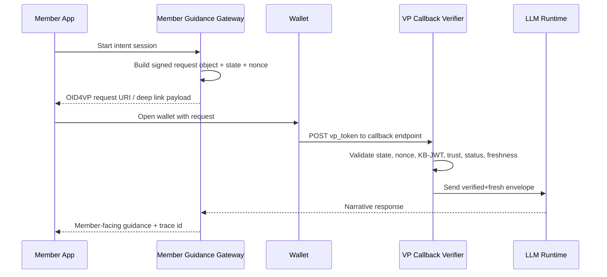

# Verified Advice Context (VAC)

## Case study: production AI guidance for superannuation and finance

## Executive summary

This case study addresses a common failure mode in financial AI programs:

- the model needs context
- teams overshare customer data to provide that context

Verified Advice Context (VAC) is a production pattern that enforces:

1. verified data provenance (`SD-JWT`)
2. minimum-necessary disclosure (`OpenID4VP` + `Presentation Exchange`)
3. deterministic policy gates before model invocation
4. auditable evidence from intent to output

VAC is not a legal shortcut. It is a technical control model that helps teams implement safer operating modes and demonstrate governance in regulated environments.

---

## Why this matters now (corrected evidence)

As of **February 27, 2026**:

| Evidence | Source date | Implementation implication |
|---|---|---|
| Total superannuation assets were **$4,485.5bn** as at **31 Dec 2025** (APRA statistics publication dated **26 Feb 2026**). | 2026-02-26 | High-value member outcomes and high blast radius for AI/data failures. |
| OAIC NDB report for Jan-Jun 2025 recorded **532** notifications; **59%** were malicious/criminal attacks; finance accounted for **14%**. | 2025 H1 report | Data minimization and containment controls are mandatory design inputs. |
| ASIC REP 798 was released **29 Oct 2024** and reviewed **23 licensees** and **624 AI use cases** (as at Dec 2023). | 2024-10-29 | AI is already operational; governance maturity and control evidence are now scrutiny points. |
| OpenID4VP 1.0 final approval post date: **10 Jul 2025**. OpenID4VCI 1.0 final approval post date: **16 Sep 2025**. | 2025 | Standards baseline is mature enough for interoperable production profiles. |
| APRA CPS 230 commencement date: **1 Jul 2025**. | 2025-07-01 | Operating model must include resilience, dependency control, and incident response. |

---

## Current production pain points

### 1) Golden-record coupling

Backend profile services return broad identity and account payloads for narrow intents.

Impact:
- unnecessary PII exposure to AI pipelines
- larger breach impact and audit scope
- higher friction with privacy/security review

### 2) Unverified model inputs

When direct data access is restricted, products often ask users to type values manually.

Impact:
- no cryptographic authenticity
- no integrity proof
- inconsistent recommendation quality

### 3) Weak intent-level evidence

Traditional telemetry logs calls, not "why this specific data was necessary."

Impact:
- difficult assurance for risk/compliance
- difficult replay for incident response and complaints

---

## Existing solution options and gaps

| Option | Short-term upside | Structural gap |
|---|---|---|
| Full profile prompt injection | Fast build | Over-collection and high governance risk. |
| User-entered inputs | Easy integration | Untrusted data; error-prone and non-reproducible. |
| Redaction middleware | Reduces obvious leakage | Brittle; cannot prove retained values are authentic. |
| API tokenization only | Better service segmentation | Still server-centric; lacks holder-mediated selective disclosure. |

---

## VAC operating model

### Core pattern

1. Issuer creates signed credentials containing member financial attributes.
2. Holder wallet/app stores credentials.
3. Member Guidance Gateway maps intent to strict claim policy.
4. Wallet presents only required claims.
5. Gateway verifies proofs, trust, status, and recency.
6. Only verified and fresh claims are sent to model runtime.

### Critical architectural decision: deterministic decisioning first, LLM narration second

For superannuation scenarios, use deterministic engines for:

- contribution cap calculations and carry-forward logic
- insurance premium impact calculations
- projection assumptions and scenario math

Use the LLM for:

- plain-language explanation
- trade-off narration
- next-step guidance and clarification prompts

This split materially reduces hallucination risk and legal exposure.

---

## Advice classification and operating model (AU)

The term "advice" is regulated in Australia. VAC implementations should explicitly classify each intent path before response generation.

### Mode A: guidance / information / general advice posture (lower risk)

- no personal recommendation presented as tailored personal advice
- deterministic facts, ranges, and educational explanations
- guardrails block intent classes that need licensed workflows

### Mode B: intra-fund or personal advice posture (higher risk)

- licensed workflow requirements apply
- best-interest and record-keeping obligations become central controls
- human adviser review/approval may be mandatory for selected intents

### Required policy gate

| Intent | Allowed mode | Automated response | Escalation |
|---|---|---|---|
| Contribution cap education | Mode A | Yes | None |
| "Should I do X" with personal circumstances | Mode B | Conditional | Licensed adviser review |
| Insurance cover change recommendation | Mode B | Conditional | Licensed workflow + record obligations |

Do not mix these modes implicitly in prompts. Make classification explicit and testable.

---

## Detailed case study: super contribution guidance

### Member question

`"If I increase pre-tax contributions, what changes for my projected outcome and insurance premium?"`

### Intent policy contract

```json
{
  "intent": "super_contribution_guidance",
  "mode": "guidance_only",
  "required_claims": [
    "concessional_contributions_ytd",
    "concessional_cap_remaining",
    "salary_band",
    "employer_contribution_rate",
    "insurance_premium_impact_flag",
    "age_band"
  ],
  "forbidden_claims": [
    "tfn",
    "full_name",
    "home_address",
    "exact_dob",
    "beneficiary_details"
  ],
  "freshness_policy": {
    "max_age_hours": 24,
    "fail_closed": true
  }
}
```

### Verified + Fresh envelope (model input contract)

```json
{
  "trace_id": "5b64f2a7-b6a1-4448-a770-c2a4e1a3e1fa",
  "intent": "super_contribution_guidance",
  "mode": "guidance_only",
  "verified_claims": {
    "concessional_contributions_ytd": {
      "value": 11850,
      "as_of_utc": "2026-02-26T12:00:00Z"
    },
    "concessional_cap_remaining": {
      "value": 18150,
      "as_of_utc": "2026-02-26T12:00:00Z"
    },
    "salary_band": {
      "value": "90k-110k",
      "as_of_utc": "2026-02-20T00:00:00Z"
    },
    "insurance_premium_impact_flag": {
      "value": true,
      "as_of_utc": "2026-02-26T12:00:00Z"
    }
  },
  "verification": {
    "nonce_verified": true,
    "kb_verified": true,
    "status_checked": true,
    "trust_chain_verified": true,
    "freshness_check_passed": true
  }
}
```

If freshness fails, the flow blocks and requests re-issuance or data refresh.

---

## Protocol-realistic flow (OID4VP)



This is closer to production OID4VP behavior than direct "gateway calls wallet" abstractions.

---

## Threat model (minimum production set)

| Threat | Control | Evidence artifact |
|---|---|---|
| Replay of presentation | `state` + `nonce` binding, expiration checks | nonce/state validation logs |
| Stolen VP token reuse | key binding JWT validation + audience checks | KB validation result per transaction |
| Issuer key compromise | status checks + trust chain verification | revocation/status query logs |
| Over-collection regression | forbidden-claims tests + runtime policy telemetry | CI test reports + policy violation metrics |
| Audit store becomes new golden record | store claim names and hashes by default; encrypt sensitive values; strict retention | data retention config + encryption audit |

---

## Supported trust models

| Model | Strength | Baseline recommendation |
|---|---|---|
| OpenID Federation trust chains | Dynamic ecosystem trust and delegation | Recommended for multi-party ecosystems |
| Static trust lists / pinned keys | Simpler operations | Acceptable for single-fund closed environments |
| Mutual TLS + bilateral trust | Strong transport identity | Good extension for high-trust bilateral channels |
| DID-method-specific trust | Flexible decentralized trust | Optional extension where ecosystem requires it |

Choose one baseline model and document extension paths explicitly to avoid hidden trust assumptions.

---

## Current production profile statement (repository-aligned)

As of the repository gap analyses dated **2026-02-26**, this ecosystem is strong foundation + partial conformance for several protocol-critical paths.

### Gap reports (pinned to commit)

- OID4VCI/OID4VP/PEX/HAIP/Federation gap report:
  - `reports/openid4vc-suite-gap-analysis.md`
  - https://github.com/openwallet-foundation-labs/sd-jwt-dotnet/blob/7eaf052/reports/openid4vc-suite-gap-analysis.md
- SD-JWT VC draft-15 gap report:
  - `reports/sd-jwt-vc-draft-15-gap-analysis.md`
  - https://github.com/openwallet-foundation-labs/sd-jwt-dotnet/blob/7eaf052/reports/sd-jwt-vc-draft-15-gap-analysis.md

### Conformance matrix (actionable)

| Feature | Status | Package | Tracking issue/work item |
|---|---|---|---|
| OID4VCI `credential_offer_uri` | Unsupported | `SdJwt.Net.Oid4Vci` | [OID4VCI table + Phase 1](https://github.com/openwallet-foundation-labs/sd-jwt-dotnet/blob/7eaf052/reports/openid4vc-suite-gap-analysis.md) |
| OID4VCI proof header mechanisms (`kid`/`x5c`) | Partial | `SdJwt.Net.Oid4Vci` | [OID4VCI table + Phase 1](https://github.com/openwallet-foundation-labs/sd-jwt-dotnet/blob/7eaf052/reports/openid4vc-suite-gap-analysis.md) |
| OID4VP JAR request object handling | Partial | `SdJwt.Net.Oid4Vp` | [OID4VP table + Phase 2](https://github.com/openwallet-foundation-labs/sd-jwt-dotnet/blob/7eaf052/reports/openid4vc-suite-gap-analysis.md) |
| PEX submission requirement semantics | Partial | `SdJwt.Net.PresentationExchange` | [PEX table + Phase 3](https://github.com/openwallet-foundation-labs/sd-jwt-dotnet/blob/7eaf052/reports/openid4vc-suite-gap-analysis.md) |
| HAIP runtime protocol validator | Partial/non-production | `SdJwt.Net.HAIP` | [HAIP table + Phase 1](https://github.com/openwallet-foundation-labs/sd-jwt-dotnet/blob/7eaf052/reports/openid4vc-suite-gap-analysis.md) |
| Federation metadata policy processing | Partial | `SdJwt.Net.OidFederation` | [Federation table + Phase 4](https://github.com/openwallet-foundation-labs/sd-jwt-dotnet/blob/7eaf052/reports/openid4vc-suite-gap-analysis.md) |

Before broad production rollout, convert each work item above into a repository issue with:

- owner
- target milestone
- conformance test exit criteria

---

## Outcome KPIs for the case study

Track these at program level:

1. **Median claims disclosed per intent** (lower is better when outcome quality is preserved).
2. **Percentage of model calls backed by verified + fresh envelopes** (target 100%).
3. **Forbidden-claim request attempts blocked** (and trend by release).
4. **Guidance-mode to licensed-workflow escalation rate** (to validate policy thresholds).
5. **Advice/guidance reproducibility rate** (response traceable to policy version and verified inputs).
6. **Containment time for trust/status incidents** (detection to enforcement).

---

## Artifact split for production teams

To keep audiences focused, VAC is published as three documents:

1. **Case study (this document)**
   - business problem, evidence, operating model, outcomes, KPIs
2. **Reference architecture**
   - components, trust model, threats, controls, deployment patterns
   - [verified-advice-reference-architecture.md](verified-advice-reference-architecture.md)
3. **Implementation guide**
   - endpoint flows, schema contracts, policy tests, runbooks
   - [verified-advice-implementation-guide.md](verified-advice-implementation-guide.md)

---

## References

1. APRA Quarterly Superannuation Performance Statistics (Dec 2025, published 26 Feb 2026): https://www.apra.gov.au/quarterly-superannuation-performance-statistics
2. OAIC Notifiable Data Breaches Report (Jan-Jun 2025): https://www.oaic.gov.au/privacy/notifiable-data-breaches/notifiable-data-breaches-publications/notifiable-data-breaches-report-january-to-june-2025
3. ASIC REP 798 media release (29 Oct 2024): https://asic.gov.au/about-asic/news-centre/find-a-media-release/2024-releases/24-230mr-asic-scrutinises-licensees-use-of-ai-and-prepares-for-future-challenges/
4. ASIC REP 798 report: https://download.asic.gov.au/media/4oujk2vv/rep798-published-29-october-2024.pdf
5. OpenID4VP 1.0 final approval post (10 Jul 2025): https://openid.net/2025/07/10/openid-for-verifiable-presentations-1-0-approved-as-final-specification/
6. OpenID4VCI 1.0 final approval post (16 Sep 2025): https://openid.net/2025/09/16/openid-for-verifiable-credential-issuance-1-0-approved-as-final-specification/
7. RFC 9901 (SD-JWT): https://datatracker.ietf.org/doc/rfc9901/
8. OpenID4VCI 1.0 specification: https://openid.net/specs/openid-4-verifiable-credential-issuance-1_0.html
9. OpenID4VP 1.0 specification: https://openid.net/specs/openid-4-verifiable-presentations-1_0.html
10. DIF Presentation Exchange v2.1.1: https://identity.foundation/presentation-exchange/spec/v2.1.1/
11. APRA CPS 230: https://www.apra.gov.au/prudential-standard-cps-230-operational-risk-management
12. APRA CPS 234: https://www.apra.gov.au/prudential-standard-cps-234-information-security
13. ASIC RG 244: https://asic.gov.au/regulatory-resources/find-a-document/regulatory-guides/rg-244-giving-information-general-advice-and-scaled-advice/
14. ASIC INFO 168 (intra-fund advice): https://asic.gov.au/regulatory-resources/find-a-document/information-sheets/info-168-superannuation-advice-under-the-future-of-financial-advice-reforms/
15. ASIC and APRA joint letter on collective charging for advice fees (10 Jan 2025): https://www.apra.gov.au/news-and-publications/joint-letter-to-superannuation-trustees-and-rses-licensees-on-collective-charging-for-advice-fees
16. Privacy Act 1988 (Cth): https://www.legislation.gov.au/C2004A03712/latest/text
