# Verified Advice Context (VAC) Reference Architecture

## Purpose

This document defines a production-defensible architecture for VAC deployments in superannuation and financial services.

It focuses on:

- security and identity controls
- trust and status validation
- threat coverage and evidence artifacts
- deployment topologies

---

## Architecture principles

1. **Verify before infer**: no model call without successful cryptographic and policy verification.
2. **Deterministic before generative**: perform calculation and rule evaluation in deterministic services first.
3. **Minimum disclosure by intent**: policy constrains what can be requested and presented.
4. **Freshness enforcement**: stale data fails closed.
5. **Mode-aware processing**: guidance mode and licensed advice mode are explicitly separated.

---

## Component architecture

```mermaid
flowchart TB
    subgraph Holder Side
        APP[Member App]
        WALLET[Wallet / Credential Store]
    end

    subgraph Issuer Side
        REG[Fund Registry Systems]
        ISSUER[Credential Issuer<br/>SdJwt.Net + OID4VCI]
    end

    subgraph Guidance Platform
        GW[Member Guidance Gateway]
        POLICY[Intent and Mode Policy Engine]
        OID4VP[OID4VP Request Builder and Callback Verifier]
        VERIFY[Proof/Trust/Status/Freshness Verifier]
        CALC[Deterministic Calculation Engine]
        LLM[LLM Narration Service]
        AUDIT[Audit and Evidence Store]
    end

    subgraph Trust and Revocation
        FED[Trust Resolver<br/>OID Federation or Static Trust]
        STATUS[Status List Service]
    end

    REG --> ISSUER
    ISSUER --> WALLET
    APP --> GW
    GW --> POLICY
    GW --> OID4VP
    OID4VP --> WALLET
    WALLET --> OID4VP
    OID4VP --> VERIFY
    VERIFY --> FED
    VERIFY --> STATUS
    VERIFY --> CALC
    CALC --> LLM
    LLM --> GW
    VERIFY --> AUDIT
    CALC --> AUDIT
    LLM --> AUDIT
```

---

## Control sequence

1. Member request arrives at gateway.
2. Policy engine classifies intent and operating mode.
3. OID4VP request is created with state/nonce and minimum claim policy.
4. Wallet submits VP response to callback endpoint.
5. Verifier checks:
   - SD-JWT integrity
   - key binding and audience
   - nonce/state replay protection
   - trust chain or pinned trust
   - status and freshness
6. Deterministic engine computes outcomes.
7. LLM produces narrative only from computed and verified outputs.
8. Audit store captures evidence chain with trace id.

---

## Deployment topologies

## Topology A: embedded wallet SDK (single app estate)

Good for fund-controlled channels where wallet integration is inside the member application.

Pros:
- simpler UX and operational control

Cons:
- tighter coupling and reduced wallet interoperability

## Topology B: external wallet interoperability (ecosystem mode)

Good for multi-wallet, multi-issuer environments using standard OID4VP request/response flows.

Pros:
- cleaner standards interoperability

Cons:
- more endpoint and state-management complexity

---

## Trust model options

| Trust model | Baseline fit | Notes |
|---|---|---|
| OID Federation trust chain | Multi-party ecosystems | Dynamic and scalable trust delegation. |
| Static trust list / pinned keys | Closed single-fund deployments | Operationally simple but less flexible. |
| mTLS bilateral trust | High-assurance partner links | Strong channel identity; use with credential proofs. |
| DID-specific trust methods | Ecosystem-specific | Use only when required by relying parties. |

Recommendation:
- choose one baseline trust model per production profile
- keep alternatives as documented extensions, not implicit behavior

---

## Threat model and control evidence

| Threat | Primary controls | Evidence artifacts |
|---|---|---|
| Replay of authorization response | state/nonce one-time checks, tight expiry windows | callback validation logs |
| Reuse of stolen VP token | KB-JWT binding, audience checks, session binding | verification audit records |
| Issuer key compromise | status list + trust resolver checks + cache invalidation | trust/status query logs and incident playbook records |
| Policy bypass for over-collection | forbidden-claim unit tests + runtime policy enforcement | CI test reports and policy decision telemetry |
| Freshness drift | per-claim `as_of` + intent-specific max-age | freshness check logs and rejection metrics |
| Audit store over-retention | encryption at rest, claim-value minimization, retention limits | retention config and access logs |

---

## Evidence model

Each response should be reconstructable using a single trace id:

1. intent + mode decision
2. requested and disclosed claim names
3. verification outcomes (proof, trust, status, freshness)
4. deterministic calculation inputs/outputs
5. model id, prompt template id, output id

This provides practical support for complaints handling, model risk review, and incident response.

---

## Production profile guardrails

1. Publish supported protocol paths and unsupported paths explicitly.
2. Block unsupported features behind feature flags.
3. Tie profile changes to conformance tests and release notes.
4. Fail closed on verification, status, or freshness failure.

---

## Related documents

- Case study: [verified-advice-context.md](verified-advice-context.md)
- Implementation guide: [verified-advice-implementation-guide.md](verified-advice-implementation-guide.md)
