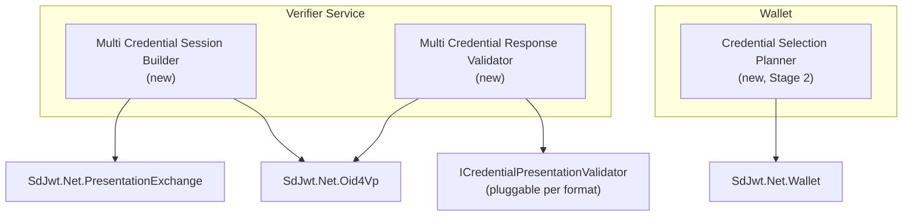
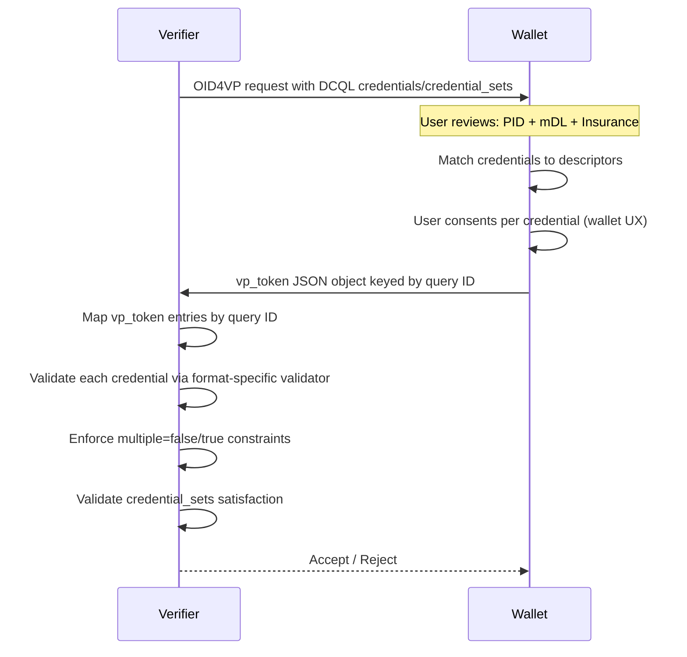

# Implementation Plan: Multi-Credential OID4VP Sessions

|                    |                                                                                                                |
| ------------------ | -------------------------------------------------------------------------------------------------------------- |
| **Status**         | Accepted                                                                                                       |
| **Priority**       | P1 - Implement next                                                                                            |
| **Author**         | SD-JWT .NET Team                                                                                               |
| **Created**        | 2026-03-04                                                                                                     |
| **Reviewed**       | 2026-05-09                                                                                                     |
| **Maturity**       | Stable                                                                                                         |
| **Packages**       | `SdJwt.Net.Oid4Vp`, `SdJwt.Net.PresentationExchange`, `SdJwt.Net.Wallet`                                       |
| **New package?**   | No                                                                                                             |
| **Public API?**    | Yes                                                                                                            |
| **Specifications** | OpenID4VP 1.0 DCQL `credentials` / `credential_sets`, DIF Presentation Exchange v2.1.1 submission requirements |

---

## Context / Problem statement

Real-world verification scenarios frequently require **multiple credentials** in a single transaction:

- **Airport check-in**: Boarding pass + passport + vaccination record
- **Financial onboarding**: Government ID + proof of address + income attestation
- **Healthcare**: Insurance card + professional license + patient consent
- **EUDIW age verification + mDL**: PID (age_over_18) + mDL (driving privileges)

`SdJwt.Net.Oid4Vp` already models multi-credential OID4VP primitives: DCQL `credentials`, DCQL `credential_sets`, VP token arrays, and multiple Presentation Exchange descriptor mappings. `SdJwt.Net.PresentationExchange` also supports multiple input descriptors and submission requirements.

The remaining gap is not protocol support. The gap is an ergonomic verifier/wallet workflow for composing, matching, consenting to, and validating multi-credential sessions consistently across DCQL and Presentation Exchange.

---

## Goals

1. Request multiple credentials (mixed SD-JWT VC and mdoc) in a single OID4VP session
2. Validate all credentials atomically (all-or-nothing as verifier application policy)
3. Support mixed format types within one presentation definition
4. Provide wallet-side planning metadata that a wallet UI can use for credential-level consent
5. Maintain backward compatibility with single-credential flows

## Non-Goals

- Cross-device credential aggregation (credentials from multiple wallets)
- Credential chaining (using one credential to unlock issuance of another)
- Wallet UX implementation (consent UI is the wallet application's responsibility)

---

## Direction

Do not add a separate "bundle" protocol. Implement a thin planning layer over OpenID4VP 1.0 and DIF PEX:

- Prefer DCQL for new OpenID4VP requests because it is the final OpenID4VP query language.
- Keep PEX support for ecosystems that still use `presentation_definition`.
- Atomic validation means the verifier rejects the whole response if any required credential query, credential set, signature, holder binding, status, or trust check fails. This is verifier application policy, not protocol-level atomicity.
- The validator must map returned `vp_token` entries by DCQL credential query `id`.
- Return standard OpenID4VP responses: VP token as a JSON object keyed by DCQL credential query `id` where each value is an array of presentations; `presentation_submission` only where PEX is used.

---

## Implementation plan

### Implementation stages

**Stage 1:** Verifier-side DCQL request builder and response validator

**Stage 2:** Reference wallet-side credential selection planner

### Architecture



### Component design

#### `MultiCredentialRequestBuilder`

Builds standard OpenID4VP requests using DCQL first and PEX where requested.

```csharp
public sealed class MultiCredentialRequestBuilder
{
    public MultiCredentialRequestBuilder AddDcqlCredential(
        string id,
        string format,
        IReadOnlyList<DcqlClaimsQuery> claims,
        bool multiple = false);

    public MultiCredentialRequestBuilder AddCredentialSet(
        string id,
        IReadOnlyList<IReadOnlyList<string>> options,
        bool required = true);

    public MultiCredentialRequestBuilder RequireAtomicSubmission(bool atomic = true);

    public AuthorizationRequest Build();
}
```

#### `MultiCredentialResponseValidator`

Validates that the standard OID4VP response satisfies the requested credential set policy.

```csharp
public sealed class MultiCredentialResponseValidator
{
    public Task<MultiCredentialValidationResult> ValidateAsync(
        AuthorizationResponse response,
        MultiCredentialValidationOptions options,
        CancellationToken cancellationToken = default);
}

public sealed class MultiCredentialValidationResult
{
    public bool IsValid { get; }
    public IReadOnlyList<CredentialQueryValidationResult> Credentials { get; init; } = [];
    public IReadOnlyList<string> UnsatisfiedCredentialSets { get; init; } = [];
}
```

#### `CredentialQueryValidationResult`

Maps returned `vp_token` entries by DCQL credential query `id`:

```csharp
public sealed class CredentialQueryValidationResult
{
    public required string QueryId { get; init; }
    public required string Format { get; init; }
    public bool IsValid { get; init; }
    public string? Error { get; init; }
    public IReadOnlyList<PresentationValidationResult> Presentations { get; init; } = [];
}
```

#### `ICredentialPresentationValidator`

Pluggable validators per credential format because `dc+sd-jwt` and `mso_mdoc` need different validation pipelines:

```csharp
public interface ICredentialPresentationValidator
{
    /// <summary>
    /// The credential format this validator handles (e.g., "dc+sd-jwt", "mso_mdoc").
    /// </summary>
    string Format { get; }

    Task<PresentationValidationResult> ValidateAsync(
        string presentation,
        CredentialQueryContext queryContext,
        CancellationToken cancellationToken = default);
}
```

#### DCQL `multiple` enforcement

The validator enforces the following rules per the DCQL response shape:

| `multiple` value                        | Behavior                                      |
| --------------------------------------- | --------------------------------------------- |
| `false` or omitted                      | Exactly one presentation maximum in the array |
| `true`                                  | One or more presentations allowed             |
| Optional credential query with no match | No `vp_token` entry for that query ID         |

### Sequence: multi-credential request



---

## API surface

```csharp
// Build multi-credential request using DCQL
var request = new MultiCredentialRequestBuilder()
    .AddDcqlCredential(
        id: "pid",
        format: "dc+sd-jwt",
        claims: pidClaims)
    .AddDcqlCredential(
        id: "mdl",
        format: "mso_mdoc",
        claims: mdlClaims)
    .AddCredentialSet("identity-and-driving", [["pid", "mdl"]])
    .RequireAtomicSubmission(true)
    .Build();

// Validate response
var validator = new MultiCredentialResponseValidator(
    formatValidators,  // IEnumerable<ICredentialPresentationValidator>
    statusChecker);
var result = await validator.ValidateAsync(response, new MultiCredentialValidationOptions
{
    FailOnPartialSubmission = true,
    ValidateStatus = true
});

foreach (var cred in result.Credentials)
{
    Console.WriteLine($"{cred.QueryId} ({cred.Format}): {(cred.IsValid ? "Valid" : cred.Error)}");
}
```

---

## Security considerations

| Concern                                   | Mitigation                                                                                                  |
| ----------------------------------------- | ----------------------------------------------------------------------------------------------------------- |
| Credential correlation across descriptors | Each credential verified independently; no cross-credential linking by verifier unless explicitly requested |
| Partial submission attacks                | `RequireAtomicSubmission` enforces all-or-nothing as verifier policy                                        |
| Mixed format validation bypass            | Each format validated by its specific `ICredentialPresentationValidator`                                    |
| Consent fatigue                           | Wallet-side planning metadata supports credential-level consent display in wallet UX                        |

---

## Acceptance criteria

```text
Given a DCQL query with two required credential sets,
when one required credential is missing,
then validator rejects the overall response.

Given a DCQL query with multiple=false,
when the vp_token array for that query ID contains two presentations,
then the validator rejects the response.

Given a DCQL query with multiple=true,
when the vp_token array for that query ID contains three presentations,
then all three are validated and the response is accepted.

Given an optional credential query with no match,
when the vp_token has no entry for that query ID,
then the validator does not reject the response.

Given mixed dc+sd-jwt and mso_mdoc credentials,
when both are present and valid,
then format-specific validators are invoked per credential format.

Given atomic submission required and one credential fails signature validation,
when the response is validated,
then the entire response is rejected.
```

---

## Interop test requirements

- Wallet interop: DCQL multi-credential request consumed by reference wallet
- Negative test: missing required credential set rejects response
- Format mismatch test: wrong format for a query ID rejects that credential
- Replay test: nonce reuse across sessions rejected
- PEX compatibility: same scenario validated via presentation_definition

---

## Estimated effort

| Component                                                 | Effort      |
| --------------------------------------------------------- | ----------- |
| DCQL-first request builder                                | 2 days      |
| PEX compatibility path                                    | 2 days      |
| Multi-credential response policy validator                | 3 days      |
| `ICredentialPresentationValidator` and format dispatching | 2 days      |
| Wallet credential selection planner (Stage 2)             | 3 days      |
| Tests for DCQL sets, VP token arrays, PEX maps            | 3 days      |
| Documentation and samples                                 | 2 days      |
| **Total**                                                 | **17 days** |

---

## Related documentation

- [OpenID4VP](../concepts/openid4vp.md)
- [Presentation Exchange](../concepts/presentation-exchange.md)
- [Wallet](../concepts/wallet.md)
