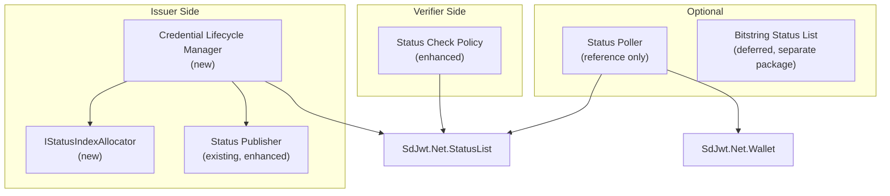
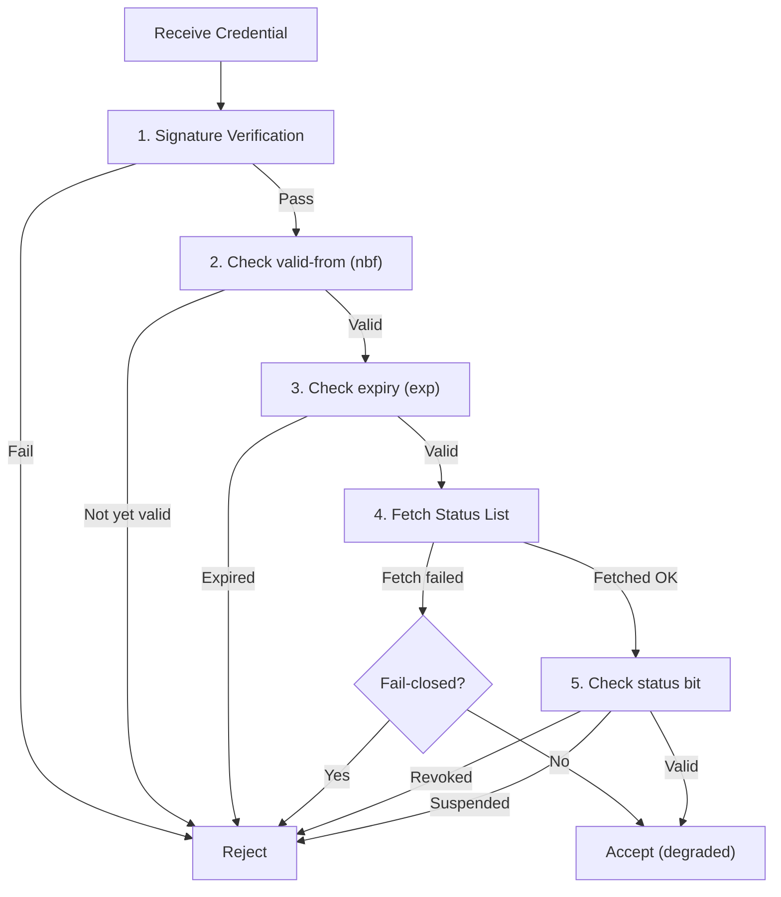

# Implementation Plan: Credential Lifecycle Controls

|                    |                                                                                                                                                                             |
| ------------------ | --------------------------------------------------------------------------------------------------------------------------------------------------------------------------- |
| **Status**         | Accepted (partial - split into work packages)                                                                                                                               |
| **Priority**       | P1 - Implement next (issuer/verifier lifecycle first)                                                                                                                       |
| **Author**         | SD-JWT .NET Team                                                                                                                                                            |
| **Created**        | 2026-03-04                                                                                                                                                                  |
| **Reviewed**       | 2026-05-09                                                                                                                                                                  |
| **Maturity**       | Spec-tracking (Token Status List is IETF draft-20, not yet RFC)                                                                                                             |
| **Package**        | `SdJwt.Net.StatusList` (extension)                                                                                                                                          |
| **New package?**   | Optional: `SdJwt.Net.StatusList.Bitstring` or `SdJwt.Net.VcDm.StatusList` for W3C Bitstring (deferred)                                                                      |
| **Public API?**    | Yes                                                                                                                                                                         |
| **Specifications** | [Token Status List draft-20](https://datatracker.ietf.org/doc/draft-ietf-oauth-status-list/), [Bitstring Status List v1.0](https://www.w3.org/TR/vc-bitstring-status-list/) |

---

## Context / Problem statement

The current `SdJwt.Net.StatusList` package provides Token Status List creation, verification, freshness checks, and RFC 7662 token introspection. `SdJwt.Net.Wallet` also includes a status-list-backed document status resolver. `SdJwt.Net.VcDm` models W3C `BitstringStatusListEntry`, but it does not issue, publish, fetch, or validate Bitstring Status List credentials.

Remaining lifecycle work is focused on richer issuer controls and additional status formats.

---

## Work packages

This proposal is split into three work packages, implemented in order:

1. **Issuer status lifecycle controls** (implement first)
2. **Verifier status policy** (implement first)
3. **Bitstring Status List v1.0** (implement later, separate package)

Wallet-side status polling is repositioned as an optional reference wallet refresh service, not a default wallet behavior.

---

## Goals

1. Provide fluent APIs for credential revocation, suspension, and reinstatement
2. Support status index allocation and persistence
3. Enforce both temporal validity and status list checks with configurable fail-open / fail-closed behavior
4. Produce structured audit events for status mutations
5. Handle concurrency and atomic batch updates safely

## Non-Goals

- CRL (Certificate Revocation List) support
- OCSP (Online Certificate Status Protocol) support
- Real-time push notification of revocation events to wallets
- Wallet-side status polling as a default behavior (optional reference only)

---

## Direction

- Keep Token Status List and W3C Bitstring Status List as separate implementations behind a shared status-check abstraction.
- Do not make W3C Bitstring Status List a dependency of the SD-JWT VC-only path; keep it as a separate optional package.
- Preserve existing `StatusListVerifier`, `HybridStatusChecker`, and wallet document status resolver APIs.
- Treat issuer-side mutation APIs as storage-backed operations, not in-memory-only helpers.
- If verifiers fetch status lists directly from issuer infrastructure, access logs can still reveal verifier activity. CDN/public caching is recommended to preserve privacy.

---

## Implementation plan

### Architecture



### Work Package 1: Issuer status lifecycle controls

#### `IStatusIndexAllocator`

```csharp
/// <summary>
/// Allocates and persists status indexes for credential lifecycle tracking.
/// </summary>
public interface IStatusIndexAllocator
{
    Task<CredentialStatusReference> AllocateAsync(
        CredentialStatusAllocationRequest request,
        CancellationToken ct = default);
}

public sealed class CredentialStatusAllocationRequest
{
    public required string StatusListUri { get; init; }
    public required string StatusPurpose { get; init; }
    public int BitSize { get; init; } = 1;
    public string? CredentialId { get; init; }
    public string? TenantId { get; init; }
}

public sealed class CredentialStatusReference
{
    public required string StatusListUri { get; init; }
    public required int StatusIndex { get; init; }
    public required string StatusPurpose { get; init; }
    public int BitSize { get; init; }
}
```

#### `CredentialLifecycleManager`

```csharp
public sealed class CredentialLifecycleManager
{
    /// <summary>
    /// Revoke with reason and audit metadata.
    /// </summary>
    public Task RevokeAsync(
        int statusIndex,
        RevocationReason reason,
        StatusMutationContext context);

    /// <summary>
    /// Suspend (temporary, can be reinstated).
    /// </summary>
    public Task SuspendAsync(
        int statusIndex,
        string reason,
        StatusMutationContext context);

    /// <summary>
    /// Reinstate a suspended credential.
    /// </summary>
    public Task ReinstateAsync(
        int statusIndex,
        StatusMutationContext context);

    /// <summary>
    /// Batch operations with concurrency control.
    /// </summary>
    public Task BatchUpdateAsync(
        IEnumerable<StatusUpdate> updates,
        StatusMutationContext context);

    /// <summary>
    /// Publish updated status list with versioning.
    /// </summary>
    public Task<StatusListPublishResult> PublishAsync(PublishOptions options);
}

public enum RevocationReason
{
    Unspecified = 0,
    KeyCompromise = 1,
    AffiliationChanged = 2,
    Superseded = 3,
    PrivilegeWithdrawn = 4,
    CessationOfOperation = 5
}
```

#### `StatusMutationContext`

Structured audit context for every status mutation:

```csharp
public sealed class StatusMutationContext
{
    public required string OperatorId { get; init; }
    public string? CorrelationId { get; init; }
    public string? Reason { get; init; }
}
```

#### Audit event model

The lifecycle manager produces structured events:

```csharp
public sealed class CredentialStatusChangedEvent
{
    public required string CredentialId { get; init; }
    public required int StatusIndex { get; init; }
    public required string OldStatus { get; init; }
    public required string NewStatus { get; init; }
    public required string Reason { get; init; }
    public required string OperatorId { get; init; }
    public required DateTimeOffset Timestamp { get; init; }
    public string? CorrelationId { get; init; }
    public string? StatusListVersion { get; init; }
}
```

#### Concurrency and publishing model

Status updates are stateful and require:

- Optimistic concurrency / ETag for status list documents
- Versioned status list documents
- Atomic batch update semantics
- Publish after mutation
- Rollback strategy on publish failure

```csharp
public sealed class PublishOptions
{
    public string? ExpectedVersion { get; init; }
    public bool RequireVersionMatch { get; init; } = true;
}

public sealed class StatusListPublishResult
{
    public required string StatusListUri { get; init; }
    public required string Version { get; init; }
    public required DateTimeOffset PublishedAt { get; init; }
}
```

### Work Package 2: Verifier status policy

```csharp
public sealed class StatusCheckPolicyOptions
{
    public bool CheckExpiry { get; set; } = true;
    public bool CheckNotBefore { get; set; } = true;
    public bool CheckStatusList { get; set; } = true;
    public bool FailClosedOnStatusError { get; set; } = true;
    public TimeSpan ClockSkew { get; set; } = TimeSpan.FromSeconds(30);
    public TimeSpan MaxStatusListAge { get; set; } = TimeSpan.FromMinutes(15);
}
```

### Verification flow



### Work Package 3: Bitstring Status List v1.0 (deferred)

The [W3C Bitstring Status List v1.0](https://www.w3.org/TR/vc-bitstring-status-list/) Recommendation provides an alternative to IETF Token Status List for W3C Verifiable Credentials.

| Feature       | IETF Token Status List            | W3C Bitstring Status List                     |
| ------------- | --------------------------------- | --------------------------------------------- |
| Format        | JWT wrapping compressed bitstring | JSON-LD VerifiableCredential + bitstring      |
| Ecosystem     | OpenID4VC, SD-JWT VC              | W3C VC Data Model, JSON-LD                    |
| Compression   | ZLIB                              | GZIP                                          |
| Status values | 1/2/4/8-bit configurable          | 1-bit default; multi-bit with status messages |

Package boundary:

```text
SdJwt.Net.StatusList               // IETF Token Status List (existing)
SdJwt.Net.StatusList.Bitstring     // W3C Bitstring Status List (new, optional)
```

Do not mix Bitstring into the SD-JWT VC happy path.

### Optional: Wallet status polling

Wallet background polling is positioned as an **optional reference wallet refresh service**, not a default wallet behavior. It introduces privacy, UX, battery, and network implications.

```csharp
public class StatusPollerOptions
{
    public TimeSpan PollInterval { get; set; } = TimeSpan.FromHours(1);
    public bool NotifyOnRevocation { get; set; } = true;
    public bool RemoveRevokedCredentials { get; set; } = false;
}
```

---

## Security considerations

| Concern                                               | Mitigation                                                                                                                                         |
| ----------------------------------------------------- | -------------------------------------------------------------------------------------------------------------------------------------------------- |
| Status list staleness                                 | Configurable max age + TTL headers                                                                                                                 |
| Privacy (verifier learns which credential is checked) | Status list download is unlinkable (verifier gets full list, checks locally). CDN/public caching recommended to prevent issuer access log leakage. |
| Revocation racing                                     | Fail-closed by default; status list freshness validation                                                                                           |
| Unauthorized revocation                               | Lifecycle manager requires operator identity; structured audit events                                                                              |
| Concurrent batch corruption                           | Optimistic concurrency / ETag; versioned status list documents                                                                                     |

---

## Acceptance criteria

```text
Given a credential with status index N,
when RevokeAsync is called with KeyCompromise reason,
then the status bit is set and a CredentialStatusChangedEvent is produced.

Given a suspended credential,
when ReinstateAsync is called,
then the credential returns to valid status.

Given a batch update of 100 status changes,
when PublishAsync is called with a version mismatch,
then the operation fails without partial updates.

Given a verifier with fail-closed policy,
when the status list fetch fails,
then the credential is rejected.

Given a verifier with fail-open policy,
when the status list fetch fails,
then the credential is accepted with degraded status.
```

---

## Interop test requirements

- Status stale test: verifier rejects credential when status list exceeds max age
- Expiry test: credential with expired validity window rejected
- Replay test: revoked credential consistently rejected across fetches
- Batch test: concurrent batch updates produce consistent status list
- Negative test: revocation of already-revoked credential is idempotent

---

## Estimated effort

| Component                                       | Effort      |
| ----------------------------------------------- | ----------- |
| Shared status-check contracts                   | 2 days      |
| `IStatusIndexAllocator`                         | 2 days      |
| `CredentialLifecycleManager` with audit events  | 3 days      |
| Concurrency/publishing model                    | 2 days      |
| Verifier status check policy                    | 3 days      |
| Tests + documentation                           | 4 days      |
| **Subtotal (Work Packages 1+2)**                | **16 days** |
| Bitstring Status List v1.0 processor (deferred) | 6 days      |
| Wallet status polling (optional)                | 3 days      |

---

## Related documentation

- [Status List](../concepts/status-list.md) - Current implementation
- [Managing Revocation Guide](../guides/managing-revocation.md) - Current guide
- [Wallet](../concepts/wallet.md) - Wallet integration
