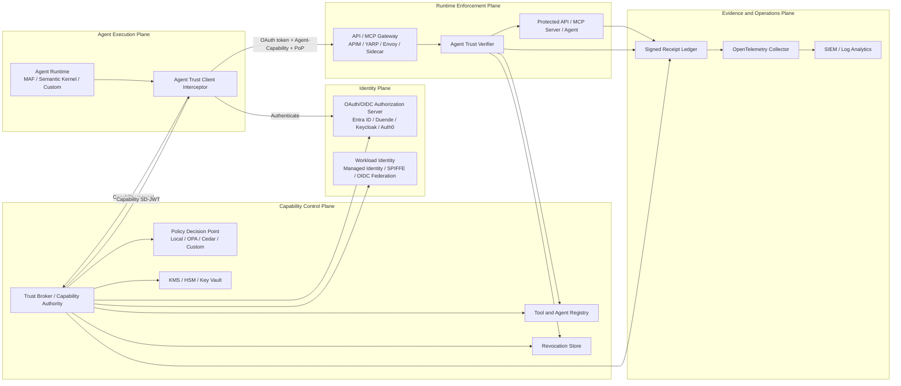
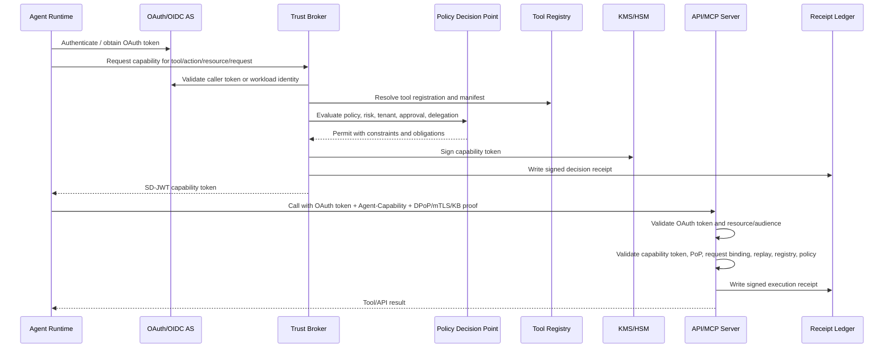
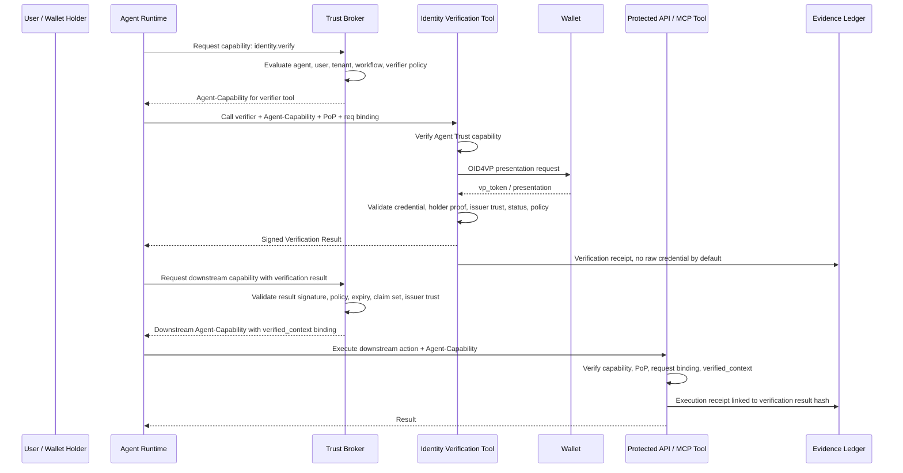

# Agent Trust Enterprise Architecture and SDK Implementation Specification

> **Document version:** v0.9-spec-preview  
> **Last updated:** 2026-06-08  
> **Document type:** Target architecture and SDK implementation specification

| Field           | Value                                                                                                                                                                                                              |
| --------------- | ------------------------------------------------------------------------------------------------------------------------------------------------------------------------------------------------------------------ |
| Document owner  | Thomas Tran                                                                                                                                                                                                        |
| Version         | v0.9-spec-preview                                                                                                                                                                                                  |
| Audience        | Solution architects, security architects, platform engineers, SDK maintainers                                                                                                                                      |
| Status          | Target design for preview-to-enterprise hardening                                                                                                                                                                  |
| Date            | 2026-05-10                                                                                                                                                                                                         |
| Scope           | `SdJwt.Net.AgentTrust.*` packages, Trust Broker reference architecture, MCP/API/A2A enforcement, digital identity verification integration, observability, conformance profiles                                    |
| Intended use    | Architecture review, engineering handover, implementation planning, security review, package design alignment                                                                                                      |
| Versioning note | This document is a specification version, not an SDK/NuGet semantic version. Use `spec-*` identifiers for document revisions to avoid confusing architecture/specification maturity with package release maturity. |

---

## Version History

| Version           | Date       | Summary                                                                                                                                                                                                                                                                                                                                                                                                                                                                                                                                                                                                                                                                                                                                                                                                                                                                                                                                                                                                                                                                                                                                                                                                                                                                                                                                                                                                                                        |
| ----------------- | ---------- | ---------------------------------------------------------------------------------------------------------------------------------------------------------------------------------------------------------------------------------------------------------------------------------------------------------------------------------------------------------------------------------------------------------------------------------------------------------------------------------------------------------------------------------------------------------------------------------------------------------------------------------------------------------------------------------------------------------------------------------------------------------------------------------------------------------------------------------------------------------------------------------------------------------------------------------------------------------------------------------------------------------------------------------------------------------------------------------------------------------------------------------------------------------------------------------------------------------------------------------------------------------------------------------------------------------------------------------------------------------------------------------------------------------------------------------------------- |
| v0.9-spec-preview | 2026-06-08 | Security-hardening corrections from architecture review. Rewrites the verification order to pin the algorithm before signature verification, verify SD-JWT disclosure integrity before reading disclosed claims, check issuer-key/agent revocation before honoring the signature, and split replay into reserve-before-authorize / commit-after-success so a stolen token is never consumed before proof-of-possession. Makes profile obligations (PoP, request binding, fail-closed) derive from `SecurityMode` rather than defaulting open. Mandates a single canonicalization (RFC 8785 JCS) with no "equivalent" escape hatch. Defines DPoP `jkt`-before-verify, a normative proof freshness window, and makes `agent_cap_ath` capability-scoped binding a MUST. Fixes the replay InProgress double-execution path and the consume-key contradiction (§10.5 vs §15.1). Mandates fail-closed on policy/approval/PDP/revocation-store unavailability for all non-Demo profiles and defines policy conflict precedence over `RequireApproval`/`StepUpRequired`. Defines delegation narrowing semantics, downstream-audience subset, aggregate (budget) limits, mandatory parent-evidence validation, and monotonic `maxDepth`. Binds the OID4VP `nonce`/audience into the signed verification result and binds `verified_context` to the requesting agent's PoP key and workflow. Records the spec-vs-implementation gaps the SDK must close. |
| v0.8-spec-preview | 2026-05-10 | Adds digital identity verification integration: OID4VP/wallet verifier reference pattern, signed verification result token, verified-context binding for downstream capabilities, identity-verification tool policies, package/API design, security requirements, demo scope, and enterprise use cases.                                                                                                                                                                                                                                                                                                                                                                                                                                                                                                                                                                                                                                                                                                                                                                                                                                                                                                                                                                                                                                                                                                                                        |
| v0.7-spec-preview | 2026-05-10 | Makes replay/idempotent retry deterministic with separate consume and retry keys, makes single-proof dual-DPoP binding the Enterprise default, requires a Core JCS canonicalizer, promotes capability templates to a first-class constrained subsystem, tightens approval/action hash semantics, and clarifies template receipts, revocation, and profile limits.                                                                                                                                                                                                                                                                                                                                                                                                                                                                                                                                                                                                                                                                                                                                                                                                                                                                                                                                                                                                                                                                              |
| v0.6-spec-preview | 2026-05-10 | Tightens replay/idempotent retry, dual-DPoP binding, JCS requirements, approval/action binding, policy hash semantics, delegation root issuer rules, MCP STDIO constraints, catalog freshness, receipt anchoring, demo token separation, conformance artifacts, and implementation API shapes.                                                                                                                                                                                                                                                                                                                                                                                                                                                                                                                                                                                                                                                                                                                                                                                                                                                                                                                                                                                                                                                                                                                                                 |
| v0.5-spec-preview | 2026-05-10 | Adds normative language, tool discovery, just-in-time minting, optional-but-policy-mandatory HITL, capability templates, deterministic canonicalization SDK requirements, verification caching, revocation latency, denial telemetry, and OAuth/MCP interoperability rules.                                                                                                                                                                                                                                                                                                                                                                                                                                                                                                                                                                                                                                                                                                                                                                                                                                                                                                                                                                                                                                                                                                                                                                    |

---

## 1. Purpose

Agent Trust defines a standards-aligned capability and evidence layer for enterprise AI agents that call tools, APIs, MCP servers, and other agents.

The design provides:

- A short-lived, audience-bound SD-JWT capability profile for per-tool and per-action authorization evidence.
- A Trust Broker / Capability Authority for production-grade capability minting.
- Runtime enforcement middleware for APIs, MCP servers, gateways, and agent-to-agent flows.
- Proof-of-possession validation using DPoP, mTLS, or SD-JWT key binding.
- Request binding so a capability cannot be reused for a different request, tool call, tenant, or resource.
- Policy decision binding so a verifier and auditor can link execution to the policy that authorized it.
- Tool registry and signed manifest validation to reduce tool poisoning and schema rug-pull risk.
- Delegation rules so one agent can delegate only narrower authority to another agent.
- Signed, partitioned audit receipts suitable for enterprise monitoring and regulated environments.
- Clear conformance profiles so teams can adopt the SDK progressively without overclaiming production readiness.
- A digital identity verification integration pattern that governs when agents may request, consume, and act on verified wallet or credential presentation results.

Agent Trust is not a replacement for OAuth, OpenID Connect, mTLS, API authorization, MCP authorization, or workload identity. It is a supplemental capability proof and audit envelope that travels with an agent action.

### 1.1 Normative Language

The keywords **MUST**, **MUST NOT**, **REQUIRED**, **SHOULD**, **SHOULD NOT**, **RECOMMENDED**, **MAY**, and **OPTIONAL** are to be interpreted as described in RFC 2119 and RFC 8174 when they appear in uppercase.

Lowercase uses of these words are descriptive and do not create conformance requirements.

This document uses the following requirement style:

| Term                 | Meaning                                                                                                                                                 |
| -------------------- | ------------------------------------------------------------------------------------------------------------------------------------------------------- |
| MUST / REQUIRED      | Mandatory for the stated conformance profile. A verifier, broker, or SDK component that does not implement the requirement must not claim that profile. |
| SHOULD / RECOMMENDED | Strongly recommended. A deployment may deviate only with a documented reason and accepted risk.                                                         |
| MAY / OPTIONAL       | Supported or permitted, but not mandatory.                                                                                                              |
| Fail closed          | Deny the request when the required validation dependency is unavailable, ambiguous, stale, or inconsistent.                                             |

### 1.2 Canonical Terminology

The canonical token type name in this document is **`agent-cap+sd-jwt`**. The canonical HTTP header for the capability token is **`Agent-Capability`**. The term **capability token** always refers to the Agent Trust SD-JWT token unless otherwise stated.

The lifecycle terms are used strictly:

| Term     | Lifecycle boundary                                                                                                                    |
| -------- | ------------------------------------------------------------------------------------------------------------------------------------- |
| Discover | Determine which tools are visible and potentially usable for a given agent, tenant, user, workflow, and policy context.               |
| Plan     | The agent or LLM decides which visible tool it wants to call. Planning does not create execution authority.                           |
| Mint     | The Trust Broker creates a signed executable capability token for a concrete operation.                                               |
| Present  | The agent sends the capability token to a verifier with the protected request.                                                        |
| Verify   | The verifier validates the token, PoP, request binding, replay state, registry state, policy obligations, revocation, and delegation. |
| Enforce  | The gateway, API, MCP server, or sidecar allows or denies execution based on the verification result and application authorization.   |
| Receipt  | A signed or durable evidence record describing a mint, deny, allow, execution, approval, delegation, or revocation event.             |

---

## 2. Terminology and Security Concepts

This section defines the core terms used throughout the design. It is intended to make the document readable for architects, security reviewers, and engineers who may not already be familiar with capability-based security, SD-JWT, proof-of-possession, or agent-specific authorization patterns.

### 2.1 Plain-Language Mental Model

Agent Trust can be understood as a controlled, auditable permission slip for an agent action.

A normal OAuth access token usually proves that a client or workload has access to a protected resource. Agent Trust adds a narrower question:

> Is this specific agent allowed to perform this specific action against this specific tool, tenant, resource, and request right now?

The main security objects are:

| Concept          | Plain-language explanation                                                               | Technical meaning in this design                                                              |
| ---------------- | ---------------------------------------------------------------------------------------- | --------------------------------------------------------------------------------------------- |
| Identity proof   | Proves who is connecting.                                                                | OAuth/OIDC token, workload identity, mTLS identity, managed identity, or SPIFFE identity.     |
| Capability proof | Proves what the agent is allowed to do.                                                  | Short-lived SD-JWT capability token.                                                          |
| Possession proof | Proves the caller using the token also controls the expected private key or certificate. | DPoP, mTLS certificate binding, or SD-JWT key binding.                                        |
| Request proof    | Proves the token was created for this exact operation.                                   | Request binding using method, URI, body hash, MCP tool name, schema hash, and arguments hash. |
| Policy proof     | Proves why the capability was granted.                                                   | Policy decision claim and decision receipt.                                                   |
| Evidence proof   | Proves what happened after allow or deny.                                                | Signed audit receipt and trace correlation.                                                   |

A protected tool call should therefore answer five questions before execution:

1. **Who is calling?** Verified by OAuth/OIDC, workload identity, mTLS, or similar identity controls.
2. **What is the caller allowed to do?** Verified by the Agent Trust capability token.
3. **Is the token being used by the expected holder?** Verified by proof-of-possession.
4. **Is this the exact request that was authorized?** Verified by request binding.
5. **Can the decision and execution be audited later?** Verified by policy binding and signed receipts.

### 2.2 Capability

A capability is a specific, bounded permission to perform an action.

In this design, a capability is not a broad role such as `admin` or a long-lived permission such as an API key. It is a short-lived authority such as:

```text
agent://claims-assistant may call crm.member.lookup with action Read for tenant-acme, resource member/12345, for this exact request body, until 10:01:30 UTC.
```

The capability is represented by the `cap` claim inside the Agent Trust SD-JWT token. The verifier must treat `cap` as authorization evidence, not as a replacement for application-level authorization.

### 2.3 Capability Token

A capability token is the signed SD-JWT that carries the capability.

It contains standard JWT claims such as `iss`, `sub`, `aud`, `iat`, `nbf`, `exp`, and `jti`, plus Agent Trust profile claims such as `cap`, `ctx`, `req`, `policy`, `delegation`, `approval`, and `cnf`.

The token is short-lived. In most remote tool-call scenarios it is also single-use.

### 2.4 Minting

Minting means creating a fresh capability token for a specific action.

The term is used instead of only saying “issuing” because Agent Trust tokens are intended to be ephemeral and action-specific. Minting should happen just before the agent calls a tool or delegates a task.

Minting does not mean the agent is trusted to create its own authority in production. In Enterprise and Regulated profiles, minting is performed by the Trust Broker / Capability Authority. The agent requests a capability; the Trust Broker decides whether to mint it.

| Term    | Meaning in this document                                                                                                    |
| ------- | --------------------------------------------------------------------------------------------------------------------------- |
| Mint    | Create a short-lived, scoped capability token for a concrete operation.                                                     |
| Issue   | More general identity term for creating a token or credential. Used for OAuth, credentials, or lower-level SD-JWT issuance. |
| Present | Send the capability token to a verifier as part of a request.                                                               |
| Verify  | Validate the token, holder proof, request binding, policy binding, replay status, and registry status.                      |
| Enforce | Apply the verified result to allow or deny the tool/API action.                                                             |

### 2.5 Trust Broker / Capability Authority

The Trust Broker, also called the Capability Authority, is the production component that decides whether a capability token should be minted.

It is responsible for:

- validating the requesting agent or workload identity;
- evaluating policy;
- resolving tool and agent registry metadata;
- applying approval and risk rules;
- signing the capability token with controlled keys;
- writing a decision receipt;
- exposing issuer metadata and JWKS for verifiers.

In Enterprise and Regulated profiles, the Trust Broker is the `iss` of the capability token. The agent receiving the capability is normally the `sub`.

### 2.6 Proof-of-Possession

Proof-of-Possession, often shortened to PoP, means the caller must prove it controls a private key or certificate associated with the token.

Without PoP, a token is usually a bearer token. A bearer token works like a hotel key card: whoever holds it can use it until it expires. If an attacker steals the token, the protected API may not be able to distinguish the attacker from the legitimate caller.

With PoP, the token is bound to cryptographic material that the legitimate caller controls. A stolen token is not enough; the attacker also needs the private key or certificate.

Agent Trust supports three PoP approaches:

| PoP type           | What it proves                                                                          | Typical use                                                                   |
| ------------------ | --------------------------------------------------------------------------------------- | ----------------------------------------------------------------------------- |
| DPoP               | Caller controls a private key and signs a proof for the HTTP method and URI.            | Browserless clients, agent runtimes, MCP/API calls where mTLS is unavailable. |
| mTLS               | Caller used a client certificate whose thumbprint matches the token confirmation claim. | High-trust service-to-service calls and gateway-to-service traffic.           |
| SD-JWT Key Binding | Holder controls the key bound to the SD-JWT presentation.                               | SD-JWT-native presentations and credential-style interactions.                |

PoP does not replace identity authentication. It answers a narrower question:

> Is the entity presenting this token also holding the expected key or certificate?

### 2.7 Sender-Constrained Token

A sender-constrained token is a token that can only be used by a caller that can prove possession of a specific key or certificate.

The binding is expressed through the JWT `cnf` confirmation claim. For example:

```json
{
  "cnf": {
    "jkt": "base64url-jwk-thumbprint"
  }
}
```

or:

```json
{
  "cnf": {
    "x5t#S256": "base64url-certificate-thumbprint"
  }
}
```

The `cnf` claim by itself is not enough. The verifier must also validate the corresponding DPoP proof, mTLS certificate, or SD-JWT key-binding proof.

### 2.8 Request Binding

Request binding means the capability token is tied to the exact request it authorizes.

For example, a token minted for:

```text
POST https://crm.example.com/tools/call
Tool: crm.member.lookup
Body hash: sha256-abc...
```

must not be accepted for:

```text
POST https://payments.example.com/tools/call
Tool: payment.send
Body hash: sha256-def...
```

Request binding protects against token relay, confused-deputy attacks, body tampering, MCP argument tampering, and reuse of a valid capability for a different operation.

### 2.9 Digital Identity Verification

Digital identity verification is the process of asking a user, organisation, or agent to prove a trusted identity attribute by presenting a verifiable credential or similar digital identity proof.

Examples include:

- a customer proving they control a wallet credential for `customer_id_verified`;
- a user proving `age_over_18` without disclosing full date of birth;
- a supplier representative proving authority to act for an organisation;
- an employee or contractor proving right-to-work, role, or certification;
- an agent proving publisher identity or runtime attestation before being admitted to an enterprise tool ecosystem.

Agent Trust does not itself replace a credential verifier. A credential verifier performs protocol-specific verification such as OpenID for Verifiable Presentations, SD-JWT VC validation, issuer trust checks, and credential-status checks. Agent Trust governs whether an agent is allowed to request that verification, consume the verification result, delegate the task, and act on the verified result.

### 2.10 OID4VP / OpenID for Verifiable Presentations

OID4VP is the protocol used by a verifier to request credentials from a holder wallet and receive one or more verifiable presentations. In an Agent Trust architecture, an identity-verification MCP/API tool can use OID4VP to interact with a wallet while Agent Trust controls the agent's authority to invoke that tool.

In simple terms:

```text
OID4VP answers: did the wallet holder present a valid credential?
Agent Trust answers: was this agent allowed to request and use that verification result?
```

### 2.11 Wallet Holder, Verifier, Issuer, and Verification Result

| Term                | Meaning in identity verification                                                                            | Agent Trust relationship                                                                                                            |
| ------------------- | ----------------------------------------------------------------------------------------------------------- | ----------------------------------------------------------------------------------------------------------------------------------- |
| Issuer              | Entity that issued the credential, such as government, bank, employer, university, or enterprise authority. | The verifier checks issuer trust; the Trust Broker may require specific issuer trust policy before minting downstream capabilities. |
| Holder              | User, organisation, wallet, or agent that holds and presents the credential.                                | The agent must not receive more holder data than policy allows.                                                                     |
| Verifier            | Service that requests and validates the credential presentation.                                            | Usually exposed as an approved MCP/API tool protected by Agent Trust.                                                               |
| Verification result | Signed result produced after credential verification.                                                       | Used as evidence for downstream capability minting.                                                                                 |

A verification result is not automatically an authorization decision. It is evidence that a credential presentation met a verification policy. The Trust Broker still decides whether that evidence is sufficient to mint a capability for a downstream action.

### 2.12 Verified Context

Verified context is the subset of verification evidence that the Trust Broker is allowed to use when making a capability decision.

A verified context should be minimal. For example, an age-restricted checkout flow usually needs `age_over_18`, not date of birth, full legal name, or document number.

Verified context may include:

- verification result hash;
- verification policy identifier;
- verified claim names;
- issuer trust status;
- credential status result;
- holder binding result;
- expiry time;
- assurance or confidence level.

Verified context MUST be bound to the downstream capability if the downstream action depends on identity verification.

### 2.13 Replay, Retry, and Invocation Control

Replay means a previously used token or proof is submitted again.

Retry means the same logical operation is attempted again because of a timeout or transient failure.

The verifier must distinguish these cases carefully:

| Case                                                        | Expected behavior                                                       |
| ----------------------------------------------------------- | ----------------------------------------------------------------------- |
| Replay with different request hash                          | Reject.                                                                 |
| Replay with different proof key                             | Reject.                                                                 |
| Replay after token consumed                                 | Reject unless bounded multi-use is explicitly configured.               |
| Idempotent retry with same request hash and idempotency key | May be allowed only under an explicit retry policy.                     |
| Multi-use capability                                        | Allowed only when the replay store supports atomic invocation counting. |

The default profile is single-use for MCP calls and non-GET remote API calls.

### 2.14 Delegation and Attenuation

Delegation means one agent passes limited authority to another agent.

Attenuation means the delegated authority must become narrower or equal, never broader.

For example, if Agent A has permission to read customer records, Agent B must not receive a delegated token that can update customer records. A child capability must not exceed the parent capability in action, resource, tenant, audience, lifetime, invocation limit, or delegation depth.

### 2.15 Policy Decision Binding

Policy decision binding means the token contains a reference to the policy decision that authorized it.

This is carried in the `policy` claim. It allows a verifier or auditor to link execution back to:

- the policy ID;
- policy version;
- decision ID;
- policy hash;
- evaluation timestamp;
- obligations such as PoP, request binding, receipt writing, or approval requirement.

Policy binding is important because a signed token should not only say “allowed”; it should also carry evidence of why it was allowed.

### 2.16 Tool Registry, Tool Manifest, and Schema Hash

The Tool Registry is the trusted inventory of tools that agents are allowed to call.

A tool manifest describes a tool’s identity, version, audience, publisher, schema, allowed actions, risk tier, and security requirements.

A schema hash or manifest hash lets the verifier detect whether a tool definition has changed between approval and execution. This helps reduce MCP tool poisoning and rug-pull risk.

| Term            | Meaning                                                           |
| --------------- | ----------------------------------------------------------------- |
| Tool ID         | Stable logical identifier, for example `crm.member.lookup`.       |
| Tool manifest   | Signed metadata describing the approved tool.                     |
| Schema hash     | Hash of the tool input/output schema or MCP tool definition.      |
| Manifest hash   | Hash of the full signed manifest or canonical manifest body.      |
| Registry status | Lifecycle state such as Proposed, Approved, Disabled, or Revoked. |

### 2.17 Audit Receipt and Evidence Ledger

An audit receipt is a structured record of an allow or deny decision, and optionally the execution result.

Receipts should contain hashes and references, not raw sensitive payloads. In Enterprise and Regulated profiles, receipts are signed and stored in a tamper-evident or append-only ledger.

Receipts answer audit questions such as:

- Which agent requested the action?
- Which tool and action were involved?
- Which policy allowed or denied it?
- Was proof-of-possession validated?
- What request hash and response hash were observed?
- Which workflow and tenant did it belong to?

### 2.18 Conformance Profile

A conformance profile defines the minimum controls a deployment must implement before claiming a maturity level.

For example, a Demo profile can use in-memory keys and optional PoP. An Enterprise profile requires Trust Broker minting, asymmetric keys, PoP for remote calls, request binding, distributed replay storage, registry checks, and signed receipts.

The profile is not a marketing label. It is a technical checklist for security posture.

## 3. Design Status and Maturity

Agent Trust is a project-defined SD-JWT application profile and SDK architecture. It is intended for controlled pilots first, then enterprise production hardening after the conformance, security, and operational gates in this document are implemented and reviewed.

### 3.1 Status Terms

| Term       | Meaning                                                                                                                                                                    |
| ---------- | -------------------------------------------------------------------------------------------------------------------------------------------------------------------------- |
| Demo       | Minimum SDK behavior required for local development, demos, and early integration.                                                                                         |
| Pilot      | Hardening level for controlled internal pilots with short-lived asymmetric tokens and explicit trust boundaries.                                                           |
| Enterprise | Production-oriented profile for remote tool calls using Trust Broker, PoP, request binding, distributed replay, registry checks, and signed receipts.                      |
| Regulated  | Strongest profile for high-risk workflows requiring approval evidence, strict PoP, full request binding, immutable receipts, operational kill switch, and periodic review. |

These terms are conformance profiles, not marketing labels. A deployment must satisfy all mandatory requirements for a profile before claiming support for that profile.

---

## 4. Non-Goals

Agent Trust does not:

- Issue OAuth access tokens.
- Replace OAuth/OIDC login, consent, authorization code flow, client credentials, or token exchange.
- Replace MCP authorization.
- Replace API resource authorization.
- Replace TLS, mTLS, service mesh identity, or SPIFFE/SPIRE.
- Replace a wallet or long-lived verifiable credential system.
- Make autonomous agent actions safe without policy, approval, monitoring, and application-level controls.
- Store raw prompts, raw tool payloads, or raw tool outputs in audit receipts by default.
- Define a completed external standard. The profile can be submitted for standardization later after implementation and interoperability experience.

---

## 5. Standards and Protocol Baseline

Agent Trust intentionally composes existing standards rather than inventing a full identity stack.

| Standard / guidance                                 | Role in this design                                                                                                                                                                                                          |
| --------------------------------------------------- | ---------------------------------------------------------------------------------------------------------------------------------------------------------------------------------------------------------------------------- |
| SD-JWT, RFC 9901                                    | Capability container, selective disclosure, Disclosures, SD-JWT+KB, and the `sd_hash` key-binding model. RFC 9901 is the normative reference for this document.                                                              |
| OpenID for Verifiable Presentations 1.0             | Credential-presentation protocol used by identity-verification tools to request and receive verifiable presentations from holder wallets.                                                                                    |
| OpenID for Verifiable Credential Issuance 1.0       | Credential issuance protocol relevant to wallet ecosystems that issue credentials later presented to verifier tools. Agent Trust does not implement issuance but may consume credentials issued through this ecosystem.      |
| SD-JWT VC draft                                     | Credential format profile for SD-JWT-based verifiable credentials. Relevant when wallet verification tools validate SD-JWT VC presentations.                                                                                 |
| W3C Verifiable Credentials Data Model 2.0           | Credential data model baseline for ecosystems that use W3C VC formats. Relevant to identity-verification adapters that validate W3C VC presentations.                                                                        |
| JWT, RFC 7519                                       | Base claim model and registered claim names such as `iss`, `sub`, `aud`, `iat`, `nbf`, `exp`, and `jti`.                                                                                                                     |
| JWS, RFC 7515                                       | Signature container used by issuer-signed JWTs, DPoP proofs, and signed receipts where JWS is used.                                                                                                                          |
| OAuth 2.0 Security BCP, RFC 9700                    | Security baseline for OAuth deployments around token handling, sender constraints, and modern threat mitigations.                                                                                                            |
| OAuth Resource Indicators, RFC 8707                 | Aligns OAuth `resource` and Agent Trust `aud` for APIs and MCP servers.                                                                                                                                                      |
| OAuth Rich Authorization Requests, RFC 9396         | Optional way to carry structured tool/action authorization details when a Trust Broker integrates with an OAuth authorization server.                                                                                        |
| OAuth Token Exchange, RFC 8693                      | Conceptual and implementation alignment for delegation, downscoping, and STS-like capability minting.                                                                                                                        |
| DPoP, RFC 9449                                      | Application-layer proof-of-possession for remote calls where mTLS is unavailable or unsuitable.                                                                                                                              |
| OAuth mTLS, RFC 8705                                | Certificate-bound proof-of-possession for high-trust service-to-service deployments.                                                                                                                                         |
| JWT Confirmation, RFC 7800                          | `cnf` claim model for holder key or certificate confirmation.                                                                                                                                                                |
| JSON Canonicalization Scheme, RFC 8785              | Recommended canonical JSON algorithm for request/argument hashing.                                                                                                                                                           |
| OAuth Protected Resource Metadata, RFC 9728         | MCP authorization discovery baseline for protected MCP servers.                                                                                                                                                              |
| MCP Authorization specification, version 2025-11-25 | MCP servers over HTTP act as OAuth resource servers; Agent Trust capability is an additional proof. This document pins the MCP authorization model to the cited version and must be reviewed when MCP authorization changes. |
| NIST SP 800-63 family                               | Optional input for assurance, step-up, and approval-level terminology in regulated deployments.                                                                                                                              |
| OWASP MCP Security Cheat Sheet                      | Threat input for tool poisoning, rug-pull, token passthrough, confused deputy, over-scoped token, and missing audit controls.                                                                                                |

### 5.1 Standards Positioning

This specification intentionally keeps Agent Trust as an SD-JWT application profile and not a new OAuth grant type. The profile uses RFC 9901 for SD-JWT and SD-JWT+KB. Where OAuth access tokens are present, OAuth validation remains independent and follows the protected resource's OAuth configuration.

OAuth/OIDC answers:

- Who is the client or workload?
- Who is the user, where applicable?
- What protected resource is the access token intended for?
- What broad scopes or authorization details were granted?
- How should tokens be requested, refreshed, exchanged, or sender-constrained?

Agent Trust answers:

- Is this specific agent allowed to perform this specific tool action now?
- What exact tool, action, resource, tenant, request body, and schema were authorized?
- Which policy decision and approval evidence authorized the action?
- Has the capability been delegated without expansion?
- Was the capability used by the expected holder against the expected endpoint?
- What signed receipt proves the allow or deny decision?

### 5.2 Interoperability with OAuth and MCP

Agent Trust is designed to sit **beside** OAuth and MCP authorization, not inside them and not instead of them. For HTTP APIs and protected HTTP MCP servers, the normal request shape is:

```http
Authorization: Bearer <oauth_access_token>
Agent-Capability: <agent_capability_sd_jwt>
DPoP: <dpop_proof>
```

Where mTLS is used, the client certificate is presented at the TLS layer instead of, or in addition to, DPoP.

Interoperability rules:

- The OAuth access token authenticates and authorizes the client or workload at the protected resource layer.
- The Agent Trust capability token authorizes the specific agent, tool, action, request, tenant, and policy decision.
- The protected resource MUST validate the OAuth access token when OAuth is required by the resource.
- The protected resource MUST validate the Agent Trust capability before executing a protected agent/tool action.
- The OAuth token `aud` or `resource` and the Agent Trust capability `aud` SHOULD identify the same protected API, MCP server, or gateway boundary.
- Token passthrough is forbidden. A downstream service MUST receive a newly minted, exchanged, or delegated token appropriate to the downstream audience.
- An MCP server that acts as an OAuth resource server MUST continue to follow MCP authorization requirements even when Agent Trust is enabled.
- Agent Trust denial MUST NOT be interpreted as OAuth authentication failure unless OAuth validation also failed.

Implementation guidance:

| Scenario                       | Required behavior                                                                                                                                         |
| ------------------------------ | --------------------------------------------------------------------------------------------------------------------------------------------------------- |
| Direct API call                | Validate OAuth first or in parallel, then validate `Agent-Capability`, PoP, request binding, and policy obligations.                                      |
| MCP `tools/call`               | Validate OAuth resource audience, `Agent-Capability`, tool manifest/schema hash, MCP argument hash, replay, and output safety obligations.                |
| A2A delegation                 | Validate parent/child attenuation and require fresh downstream capability rather than forwarding the parent token.                                        |
| Sidecar or gateway enforcement | The gateway MAY validate Agent Trust centrally, but downstream services MUST receive authenticated verification context over a trusted internal boundary. |

---

## 6. Trust Model

### 6.1 Actors

| Actor                               | Responsibility                                                                                                   |
| ----------------------------------- | ---------------------------------------------------------------------------------------------------------------- |
| Human user                          | Initiates business intent, approves high-risk actions where required.                                            |
| Agent runtime                       | Plans and executes workflow steps; requests capabilities; must not mint production authority for itself.         |
| Trust Broker / Capability Authority | Evaluates policy, checks identity, signs capability tokens, writes decision receipts, exposes metadata and JWKS. |
| Policy Decision Point               | Evaluates rules, risk, tenant boundaries, approvals, delegation, and obligations.                                |
| Tool Registry                       | Defines approved tool identity, manifest hash, schema hash, audience, lifecycle status, risk tier, and owner.    |
| Protected API / MCP server          | Validates OAuth token, validates Agent Trust capability, enforces app authorization, writes execution receipt.   |
| Gateway / Sidecar / Middleware      | Performs reusable verification and enforcement close to the resource.                                            |
| Evidence Ledger                     | Stores signed decision/execution receipts in an append-only or tamper-evident form.                              |
| Security operations                 | Monitors events, revokes agents/tools/issuers/policies, reviews audit trails.                                    |

### 6.2 Claim Semantics

Production and Regulated modes use the following identity semantics:

| Claim / field       | Required meaning                                                                            |
| ------------------- | ------------------------------------------------------------------------------------------- |
| `iss`               | Trust Broker / Capability Authority that signs the capability token.                        |
| `sub`               | Agent or workload receiving authority.                                                      |
| `aud`               | Target API, MCP server, tool server, or downstream agent expected to verify the capability. |
| `act`               | Optional upstream actor, such as the user or delegating agent.                              |
| `agent`             | Optional structured agent identity metadata.                                                |
| `ctx.tenantId`      | Tenant boundary for authorization and replay partitioning.                                  |
| `policy.decisionId` | Policy decision that authorized minting.                                                    |
| `cnf`               | Confirmation key/certificate used for proof-of-possession.                                  |

In Demo mode, an agent may self-issue for simplicity. That mode must be labelled as Demo and must not be used across production trust boundaries.

### 6.3 Trust Boundaries

| Boundary                              | Required controls                                                                             |
| ------------------------------------- | --------------------------------------------------------------------------------------------- |
| Agent runtime to Trust Broker         | OAuth/OIDC, workload identity, mTLS, managed identity, or equivalent authenticated channel.   |
| Trust Broker to KMS/HSM               | Non-exportable signing keys where supported; least-privilege signing permission.              |
| Agent runtime to API/MCP server       | TLS, OAuth access token if resource requires it, Agent Trust capability, PoP where required.  |
| API/MCP server to downstream resource | No token passthrough; obtain fresh downstream token/capability or use server-side credential. |
| Gateway to internal service           | Preserve verified claims using trusted internal context, not unauthenticated headers.         |
| Receipt store                         | Append-only or tamper-evident storage; restricted write access; read access audited.          |

---

## 7. Enterprise Architecture

### 7.1 Logical Architecture



### 7.2 Runtime Sequence



---

## 8. Conformance Profiles

Conformance profiles define implementation requirements. Packages may implement reusable components across profiles, but deployment configuration determines the active profile.

### 8.0 Normative Requirements Summary

| Requirement area     | Demo                                                           | Pilot                                                        | Enterprise                                                                                                    | Regulated                                                 |
| -------------------- | -------------------------------------------------------------- | ------------------------------------------------------------ | ------------------------------------------------------------------------------------------------------------- | --------------------------------------------------------- |
| Trust Broker         | MAY be in-process or omitted                                   | SHOULD be used for remote pilots                             | MUST be used for production remote calls                                                                      | MUST be used                                              |
| `iss` semantics      | MAY be local agent                                             | SHOULD be broker or documented local issuer                  | MUST be Trust Broker / Capability Authority                                                                   | MUST be Trust Broker / Capability Authority               |
| Signing keys         | Symmetric or in-memory allowed                                 | Asymmetric REQUIRED for remote pilots                        | KMS/HSM-backed asymmetric REQUIRED                                                                            | Managed HSM or equivalent REQUIRED; key export prohibited |
| Proof-of-possession  | OPTIONAL                                                       | REQUIRED for privileged remote calls                         | REQUIRED for all remote calls                                                                                 | REQUIRED for all calls                                    |
| Request binding      | OPTIONAL                                                       | REQUIRED for writes and sensitive MCP calls                  | REQUIRED for all non-GET APIs and all MCP tool calls                                                          | REQUIRED for all calls                                    |
| Replay control       | In-memory allowed                                              | REQUIRED; distributed for multi-node                         | Distributed atomic store REQUIRED                                                                             | Distributed atomic store REQUIRED with monitoring         |
| Tool discovery       | Static catalog allowed                                         | SHOULD be policy-filtered                                    | MUST be Trust Broker-filtered                                                                                 | MUST be Trust Broker-filtered and signed                  |
| HITL / approval      | OPTIONAL                                                       | SHOULD be supported for testing sensitive actions            | Approval evidence model and broker challenge flow MUST be available; enforcement REQUIRED when policy demands | MUST be available; REQUIRED for high-risk actions         |
| Registry failures    | MAY fail open in local demos                                   | SHOULD fail closed for sensitive tools                       | MUST fail closed for registry/revocation uncertainty                                                          | MUST fail closed                                          |
| Receipts             | Logging allowed                                                | Durable receipts REQUIRED                                    | Signed receipts REQUIRED                                                                                      | Signed and anchored receipts REQUIRED                     |
| Raw payload logging  | SHOULD NOT                                                     | MUST NOT by default                                          | MUST NOT                                                                                                      | MUST NOT                                                  |
| Demo wire separation | `agent-cap+sd-jwt+demo` or `agent_trust_profile=demo` REQUIRED | Verifier MUST reject demo tokens outside demo trust boundary | Verifier MUST reject demo tokens                                                                              | Verifier MUST reject demo tokens                          |
| MaxIssuedAtAge       | RECOMMENDED                                                    | REQUIRED and configurable                                    | REQUIRED; protects against stale or backdated tokens                                                          | REQUIRED and monitored                                    |

A deployment MUST satisfy every mandatory requirement for the selected profile before claiming support for that profile.

### 8.1 Demo Profile

Demo profile is for local samples and tutorials.

| Area                      | Requirement                                                                                                                 |
| ------------------------- | --------------------------------------------------------------------------------------------------------------------------- |
| Signing                   | Symmetric or in-memory asymmetric keys allowed.                                                                             |
| Issuer                    | Local agent self-issuance allowed.                                                                                          |
| Replay                    | In-memory nonce store allowed.                                                                                              |
| PoP                       | Optional.                                                                                                                   |
| Request binding           | Optional.                                                                                                                   |
| Policy                    | Local rule-based policy allowed.                                                                                            |
| Receipts                  | Logging receipt writer allowed.                                                                                             |
| Token lifetime            | Short lifetime recommended, maximum 5 minutes.                                                                              |
| Token type/profile marker | `agent-cap+sd-jwt+demo` REQUIRED, or `agent_trust_profile=demo` claim REQUIRED. Non-demo verifiers MUST reject demo tokens. |

### 8.2 Pilot Profile

Pilot profile is for controlled internal pilots.

| Area            | Requirement                                                                           |
| --------------- | ------------------------------------------------------------------------------------- |
| Signing         | Asymmetric signing required.                                                          |
| Issuer          | Local issuer allowed only inside a documented trust boundary; Trust Broker preferred. |
| Replay          | Replay prevention required; distributed replay required for multi-node deployments.   |
| PoP             | Required for remote write or privileged calls; recommended for all remote calls.      |
| Request binding | Required for writes and MCP calls that access sensitive data.                         |
| Policy          | Local or external PDP allowed; default deny required.                                 |
| Receipts        | Durable receipts required; signed receipts recommended.                               |
| Tool registry   | Required for MCP tools and production-like APIs.                                      |
| Token lifetime  | Default 60 seconds; maximum 5 minutes.                                                |

### 8.3 Enterprise Profile

Enterprise profile is the production-oriented default for remote agent-to-tool calls.

| Area            | Requirement                                                                                                         |
| --------------- | ------------------------------------------------------------------------------------------------------------------- |
| Signing         | Trust Broker signs with KMS/HSM-backed asymmetric keys.                                                             |
| Issuer          | `iss` must identify the Trust Broker / Capability Authority.                                                        |
| Agent identity  | Agent must be represented by `sub` and/or `agent`.                                                                  |
| OAuth/MCP       | OAuth access token validated where resource requires OAuth. MCP HTTP servers follow MCP authorization requirements. |
| Replay          | Distributed atomic replay store required.                                                                           |
| PoP             | Required for all remote calls.                                                                                      |
| Request binding | Required for all non-GET API calls and all MCP `tools/call` requests.                                               |
| Policy          | Policy decision bound into token and receipt.                                                                       |
| Registry        | Tool registry with approved tool status and manifest/schema hash validation required.                               |
| Receipts        | Signed decision and execution receipts required.                                                                    |
| Revocation      | Revocation store checked during mint and verify.                                                                    |
| Observability   | OpenTelemetry traces/metrics and structured logs required without raw token/payload logging.                        |

### 8.4 Regulated Profile

Regulated profile is for high-risk workflows involving financial movement, entitlement changes, cross-tenant data access, regulated personal information, or legally relevant decisions.

| Area            | Requirement                                                                              |
| --------------- | ---------------------------------------------------------------------------------------- |
| Signing         | HSM or managed HSM signing required; key export prohibited.                              |
| PoP             | Required for all calls, including reads.                                                 |
| Request binding | Required for all calls, including reads.                                                 |
| Single-use      | Required for all capability tokens unless explicit idempotent retry policy exists.       |
| Approval        | Required for destructive, external-send, financial, entitlement, or high-risk actions.   |
| Receipts        | Signed, partitioned hash chain or Merkle-batched receipts anchored to immutable storage. |
| Policy          | Versioned policy bundle with review history and decision evidence.                       |
| Registry        | Tool lifecycle approval, periodic review, and revocation required.                       |
| Operations      | Security dashboard, kill switch, incident procedure, and evidence export required.       |

---

## 9. Capability Token Profile

### 9.1 Header

```json
{
  "alg": "ES256",
  "kid": "https://trust.example.com/jwks#cap-2026-05",
  "typ": "agent-cap+sd-jwt"
}
```

Rules:

- `typ` MUST be `agent-cap+sd-jwt` for Pilot, Enterprise, and Regulated capability tokens.
- Demo tokens MUST use `typ = agent-cap+sd-jwt+demo` or include `agent_trust_profile = demo`; non-demo verifiers MUST reject demo-marked tokens.
- `kid` is REQUIRED for Enterprise and Regulated profiles.
- Algorithms must be allowlisted by profile.
- HMAC algorithms are allowed only in Demo profile unless a closed pilot explicitly documents the trust boundary.

### 9.2 Payload

```json
{
  "iss": "https://trust.example.com",
  "sub": "agent://claims-assistant/prod",
  "aud": "mcp://crm-server",
  "iat": 1778390000,
  "nbf": 1778390000,
  "exp": 1778390060,
  "jti": "qvXbR3M2z6b5bL4LCFJgiNbpa9P50qbU3c3EegFf4fE",

  "agent": {
    "id": "agent://claims-assistant/prod",
    "instanceId": "agent-instance-01HXX",
    "runtime": "maf",
    "version": "1.3.0"
  },

  "act": {
    "sub": "user://12345",
    "tenant": "tenant-acme"
  },

  "cap": {
    "toolId": "crm.contacts",
    "toolVersion": "2.1.0",
    "toolManifestHash": "sha256-Sf6Zp0...",
    "action": "Read",
    "resource": "customer/12345",
    "resourceType": "customer-profile",
    "dataClassification": "Confidential",
    "purpose": "claims_support",
    "limits": {
      "maxResults": 10,
      "maxPayloadBytes": 32768,
      "maxInvocations": 1
    }
  },

  "ctx": {
    "correlationId": "corr-01HX",
    "workflowId": "wf-claims-456",
    "stepId": "lookup-customer",
    "tenantId": "tenant-acme",
    "traceparent": "00-..."
  },

  "req": {
    "method": "POST",
    "uri": "https://crm.example.com/mcp",
    "contentType": "application/json",
    "bodyHash": "sha256-YWJj...",
    "jsonrpcMethod": "tools/call",
    "mcpToolId": "crm.contacts",
    "mcpToolSchemaHash": "sha256-7B3...",
    "mcpArgumentsHash": "sha256-Lk9...",
    "idempotencyKey": "idem-01HX"
  },

  "policy": {
    "decisionId": "dec-01HX",
    "policyId": "agent-tool-access",
    "policyVersion": "2026.05.10",
    "policyHash": "sha256-F90...",
    "evaluatedAt": 1778390000,
    "obligationsHash": "sha256-P0l..."
  },

  "cnf": {
    "jkt": "base64url-jwk-thumbprint"
  }
}
```

### 9.3 Mandatory Disclosure Policy

The following must be visible to the verifier that enforces the action.

Protected header:

```text
alg
kid
typ
```

Payload claims:

```text
iss
sub
aud
iat
nbf
exp
jti
cnf, when PoP is required
cap.toolId
cap.action
cap.resource or resource pattern
cap.toolManifestHash, when registry binding is required
ctx.tenantId
req.method, when request binding is required
req.uri, when request binding is required
req.bodyHash, when request body binding is required
req.mcpToolId, for MCP tool calls
req.mcpToolSchemaHash, for MCP tool calls
policy.decisionId
policy.policyVersion
delegation.parentTokenHash, when delegated
approval.approvalId, when approval is required
```

Claims that may be selectively disclosed:

```text
ctx.workflowId
ctx.stepId
cap.purpose
agent.runtime
agent.version
approval.approvedBy
approval.approvalLevel
non-essential business context
```

Security-critical claims required for allow/deny decisions MUST NOT be hidden from the enforcing verifier.

### 9.3.1 Canonical Tool Identity

`cap.toolId` is the canonical machine identifier for authorization, registry lookup, telemetry, and request binding. The token profile MUST NOT require both `cap.tool` and `cap.toolId` for the same value. If an SDK exposes a legacy `Tool` property for compatibility, it MUST map to `toolId` during token construction or be treated as display-only metadata outside the security decision.

Human-readable names belong in registry metadata such as `displayName`; they MUST NOT be used for authorization.

### 9.4 Policy Claim

The `policy` claim binds the capability to the authorization decision that allowed minting.

Verification requirements:

- Enterprise and Regulated profiles REQUIRE `policy`.
- `policy.decisionId` MUST correlate to a signed decision receipt or PDP evidence record.
- `policy.policyVersion` MUST be accepted by the verifier.
- `policy.policyHash` MUST identify the canonical policy bundle or PDP decision policy set used at mint time. For local policies, this is the hash of the canonical policy bundle. For external PDPs, this is the hash or versioned digest of the evaluated policy package returned by the PDP.
- `policy.obligationsHash` MUST be the SHA-256 hash of the JCS-canonicalized obligations object returned by policy evaluation.

`obligationsHash` covers the obligations that must be checked by the verifier and enforced by the resource. The verifier checks that the obligations are present and satisfiable; the resource or gateway enforces the obligations during execution.

Canonical obligations object:

```json
{
  "requireApproval": true,
  "requireProofOfPossession": true,
  "requireReceipt": true,
  "requireRequestBinding": true,
  "requiredDisclosures": ["cap.toolId", "cap.action", "ctx.tenantId"],
  "maxTokenLifetimeSeconds": 60,
  "maxInvocations": 1
}
```

### 9.5 Approval Claim

The `approval` claim is required when policy returns `RequireApproval` or `StepUpRequired`. Approval evidence is optional as a platform feature, but mandatory when policy requires it.

```json
{
  "approval": {
    "approvalId": "apr-01HX",
    "approvedBy": "user://manager-456",
    "approvedAt": 1778390000,
    "approvalLevel": "human-confirmed",
    "expiresAt": 1778390300,
    "approvedActionHash": "sha256-..."
  }
}
```

Approval rules:

- Approval MUST be time-bound.
- Approval evidence MUST be bound into the signed capability token by the Trust Broker. Tool servers MUST NOT accept standalone approval identifiers as authorization.
- `approvedActionHash` MUST be the SHA-256 hash of the JCS-canonicalized approval request payload.
- The approval request payload MUST include at least:
  - `toolId`;
  - `action`;
  - `resource` or resource pattern;
  - `tenantId`;
  - request binding fields that materially affect execution;
  - policy obligations that require approval;
  - business-critical fields such as `amount`, `currency`, `recipient`, `externalDestination`, `entitlement`, or `recordId` when applicable.
- The Trust Broker MUST recompute or verify `approvedActionHash` before minting the approved capability.
- The verifier SHOULD recompute `approvedActionHash` from `cap`, `req`, and relevant policy obligations when sufficient information is disclosed to it.
- Approval MUST NOT authorize a broader request than the request eventually executed.
- Approval evidence MUST be stored in the receipt ledger or approval service.

Canonical approval payload shape:

```json
{
  "toolId": "payments.send",
  "action": "Write",
  "resource": "payment/intent-123",
  "tenantId": "tenant-acme",
  "requestBinding": {
    "method": "POST",
    "uri": "https://payments.example.com/send",
    "bodyHash": "sha256-...",
    "idempotencyKey": "idem-..."
  },
  "business": {
    "amount": "1000.00",
    "currency": "AUD",
    "recipient": "vendor-456"
  },
  "obligations": {
    "requireProofOfPossession": true,
    "requireRequestBinding": true,
    "requireReceipt": true
  }
}
```

### 9.6 Delegation Claim

Delegated capabilities include `delegation`.

```json
{
  "delegation": {
    "parentTokenId": "parent-jti",
    "parentTokenHash": "sha256-parent-token",
    "depth": 1,
    "maxDepth": 2,
    "rootIssuer": "https://trust.example.com",
    "delegatedBy": "agent://orchestrator",
    "delegatedTo": "agent://helper",
    "allowedDownstreamAudiences": ["mcp://crm-server"],
    "parentReceiptId": "receipt-parent-01HX"
  }
}
```

---

## 10. Capability Lifecycle

This section describes the lifecycle of an Agent Trust capability from request to expiry. The terms are used consistently throughout the design:

- **Minting** creates a fresh, signed capability token for a specific action.
- **Presentation** sends the capability token to a verifier with the protected request.
- **Verification** checks the token, issuer, holder proof, request binding, policy, replay status, and registry state.
- **Execution** runs the tool/API action only after verification succeeds.
- **Receipt writing** records the decision and execution evidence.
- **Expiry/replay control** prevents old or already-used capabilities from being accepted.

The lifecycle is intentionally short. Capabilities are not long-lived credentials; they are per-action authority envelopes.

### 10.0 Pre-Authorization vs Just-in-Time Minting

Capability tokens are execution credentials, not planning credentials. Agent runtimes SHOULD NOT mint executable capability tokens at the start of an LLM reasoning step because reasoning loops, retries, and multi-step planning can exceed short token lifetimes.

The preferred lifecycle is:

1. The agent requests a policy-filtered tool catalog for the current user, tenant, workflow, and agent context.
2. The LLM or planner selects a visible tool and constructs the intended arguments.
3. The runtime canonicalizes the final request and computes request hashes.
4. The runtime requests a capability from the Trust Broker immediately before dispatch.
5. The runtime sends the OAuth token, Agent Trust capability, and PoP proof to the tool/API/MCP server.

The Trust Broker MAY return a non-executable planning decision or catalog before dispatch. That planning decision MUST NOT be accepted by a tool server as execution authority.

Default executable capability lifetime:

| Profile    | Default guidance                                             |
| ---------- | ------------------------------------------------------------ |
| Demo       | Configurable, maximum 5 minutes.                             |
| Pilot      | 60-300 seconds depending on trust boundary.                  |
| Enterprise | 30-120 seconds. Use JIT minting rather than broad lifetimes. |
| Regulated  | 15-60 seconds unless an explicit profile exception exists.   |

Long-running agent reasoning SHOULD use just-in-time minting rather than longer-lived executable tokens.

### 10.1 Minting

The Trust Broker performs minting in Enterprise and Regulated profiles.

Minting steps:

1. Authenticate the requester using OAuth, workload identity, mTLS, managed identity, or a configured trust mechanism.
2. Resolve the agent identity.
3. Resolve target tool/API/agent from registry.
4. Canonicalize the requested operation and compute request hashes.
5. Evaluate policy.
6. Check approval requirement and approval evidence.
7. Check revocation status for agent, tool, issuer key, policy, tenant, and approval.
8. Build mandatory claims.
9. Apply selective disclosure policy.
10. Apply PoP confirmation claim.
11. Sign using KMS/HSM-backed key.
12. Write signed decision receipt.
13. Return capability token and receipt reference.

### 10.2 Presentation

The agent presents:

```http
Authorization: Bearer <oauth_access_token>
Agent-Capability: <sd-jwt-capability>
DPoP: <dpop-proof>
```

For mTLS, the client certificate is presented at the TLS layer.

For SD-JWT+KB, the `Agent-Capability` value contains the SD-JWT+KB presentation.

### 10.3 Verification

The receiving API, MCP server, gateway, or sidecar validates:

1. OAuth access token, if the resource requires OAuth.
2. Agent Trust capability signature and issuer.
3. Token type, algorithm, key ID, audience, expiry, issued-at, not-before.
4. Replay state.
5. PoP proof.
6. Request binding.
7. Tool registry state and manifest/schema hash.
8. Tenant and resource boundary.
9. Policy binding and obligations.
10. Approval evidence.
11. Delegation chain and attenuation.
12. Revocation state.
13. Application-level authorization.
14. Receipt write before or immediately after action execution, depending on decision point.

### 10.4 Execution

The endpoint executes only after validation succeeds. Execution must still enforce:

- Business authorization.
- Resource ownership.
- Tenant isolation.
- Rate limits.
- Data classification rules.
- Output filtering and prompt-injection controls before returning results to an LLM context.

### 10.5 Expiry and Replay

Capability tokens are short-lived and single-use by default.

Rules:

- `jti` must contain at least 128 bits of entropy; 256 bits recommended.
- `jti` generation must use cryptographically secure random bytes.
- Single-use tokens are consumed after all verification and authorization checks pass (the **commit** step of §12.3), not merely on signature validity.
- Bounded multi-use requires atomic invocation counting and must be explicitly allowed by `cap.limits.maxInvocations`.
- Idempotent retry is allowed only when the same `jti`, request hash, proof thumbprint, audience, tenant, and idempotency key are repeated within the retry window, and a retry MUST return the stored prior result rather than re-executing a side-effecting operation (see §15.4).
- Regulated profile requires single-use unless an approved idempotent retry policy exists.

The single-use **consumption** key is `jti`-scoped only and MUST match §15.1 exactly:

```text
K_consume = H(issuer | audience | tenantId | subjectAgent | jti)
```

`requestHash` and `proofThumbprint` MUST NOT be part of the consumption key — including them would let the same `jti` be replayed with a different request (defeating single-use). They are stored as record _values_ for tamper-detection and form the separate **retry** key `K_retry` (§15.1).

---

## 11. Trust Broker / Capability Authority

The Trust Broker is the production authority for capability minting. It exists to keep signing keys, policy decisions, approval evidence, and audit receipts outside the agent runtime.

The agent runtime may plan an action and request a capability, but it must not be the authority that grants itself production access. This separation is critical because agents can be influenced by prompts, tool outputs, memory, or compromised runtime state.

### 11.1 Responsibilities

The Trust Broker is the production authority for Agent Trust.

It must:

- Authenticate caller identity.
- Resolve agent registration.
- Resolve target resource and tool registration.
- Evaluate policy and obligations.
- Check approval evidence where required.
- Check revocation status.
- Create capability tokens.
- Use key custody for signing.
- Publish metadata and JWKS.
- Write decision receipts.
- Expose administrative and operational endpoints.

### 11.2 API Surface

```csharp
public interface ICapabilityAuthority
{
    Task<CapabilityMintResult> MintAsync(
        CapabilityMintRequest request,
        CancellationToken cancellationToken = default);

    Task<CapabilityMintResult> DelegateAsync(
        CapabilityDelegationRequest request,
        CancellationToken cancellationToken = default);

    Task<CapabilityIntrospectionResult> IntrospectAsync(
        CapabilityIntrospectionRequest request,
        CancellationToken cancellationToken = default);

    Task<RevocationResult> RevokeAsync(
        RevocationRequest request,
        CancellationToken cancellationToken = default);
}
```

### 11.3 Mint Request

```csharp
public sealed record CapabilityMintRequest
{
    public required WorkloadIdentity Caller { get; init; }
    public UserIdentity? User { get; init; }
    public required string SubjectAgent { get; init; }
    public required string Audience { get; init; }
    public required CapabilityClaim Capability { get; init; }
    public required CapabilityContext Context { get; init; }
    public required RequestBinding RequestBinding { get; init; }
    public SenderConstraint? SenderConstraint { get; init; }
    public DelegationEvidence? Delegation { get; init; }
    public ApprovalEvidence? Approval { get; init; }
    public TimeSpan? RequestedLifetime { get; init; }
}
```

### 11.4 Mint Result

```csharp
public sealed record CapabilityMintResult
{
    public required string Token { get; init; }
    public required string TokenId { get; init; }
    public required DateTimeOffset ExpiresAt { get; init; }
    public required string DecisionId { get; init; }
    public required SignedAuditReceipt DecisionReceipt { get; init; }
    public IReadOnlyList<PolicyObligation> Obligations { get; init; } = [];
}
```

### 11.4.1 Capability Templates and Delegated Local Minting

Capability templates are an optional scalability optimization for high-throughput, low-risk, or edge deployments. A template is **not** an executable tool-call capability. It is a broker-issued authorization envelope that permits a local runtime to derive narrower executable capabilities under strict constraints.

Capability templates materially change the trust model because minting moves closer to the agent runtime. They MUST NOT be enabled by default and MUST NOT be used as a shortcut around policy, proof-of-possession, request binding, revocation, or audit.

#### Template Profile

A template is a JWS-signed authorization envelope issued by the Trust Broker.

```json
{
  "typ": "agent-cap-template+jwt",
  "iss": "https://trust.example.com",
  "sub": "agent://claims-assistant/prod#instance-01HX",
  "aud": ["mcp://crm-server", "https://crm.example.com"],
  "iat": 1778390000,
  "exp": 1778393600,
  "jti": "tmpl-01HX",
  "template": {
    "templateId": "tmpl-low-risk-reads-v3",
    "templateHash": "sha256-...",
    "tenantId": "tenant-acme",
    "allowedTools": ["crm.contacts", "crm.cases"],
    "allowedActions": ["Read"],
    "allowedResourcePatterns": ["customer/*", "case/*"],
    "maxDerivedLifetimeSeconds": 60,
    "maxDerivedInvocations": 1,
    "deriveCount": 500,
    "obligations": {
      "requireProofOfPossession": true,
      "requireRequestBinding": true,
      "requireReceipt": true
    }
  },
  "cnf": {
    "jkt": "tpm-bound-key-thumbprint"
  }
}
```

A derived capability is a normal `agent-cap+sd-jwt` capability token minted locally and signed with the template-authorized TPM/HSM/secure-enclave-bound key. It includes a `templateChain` claim.

```json
{
  "typ": "agent-cap+sd-jwt",
  "iss": "agent://claims-assistant/prod#instance-01HX",
  "aud": "mcp://crm-server",
  "templateChain": {
    "templateTokenHash": "sha256-...",
    "templateId": "tmpl-low-risk-reads-v3",
    "templateExp": 1778393600,
    "deriveSequence": 47,
    "rootBroker": "https://trust.example.com"
  },
  "cap": {
    "toolId": "crm.contacts",
    "action": "Read",
    "resource": "customer/12345"
  },
  "req": {
    "method": "POST",
    "uri": "https://crm.example.com/mcp",
    "mcpArgumentsHash": "sha256-..."
  },
  "cnf": {
    "jkt": "tpm-bound-key-thumbprint"
  }
}
```

#### Template Validation Algorithm

A verifier accepting template-derived capabilities MUST perform the following checks:

```text
1. Parse the derived capability. If templateChain is absent, use the normal Trust Broker-issued capability path.
2. Resolve the template either from an inline template object, a template cache, or the Trust Broker using templateChain.templateTokenHash.
3. Verify the Trust Broker signature on the template against the broker JWKS.
4. Verify template.cnf.jkt == derived.cnf.jkt.
5. Verify the derived capability signature using the template-authorized local key.
6. Check the template jti/templateId against the revocation store.
7. Check deriveSequence against the per-template monotonic counter and template.template.deriveCount.
8. Verify derived.exp <= template.exp.
9. Verify derived.exp - derived.iat <= template.template.maxDerivedLifetimeSeconds.
10. Verify derived.aud is within template.aud.
11. Verify derived.cap.toolId is within template.template.allowedTools.
12. Verify derived.cap.action is within template.template.allowedActions.
13. Verify derived.cap.resource matches at least one allowedResourcePattern.
14. Verify derived.ctx.tenantId == template.template.tenantId.
15. Verify all template obligations are satisfied by the request and verifier context.
16. Run normal capability verification: request binding, PoP, replay, registry, revocation, policy, and receipt checks.
```

#### Template Receipt and Audit Model

Template use creates three related evidence records:

| Receipt                   | Created by        | Purpose                                                                                       |
| ------------------------- | ----------------- | --------------------------------------------------------------------------------------------- |
| Template issuance receipt | Trust Broker      | Records broker decision, template constraints, holder key, expiry, and derive count.          |
| Derived mint receipt      | Local runtime     | Records each locally derived capability, derive sequence, request binding, and template hash. |
| Execution receipt         | Verifier/resource | Records actual execution or denial, with `templateChain.templateTokenHash`.                   |

The local runtime MUST persist derived mint receipts to a durable local write-ahead log before presenting a derived capability. It MUST synchronize receipts to the evidence ledger according to the profile. If receipt synchronization cannot be guaranteed, template-derived capabilities MUST NOT claim Enterprise conformance.

#### Template Profile Rules

| Profile    | Template support                               | Constraints                                                                                                                                              |
| ---------- | ---------------------------------------------- | -------------------------------------------------------------------------------------------------------------------------------------------------------- |
| Demo       | Allowed                                        | No real TPM/HSM required. Wire profile MUST remain demo-marked.                                                                                          |
| Pilot      | Allowed                                        | Protected local key required for non-trivial tools. Broker revocation required.                                                                          |
| Enterprise | Allowed for low-risk reads only                | TPM/HSM/secure-enclave key required; max template lifetime 1 hour; max derived lifetime 60 seconds; request binding and PoP required.                    |
| Regulated  | Not allowed for high-risk or regulated actions | All destructive, financial, entitlement, external-send, privileged, cross-tenant, or approval-gated actions MUST be minted directly by the Trust Broker. |

Template `jti` or `templateId` revocation invalidates all not-yet-accepted derived capabilities. Verifiers MUST check template revocation according to the profile revocation-latency requirements. Local runtimes SHOULD poll for template revocation and stop deriving immediately when a revocation signal is received.

### 11.5 Broker Implementation Scope

| Profile    | Broker behavior                                                                                                                  |
| ---------- | -------------------------------------------------------------------------------------------------------------------------------- |
| Demo       | In-process authority adapter can wrap `CapabilityTokenIssuer` for samples.                                                       |
| Pilot      | Broker can be an internal ASP.NET Core service using asymmetric keys and durable receipts.                                       |
| Enterprise | Broker uses KMS/HSM signing, registry, distributed replay, revocation, policy binding, and signed receipts.                      |
| Regulated  | Broker requires approval evidence, immutable receipt anchoring, strict PoP, strict request binding, and operational kill switch. |

### 11.6 Broker Metadata

The broker exposes metadata:

```http
GET /.well-known/agent-trust-configuration
GET /.well-known/jwks.json
```

Example:

```json
{
  "issuer": "https://trust.example.com",
  "jwks_uri": "https://trust.example.com/.well-known/jwks.json",
  "token_types_supported": ["agent-cap+sd-jwt"],
  "proof_methods_supported": ["dpop", "mtls", "sd-jwt-kb"],
  "request_binding_supported": true,
  "delegation_supported": true,
  "profiles_supported": ["Pilot", "Enterprise"]
}
```

---

## 12. Verification Service and Enforcement Pipeline

### 12.1 Verifier Interface

```csharp
public interface ICapabilityVerifier
{
    Task<CapabilityVerificationResult> VerifyAsync(
        string token,
        AgentTrustVerificationContext context,
        CancellationToken cancellationToken = default);
}
```

### 12.2 Verification Context

```csharp
public sealed record AgentTrustVerificationContext
{
    public required string ExpectedAudience { get; init; }
    public required IReadOnlyDictionary<string, SecurityKey> TrustedIssuers { get; init; }
    public AgentTrustSecurityMode SecurityMode { get; init; } = AgentTrustSecurityMode.Pilot;

    public TimeSpan ClockSkewTolerance { get; init; } = TimeSpan.FromSeconds(30);
    public TimeSpan MaxTokenLifetime { get; init; } = TimeSpan.FromMinutes(5);
    public TimeSpan MaxIssuedAtAge { get; init; } = TimeSpan.FromMinutes(5);

    public IReadOnlySet<string> AllowedAlgorithms { get; init; } =
        new HashSet<string>(StringComparer.Ordinal) { "ES256", "ES384", "ES512", "PS256", "PS384", "PS512" };

    public IReadOnlySet<string> AcceptedTokenTypes { get; init; } =
        new HashSet<string>(StringComparer.Ordinal) { "agent-cap+sd-jwt" };

    public string? ExpectedToolId { get; init; }
    public string? ExpectedAction { get; init; }
    public string? ExpectedTenantId { get; init; }
    public string? ExpectedToolSchemaHash { get; init; }

    public bool EnforceReplayPrevention { get; init; } = true;
    public bool RequireProofOfPossession { get; init; }
    public bool RequireRequestBinding { get; init; }
    public bool RequireToolManifestBinding { get; init; }
    public bool RequirePolicyBinding { get; init; }

    public HttpRequestBinding? ActualRequest { get; init; }
    public ProofMaterial? ProofMaterial { get; init; }
}
```

**Profile obligations are minimums derived from `SecurityMode`; they are not optional booleans that default open.** The `Require*` flags MAY raise enforcement above the profile minimum but MUST NOT lower it. A verifier MUST compute the effective obligation set from `SecurityMode` and the profile matrix (§8) and enforce the stricter of (profile minimum, explicit flag). Concretely:

| `SecurityMode` | PoP                                  | Request binding                                      | Policy binding | Fail-closed on store/PDP unavailability | Symmetric (HMAC) alg | Max token lifetime ceiling |
| -------------- | ------------------------------------ | ---------------------------------------------------- | -------------- | --------------------------------------- | -------------------- | -------------------------- |
| Demo           | Optional                             | Optional                                             | Optional       | No                                      | Allowed              | Per §10.0                  |
| Pilot          | Required for privileged remote calls | Required for writes                                  | Recommended    | High-risk calls                         | Rejected             | ≤ §10.0 Pilot              |
| Enterprise     | Required for all remote calls        | Required for all non-GET APIs and all MCP tool calls | Required       | Yes                                     | Rejected             | ≤ §10.0 Enterprise         |
| Regulated      | Required for all calls               | Required for all calls                               | Required       | Yes                                     | Rejected             | ≤ §10.0 Regulated          |

Normative rules:

- A verifier in Enterprise or Regulated mode MUST reject construction/configuration (or fail closed at first use) if it cannot enforce that mode's mandated obligations — it MUST NOT silently run with `RequireProofOfPossession`/`RequireRequestBinding`/`RequirePolicyBinding` unset.
- Time ceilings (`MaxTokenLifetime`, `MaxIssuedAtAge`) MUST NOT exceed the active profile's maximum (§10.0). A configured value larger than the profile ceiling MUST be rejected, not silently honored.
- `AllowedAlgorithms` MUST exclude symmetric/HMAC and `none` unless `SecurityMode == Demo`, regardless of the configured set.
- `AcceptedTokenTypes` MUST reject demo-marked tokens unless `SecurityMode == Demo`, and SHOULD NOT include unrelated SD-JWT-VC types (`vc+sd-jwt`) by default; accepting them requires explicit opt-in.

`MaxIssuedAtAge` is a profile-level freshness check. It is separate from `exp - iat <= MaxTokenLifetime`: max lifetime limits how long a token can live, while issued-at freshness prevents accepting tokens that were minted with stale or backdated `iat` values but still have a future `exp`.

For hot paths, implementations SHOULD split startup configuration from per-request state:

```csharp
public sealed record AgentTrustVerifierOptions
{
    public required string ExpectedAudience { get; init; }
    public required ITrustedIssuerResolver Issuers { get; init; }
    public required AgentTrustSecurityMode SecurityMode { get; init; }
    public required IReadOnlySet<string> AllowedAlgorithms { get; init; }
    public required TimeSpan MaxTokenLifetime { get; init; }
    public required TimeSpan MaxIssuedAtAge { get; init; }
}

public sealed record VerifyRequest
{
    public required string CapabilityToken { get; init; }
    public required HttpRequestBinding ActualRequest { get; init; }
    public ProofMaterial? ProofMaterial { get; init; }
    public string? OAuthAccessToken { get; init; }
}
```

The richer `AgentTrustVerificationContext` remains useful for clarity, tests, and low-volume flows; production middleware SHOULD avoid avoidable per-request allocations.

### 12.3 Verification Order

The verifier fails closed in Enterprise and Regulated profiles. The order below is normative; it is constructed so that (a) the signature is never verified with an unpinned algorithm, (b) no selectively-disclosed claim value is read before its disclosure has been integrity-checked, (c) a revoked or rotated issuer key is rejected before its signature is honored, and (d) a single-use token is never _consumed_ on a request that subsequently fails authentication or authorization. Replay protection is therefore split into a **reserve** step (before authorization) and a **commit** step (after all checks pass).

```text
1.  Extract and parse token (compact SD-JWT, disclosures, optional KB-JWT).
2.  Validate protected header: typ and kid.
    - Reject demo-marked tokens (typ = agent-cap+sd-jwt+demo, or agent_trust_profile = demo)
      unless the active SecurityMode is Demo. A missing/unrecognized typ fails closed.
3.  Resolve issuer key from trusted issuer configuration or JWKS (by kid).
4.  Pin the algorithm: reject unless the header alg is in the profile allowlist AND is
    valid for the resolved key type (no alg/key-type confusion; reject none and, outside
    Demo, reject symmetric/HMAC). The signature in step 5 MUST be verified only with this
    pinned algorithm and key type.
5.  Verify JWS signature using the pinned algorithm and resolved key.
6.  Verify SD-JWT disclosure integrity: every disclosure hashes to a digest in the signed
    payload, with no duplicate or unrecognized disclosures. No disclosed claim value may be
    read by any later step until this passes.
7.  Verify SD-JWT+KB if required.
8.  Verify issuer-key and issuer/agent revocation. A token signed by a revoked or rotated
    signing key, or issued by a revoked agent, MUST be rejected here, before any replay-store
    mutation or side effect. (Entity revocation of the token/tool/policy/tenant is checked in
    step 18.)
9.  Verify mandatory claims are present (see §9.3 mandatory disclosure policy).
10. Verify issuer, audience (exact, case-sensitive set membership on a single canonical
    audience identifier scheme), expiry, nbf, iat freshness (MaxIssuedAtAge), and max lifetime.
11. Reserve replay state atomically (single-use consumption key = H(issuer|audience|tenant|
    subject|jti), per §15.1). Reservation only; do not commit consumption yet.
12. Verify proof-of-possession, including capability-scoped binding. If the token carries a
    cnf claim, PoP MUST be validated and a missing/invalid proof MUST be rejected. For DPoP,
    the proof's agent_cap_ath MUST equal base64url(SHA-256(presented capability token)) so a
    proof minted for one capability cannot authorize another.
13. Verify request binding (req): method, canonical URI (byte-equal per §14.2, query included),
    and body/argument hash.
14. Verify tool/action/resource/tenant against cap (authorization on cap.toolId).
15. Verify registry status and manifest/schema hash against the registry's current approved
    values for cap.toolId@toolVersion (not against the token's own copy).
16. Verify policy claim and obligations (policyVersion accepted; policyHash/obligationsHash
    independently confirmed per §9.4/§16).
17. Verify approval evidence; recompute approvedActionHash from cap, req, and obligations where
    the profile requires it (§9.5, §16.7).
18. Verify entity revocation status (token, agent, tool, policy, tenant).
19. Verify delegation chain attenuation against validated parent evidence (§18).
20. Commit replay consumption (single-use) or atomically increment the bounded-use counter
    (§15.4). Commit happens only after every preceding check has passed.
21. Emit denial receipt on failure where safe; emit an allow receipt on success.
22. Return verified capability context.
```

> Reserve-then-commit (steps 11 and 20) prevents two failure modes: a stolen or replayed token consuming a legitimate single-use slot before it is even authenticated (a denial-of-service against the genuine holder), and a side effect occurring before replay state is durably recorded. An implementation MAY use an atomic "reserve with short lease, then commit" primitive; if any step between 11 and 20 fails, the reservation MUST be released or allowed to expire without being counted as a consumption.

### 12.4 Error Mapping

| Error code                 | HTTP status | Meaning                                                   |
| -------------------------- | ----------: | --------------------------------------------------------- |
| `invalid_token`            |         401 | Missing, empty, malformed, or unparseable token.          |
| `invalid_token_type`       |         400 | Unsupported `typ`.                                        |
| `algorithm_not_allowed`    |         401 | `alg` not allowed for profile.                            |
| `missing_key_id`           |         401 | `kid` missing where required.                             |
| `untrusted_issuer`         |         401 | Issuer not trusted.                                       |
| `invalid_signature`        |         401 | Signature verification failed.                            |
| `invalid_audience`         |         403 | Token not issued for this audience/resource.              |
| `token_expired`            |         401 | `exp` is past allowed skew.                               |
| `token_not_yet_valid`      |         401 | `nbf` not reached.                                        |
| `token_too_old`            |         401 | `iat` exceeds max freshness.                              |
| `excessive_lifetime`       |         400 | `exp - iat` exceeds max lifetime.                         |
| `replay_detected`          |         401 | Token/proof/request already consumed.                     |
| `pop_required`             |         401 | Proof required but missing.                               |
| `pop_invalid`              |         401 | Proof invalid.                                            |
| `request_binding_required` |         400 | `req` required but missing.                               |
| `request_binding_mismatch` |         403 | Actual request does not match `req`.                      |
| `tool_not_found`           |         403 | Tool missing from registry.                               |
| `tool_revoked`             |         403 | Tool disabled or revoked.                                 |
| `manifest_hash_mismatch`   |         403 | Tool manifest/schema mismatch.                            |
| `tenant_mismatch`          |         403 | Tenant boundary violation.                                |
| `policy_binding_invalid`   |         403 | Policy claim missing, unknown, rejected, or inconsistent. |
| `approval_required`        |         403 | Human/step-up approval required.                          |
| `delegation_violation`     |         403 | Delegation chain invalid or expanded.                     |
| `revoked`                  |         403 | Token, agent, key, tool, policy, or tenant is revoked.    |

### 12.5 Verification Caching and Fail-Closed Rules

Verifiers MAY cache JWKS, tool metadata, policy bundles, revocation decisions, and denial decisions. Caching MUST NOT hide revocation or registry changes beyond the maximum revocation latency for the active profile.

Cache categories:

| Cache                        | Purpose                                             | Required behavior                                                             |
| ---------------------------- | --------------------------------------------------- | ----------------------------------------------------------------------------- |
| JWKS positive cache          | Avoid resolving keys for every request.             | TTL must be bounded; cache must refresh on unknown `kid`.                     |
| Tool registry positive cache | Avoid registry lookup for every request.            | TTL must be bounded by profile; revoked/disabled tools must invalidate cache. |
| Revocation negative cache    | Cache known revoked/denied entities.                | Safe and recommended with short TTL to reduce repeated store lookups.         |
| Policy bundle cache          | Enable local policy evaluation.                     | Must include policy version/hash and refresh/rollback strategy.               |
| Denial cache                 | Protect verifier against repeated invalid attempts. | Must be keyed by stable denial cause and expire quickly.                      |

Fail-closed requirements:

| Condition                                                     | Pilot                                               | Enterprise                         | Regulated                                   |
| ------------------------------------------------------------- | --------------------------------------------------- | ---------------------------------- | ------------------------------------------- |
| JWKS resolver unavailable and key not cached                  | Fail closed for remote calls                        | Fail closed                        | Fail closed                                 |
| Tool registry unavailable                                     | Fail closed for sensitive tools                     | Fail closed                        | Fail closed                                 |
| Revocation store unavailable                                  | Fail closed for high-risk calls                     | Fail closed                        | Fail closed                                 |
| Replay store unavailable                                      | Fail closed for non-idempotent/side-effecting calls | Fail closed                        | Fail closed                                 |
| Policy store/PDP unavailable                                  | Configurable, deny by default                       | Fail closed                        | Fail closed                                 |
| Policy evaluation errors, times out, or returns indeterminate | Deny                                                | Deny (fail closed)                 | Deny (fail closed)                          |
| Approval service unavailable when approval is required        | Fail closed                                         | Fail closed                        | Fail closed                                 |
| Receipt sink unavailable                                      | Log and alert                                       | Fail closed or durable local queue | Fail closed unless durable WAL is available |

Fail-open is prohibited for any non-idempotent or side-effecting operation in all profiles above Demo. "Indeterminate" includes a PDP error, timeout, or any non-definitive result; it MUST be treated as `Deny`, not as `Permit` or "no matching rule".

A "durable local queue" / "durable WAL" that satisfies the receipt-sink row above MUST be crash-safe (fsync/flush to stable storage) and the receipt MUST be durably recorded **before** the action's externally visible side effect for Enterprise and Regulated. An in-memory or best-effort queue does not satisfy this requirement.

Maximum revocation latency:

| Profile    |              Maximum revocation latency |
| ---------- | --------------------------------------: |
| Demo       |                         Not guaranteed. |
| Pilot      |                              5 minutes. |
| Enterprise |                             60 seconds. |
| Regulated  | 10 seconds or online fail-closed check. |

### 12.6 Step-Up Error Response

When policy requires approval or step-up authorization, the broker or verifier MUST return a structured denial rather than minting or accepting an executable capability. The preferred response uses HTTP 403 and `application/problem+json`:

```http
HTTP/1.1 403 Forbidden
Content-Type: application/problem+json
WWW-Authenticate: AgentCapability error="approval_required"
```

```json
{
  "type": "https://sdjwt.dev/problems/agent-trust/approval-required",
  "title": "Human approval required",
  "status": 403,
  "error": "approval_required",
  "correlationId": "corr-123",
  "approvalChallenge": "apr_chal_456",
  "approvalUri": "https://trust.example.com/approvals/apr_chal_456",
  "requiredApprovalLevel": "human-confirmed",
  "expiresAt": 1778390300,
  "requiredContext": {
    "toolId": "payments.send",
    "action": "Write",
    "riskTier": "Critical"
  }
}
```

The agent runtime MUST pause execution until approval evidence is obtained. Tool servers MUST NOT accept standalone approval identifiers as authorization. Approval evidence is valid only when bound into a signed capability token by the Trust Broker.

---

## 13. Proof-of-Possession Subsystem

Proof-of-Possession prevents a stolen capability token from being useful by itself. A bearer token can be used by whoever obtains it. A proof-of-possession token requires the caller to prove control of a private key or client certificate that matches the token's `cnf` claim.

Agent Trust uses PoP to protect remote agent-to-tool, agent-to-API, and agent-to-agent calls. PoP is especially important when capability tokens travel through logs, proxies, browserless runtimes, MCP clients, or distributed agent systems.

PoP does not decide whether an action is authorized. Authorization is decided by policy and capability validation. PoP only proves that the caller presenting the token is the expected holder.

### 13.1 Proof Types

| Proof type          | Use case                                                                                          |
| ------------------- | ------------------------------------------------------------------------------------------------- |
| DPoP                | Application-level proof for HTTP/API/MCP calls where the client controls a key pair.              |
| mTLS                | Service-to-service or gateway-to-service proof where client certificates are available.           |
| SD-JWT+KB           | Holder binding for SD-JWT presentations requiring a KB-JWT.                                       |
| Gateway-bound proof | Internal deployments where a trusted gateway enforces PoP and passes verified context downstream. |

> If a capability token carries a `cnf` claim, the verifier MUST validate a matching proof; a missing or invalid proof MUST be rejected (`pop_required` / `pop_invalid`). A `cnf`-bound token MUST NOT be accepted as a bearer token under any profile.

### 13.2 DPoP Validation

The verifier validates, in this order (the key and algorithm are pinned **before** the signature is verified, to prevent algorithm/key-type confusion):

1. DPoP header exists when required.
2. DPoP JWT `typ` is `dpop+jwt`.
3. The header JWK is a public key only (no private parameters), and its `alg` is asymmetric and in the allowed set. `none` and symmetric algorithms MUST be rejected. The `alg` MUST be valid for the JWK's key type.
4. Compute `jkt` from the DPoP header JWK (RFC 7638 thumbprint) and verify it equals the token's `cnf.jkt` **before** verifying the signature. Reject on mismatch.
5. Verify the DPoP proof signature using the pinned algorithm and the header JWK.
6. `htm` matches the actual HTTP method (case-insensitive).
7. `htu` matches the actual target URI using RFC 9449 Section 4.3 validation rules (scheme + host + path, query/fragment excluded). The `htu` host+path MUST be derived from the same authoritative request URI used for `req.uri` validation (§13.3.1).
8. `iat` is fresh: the verifier MUST reject the proof if `now - iat` exceeds the profile proof-freshness window or if `iat` is in the future beyond clock skew. Default maximum proof age: Pilot 120 s, Enterprise 60 s, Regulated 30 s. The replay-store retention for the proof `jti` MUST cover at least this window plus clock skew.
9. DPoP `jti` is present and has not been replayed (tracked in the DPoP proof partition, distinct from the capability `jti` partition).
10. OAuth `ath` matches the OAuth access token where OAuth DPoP is used.
11. `agent_cap_ath` equals `base64url(SHA256(ASCII(presented capability token)))`. This is REQUIRED (not "where configured") for Enterprise and Regulated whenever an `Agent-Capability` token is present, so a proof minted for one capability cannot authorize another.
12. DPoP nonce is validated if the server requires a nonce challenge (RECOMMENDED for Regulated).

### 13.3 Dual-Token DPoP Binding

When both an OAuth access token and an Agent Trust capability token are present, Enterprise and Regulated implementations MUST use a single-proof, dual-binding model by default.

Enterprise default:

- A single `DPoP` proof MUST be validated for the HTTP request.
- The DPoP proof MUST contain `ath` when an OAuth access token is present and OAuth DPoP is used.
- The DPoP proof MUST contain `agent_cap_ath` when an `Agent-Capability` token is present.
- OAuth validation MUST verify `ath == base64url(SHA256(ASCII(oauth_access_token)))`.
- Agent Trust validation MUST verify `agent_cap_ath == base64url(SHA256(ASCII(agent_capability_token)))`.
- OAuth validation MUST verify `oauth_token.cnf.jkt == jkt` when the OAuth token is DPoP-bound.
- Agent Trust validation MUST verify `agent_capability.cnf.jkt == jkt`.
- Both bindings MUST succeed when both tokens are present.

Example DPoP payload for the Enterprise default:

```json
{
  "htm": "POST",
  "htu": "https://crm.example.com/mcp",
  "iat": 1778390000,
  "jti": "proof-01HX",
  "ath": "base64url-sha256-oauth-access-token",
  "agent_cap_ath": "base64url-sha256-agent-capability-token"
}
```

Validation order:

```text
1. Validate the header JWK is public-only and its alg is asymmetric and allowed (reject none/HMAC).
2. Compute jkt from the DPoP header JWK and confirm it matches the bound token cnf.jkt.
3. Verify the DPoP proof signature using the pinned algorithm and the header JWK.
4. Validate htm, htu, iat (freshness window), jti (unreplayed), and nonce per RFC 9449.
5. If OAuth access token is present and DPoP-bound, validate ath and oauth_token.cnf.jkt.
6. If Agent-Capability is present, validate agent_cap_ath and agent_capability.cnf.jkt.
7. Reject unless every required binding succeeds.
```

`cnf.jkt` proves that the presenter controls the expected key. `agent_cap_ath` proves that the DPoP proof was created for this exact capability token. Both are required because a holder may legitimately possess multiple capability tokens; a proof for one capability MUST NOT be usable with another capability.

A dedicated Agent Trust proof MAY be supported only when the OAuth resource server is third-party or cannot validate the private `agent_cap_ath` claim. That variant uses:

```http
DPoP: <oauth-bound-proof>
Agent-Capability-DPoP: <capability-bound-proof>
```

If the dedicated-proof variant is used:

- Both proofs MUST use the same JWK thumbprint (`jkt`).
- Both proofs MUST bind to the same HTTP method and URI.
- Both proofs MUST have fresh `iat` values within the configured proof skew.
- The two proofs MUST have distinct `jti` values.
- The two proofs MUST carry a shared request-correlation value (identical `nonce`, or a shared `req_id` bound to the same request) so they cannot be combined from different requests. Replay entries MUST be tracked in separate proof partitions and correlated in the execution receipt.
- This variant MAY claim Enterprise conformance only when documented as an interoperability exception. It MUST NOT be used for Regulated profile unless explicitly approved by the deployment security authority.

### 13.3.1 DPoP `htu` and Agent Trust `req.uri`

`htu` and `req.uri` are validated against the same authoritative request URI but enforce different scopes.

- DPoP `htu` MUST be validated according to RFC 9449 Section 4.3 against the actual HTTP request URI.
- Agent Trust `req.uri` MUST be byte-equal to the canonical request URI produced by Section 14.2 for the actual request.
- DPoP `htu` excludes query and fragment according to RFC 9449. Agent Trust `req.uri` follows the Agent Trust request-binding canonicalization rules and includes the canonical query (per §14.2).
- **Cross-consistency (normative):** the scheme + host + path of the canonical `req.uri` MUST equal the scheme + host + path used for DPoP `htu` validation, and both MUST be derived from the same authoritative request URI. A request where `htu` and `req.uri` resolve to different origins or paths MUST be rejected. This closes the gap where one check passes against a different endpoint than the other.
- Passing one validation does not imply passing the other (they differ on query scope), but they MUST agree on origin and path.
- The conformance suite MUST include test vectors where: (a) DPoP `htu` succeeds but `req.uri` fails on query normalization; (b) `req.uri` succeeds but `htu` resolves to a different host (MUST be rejected); (c) two distinct query orderings (`?a=1&a=2` vs `?a=2&a=1`) — see §14.2 ordering rule; (d) `%2F` vs `%2f` percent-encoding casing.

### 13.4 mTLS Validation

The verifier validates:

1. Client certificate exists at the TLS termination point.
2. Certificate chain is valid according to deployment trust policy.
3. SHA-256 thumbprint of DER certificate equals `cnf.x5t#S256`.
4. Forwarded certificate headers are rejected unless inserted by a trusted gateway within a documented boundary.
5. Gateway-to-service propagation uses signed/secured internal context, not arbitrary headers.

### 13.5 SD-JWT Key Binding Validation

When key binding is required:

- The SD-JWT presentation contains the issuer-signed JWT, zero or more disclosures, and a final KB-JWT component.
- The KB-JWT signature is verified using the holder key referenced by the SD-JWT.
- The KB-JWT `sd_hash` matches the hash of the SD-JWT presentation without the KB-JWT.
- The KB-JWT audience matches the verifier.
- The KB-JWT nonce matches the verifier-provided nonce when required.
- The KB-JWT `iat` is fresh.

---

## 14. Request Binding and Canonicalization

Request binding prevents a valid capability from being reused for a different operation. It binds the token to the actual HTTP request or MCP tool call using canonicalized method, URI, body hash, tool identity, schema hash, arguments hash, and idempotency key where required.

This is separate from proof-of-possession. PoP proves the caller holds the expected key. Request binding proves the token was minted for this exact operation.

### 14.1 Request Binding Claim

`req` binds the capability token to a specific operation.

```json
{
  "method": "POST",
  "uri": "https://crm.example.com/mcp?tenant=tenant-acme",
  "contentType": "application/json",
  "bodyHash": "sha256-...",
  "jsonrpcMethod": "tools/call",
  "mcpToolId": "crm.contacts",
  "mcpToolSchemaHash": "sha256-...",
  "mcpArgumentsHash": "sha256-...",
  "mcpSessionIdHash": "sha256-...",
  "idempotencyKey": "idem-..."
}
```

### 14.2 Canonicalization Rules

| Field            | Rule                                                                                                                                                                                                                                                                                                       |
| ---------------- | ---------------------------------------------------------------------------------------------------------------------------------------------------------------------------------------------------------------------------------------------------------------------------------------------------------- |
| HTTP method      | Uppercase ASCII.                                                                                                                                                                                                                                                                                           |
| URI scheme/host  | Lowercase.                                                                                                                                                                                                                                                                                                 |
| Port             | Remove default port 80 for HTTP and 443 for HTTPS.                                                                                                                                                                                                                                                         |
| Path             | Preserve exactly; path is case-sensitive.                                                                                                                                                                                                                                                                  |
| Query            | Percent-decode unreserved characters only (see below), then sort the resulting name/value pairs by a byte-wise (octet) comparison of name, then value; repeated names remain repeated pairs. The sort comparison MUST be byte-wise over UTF-8, not locale- or culture-aware, so all implementations agree. |
| Percent encoding | Percent-decode unreserved characters only; for every retained `%XX` escape, normalize the two hex digits to uppercase. `+` in the query is treated as a literal `+`, not as space.                                                                                                                         |
| Fragment         | Remove.                                                                                                                                                                                                                                                                                                    |
| Content type     | Use media type only; bind the charset for any text body whose interpretation depends on it.                                                                                                                                                                                                                |
| Body             | Hash bytes after content encoding (e.g. gzip) is resolved.                                                                                                                                                                                                                                                 |
| JSON             | Use the SDK's RFC 8785 JCS canonicalizer (§14.5). No other serializer output is permitted as the hash input.                                                                                                                                                                                               |
| MCP arguments    | Hash canonical (JCS) JSON-RPC `params.arguments`.                                                                                                                                                                                                                                                          |
| MCP session      | Hash stable session identifier where available.                                                                                                                                                                                                                                                            |
| Idempotency key  | Required for non-idempotent operations.                                                                                                                                                                                                                                                                    |

Query parameter order is normalized by the sort above; backends MUST NOT assign security or routing meaning to the original ordering of query parameters for request-bound operations. Any tenant- or identity-bearing query parameter (e.g. `?tenant=`) MUST equal the corresponding signed claim (`ctx.tenantId`, `cap.resource`); the verifier MUST reject a request whose effective tenant/resource derived from the URL does not match the signed claim.

### 14.3 Empty Body Rules

- If the actual request carries any body bytes, `bodyHash` MUST be present and validated. Presence of `bodyHash` is a property of the actual request, not of the verifier's expectation — a verifier MUST NOT treat an endpoint as "no body expected" and skip binding a body that was in fact sent.
- If a method expects a body and the body is empty, `bodyHash` is the SHA-256 hash of zero bytes.
- If a method genuinely carries no body (e.g. GET with no entity), `bodyHash` is omitted; the token's obligations or the tool registry MUST declare which `req` fields are mandatory for the operation class, and the verifier MUST reject (`request_binding_required`) if a mandated field is absent. This prevents a request-binding downgrade where a stripped `bodyHash` lets an attacker attach an unbound body.
- For MCP `tools/call`, arguments hash is required even if the arguments object is empty.

### 14.4 Request Binding Scope

| Operation                        | Request binding requirement |
| -------------------------------- | --------------------------- |
| Demo local call                  | Optional.                   |
| Pilot write call                 | Required.                   |
| Pilot MCP call to sensitive tool | Required.                   |
| Enterprise remote API non-GET    | Required.                   |
| Enterprise MCP `tools/call`      | Required.                   |
| Regulated any call               | Required.                   |

### 14.5 SDK Canonicalization Requirement

`SdJwt.Net.AgentTrust.Core` MUST provide a deterministic request canonicalization component. Implementers MUST NOT use arbitrary application JSON serialization output as the security hash input.

```csharp
public interface IRequestCanonicalizer
{
    CanonicalRequest Canonicalize(HttpRequestBinding request);
    string ComputeBodyHash(ReadOnlySpan<byte> body);
    string ComputeJsonHash<T>(T value);
    string ComputeMcpArgumentsHash(McpToolCallEnvelope envelope);
}
```

The Core package MUST ship an RFC 8785 JSON Canonicalization Scheme (JCS) implementation and MUST pass the published JCS test vectors. The SDK-provided JCS implementation is the only conformant canonicalizer for cross-trust-boundary Agent Trust request binding.

`System.Text.Json` output, Newtonsoft.Json output, or any application-specific serializer output MUST NOT be used directly as the cross-trust-boundary hash input. These serializers may be used to parse or materialize objects, but the bytes used for `bodyHash`, `mcpArgumentsHash`, `approvedActionHash`, `policyHash`, and `obligationsHash` MUST come from the Agent Trust canonicalizer.

There is exactly one conformant canonicalization for any hash that crosses a trust boundary (`bodyHash`, `mcpArgumentsHash`, `approvedActionHash`, `policyHash`, `obligationsHash`): the SDK's RFC 8785 JCS implementation. The "or the SDK's deterministic equivalent" allowance from earlier drafts is removed. An "alternative" or "byte-identical for the supported value space" canonicalizer MUST NOT be used for cross-boundary hashes, because a near-equivalent canonicalizer creates a canonicalization gap an attacker can exploit (two inputs that hash identically under the producer but parse differently at the consumer). All participants — broker (producer) and every verifier (consumer) — MUST use the same published, conformance-tested JCS implementation.

The canonicalizer MUST reject values that cannot be represented deterministically, including:

- `double.NaN`, `double.PositiveInfinity`, and `double.NegativeInfinity`;
- numeric values that cannot be represented consistently under JCS number rules;
- `DateTime` or `DateTimeOffset` values without an explicit UTC ISO 8601 representation;
- object graphs with cycles;
- serializer attributes that cause producer/consumer divergence for security-bound fields;
- duplicate JSON object member names.

The SDK SHOULD provide source-generated binding helpers for strongly typed .NET request models. Generated helpers MUST route through the SDK JCS canonicalizer and MUST NOT compute hashes using normal JSON serialization output.

```csharp
[AgentTrustRequestBinding]
public partial record CrmLookupRequest(string CustomerId, string[] Fields);
```

Generated helpers SHOULD validate at compile time where possible that request-bound properties are JCS-representable. Runtime canonicalization MUST still validate all actual values before hashing.

### 14.6 Request Binding Test Vectors

The SDK MUST publish test vectors for:

- equivalent JSON object property order;
- nested objects and arrays;
- repeated query parameters;
- empty body vs absent body;
- empty MCP arguments object;
- Unicode strings;
- numeric values;
- percent-encoded URI characters;
- path case sensitivity;
- content-type normalization;
- DPoP `htu` succeeds while Agent Trust `req.uri` fails due to request-binding canonicalization differences.

---

## 15. Replay and Invocation Control

Replay control prevents the same token, proof, or invocation from being accepted more times than intended. The default security posture is single-use for remote MCP calls and non-GET API calls.

Replay control is not the same as request binding. Request binding detects that a token is being used for the wrong operation. Replay control detects that the token or proof has already been used.

### 15.1 Replay Store

Replay protection separates the **consumption key** from the **retry correlation key**. This avoids rejecting legitimate idempotent retries while still preventing replay and tampering.

```csharp
public interface IReplayStore
{
    Task<ReplayDecision> TryConsumeAsync(
        ReplayRequest request,
        CancellationToken cancellationToken = default);
}
```

```csharp
public sealed record ReplayRequest
{
    public required string Issuer { get; init; }
    public required string Audience { get; init; }
    public required string TenantId { get; init; }
    public required string Subject { get; init; }
    public required string TokenId { get; init; }
    public required ReplayPolicy Policy { get; init; }
    public required DateTimeOffset ExpiresAt { get; init; }
    public required string RequestHash { get; init; }
    public required string ProofThumbprint { get; init; }
    public string? IdempotencyKey { get; init; }
    public int? MaxInvocations { get; init; }
    public TimeSpan? RetryWindow { get; init; }
}

public sealed record ReplayDecision
{
    public required ReplayDecisionKind Kind { get; init; }
    public string? ErrorCode { get; init; }
    public string? Reason { get; init; }
    public int? InvocationCount { get; init; }
    public DateTimeOffset? FirstSeenAt { get; init; }
    public string? CachedResultReference { get; init; }
}

public enum ReplayDecisionKind
{
    AcceptedNew,
    AcceptedRetry,
    AcceptedBoundedInvocation,
    RejectedReplay,
    RejectedRetryWindowExpired,
    RejectedStoreUnavailable,
    RejectedPolicyViolation
}
```

Replay keys:

```text
K_consume = H(issuer | audience | tenant | subject | jti)
K_retry   = H(issuer | audience | tenant | subject | jti | requestHash | idempotencyKey)
```

The consume record stores request details as values, not as part of the consume key:

```json
{
  "requestHash": "sha256-...",
  "proofThumbprint": "jkt-or-x5t",
  "idempotencyKey": "idem-...",
  "status": "Consumed|InProgress|CompletedRetryable",
  "firstSeenAt": 1778390000,
  "invocationCount": 1,
  "cachedResultReference": "result-ref-optional"
}
```

### 15.2 Replay Policies

| Policy            | Behavior                                                                                              |
| ----------------- | ----------------------------------------------------------------------------------------------------- |
| Single-use        | First valid use consumes the token. Later use is rejected.                                            |
| Bounded multi-use | Atomic counter allows up to `maxInvocations`.                                                         |
| Idempotent retry  | Same request hash, same proof thumbprint, and same idempotency key may retry within the retry window. |

Enterprise default:

- MCP tool calls: single-use unless idempotent retry is explicitly configured for the tool.
- Non-GET API calls: single-use unless idempotent retry is explicitly configured.
- GET calls: single-use unless bounded multi-use is explicitly configured.
- Regulated profile: single-use for all calls unless a documented retry policy exists.

### 15.3 Storage Requirements

| Deployment        | Store                                                                           |
| ----------------- | ------------------------------------------------------------------------------- |
| Demo              | In-memory concurrent dictionary.                                                |
| Pilot single-node | In-memory or local durable store.                                               |
| Pilot multi-node  | Redis, SQL unique constraint, or equivalent atomic store REQUIRED.              |
| Enterprise        | Distributed atomic replay store with TTL REQUIRED.                              |
| Regulated         | Distributed atomic replay store with metrics, alerting, and evidence retention. |

Redis implementations MUST use atomic `SET NX EX` for single-use and Lua/transactional operations for bounded multi-use or idempotent retry. SQL implementations MUST use unique constraints or serializable transactions. Non-atomic check-then-set replay implementations MUST NOT claim Pilot multi-node, Enterprise, or Regulated conformance.

### 15.4 Replay Decision Algorithm

The following algorithm is normative for Enterprise and Regulated profiles:

```text
Input: issuer, audience, tenant, subject, jti, requestHash, proofThumbprint, idempotencyKey, policy, exp

1. If exp has passed, reject token_expired before writing to the replay store.
2. If the replay store is unavailable (error/timeout), return RejectedStoreUnavailable.
   Enterprise and Regulated MUST NOT execute the operation; fail-open is prohibited for any
   non-idempotent or side-effecting call.
3. Compute K_consume = H(issuer | audience | tenant | subject | jti).
4. Compute K_retry only when policy is IdempotentRetry.
5. If policy is SingleUse:
   a. SET consume:{K_consume} = {requestHash, proofThumbprint, idempotencyKey, status=Consumed, firstSeenAt} IF NOT EXISTS with TTL exp + skew.
   b. If SET succeeds, return AcceptedNew.
   c. If SET fails, return RejectedReplay.
6. If policy is IdempotentRetry:
   a. Require idempotencyKey, requestHash, and proofThumbprint.
   b. SET consume:{K_consume} = {requestHash, proofThumbprint, idempotencyKey, status=InProgress, firstSeenAt} IF NOT EXISTS with TTL exp + skew.
   c. If SET succeeds, return AcceptedNew; on completion atomically set status=Completed and write retry:{K_retry} with the result reference.
   d. If SET fails, read consume:{K_consume}.
   e. If existing.requestHash != current.requestHash, reject RejectedReplay.
   f. If existing.proofThumbprint != current.proofThumbprint, reject RejectedReplay.
   g. If existing.idempotencyKey != current.idempotencyKey, reject RejectedReplay.
   h. If now > existing.firstSeenAt + retryWindow, reject RejectedRetryWindowExpired.
   i. If retry:{K_retry} exists, return AcceptedRetry with cachedResultReference (return the
      stored result; do NOT re-execute the operation).
   j. If existing.status is InProgress and no cached result exists, return RetryPending
      (HTTP 409). The verifier MUST NOT permit a second execution while the first is in flight;
      a true replay arriving during the in-progress window is thereby denied a second run.
7. If policy is BoundedMultiUse:
   a. Require cap.limits.maxInvocations.
   b. Atomically acquire the next invocation slot using a compare-and-increment that increments
      ONLY when the resulting count would be <= maxInvocations (e.g. a guarded Lua INCR or a
      conditional UPDATE). A failed acquire returns RejectedInvocationLimit and MUST NOT burn budget.
   c. Store requestHash and proofThumbprint on first invocation.
   d. Reject if later invocations use a different requestHash or proofThumbprint unless the tool policy explicitly allows distinct request binding per invocation.
   e. Execute only after a successful bounded acquire; return AcceptedBoundedInvocation.
8. Emit replay decision telemetry with ReplayDecisionKind.
```

A genuine retry is validated against the stored request hash, proof thumbprint, and idempotency key and returns the cached result rather than re-executing. A replay attempt with a modified body, different proof key, or different idempotency key fails before execution, and a concurrent replay arriving while the first invocation is still in progress is denied (`RetryPending`), never granted a second execution.

## 16. Policy Model

The policy model decides whether a capability may be minted and whether it may be accepted at verification time. Policy is the business and security decision layer; the token is the signed evidence of that decision.

Policies should return both a decision and obligations. Obligations are controls that must be enforced, such as proof-of-possession, request binding, approval, receipt writing, required disclosures, maximum token lifetime, or maximum invocation count.

### 16.1 Policy Evaluation Points

Policy is evaluated:

1. Before minting at the Trust Broker.
2. Optionally at verification time.
3. During delegation.
4. During approval checks.
5. During revocation and emergency kill switch checks.
6. During tool registry lifecycle changes.

### 16.2 Policy Request

```csharp
public sealed record PolicyRequest
{
    public required string AgentId { get; init; }
    public string? UserId { get; init; }
    public required string TenantId { get; init; }
    public required string ToolId { get; init; }
    public required string Action { get; init; }
    public string? Resource { get; init; }
    public string? DataClassification { get; init; }
    public RequestBinding? RequestBinding { get; init; }
    public DelegationEvidence? Delegation { get; init; }
    public ApprovalEvidence? Approval { get; init; }
    public IReadOnlyDictionary<string, string> Attributes { get; init; } =
        new Dictionary<string, string>();
}
```

### 16.3 Policy Decision

```csharp
public sealed record PolicyDecision
{
    public required DecisionEffect Effect { get; init; }
    public string? ReasonCode { get; init; }
    public PolicyConstraints? Constraints { get; init; }
    public IReadOnlyList<PolicyObligation> Obligations { get; init; } = [];
    public required string DecisionId { get; init; }
    public required string PolicyId { get; init; }
    public required string PolicyVersion { get; init; }
    public required string PolicyHash { get; init; }
}
```

```csharp
public enum DecisionEffect
{
    Permit,
    Deny,
    RequireApproval,
    StepUpRequired
}
```

### 16.4 Conflict Resolution

Policy evaluation is deterministic. All four `DecisionEffect` values participate, with the more restrictive non-deny effect winning over `Permit` so an approval/step-up requirement is never silently dropped:

1. Sort rules by priority descending.
2. Evaluate all matching rules at the highest matching priority.
3. Apply the most restrictive effect among matching rules at that priority, using the precedence
   `Deny` > `StepUpRequired` > `RequireApproval` > `Permit`:
   a. If any matching rule is `Deny`, return `Deny`.
   b. Else if any is `StepUpRequired`, return `StepUpRequired`.
   c. Else if any is `RequireApproval`, return `RequireApproval`.
   d. Else if any is `Permit`, return `Permit`.
4. If no rule matched at that priority, continue to the next priority.
5. Default is `Deny`.
6. If policy evaluation errors, times out, or returns an indeterminate result, the effect MUST be
   treated as `Deny` (fail closed) for all profiles above Demo — this is distinct from "no rule
   matched" and MUST NOT resolve to `Permit`.

### 16.5 Obligations

```csharp
public sealed record PolicyObligation
{
    public bool RequireReceipt { get; init; }
    public bool RequireApproval { get; init; }
    public bool RequireRequestBinding { get; init; }
    public bool RequireProofOfPossession { get; init; }
    public bool RequireToolRegistryValidation { get; init; }
    public IReadOnlyList<string> RequiredDisclosures { get; init; } = [];

    // Must be a superset of the §9.4 canonical obligations object so every obligation that the
    // token's obligationsHash commits to can be expressed by the decision that produced it.
    public int? MaxTokenLifetimeSeconds { get; init; }
    public int? MaxInvocations { get; init; }
}
```

`obligationsHash` (§9.4) MUST be computed over the JCS-canonicalized full obligation set, and the verifier MUST re-derive and compare it against the obligations it will actually enforce. An obligation that cannot be expressed in the obligation model cannot be hash-bound and therefore MUST NOT be relied on as an enforced control.

### 16.6 Policy Implementation Scope

| Profile    | Policy capability                                                                                                                       |
| ---------- | --------------------------------------------------------------------------------------------------------------------------------------- |
| Demo       | Local rule engine with default deny.                                                                                                    |
| Pilot      | Local rule engine plus durable decision receipts.                                                                                       |
| Enterprise | External PDP adapter, policy hash/version binding, obligations, revocation integration, fail-closed on PDP error/timeout/indeterminate. |
| Regulated  | Approval/step-up decisions, policy review history, evidence export, strict fail-closed behavior.                                        |

Fail-closed on policy-evaluation failure (error, timeout, or indeterminate result) is REQUIRED for Enterprise and Regulated, not only Regulated; see §16.4 step 6 and the §12.5 fail-closed table.

### 16.7 Human Approval / HITL Policy

Human-in-the-loop approval is an optional platform capability, but it becomes mandatory when policy requires it. It is not required for every capability token.

Rules:

- The SDK Core MUST define approval evidence models and verifier hooks without depending on a specific approval product.
- The Trust Broker SHOULD support an approval challenge flow.
- Enterprise and Regulated deployments MUST implement approval handling for policy-defined sensitive actions.
- If policy returns `RequireApproval` or `StepUpRequired`, the Trust Broker MUST NOT mint an executable capability token until valid approval evidence is provided.
- Approval evidence MUST be bound into the signed capability token.
- Tool servers MUST NOT accept standalone approval identifiers as authorization.

Recommended defaults:

| Action type                                        | Approval stance                                              |
| -------------------------------------------------- | ------------------------------------------------------------ |
| Low-risk read-only lookup                          | Usually not required.                                        |
| Confidential data read                             | Policy-dependent.                                            |
| Business record write/update                       | Required when material impact or high-risk data is involved. |
| Delete, payment, external send, entitlement change | Required by default.                                         |
| Cross-tenant access                                | Required or denied by default.                               |
| Break-glass/admin operation                        | Required; two-person approval SHOULD be supported.           |

Example policy decision:

```json
{
  "effect": "RequireApproval",
  "reason": "payment_send_requires_human_confirmation",
  "obligations": {
    "approvalLevel": "human-confirmed",
    "maxApprovalAgeSeconds": 300,
    "requireRequestBinding": true,
    "requireProofOfPossession": true
  }
}
```

Approval is therefore a policy obligation, not a hardcoded workflow.

---

## 17. Tool and Agent Registry

The registry prevents agents from calling unknown, revoked, shadowed, or modified tools. It provides a canonical source of truth for tool identity, audience, publisher, schema, manifest hash, lifecycle state, and security requirements.

For MCP, the registry is important because tools can be discovered dynamically and tool definitions may change over time. A capability minted against one schema should not be accepted if the tool schema has changed unless the change has been reviewed and approved.

### 17.1 Tool Registration

```csharp
public sealed record ToolRegistration
{
    public required string ToolId { get; init; }
    public required string Version { get; init; }
    public required string Audience { get; init; }
    public required string ManifestHash { get; init; }
    public required string SchemaHash { get; init; }
    public required RegistrationStatus Status { get; init; }

    public string? DisplayName { get; init; }
    public string? ToolOwner { get; init; }
    public string? PublisherIdentity { get; init; }
    public string? SigningKeyUri { get; init; }
    public string? McpServerUri { get; init; }
    public RiskTier RiskTier { get; init; } = RiskTier.Medium;
    public string? DataClassification { get; init; }
    public IReadOnlyList<string> AllowedActions { get; init; } = [];
    public IReadOnlyList<string> AllowedTenants { get; init; } = [];
    public IReadOnlyList<string> AllowedEnvironments { get; init; } = [];
    public IReadOnlyList<string> AllowedEgressDomains { get; init; } = [];
    public TimeSpan? MaxTokenLifetime { get; init; }
    public bool RequiresProofOfPossession { get; init; }
    public bool RequiresRequestBinding { get; init; }
    public string? ApprovalPolicy { get; init; }
    public IReadOnlyList<string> PreviousManifestHashes { get; init; } = [];
    public DateTimeOffset? LastReviewedAt { get; init; }
}
```

### 17.2 Tool Status

```csharp
public enum RegistrationStatus
{
    Proposed,
    Approved,
    Disabled,
    Revoked
}
```

Only `Approved` tools may receive Enterprise or Regulated capabilities.

### 17.3 Signed Tool Manifest

```json
{
  "toolId": "crm.contacts",
  "version": "2.1.0",
  "audience": "mcp://crm-server",
  "publisher": "did:web:publisher.example.com",
  "schemaHash": "sha256-...",
  "allowedActions": ["Read"],
  "dataClassification": "Confidential",
  "riskTier": "High",
  "createdAt": 1778390000,
  "signature": {
    "alg": "ES256",
    "kid": "https://publisher.example.com/jwks#key-1",
    "value": "base64url-signature"
  }
}
```

Validation rules:

- Manifest hash in token matches registry current manifest hash.
- Schema hash in request matches registry schema hash.
- Manifest signature validates against trusted publisher identity.
- Tool status is `Approved`.
- Tool audience matches token `aud`.
- Action is listed in `AllowedActions`.
- Tenant and environment are allowed.
- Risk tier obligations are enforced.
- `AllowedEgressDomains` MUST be enforced by the tool runtime, sidecar, service mesh, or gateway when egress control is declared for the tool. The verifier records the declared egress policy in verification context; the network enforcement point prevents unapproved outbound calls.

### 17.4 Registry Implementation Scope

| Profile    | Registry capability                                                                                            |
| ---------- | -------------------------------------------------------------------------------------------------------------- |
| Demo       | Static in-memory registry for samples.                                                                         |
| Pilot      | Read-only registry file or database with approved tool metadata.                                               |
| Enterprise | Lifecycle-managed registry with approve/disable/revoke, signed manifests, owner, risk tier, and tenant rules.  |
| Regulated  | Review workflow, approval evidence, previous hash history, immutable change log, and periodic recertification. |

### 17.5 Tool Discovery and Authorized Catalog

The Tool Registry is the source of truth. The Trust Broker is the policy-filtered publisher. The verifier is the enforcement point. The agent runtime is the consumer. The LLM should see only the filtered catalog.

In Enterprise and Regulated profiles, agents MUST NOT directly enumerate the full Tool Registry. The agent runtime MUST request an authorized tool catalog from the Trust Broker. The Trust Broker evaluates workload identity, user context, tenant, workflow, environment, policy, tool status, data classification, and risk tier before returning tool metadata.

The returned catalog SHOULD be signed or accompanied by a catalog hash. Capability tokens minted later for tool execution MUST bind to the tool identifier, tool version, and manifest/schema hash from the authorized catalog.

The catalog response MUST include `issuedAt` and `expiresAt`. The catalog `expiresAt` MUST NOT exceed the profile's maximum revocation latency. Agent runtimes MUST refetch the catalog on expiry and MUST NOT use stale catalog entries to request new executable capabilities.

Tool discovery is advisory only. Final authorization MUST still occur at just-in-time capability minting and again at verification time.

| Profile    | Discovery model                                                           |
| ---------- | ------------------------------------------------------------------------- |
| Demo       | Local static catalog allowed.                                             |
| Pilot      | Policy-filtered registry access recommended.                              |
| Enterprise | Trust Broker-filtered catalog required.                                   |
| Regulated  | Signed, policy-filtered, tenant-scoped, workflow-scoped catalog required. |

The authorized catalog prevents leaking tools the agent cannot use, reduces tool shadowing, and avoids exposing high-risk tool descriptions to low-trust prompts.

---

## 18. Agent-to-Agent Delegation

### 18.1 Delegation Principle

Delegation must preserve or narrow authority. A child capability must never exceed the parent capability.

### 18.2 Attenuation Rules

The verifier or broker enforces the rules below. "Narrows" has a defined meaning: a child value is accepted only if the set of operations/resources it authorizes is a strict subset of, or equal to, the parent's. Any comparison that cannot be decided (unknown pattern syntax, incomparable values) MUST fail closed (`delegation_violation`).

```text
child.exp <= parent.exp
child.nbf >= parent.nbf
child.aud is in parent.delegation.allowedDownstreamAudiences
child.delegation.allowedDownstreamAudiences is a subset of parent.delegation.allowedDownstreamAudiences
child.cap.toolId == parent.cap.toolId            (tool identity cannot change across delegation)
child.cap.action is a subset of parent.cap.action  (action set narrows or equals; never a superset)
child.cap.resource is a syntactic sub-scope of parent.cap.resource
    (the child pattern matches a subset of what the parent pattern matches; e.g. parent
     "customer/12345" cannot be widened to child "customer/*"; "*" is broader than any concrete value)
child.cap.limits <= parent.cap.limits for every numeric limit (per-token bound)
SUM(limits across all children of a parent) <= parent.cap.limits   (aggregate/budget bound; see below)
child.ctx.tenantId == parent.ctx.tenantId
If parent has no delegation claim, parentDepth = 0 and rootIssuer = parent.iss
If parent has delegation claim, parentDepth = parent.delegation.depth and rootIssuer = parent.delegation.rootIssuer
child.delegation.depth == parentDepth + 1
child.delegation.maxDepth <= parent.delegation.maxDepth   (a child cannot raise the depth ceiling)
child.delegation.depth <= child.delegation.maxDepth
child.delegation.rootIssuer == rootIssuer
no principal appears twice in the validated chain (cycle/ping-pong delegation is rejected)
child.policy obligations are equal or stricter than parent obligations
```

"Stricter" obligations are defined per field: a boolean obligation may only move `false -> true` (never relaxed `true -> false`), numeric caps (lifetime, invocations) may only decrease, and `requiredDisclosures` may only grow. A child obligation weaker than its parent MUST be rejected.

**Aggregate (budget) limits.** A per-token `child.limits <= parent.limits` check is insufficient on its own: a parent with `maxInvocations: 10` could otherwise mint many children each with `maxInvocations: 10`, multiplying total authority (fan-out amplification). Quantitative limits MUST therefore be debited from the parent's budget — the sum of all children's allocations MUST NOT exceed the parent's — by sharing the parent `jti`'s budget in the replay/counter store, or limits MUST be documented as per-leaf with an explicit separate aggregate cap.

### 18.3 Parent Evidence Strategies

| Strategy                           | Behavior                                               | Use case                                         |
| ---------------------------------- | ------------------------------------------------------ | ------------------------------------------------ |
| Parent token included              | Verifier can directly validate parent constraints.     | Strongest standalone validation, larger payload. |
| Parent token hash + receipt lookup | Verifier queries ledger/authority for parent evidence. | Enterprise audit integration.                    |
| Delegation receipt reference       | Verifier validates signed delegation receipt.          | Regulated and high-scale flows.                  |

Enterprise and Regulated deployments MUST validate parent evidence (not merely SHOULD): the verifier MUST obtain the parent capability (or a signed delegation receipt for it), verify the parent's signature/receipt, confirm the parent is not revoked, and recompute `parentTokenHash` to confirm it matches the child's `delegation.parentTokenHash`. The self-asserted `delegation.depth`, `delegation.maxDepth`, and `delegation.rootIssuer` MUST be cross-checked against the validated parent evidence — they MUST NOT be trusted on the child's word alone, because the attenuation and depth checks of §18.2 are only as trustworthy as the parent values they compare against. A `parentTokenHash` with no validated parent evidence proves nothing and MUST cause `delegation_violation`.

Federated brokers are not allowed to change `rootIssuer` across a chain unless the parent capability explicitly authorizes a federated downstream broker and the verifier can validate the federation trust relationship.

### 18.4 A2A Component Scope

| Profile    | A2A capability                                                                                         |
| ---------- | ------------------------------------------------------------------------------------------------------ |
| Demo       | Simple delegation token with depth metadata.                                                           |
| Pilot      | Delegation validator enforces depth, audience, tenant, and action narrowing.                           |
| Enterprise | Parent evidence lookup, signed delegation receipts, downstream audience allowlist, and policy binding. |
| Regulated  | Full chain evidence, approval-aware delegation, immutable per-hop receipts, and security review.       |

---

## 19. MCP Integration

### 19.1 MCP HTTP Transport

Protected HTTP MCP servers follow MCP authorization. Agent Trust is additional.

Request pattern:

```http
POST /mcp HTTP/1.1
Authorization: Bearer <oauth_access_token>
Agent-Capability: <sd-jwt-capability>
DPoP: <dpop-proof>
Content-Type: application/json
```

The MCP server validates:

1. OAuth access token audience/resource.
2. Agent Trust capability audience.
3. PoP proof.
4. Request binding for `tools/call`.
5. Tool manifest/schema hash.
6. Tool registry status.
7. Policy and approval obligations.
8. Replay and revocation.
9. Tool-specific app authorization.
10. Tool output sanitization before returning to LLM context.

### 19.2 MCP STDIO Transport

MCP STDIO does not use MCP HTTP OAuth authorization. Local desktop STDIO integrations often lack meaningful workload identity, so STDIO MUST NOT be treated as equivalent to remote Enterprise transport.

Requirements:

- STDIO MCP is Demo or Pilot profile only unless the deployment defines a concrete process-bound key model.
- Enterprise STDIO use requires a process-bound key stored in the OS keychain, TPM, secure enclave, or equivalent protected store, with capability scoped to a local origin and tool manifest.
- Remote OAuth access tokens MUST NOT be sent through STDIO tools.
- Tool registry and policy checks MUST occur before local tool execution.
- STDIO trust MUST NOT be upgraded to Enterprise or Regulated conformance by configuration alone.

### 19.3 MCP Client Interceptor

The client interceptor:

- Resolves tool-to-audience mapping.
- Computes MCP argument hash.
- Requests capability from Trust Broker.
- Attaches `Agent-Capability`.
- Creates DPoP proof when required.
- Writes denied-call receipt if policy denies before tool call.

### 19.4 MCP Server Guard

The server guard:

- Extracts `Agent-Capability`.
- Validates OAuth separately.
- Runs Agent Trust verifier.
- Checks registry and policy.
- Creates execution receipt.
- Passes verified capability context to the tool handler.

### 19.5 MCP Component Scope

| Profile    | MCP capability                                                                                                      |
| ---------- | ------------------------------------------------------------------------------------------------------------------- |
| Demo       | Client interceptor mints demo token and server guard verifies issuer/audience/expiry/replay.                        |
| Pilot      | Request binding, tool schema hash, tenant, and policy checks.                                                       |
| Enterprise | OAuth resource alignment, DPoP/mTLS, registry lifecycle, revocation, signed receipts, token passthrough prevention. |
| Regulated  | Approval evidence, strict single-use, output sanitization requirement, immutable receipts, and incident controls.   |

---

## 20. ASP.NET Core and API Gateway Integration

### 20.1 ASP.NET Core Middleware

The middleware:

1. Skips configured excluded paths.
2. Validates OAuth access token using existing ASP.NET authentication where configured.
3. Extracts `Agent-Capability`.
4. Builds `AgentTrustVerificationContext` from route, method, body hash, tenant, tool/action attributes, and proof material.
5. Calls `ICapabilityVerifier`.
6. Stores verified capability context in `HttpContext.Items`.
7. Maps failures to HTTP status and problem details.
8. Writes receipt.
9. Continues to endpoint.

### 20.2 Declarative Authorization

```csharp
[RequireCapability("crm.contacts", "Read")]
public async Task<IActionResult> GetContact(string id)
{
    ...
}
```

### 20.3 Gateway Enforcement

Gateway enforcement is suitable for centralized verification. However:

- Deep request body hashing may be complex in API gateway policy languages.
- DPoP validation and SD-JWT+KB may be easier in YARP/Envoy/sidecar.
- Gateway must not pass unverifiable headers downstream.
- Gateway-to-service context must be authenticated and integrity-protected.

### 20.4 API Integration Scope

| Profile    | API capability                                                                                             |
| ---------- | ---------------------------------------------------------------------------------------------------------- |
| Demo       | Middleware validates Agent Trust token on selected routes.                                                 |
| Pilot      | Route attributes, replay checks, policy checks, durable receipts.                                          |
| Enterprise | OAuth + Agent Trust dual validation, PoP, request binding, registry, revocation, structured error mapping. |
| Regulated  | Approval enforcement, strict single-use, immutable receipt write, and high-risk action controls.           |

---

## 21. Identity Integration

### 21.1 OAuth and OIDC

OAuth/OIDC is used for user and client authentication and for protected resource access.

Agent Trust does not define OAuth flows. It consumes identity context from existing OAuth/OIDC infrastructure.

Supported deployment patterns:

| Pattern             | Use case                                                               |
| ------------------- | ---------------------------------------------------------------------- |
| Client credentials  | Agent service calls internal tool without user context.                |
| On-behalf-of        | Agent calls API on behalf of a signed-in user.                         |
| Token exchange      | Agent delegates/downscopes authority to another agent or resource.     |
| RAR                 | Structured authorization detail passed to broker/authorization server. |
| Resource indicators | Resource/audience alignment for API/MCP server.                        |

### 21.2 Workload Identity

Supported workload identity sources:

- Azure Managed Identity.
- Workload Identity Federation.
- SPIFFE/SPIRE SVID.
- Kubernetes service account OIDC.
- GitHub Actions OIDC for CI/CD release automation.
- mTLS client certificate.

### 21.3 Identity Component Scope

| Profile    | Identity capability                                                                                       |
| ---------- | --------------------------------------------------------------------------------------------------------- |
| Demo       | Static workload identity provider for local tests.                                                        |
| Pilot      | OAuth/OIDC validation or managed identity integration.                                                    |
| Enterprise | Entra ID/OIDC integration, resource audience validation, workload federation, broker identity validation. |
| Regulated  | Documented identity assurance, credential rotation, issuer allowlist, and incident revocation path.       |

### 21.4 Digital Identity Verification Integration

Agent Trust supports digital identity verification as an integration pattern, not as a replacement for OID4VP, wallet infrastructure, credential-status services, trust registries, or credential-format validators.

The key design rule is:

```text
Identity verifier verifies credentials.
Agent Trust governs agent authority around the verification lifecycle.
```

Agent Trust MUST be able to express and enforce the following decisions:

- whether an agent may request identity verification;
- which verifier tool the agent may call;
- which claims may be requested;
- which credential formats and issuers are acceptable;
- whether human approval or step-up is required;
- whether a signed verification result may be used to mint a downstream capability;
- which downstream action the verified result authorizes;
- how the identity-verification chain is audited without logging raw credentials.

Agent Trust MUST NOT require raw credential payloads to be disclosed to the agent runtime unless policy explicitly allows it. The preferred model is for the verifier tool to return a signed verification result and minimal verified context.

### 21.5 Responsibility Split: Credential Verification vs Agent Authorization

| Concern               | Identity verifier responsibility                                                          | Agent Trust responsibility                                                     |
| --------------------- | ----------------------------------------------------------------------------------------- | ------------------------------------------------------------------------------ |
| Presentation protocol | Run OID4VP or equivalent presentation flow.                                               | Authorize agent to invoke the verifier tool.                                   |
| Wallet interaction    | Create request URI, QR/deep link, same-device or cross-device flow, receive presentation. | Bind verifier invocation to agent capability, workflow, tenant, and request.   |
| Credential parsing    | Validate SD-JWT VC, W3C VC, mdoc, or supported credential format.                         | Consume only the verifier's signed result and policy-relevant claims.          |
| Issuer trust          | Resolve issuer metadata, trust chain, DID/JWK/certificate, or trust registry.             | Require accepted issuer trust status before downstream capability minting.     |
| Holder binding        | Validate holder proof / key binding / wallet response.                                    | Bind verified subject or pseudonymous holder context to downstream capability. |
| Credential status     | Check revocation/status list where applicable.                                            | Require `credentialStatus = valid` when policy requires it.                    |
| Business policy       | Apply verification policy such as age, residency, authority, membership.                  | Use verification result as evidence for capability policy.                     |
| Audit                 | Produce verification receipt/result.                                                      | Produce capability mint, verification, execution, and evidence receipts.       |

### 21.6 Identity Verification Reference Flow



The identity-verification result MUST be treated as evidence, not as direct authorization. A downstream API MUST NOT accept a raw `verificationResultId` as sufficient authority. The Trust Broker MUST bind accepted verification evidence into a signed downstream capability.

### 21.7 Identity Verification Tool Capability

The first capability in the flow authorizes the agent to request verification from an approved verifier tool.

Example capability:

```json
{
  "iss": "https://trust-broker.example.com",
  "sub": "agent://support-assistant/prod",
  "aud": "mcp://identity-verifier",
  "typ": "agent-cap+sd-jwt",
  "cap": {
    "toolId": "identity.verify",
    "action": "RequestPresentation",
    "resource": "customer/12345",
    "purpose": "verified_customer_support",
    "constraints": {
      "allowedClaimSets": ["customer_id_verified"],
      "allowedCredentialFormats": ["sd-jwt-vc"],
      "maxPresentationAgeSeconds": 300,
      "rawCredentialDisclosure": false
    }
  },
  "ctx": {
    "tenantId": "tenant-acme",
    "workflowId": "wf-support-123",
    "correlationId": "corr-123"
  },
  "req": {
    "method": "POST",
    "uri": "https://identity.example.com/mcp",
    "jsonrpcMethod": "tools/call",
    "mcpToolId": "identity.verify",
    "argumentsHash": "sha256-..."
  }
}
```

The verifier tool MUST verify this capability before initiating an OID4VP or wallet verification session. The verifier tool MUST reject requests that ask for claims, formats, issuers, or purposes outside the capability constraints.

### 21.8 Signed Verification Result

A verification result is a signed statement from the identity-verification tool that a credential presentation met a specific verification policy.

The verification result MAY be represented as JWS, SD-JWT, or another signed envelope supported by the deployment. The default reference profile uses JWS for simplicity because the result is usually consumed by the Trust Broker and resource servers, not selectively disclosed by a holder wallet.

Example verification result:

```json
{
  "iss": "https://identity-verifier.example.com",
  "sub": "verification-session:ver_01HX",
  "aud": "https://trust-broker.example.com",
  "iat": 1778390000,
  "exp": 1778390300,
  "jti": "ver-result-01HX",
  "verification": {
    "status": "verified",
    "presentationProtocol": "openid4vp",
    "credentialFormat": "sd-jwt-vc",
    "verificationPolicyId": "customer-id-check-v1",
    "claimsVerified": ["customer_id_verified"],
    "issuerTrustStatus": "trusted",
    "credentialStatus": "valid",
    "holderBinding": "valid",
    "assuranceLevel": "enterprise",
    "subjectBindingHash": "hmac-sha256-...",
    "presentationHash": "sha256-...",
    "presentationNonce": "oidc-nonce-fresh-01HX",
    "verifierAudience": "https://identity-verifier.example.com",
    "resultHash": "sha256-..."
  },
  "ctx": {
    "tenantId": "tenant-acme",
    "workflowId": "wf-support-123",
    "correlationId": "corr-123"
  }
}
```

The verification result MUST NOT include raw credentials, full presentation payloads, document numbers, date of birth, or unnecessary personal data by default. It SHOULD include hashes, claim names, policy identifiers, trust status, and expiry.

The result MUST carry the OID4VP `presentationNonce` (the nonce the verifier freshly generated for and bound to this presentation) and the `verifierAudience`/`client_id` the presentation was directed to, so that result consumers can confirm the underlying presentation was fresh and audience-bound rather than a replayed or relayed `vp_token`.

`subjectBindingHash` MUST be a keyed MAC (HMAC-SHA-256) over an explicitly specified preimage (e.g. the verified subject identifier plus the binding context), using a per-tenant or per-session salt that is also bound into the downstream capability — not a bare SHA-256 of a low-entropy identifier (which would be reversible by brute force and would leak PII into receipts/traces). The preimage and salt source MUST be defined by the deployment so that an authorized downstream consumer can deterministically recompute and compare it; an opaque hash that no consumer can recompute cannot satisfy the §21.9 subject-match check.

The Trust Broker MUST validate:

1. signature and issuer of the verification result, where the issuer key is on a per-`verificationPolicyId` allowlist of accepted verifier signing keys (the verifier is a trusted oracle; its key MUST be pinned, not merely "asserted trusted");
2. result audience equals the Trust Broker or expected relying party;
3. result expiry and issued-at freshness;
4. the `presentationNonce` is single-use (not previously consumed) and `verifierAudience` matches the configured verifier identity;
5. result replay status — verification results MUST be single-use by default for Enterprise and Regulated (replay-tracked by `jti`); any reuse requires an explicit, policy-declared reuse count/window;
6. verification policy identifier is accepted;
7. required claims are present and verified;
8. issuer trust and credential status meet policy; for Regulated, the broker MUST independently re-check the verified credential issuer against its own trust registry rather than trusting the asserted `issuerTrustStatus`;
9. tenant, workflow, correlation, and subject-binding context match the capability request;
10. result hash has not been revoked or consumed outside allowed policy.

### 21.9 Verified Context Binding for Downstream Capabilities

When a downstream action depends on identity verification, the Trust Broker MUST bind the verification result into the downstream capability.

Example downstream capability:

```json
{
  "iss": "https://trust-broker.example.com",
  "sub": "agent://support-assistant/prod",
  "aud": "https://crm.example.com",
  "typ": "agent-cap+sd-jwt",
  "cap": {
    "toolId": "crm.customer.read",
    "action": "Read",
    "resource": "customer/12345",
    "purpose": "verified_customer_support"
  },
  "verified_context": {
    "verificationResultHash": "sha256-...",
    "verificationResultIssuer": "https://identity-verifier.example.com",
    "verificationPolicyId": "customer-id-check-v1",
    "claims": ["customer_id_verified"],
    "issuerTrustStatus": "trusted",
    "credentialStatus": "valid",
    "subjectBindingHash": "hmac-sha256-...",
    "boundAgentKeyThumbprint": "jkt-of-requesting-agent",
    "workflowId": "wf-support-123",
    "correlationId": "corr-123",
    "expiresAt": 1778390300
  },
  "policy": {
    "decisionId": "dec_01HY",
    "policyId": "crm-read-after-idv",
    "policyVersion": "2026.05.10",
    "policyHash": "sha256-..."
  }
}
```

A verifier or API MUST reject the downstream capability if:

- `verified_context.expiresAt` is expired;
- required claims are missing;
- the verification result issuer is not trusted (not on the per-policy verifier-key allowlist);
- issuer trust status or credential status is insufficient;
- `subjectBindingHash` does not match the expected subject, resource, tenant, or workflow context (recomputed with the keyed MAC of §21.8);
- `verified_context.boundAgentKeyThumbprint` does not equal the `cnf.jkt` of the capability actually being presented — this binds the verified context to the specific agent that requested verification and prevents transplanting a valid verification result to a different agent or session;
- `verified_context.workflowId`/`correlationId` do not match the workflow/correlation of the original verification capability;
- policy requires a verification result and no `verified_context` is present.

Because the verification proves a _credential holder_ was verified while the downstream capability is presented by an _agent_, binding only to the holder's `subjectBindingHash` is insufficient: the verified context MUST also be bound to the requesting agent's PoP key and workflow as above, or a verification result minted for one agent/workflow could be reused to authorize a different agent's action against the same subject/tenant.

### 21.10 Claim-Minimization Rules

Identity verification flows MUST follow data minimization.

| Scenario                 | Preferred verified claim                                | Avoid disclosing by default                                  |
| ------------------------ | ------------------------------------------------------- | ------------------------------------------------------------ |
| Age-restricted service   | `age_over_18` or `age_over_21`                          | Full date of birth, document number, full legal name.        |
| Customer support         | `customer_id_verified`                                  | Full credential, raw wallet presentation.                    |
| Financial account action | `member_id_verified`, `authority=account_holder`        | Full identity document unless policy explicitly requires it. |
| Supplier onboarding      | `organisation_verified`, `representative_authority`     | Full corporate document payload.                             |
| Employee onboarding      | `right_to_work`, `role_verified`, `certification_valid` | Full passport or personal document details.                  |

The verifier tool MUST request the minimum claim set needed for the action. The Trust Broker SHOULD reject verification requests that exceed the claim set allowed by policy.

### 21.11 Human Approval and Identity Verification

Human approval remains optional as a platform capability but mandatory when policy requires it.

Identity verification SHOULD trigger approval or step-up when:

- the requested claim set is sensitive;
- the downstream action is destructive, financial, external-send, entitlement-changing, cross-tenant, or privileged;
- verification result is incomplete, conflicting, low assurance, or manually overridden;
- the verifier asks for raw credential disclosure;
- the user acts on behalf of another person or organisation;
- policy requires two-person approval.

Approval evidence MUST be bound to the downstream capability, not accepted directly by the protected API.

### 21.12 Tool Discovery for Identity Verification

Identity-verification tools MUST be discovered through the Trust Broker-filtered catalog in Enterprise and Regulated profiles.

The catalog entry for an identity-verification tool SHOULD include:

```json
{
  "toolId": "identity.verify",
  "audience": "mcp://identity-verifier",
  "presentationProtocols": ["openid4vp"],
  "credentialFormats": ["sd-jwt-vc", "w3c-vc"],
  "allowedClaimSets": [
    "age_over_18",
    "customer_id_verified",
    "organisation_authority"
  ],
  "issuerTrustPolicies": ["eudi-trusted-issuer", "enterprise-trusted-issuer"],
  "requiresProofOfPossession": true,
  "requiresRequestBinding": true,
  "rawCredentialDisclosureAllowed": false,
  "catalogExpiresAt": 1778390300
}
```

Agents MUST NOT directly enumerate all identity-verification tools or credential schemas in Enterprise and Regulated profiles. The LLM planner SHOULD only receive the filtered claim sets and tool descriptions that policy allows.

### 21.13 Suggested SDK / Package Shape

Identity verification can be implemented as a reference pattern first and later promoted to an adapter package.

Recommended reference path:

```text
docs/reference-patterns/agent-identity-verification.md
samples/AgentTrustIdentityVerificationDemo/
```

Possible package name if promoted:

```text
SdJwt.Net.AgentTrust.IdentityVerification
```

Recommended interfaces:

```csharp
public interface IIdentityVerificationTool
{
    Task<VerificationSession> StartAsync(VerificationRequest request, CancellationToken ct = default);
    Task<SignedVerificationResult> CompleteAsync(string sessionId, CancellationToken ct = default);
}

public interface IVerificationResultValidator
{
    Task<VerificationResultValidation> ValidateAsync(
        string signedVerificationResult,
        VerificationResultValidationOptions options,
        CancellationToken ct = default);
}

public sealed record VerificationRequest
{
    public required string AgentId { get; init; }
    public required string TenantId { get; init; }
    public required string WorkflowId { get; init; }
    public required IReadOnlyList<string> RequestedClaims { get; init; }
    public required string Purpose { get; init; }
    public IReadOnlyList<string> AcceptedCredentialFormats { get; init; } = Array.Empty<string>();
    public IReadOnlyList<string> AcceptedIssuerPolicies { get; init; } = Array.Empty<string>();
}

public sealed record VerificationResultBinding
{
    public required string VerificationResultHash { get; init; }
    public required string VerificationPolicyId { get; init; }
    public required IReadOnlyList<string> Claims { get; init; }
    public required DateTimeOffset ExpiresAt { get; init; }
    public string? SubjectBindingHash { get; init; }
    public string? IssuerTrustStatus { get; init; }
    public string? CredentialStatus { get; init; }
}
```

Core should define `VerificationResultBinding` only if it is used by capability tokens. Protocol-specific OID4VP logic SHOULD remain in an adapter or sample to avoid turning Agent Trust Core into a full wallet verifier.

### 21.14 Demo Scope

A first demo SHOULD use a mocked verifier result rather than implementing full wallet infrastructure.

Recommended sample projects:

```text
samples/AgentTrustIdentityVerificationDemo/
  AgentTrustIdentityVerification.Agent
  AgentTrustIdentityVerification.TrustBroker
  AgentTrustIdentityVerification.VerifierTool
  AgentTrustIdentityVerification.ProtectedApi
```

Demo flow:

1. Agent attempts protected action.
2. Trust Broker returns `verification_required` or policy denial with required claim set.
3. Agent requests capability to call `identity.verify`.
4. VerifierTool returns a mocked signed verification result.
5. Trust Broker validates result and mints downstream capability.
6. ProtectedApi verifies downstream capability and writes receipt.

The demo MUST clearly state that mocked verification is not equivalent to production OID4VP wallet verification.

### 21.15 Digital Identity Verification Use Cases

| Use case                                   | Verified claims                                               | Downstream capability                              | Notes                                                            |
| ------------------------------------------ | ------------------------------------------------------------- | -------------------------------------------------- | ---------------------------------------------------------------- |
| Verified customer support                  | `customer_id_verified`                                        | `crm.customer.read`                                | Good enterprise reference pattern.                               |
| Privacy-preserving age verification        | `age_over_18`                                                 | `checkout.purchase.submit`                         | Strong SD-JWT selective disclosure story.                        |
| Financial services verified advice context | `member_id_verified`, `authority=account_holder`, `residency` | `advice.context.prepare`, `member.profile.read`    | Must avoid overclaiming regulated advice.                        |
| Supplier onboarding / bank detail change   | `organisation_verified`, `representative_authority`           | `supplier.bank_details.update`                     | Should require HITL and request binding.                         |
| Employee or contractor onboarding          | `right_to_work`, `role_verified`, `certification_valid`       | `identity.account.create`, `access.request.submit` | Approval required for entitlements.                              |
| Agent marketplace onboarding               | `agent_publisher_verified`, `runtime_attested`                | `agent.register`, `tool.access.request`            | Uses identity verification for agents/software, not only humans. |

### 21.16 Digital Identity Verification Security Requirements

| Requirement                                                          | Demo         | Pilot                        | Enterprise                             | Regulated                                             |
| -------------------------------------------------------------------- | ------------ | ---------------------------- | -------------------------------------- | ----------------------------------------------------- |
| Agent capability required to call verifier                           | SHOULD       | MUST                         | MUST                                   | MUST                                                  |
| Signed verification result                                           | SHOULD       | MUST                         | MUST                                   | MUST                                                  |
| Raw credential disclosure disabled by default                        | SHOULD       | MUST                         | MUST                                   | MUST                                                  |
| Trust Broker validates verification result before downstream minting | SHOULD       | MUST                         | MUST                                   | MUST                                                  |
| `verified_context` bound to downstream capability                    | MAY          | SHOULD                       | MUST                                   | MUST                                                  |
| OID4VP / wallet protocol implementation                              | Mock allowed | Adapter or external verifier | Approved verifier tool                 | Approved verifier with documented assurance and audit |
| Credential status / revocation check                                 | Optional     | SHOULD                       | MUST when supported by credential type | MUST when supported by credential type                |
| HITL for high-risk downstream action                                 | Optional     | SHOULD                       | MUST by policy                         | MUST by policy                                        |
| Verification receipts                                                | Logging      | Durable                      | Signed                                 | Signed and immutable / anchored                       |

### 21.17 Identity Verification Non-Goals

Agent Trust identity-verification integration does not require Agent Trust Core to become:

- a wallet;
- a credential issuer;
- an OID4VCI server;
- a universal OID4VP verifier;
- a DID resolver for all DID methods;
- an EUDI Wallet trust-list implementation;
- a replacement for commercial identity-verification providers.

Those capabilities may be provided by adapter packages, samples, external verifier tools, or partner integrations. Agent Trust remains the agent authorization, capability, policy, proof-of-possession, request-binding, and evidence layer around those verifier tools.

---

## 22. Audit and Evidence Ledger

Audit receipts provide evidence, not authorization. They are written after a minting decision, verification decision, or execution result so that security teams and auditors can reconstruct what happened without storing raw sensitive payloads.

Receipts should be signed in Enterprise and Regulated profiles. High-throughput deployments should partition receipt chains by tenant, workflow, tool, or time window, or use Merkle batch anchoring rather than relying on one global linear chain.

### 22.1 Receipt Types

| Receipt            | Created by                    | Purpose                                               |
| ------------------ | ----------------------------- | ----------------------------------------------------- |
| Decision receipt   | Trust Broker                  | Records allow/deny/approval requirement at mint time. |
| Execution receipt  | API/MCP verifier or resource  | Records actual allow/deny and execution metadata.     |
| Delegation receipt | Trust Broker or A2A authority | Records parent-to-child capability attenuation.       |
| Approval receipt   | Approval service              | Records human or step-up approval evidence.           |
| Revocation receipt | Admin/security service        | Records revocation and kill switch actions.           |

### 22.2 Audit Receipt

```csharp
public sealed record AuditReceipt
{
    public required string ReceiptId { get; init; }
    public required string TokenId { get; init; }
    public required DateTimeOffset Timestamp { get; init; }
    public required ReceiptDecision Decision { get; init; }
    public required string Tool { get; init; }
    public required string Action { get; init; }
    public required string CorrelationId { get; init; }

    public string? DenyReason { get; init; }
    public long? DurationMs { get; init; }
    public string? Issuer { get; init; }
    public string? SubjectAgent { get; init; }
    public string? TenantId { get; init; }
    public string? PolicyId { get; init; }
    public string? PolicyVersion { get; init; }
    public string? InputHash { get; init; }
    public string? OutputHash { get; init; }
    public string? RequestHash { get; init; }
    public string? ProofType { get; init; }
    public string? ToolManifestHash { get; init; }
    public string? ApprovalId { get; init; }
    public AgentTrustSecurityMode? ProfileLevel { get; init; }
}
```

### 22.3 Signed Receipt

```csharp
public sealed record SignedAuditReceipt
{
    public required AuditReceipt Receipt { get; init; }
    public required string Signature { get; init; }
    public required string KeyId { get; init; }
    public required string Algorithm { get; init; }
    public ReceiptChainContext? Chain { get; init; }
}
```

### 22.4 Receipt Chain Partitioning

A single global hash chain does not scale well. Agent Trust uses partitioned evidence chains.

Default partition:

```text
tenantId | workflowId
```

Alternative partitions:

| Partition                   | Use case                              |
| --------------------------- | ------------------------------------- |
| `tenantId + workflowId`     | Workflow-level traceability.          |
| `tenantId + toolId + date`  | High-volume tool audit.               |
| `tenantId + agentId + date` | Agent behavior review.                |
| Merkle batch root           | High-throughput, immutable anchoring. |

A partitioned linear chain is tamper-evident only if each receipt links to the previous receipt hash and the current chain head is periodically anchored to immutable storage. Without immutable anchoring, deletion of the latest receipts may not be detectable.

Enterprise deployments SHOULD anchor partition heads or Merkle roots periodically. Regulated deployments MUST use immutable anchoring through WORM storage, ledger service, signed batch export, or equivalent control. Regulated deployments MUST NOT rely on an unanchored linear chain alone.

### 22.5 Sensitive Data Policy

Receipts must not include raw prompts, raw tool arguments, raw outputs, access tokens, capability tokens, or PII by default. Use hashes, references, classification, and correlation IDs.

---

## 23. Revocation and Kill Switch

### 23.1 Revocation Store

```csharp
public interface IRevocationStore
{
    Task<bool> IsRevokedAsync(
        RevocationCheck check,
        CancellationToken cancellationToken = default);
}
```

Revocation targets:

```text
token jti
issuer
issuer key id
agent id
tool id
policy id/version
tenant id
workflow id
approval id
manifest hash
```

### 23.2 Kill Switch Behavior

A kill switch can disable:

- Specific tool.
- Specific agent.
- Specific tenant.
- Specific issuer key.
- Specific policy version.
- Specific risk tier.
- All delegated calls.
- All remote tool calls except break-glass allowlist.

Kill switch changes must create signed revocation receipts.

### 23.3 Revocation Scope

| Profile    | Revocation capability                                                                |
| ---------- | ------------------------------------------------------------------------------------ |
| Demo       | Token replay store only.                                                             |
| Pilot      | Manual issuer/tool disable configuration.                                            |
| Enterprise | Central revocation store checked by broker and verifier.                             |
| Regulated  | Emergency kill switch, signed revocation receipts, SIEM alerting, approval workflow. |

### 23.4 Revocation Latency and Incident Response

Revocation behavior MUST be predictable during incidents. A deployment profile defines the maximum time between an administrative revocation event and enforcement at broker/verifier decision points.

| Profile    |                  Revocation latency expectation |
| ---------- | ----------------------------------------------: |
| Demo       |                                   No guarantee. |
| Pilot      | Within 5 minutes for documented trust boundary. |
| Enterprise |                              Within 60 seconds. |
| Regulated  |  Within 10 seconds or online fail-closed check. |

Incident handling rules:

- Emergency key rollover MUST publish a new JWKS and mark compromised `kid` values revoked.
- Verifiers MUST refresh JWKS on unknown `kid` and SHOULD support forced cache invalidation.
- Already-issued capabilities signed by a revoked key MUST be rejected once the revocation signal reaches the verifier.
- A revoked tool MUST be rejected even if the token has not expired.
- A revoked approval ID MUST invalidate capabilities that depend on that approval when profile policy requires online approval checks.
- Kill switch activation MUST produce a signed revocation receipt and security telemetry event.

---

## 24. Observability

### 24.1 Metrics

| Metric                               | Type      | Tags                                            |
| ------------------------------------ | --------- | ----------------------------------------------- |
| `agent_trust.capability.minted`      | Counter   | profile, issuer, tool, action, result           |
| `agent_trust.capability.verified`    | Counter   | profile, issuer, audience, tool, action, result |
| `agent_trust.capability.rejected`    | Counter   | profile, error_code, tool, action               |
| `agent_trust.policy.evaluated`       | Counter   | policy_id, effect, tool, action                 |
| `agent_trust.replay.detected`        | Counter   | audience, tenant, tool                          |
| `agent_trust.pop.failed`             | Counter   | proof_type, reason                              |
| `agent_trust.request_binding.failed` | Counter   | tool, action                                    |
| `agent_trust.receipt.written`        | Counter   | receipt_type, result                            |
| `agent_trust.mint.duration`          | Histogram | profile, tool                                   |
| `agent_trust.verify.duration`        | Histogram | profile, tool                                   |

### 24.2 Traces

Activities:

```text
AgentTrust.Mint
AgentTrust.Verify
AgentTrust.PolicyEvaluate
AgentTrust.RegistryResolve
AgentTrust.ReplayConsume
AgentTrust.ReceiptWrite
AgentTrust.DelegationValidate
AgentTrust.PopValidate
AgentTrust.RequestBindingValidate
```

Trace tags must not contain raw token, raw prompt, raw arguments, or raw output.

### 24.3 Logs

Structured logs include:

- Correlation ID.
- Token ID hash, not full token.
- Issuer.
- Subject agent.
- Audience.
- Tool.
- Action.
- Tenant.
- Decision.
- Error code.
- Profile.
- Policy ID/version.
- Receipt ID.

Safe telemetry rules:

| Data type                                         | Logging rule                                                                               |
| ------------------------------------------------- | ------------------------------------------------------------------------------------------ |
| OAuth access token                                | MUST NOT log.                                                                              |
| Agent Trust capability token                      | MUST NOT log. Store only token hash or `jti`.                                              |
| Raw prompt                                        | MUST NOT log by default.                                                                   |
| Tool arguments                                    | MUST NOT log by default; hash or redact.                                                   |
| Tool output                                       | MUST NOT log by default; hash or store protected reference.                                |
| PII / regulated data                              | MUST be redacted, tokenized, or omitted unless explicit approved audit requirement exists. |
| ToolId, action, audience, issuer, tenant, profile | MAY log as metadata.                                                                       |

### 24.4 Denial Telemetry Taxonomy

Verifiers MUST emit a structured denial category for rejected requests. Denial categories distinguish agent planning errors from malformed, tampered, or malicious requests.

Recommended OpenTelemetry attribute:

```text
agent_trust.denial.category
```

Allowed values:

```text
policy_deny
approval_required
proof_invalid
proof_missing
request_binding_mismatch
replay_detected
token_expired
issuer_untrusted
audience_mismatch
tool_not_found
tool_revoked
delegation_violation
tenant_mismatch
schema_mismatch
rate_limited
revoked
verifier_error
```

Additional agent-behavior attributes MAY be emitted when they can be computed without logging sensitive content:

```text
agent_trust.agent.unauthorized_tool_attempt = true|false
agent_trust.agent.binding_tamper_detected = true|false
agent_trust.agent.catalog_miss = true|false
```

These attributes help distinguish policy-denied tool attempts from request tampering, stale catalogs, revoked tools, and proof failures.

### 24.5 Safe Telemetry and Logging Matrix

| Data                       | Logging rule                                                       |
| -------------------------- | ------------------------------------------------------------------ |
| OAuth access token         | MUST NOT log.                                                      |
| Agent capability token     | MUST NOT log. Log token ID hash only.                              |
| Raw prompt                 | MUST NOT log by default.                                           |
| Raw tool arguments         | MUST NOT log by default. Store hash/reference only.                |
| Raw tool output            | MUST NOT log by default. Store hash/reference/classification only. |
| User identifier            | SHOULD be pseudonymized or hashed unless operationally required.   |
| Tenant ID                  | MAY log when tenant ID is not sensitive in the deployment.         |
| Tool ID/action             | MAY log.                                                           |
| Policy ID/version          | SHOULD log.                                                        |
| Request hash/output hash   | SHOULD log.                                                        |
| Error code/denial category | SHOULD log.                                                        |
| Approval ID                | MAY log; approval details SHOULD remain in approval system.        |

Every profile MUST default to no raw payload logging. Enterprise and Regulated profiles MUST provide configuration guardrails to prevent accidental token, prompt, or payload logging in middleware, OpenTelemetry tags, and receipt writers.

---

## 25. Package Architecture

### 25.1 Package Boundaries

| Package                                     | Responsibility                                                                                                                            | Must not                                                                                  |
| ------------------------------------------- | ----------------------------------------------------------------------------------------------------------------------------------------- | ----------------------------------------------------------------------------------------- |
| `SdJwt.Net.AgentTrust.Core`                 | Token models, issuer/verifier primitives, request binding, replay abstractions, receipt abstractions.                                     | Depend on ASP.NET Core, Azure SDK, Redis, OPA, MCP SDK, or OpenTelemetry SDK.             |
| `SdJwt.Net.AgentTrust.Policy`               | Local policy engine, constraints, obligations, rule builder.                                                                              | Mint tokens or perform transport-specific work.                                           |
| `SdJwt.Net.AgentTrust.AspNetCore`           | HTTP middleware, attributes, problem-details mapping, request extraction.                                                                 | Own policy decisions independently of configured policy engine.                           |
| `SdJwt.Net.AgentTrust.Mcp`                  | MCP client interceptor and server guard.                                                                                                  | Replace MCP OAuth authorization.                                                          |
| `SdJwt.Net.AgentTrust.Maf`                  | Agent/function pipeline integration.                                                                                                      | Hard-depend on one agent framework.                                                       |
| `SdJwt.Net.AgentTrust.A2A`                  | Delegation token and chain validation helpers.                                                                                            | Allow capability expansion.                                                               |
| `SdJwt.Net.AgentTrust.OpenTelemetry`        | Metrics/traces/receipt decorators.                                                                                                        | Log token payloads or sensitive data.                                                     |
| `SdJwt.Net.AgentTrust.Policy.Opa`           | OPA adapter for `IPolicyEngine`.                                                                                                          | Make OPA mandatory for Core or Policy.                                                    |
| `SdJwt.Net.AgentTrust.Azure`                | Optional Azure Key Vault, Redis, App Insights, Managed Identity adapters.                                                                 | Pollute Core with cloud dependencies.                                                     |
| `SdJwt.Net.AgentTrust.Broker`               | Reference Trust Broker service.                                                                                                           | Become required for Demo/Pilot SDK usage.                                                 |
| `SdJwt.Net.AgentTrust.IdentityVerification` | Optional adapter/reference package for verification-result validation, verified-context binding, and identity-verification tool patterns. | Turn Core into a wallet, OID4VP server, OID4VCI issuer, or universal credential verifier. |

### 25.2 Core Package Components

Core includes:

- `CapabilityTokenIssuer`
- `CapabilityTokenVerifier`
- `ICapabilityVerifier`
- `CapabilityTokenOptions`
- `CapabilityClaim`
- `CapabilityContext`
- `RequestBinding`
- `DelegationBinding`
- `SenderConstraint`
- `PolicyDecisionBinding`
- `CapabilityVerificationResult`
- `AgentTrustVerificationContext`
- `INonceStore`
- `IReplayStore`
- `IReceiptWriter`
- `IReceiptSigner`
- `IKeyCustodyProvider`
- `IJwksKeyResolver`
- `IRevocationStore`

Core implementation scope:

| Profile    | Core scope                                                                                                               |
| ---------- | ------------------------------------------------------------------------------------------------------------------------ |
| Demo       | Mint/verify, `agent-cap+sd-jwt`, issuer/audience/expiry/replay, in-memory stores.                                        |
| Pilot      | Algorithm allowlist, `nbf`/`iat`, token type, request binding models, policy claim support.                              |
| Enterprise | Full verification context, PoP validator integration, distributed replay abstraction, revocation checks, registry hooks. |
| Regulated  | Strict fail-closed defaults, receipt signing abstractions, conformance test suite.                                       |

---

## 26. Deployment Topologies

### 26.1 SDK-Only

Use for local samples and unit tests.

```text
Agent -> Local Policy -> Local Issuer -> Local Tool Guard
```

Controls:

- In-memory keys.
- In-memory replay.
- Logging receipts.
- Demo profile only.

### 26.2 ASP.NET API Middleware

Use for protected internal APIs.

```text
Agent -> Trust Broker -> ASP.NET API Middleware -> API Endpoint
```

Controls:

- OAuth validation.
- Agent Trust capability validation.
- Route capability attributes.
- Distributed replay.
- Receipts.

### 26.3 MCP Gateway Guard

Use for MCP servers.

```text
Agent -> Trust Broker -> MCP Server Guard -> Tool Handler
```

Controls:

- MCP OAuth resource validation.
- Agent capability validation.
- Tool registry.
- Request/argument hash.
- Tool output sanitation requirement.

### 26.4 Sidecar / Service Mesh

Use for Kubernetes and distributed platforms.

```text
Agent Pod -> Sidecar Verifier -> Tool Service
```

Controls:

- mTLS/SPIFFE.
- Local verification cache.
- Central registry and revocation.
- Distributed replay.

### 26.5 Trust Broker Service

Use for Enterprise and Regulated profiles.

```text
Agents -> Broker -> KMS/PDP/Registry/Ledger
```

Controls:

- Central minting.
- Policy decision binding.
- Approval evidence.
- Signed receipts.
- Revocation.

---

## 27. Azure Reference Implementation

### 27.1 Azure Components

| Concern           | Azure option                                                             |
| ----------------- | ------------------------------------------------------------------------ |
| Human identity    | Microsoft Entra ID.                                                      |
| Workload identity | Managed Identity, workload identity federation.                          |
| Trust Broker      | ASP.NET Core on Azure Container Apps, AKS, or App Service.               |
| Signing keys      | Azure Key Vault or Managed HSM.                                          |
| Replay store      | Azure Cache for Redis using atomic `SET NX EX` or counter scripts.       |
| Registry          | Azure SQL, PostgreSQL, Cosmos DB, or signed registry file for pilots.    |
| Receipts          | Event Hub, Log Analytics, immutable Blob Storage, or SIEM export.        |
| Gateway           | Azure API Management, YARP, Envoy, or Application Gateway plus sidecar.  |
| Observability     | OpenTelemetry Collector, Azure Monitor, Application Insights.            |
| mTLS              | Azure Key Vault certificates and gateway/service certificate validation. |

### 27.2 Azure Constraints

- APIM is strong for JWT validation and routing, but complex SD-JWT+KB, DPoP, and body hashing may be better implemented in YARP, Envoy, or ASP.NET middleware.
- Key Vault signing avoids private key export; local signing keys should not be used for Enterprise signing.
- Redis replay must be atomic; non-atomic check-then-set is insufficient.
- Application Insights must not receive full tokens or raw tool arguments.
- If APIM terminates mTLS, downstream verifiers must trust certificate context only through an authenticated internal channel.
- Entra ID OBO is preferred when a user-delegated enterprise API call is required.
- Managed Identity is preferred for broker-to-infrastructure access.

---

## 28. Testing and Conformance

### 28.1 Test Categories

| Category        | Required tests                                                                                                                |
| --------------- | ----------------------------------------------------------------------------------------------------------------------------- |
| Token           | Valid token, malformed token, missing claims, bad `typ`, bad `alg`, missing `kid`.                                            |
| Lifetime        | Expired, not-yet-valid, stale `iat`, excessive lifetime.                                                                      |
| Signature       | Wrong key, untrusted issuer, key rotation, JWKS resolution.                                                                   |
| Disclosure      | Missing mandatory disclosure, hidden authorization-critical claim, invalid disclosure digest.                                 |
| Replay          | Single-use replay, proof replay, idempotent retry, max invocation counter.                                                    |
| PoP             | DPoP `htm`, `htu`, `jti`, `iat`, `jkt`, `ath`, `agent_cap_hash`; mTLS thumbprint; SD-JWT+KB nonce/aud/sd_hash.                |
| Request binding | URI canonicalization, query reorder, duplicate query keys, body hash mismatch, JSON canonicalization, MCP argument tampering. |
| Policy          | Default deny, priority ordering, deny override, obligations, approval requirement, OPA fail-closed.                           |
| Registry        | Tool not found, disabled, revoked, schema changed, manifest signature invalid, audience mismatch.                             |
| Delegation      | Depth exceeded, scope expansion, tenant change, audience not allowed, parent evidence missing.                                |
| MCP             | Token passthrough, tool shadowing, schema rug-pull, output injection marker, confused deputy.                                 |
| Receipts        | Signed receipt verification, chain break, partition key, Merkle batch root, sensitive data redaction.                         |
| Azure adapters  | Key Vault signing, Redis atomic replay, Managed Identity, OpenTelemetry export.                                               |

### 28.2 Conformance Suites

| Suite                  | Target                                                                                      |
| ---------------------- | ------------------------------------------------------------------------------------------- |
| Demo conformance       | Local mint/verify, sample flows.                                                            |
| Pilot conformance      | Asymmetric signing, replay, policy, durable receipts.                                       |
| Enterprise conformance | Trust Broker, PoP, request binding, registry, revocation, signed receipts.                  |
| Regulated conformance  | Approval, strict single-use, immutable evidence, kill switch, full negative security suite. |

### 28.3 Benchmarking

Benchmarks must be explicit about included dependencies.

Benchmark dimensions:

- ES256 signing.
- PS256 signing.
- SD-JWT verification.
- SD-JWT+KB verification.
- DPoP validation.
- Redis replay consume.
- Registry lookup.
- OPA policy call.
- Key Vault signing.
- Receipt signing and write.
- End-to-end API/MCP verification.

Performance claims must not be made without benchmark results and environment details.

---

## 29. Security Operations

### 29.1 Alerts

Alert on:

- Replay detected.
- PoP failure spike.
- Request binding mismatch spike.
- Tool revoked but still requested.
- Policy version rejected.
- Approval required but missing.
- Delegation violation.
- Token issued with Demo profile outside dev environment.
- HMAC signing used outside Demo.
- Receipt write failure in Enterprise or Regulated mode.
- Registry manifest mismatch.
- Revocation store unavailable.

### 29.2 Fail-Closed Rules

Enterprise and Regulated profiles fail closed when:

- Policy engine unavailable.
- Registry unavailable.
- Replay store unavailable.
- Revocation store unavailable.
- Receipt store unavailable for required receipts.
- Key resolver unavailable.
- PoP validator unavailable where PoP is required.

Pilot profile may allow documented degraded behavior only when explicitly configured.

### 29.3 Incident Response

Incident response must support:

- Disable issuer key.
- Disable agent.
- Disable tool.
- Disable policy version.
- Disable tenant.
- Disable delegation.
- Force proof-of-possession requirement.
- Force request binding requirement.
- Export receipt evidence by correlation ID, workflow ID, tenant, tool, and token ID.

---

## 30. Engineering Handover Checklist

This checklist is for review sign-off. It is not a standalone roadmap; each item corresponds to a component requirement above.

| Component       | Review question                                                                              |
| --------------- | -------------------------------------------------------------------------------------------- |
| Token profile   | Are issuer, subject, audience, actor, policy, request, and PoP claims unambiguous?           |
| Trust Broker    | Can agents request authority without holding signing keys?                                   |
| Verifier        | Does verification fail closed for Enterprise and Regulated profiles?                         |
| PoP             | Are DPoP, mTLS, and SD-JWT+KB validation paths independently testable?                       |
| Request binding | Are canonicalization rules deterministic across clients and servers?                         |
| Replay          | Is replay atomic, partitioned, and compatible with idempotent retry rules?                   |
| Policy          | Are decisions versioned, bound to tokens, and linked to receipts?                            |
| Registry        | Are tool manifests signed, versioned, and lifecycle-managed?                                 |
| Delegation      | Is capability expansion impossible by construction and by tests?                             |
| MCP             | Does Agent Trust complement MCP OAuth rather than replace it?                                |
| Receipts        | Are receipts signed, redacted, partitioned, and tamper-evident?                              |
| Revocation      | Can security operations stop a token, agent, tool, issuer key, policy, or tenant?            |
| Observability   | Are useful signals emitted without leaking tokens or payloads?                               |
| Azure           | Are Key Vault, Redis, Entra ID, APIM/YARP, and Log Analytics responsibilities clear?         |
| Tests           | Do negative tests cover replay, PoP, request binding, registry, delegation, and MCP threats? |

### 30.1 Implementation Conformance Gaps (current SDK vs this specification)

The following gaps between `SdJwt.Net.AgentTrust.*` and this specification were identified during the v0.9 security review. They are recorded here as authoritative work items; the specification is the source of truth and the implementation MUST converge on it.

| #   | Spec requirement                                                                                                                                            | Current implementation                                                                                                                                   | Required action                                                                                                                                             |
| --- | ----------------------------------------------------------------------------------------------------------------------------------------------------------- | -------------------------------------------------------------------------------------------------------------------------------------------------------- | ----------------------------------------------------------------------------------------------------------------------------------------------------------- |
| 1   | Enterprise/Regulated MUST enforce PoP, request binding, and fail-closed behavior derived from `SecurityMode` (§8, §12.2).                                   | `RequireProofOfPossession`/`RequireRequestBinding`/`RequirePolicyBinding` default to `false`; `SecurityMode` is recorded but does not drive enforcement. | Derive the effective obligation set from `SecurityMode`; reject Enterprise/Regulated contexts that cannot enforce the profile minimum.                      |
| 2   | Non-demo verifiers MUST reject demo-marked tokens; `vc+sd-jwt` SHOULD NOT be accepted by default (§8.1, §9.1, §12.2).                                       | Demo marker is not checked; `typ` check is best-effort (`catch {}`); default `AcceptedTokenTypes` includes `vc+sd-jwt`.                                  | Reject `agent-cap+sd-jwt+demo` / `agent_trust_profile=demo` unless `SecurityMode==Demo`; make the `typ` check fail closed; require opt-in for legacy types. |
| 3   | A single RFC 8785 JCS canonicalizer MUST be used for all cross-boundary hashes (§14.5).                                                                     | `IRequestCanonicalizer` is interface-only; `RequestBinding.ComputeJsonHash` uses `System.Text.Json` directly.                                            | Ship a JCS implementation in Core; route `bodyHash`/`mcpArgumentsHash`/`approvedActionHash`/`policyHash`/`obligationsHash` through it.                      |
| 4   | Request-binding claim is `req` (§9.2, §9.3, §14.1).                                                                                                         | Code mints/reads `req_bind`.                                                                                                                             | Align on a single claim name across spec and code (`req`); update issuer, verifier, and tests together.                                                     |
| 5   | `MaxIssuedAtAge` freshness check is REQUIRED (§8.0, §12.4 `token_too_old`).                                                                                 | Defined on the context but never enforced.                                                                                                               | Enforce `now - iat <= MaxIssuedAtAge` (+skew) and emit `token_too_old`.                                                                                     |
| 6   | Symmetric/HMAC algorithms are allowed only in Demo (§9.1).                                                                                                  | Allowlist is caller-supplied; HMAC is accepted in any mode if listed.                                                                                    | Reject symmetric algorithms when `SecurityMode != Demo` regardless of the supplied allowlist.                                                               |
| 7   | Authorization is on canonical `cap.toolId`; `cap.tool` is display-only (§9.3.1).                                                                            | Issuer requires `cap.tool`; verifier matches on either `Tool` or `ToolId`.                                                                               | Require `toolId`, derive from `Tool` at mint, authorize on `toolId` only.                                                                                   |
| 8   | DPoP MUST validate capability-scoped `agent_cap_ath`; verifier MUST honor `RequirePolicyBinding` and emit `policy`/`approval` bindings (§13.3, §9.4, §9.5). | `agent_cap_ath` not validated; `RequirePolicyBinding` unread; `policy`/`approval`/`act` claims not emitted/enforced.                                     | Implement `agent_cap_ath` check, policy/approval binding emission and verification, and `policy_binding_invalid`.                                           |
| 9   | `req.uri` MUST be byte-equal to the canonical request URI including sorted query, case-sensitive path (§13.3.1, §14.2).                                     | `UriMatches` strips query/fragment and compares case-insensitively (DPoP `htu` semantics).                                                               | Implement §14.2 canonicalization for `req.uri` and compare byte-equal.                                                                                      |
| 10  | Revocation and tool-registry checks are mandatory verification steps with profile fail-closed behavior (§12.3 steps 8/15/18, §12.5).                        | `CapabilityTokenVerifier` does not invoke `IRevocationStore`/`IToolRegistry` in the verify path.                                                         | Wire revocation and registry checks into verification with profile-driven fail-closed semantics.                                                            |

---

## 31. Specification Decomposition and Conformance Artifacts

This document is a handover specification. Before a stable v1.0 profile, the work SHOULD be split into independently versioned artifacts:

| Artifact                             | Content                                                                                          | Stability expectation           |
| ------------------------------------ | ------------------------------------------------------------------------------------------------ | ------------------------------- |
| Agent Trust Capability Token Profile | Token type, mandatory claims, disclosure rules, PoP binding, request binding, delegation claims. | Slow-moving and standardizable. |
| Verification and Enforcement Profile | Verifier algorithm, replay, revocation, registry, policy obligations, error mapping.             | Moderate change rate.           |
| .NET SDK Design                      | Package boundaries, C# interfaces, middleware, adapters, implementation guidance.                | Faster change rate.             |
| Reference Deployments                | Azure, sidecar, MCP, gateway, broker deployment topologies.                                      | Environment-specific.           |

### 31.1 Conformance Test Vector Sets

Enterprise and Regulated conformance MUST be backed by published test vectors rather than self-attestation alone.

Required vector sets:

- SD-JWT capability token parsing and mandatory disclosure.
- DPoP dual-token binding with `ath` and `agent_cap_hash`.
- Request URI canonicalization.
- RFC 8785 JSON canonicalization.
- MCP JSON-RPC argument hashing.
- Replay and idempotent retry outcomes.
- Delegation attenuation.
- Policy and approval hash binding.
- Tool manifest/schema hash mismatch.
- Receipt signature and chain/batch verification.

A deployment MUST NOT claim Enterprise or Regulated profile support unless it passes the relevant conformance vectors for the enabled features.

---

## 32. References

- RFC 9901: Selective Disclosure for JSON Web Tokens — https://www.rfc-editor.org/rfc/rfc9901
- RFC 7515: JSON Web Signature — https://www.rfc-editor.org/rfc/rfc7515
- RFC 7519: JSON Web Token — https://www.rfc-editor.org/rfc/rfc7519
- RFC 9700: Best Current Practice for OAuth 2.0 Security — https://www.rfc-editor.org/rfc/rfc9700
- RFC 8707: Resource Indicators for OAuth 2.0 — https://www.rfc-editor.org/rfc/rfc8707
- RFC 9396: OAuth 2.0 Rich Authorization Requests — https://www.rfc-editor.org/rfc/rfc9396
- RFC 8693: OAuth 2.0 Token Exchange — https://www.rfc-editor.org/rfc/rfc8693
- RFC 9449: OAuth 2.0 Demonstrating Proof of Possession — https://www.rfc-editor.org/rfc/rfc9449
- RFC 8705: OAuth 2.0 Mutual-TLS Client Authentication and Certificate-Bound Access Tokens — https://www.rfc-editor.org/rfc/rfc8705
- RFC 7800: Proof-of-Possession Key Semantics for JWTs — https://www.rfc-editor.org/rfc/rfc7800
- RFC 8785: JSON Canonicalization Scheme — https://www.rfc-editor.org/rfc/rfc8785
- RFC 9728: OAuth 2.0 Protected Resource Metadata — https://www.rfc-editor.org/rfc/rfc9728
- OpenID for Verifiable Presentations 1.0 — https://openid.net/specs/openid-4-verifiable-presentations-1_0.html
- OpenID for Verifiable Credential Issuance 1.0 — https://openid.net/specs/openid-4-verifiable-credential-issuance-1_0.html
- SD-JWT-based Verifiable Credentials draft — https://www.ietf.org/archive/id/draft-ietf-oauth-sd-jwt-vc-11.html
- W3C Verifiable Credentials Data Model v2.0 — https://www.w3.org/TR/vc-data-model-2.0/
- MCP Authorization specification, version 2025-11-25 — https://modelcontextprotocol.io/specification/2025-11-25/basic/authorization
- NIST SP 800-63 Digital Identity Guidelines — https://pages.nist.gov/800-63-4/
- OWASP MCP Security Cheat Sheet — https://cheatsheetseries.owasp.org/cheatsheets/MCP_Security_Cheat_Sheet.html
- Open Policy Agent — https://www.openpolicyagent.org/
- Microsoft Entra ID OAuth documentation — https://learn.microsoft.com/entra/identity-platform/
- Azure Key Vault — https://learn.microsoft.com/azure/key-vault/
