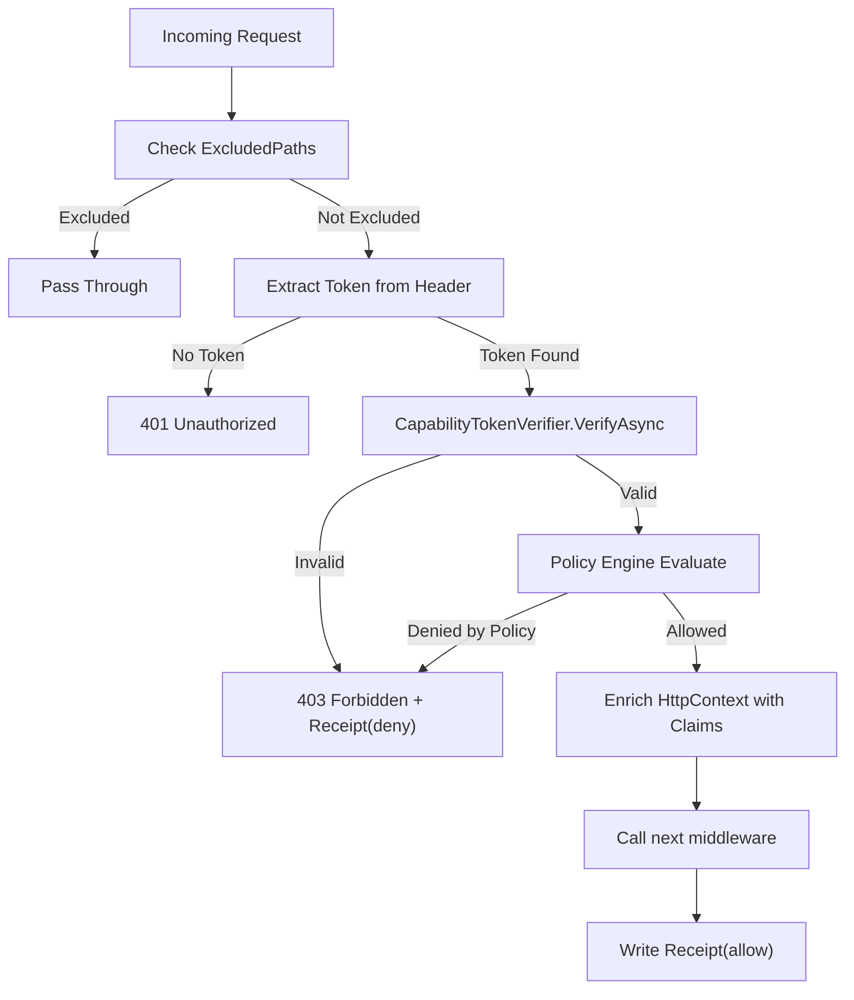

# Agent Trust Kit — ASP.NET Core Verifier Middleware Proposal

## Document Information

| Field      | Value                                                                    |
| ---------- | ------------------------------------------------------------------------ |
| Version    | 1.0.0                                                                    |
| Package    | `SdJwt.Net.AgentTrust.AspNetCore`                                        |
| Status     | Draft Proposal                                                           |
| Created    | 2026-03-01                                                               |
| Depends On | `SdJwt.Net.AgentTrust.Core`, `SdJwt.Net.AgentTrust.Policy`               |
| Related    | [Overview](agent-trust-kit-overview.md), [Core](agent-trust-kit-core.md) |

---

## Purpose

`SdJwt.Net.AgentTrust.AspNetCore` provides **inbound verification middleware** for ASP.NET Core applications that act as MCP tool servers, API endpoints, or A2A agent endpoints. It verifies incoming SD-JWT capability tokens, enforces policy constraints, emits audit receipts, and integrates with ASP.NET Core's authorization system.

---

## Design Justification

### Why ASP.NET Core Middleware?

Tool servers and agent endpoints are typically hosted as HTTP services (ASP.NET Core APIs, minimal APIs, MCP HTTP servers). ASP.NET Core's middleware pipeline is the standard interception point for:

- Authentication/Authorization
- Request validation
- Security enforcement

This aligns directly with verifying capability tokens before request processing.

### Placement in the ASP.NET Core Pipeline

```
Request → [Routing] → [AgentTrustVerification] → [Authorization] → [Endpoint]
```

The middleware sits after routing (so it knows which endpoint is targeted) and before authorization (so it can populate the claims principal with capability information).

---

## Component Design

### 1. Verification Middleware

```csharp
namespace SdJwt.Net.AgentTrust.AspNetCore;

/// <summary>
/// ASP.NET Core middleware that verifies inbound SD-JWT capability tokens
/// on agent-to-tool and agent-to-agent requests.
/// </summary>
public class AgentTrustVerificationMiddleware
{
    private readonly RequestDelegate _next;
    private readonly CapabilityTokenVerifier _verifier;
    private readonly IPolicyEngine _policyEngine;
    private readonly IReceiptWriter _receiptWriter;
    private readonly AgentTrustVerificationOptions _options;
    private readonly ILogger<AgentTrustVerificationMiddleware> _logger;

    public AgentTrustVerificationMiddleware(
        RequestDelegate next,
        CapabilityTokenVerifier verifier,
        IPolicyEngine policyEngine,
        IReceiptWriter receiptWriter,
        IOptions<AgentTrustVerificationOptions> options,
        ILogger<AgentTrustVerificationMiddleware> logger);

    public async Task InvokeAsync(HttpContext context);
}
```

### 2. Verification Options

```csharp
namespace SdJwt.Net.AgentTrust.AspNetCore;

/// <summary>
/// Configuration for the inbound Agent Trust verification middleware.
/// </summary>
public record AgentTrustVerificationOptions
{
    /// <summary>
    /// The audience identifier for this tool/agent endpoint.
    /// Tokens must have this as their "aud" claim.
    /// </summary>
    public required string Audience { get; init; }

    /// <summary>
    /// Trusted agent issuers and their verification keys.
    /// Key: issuer identifier. Value: public key for signature verification.
    /// </summary>
    public IReadOnlyDictionary<string, SecurityKey> TrustedIssuers { get; init; }
        = new Dictionary<string, SecurityKey>();

    /// <summary>
    /// HTTP header name to extract the capability token from.
    /// Default: "Authorization".
    /// </summary>
    public string TokenHeaderName { get; init; } = "Authorization";

    /// <summary>
    /// Expected header prefix before the token. Default: "SdJwt".
    /// </summary>
    public string TokenHeaderPrefix { get; init; } = "SdJwt";

    /// <summary>
    /// Paths to exclude from verification (e.g., health checks).
    /// Supports glob patterns.
    /// </summary>
    public IReadOnlyList<string> ExcludedPaths { get; init; } = new List<string>
    {
        "/health",
        "/ready",
        "/.well-known/*"
    };

    /// <summary>
    /// Whether to enforce action-level constraints from the capability token.
    /// </summary>
    public bool EnforceActionConstraints { get; init; } = true;

    /// <summary>
    /// Whether to enforce limit constraints (maxResults, etc).
    /// </summary>
    public bool EnforceLimits { get; init; } = true;

    /// <summary>
    /// Whether to emit receipts for every request evaluation.
    /// </summary>
    public bool EmitReceipts { get; init; } = true;

    /// <summary>
    /// Optional JWKS endpoint URL for dynamic key resolution.
    /// When set, keys are fetched from this endpoint and cached.
    /// </summary>
    public string? JwksEndpoint { get; init; }

    /// <summary>
    /// JWKS cache duration. Default: 15 minutes.
    /// </summary>
    public TimeSpan JwksCacheDuration { get; init; } = TimeSpan.FromMinutes(15);
}
```

### 3. Authorization Attribute

```csharp
namespace SdJwt.Net.AgentTrust.AspNetCore;

/// <summary>
/// Attribute to require specific capability actions on controller endpoints.
/// </summary>
[AttributeUsage(AttributeTargets.Method | AttributeTargets.Class)]
public class RequireCapabilityAttribute : Attribute, IAuthorizationFilter
{
    /// <summary>
    /// The required tool identifier.
    /// </summary>
    public string Tool { get; set; }

    /// <summary>
    /// The required action within the tool.
    /// </summary>
    public string Action { get; set; }

    /// <summary>
    /// Optional required resource pattern (supports wildcards).
    /// </summary>
    public string? Resource { get; set; }

    public RequireCapabilityAttribute(string tool, string action);

    public void OnAuthorization(AuthorizationFilterContext context);
}
```

### 4. Extension Methods

```csharp
namespace SdJwt.Net.AgentTrust.AspNetCore;

/// <summary>
/// Extension methods for adding Agent Trust verification to ASP.NET Core.
/// </summary>
public static class AgentTrustAspNetCoreExtensions
{
    /// <summary>
    /// Adds Agent Trust verification middleware to the request pipeline.
    /// </summary>
    public static IApplicationBuilder UseAgentTrustVerification(
        this IApplicationBuilder app);

    /// <summary>
    /// Adds Agent Trust verification services to the DI container.
    /// </summary>
    public static IServiceCollection AddAgentTrustVerification(
        this IServiceCollection services,
        Action<AgentTrustVerificationOptions> configure);

    /// <summary>
    /// Adds Agent Trust authorization policy for use with [Authorize] attribute.
    /// </summary>
    public static AuthorizationBuilder AddAgentTrustPolicy(
        this AuthorizationBuilder builder,
        string policyName,
        string tool,
        string action);
}
```

### 5. HttpContext Extensions

```csharp
namespace SdJwt.Net.AgentTrust.AspNetCore;

/// <summary>
/// Extension methods for accessing verified capability information
/// from the HttpContext.
/// </summary>
public static class HttpContextCapabilityExtensions
{
    /// <summary>
    /// Gets the verified capability claim from the current request.
    /// Returns null if no capability token was verified.
    /// </summary>
    public static CapabilityClaim? GetVerifiedCapability(this HttpContext context);

    /// <summary>
    /// Gets the verified capability context from the current request.
    /// </summary>
    public static CapabilityContext? GetCapabilityContext(this HttpContext context);

    /// <summary>
    /// Gets the issuer identity from the verified capability token.
    /// </summary>
    public static string? GetAgentIssuer(this HttpContext context);
}
```

---

## Workflow 1 — Tool Onboarding (MCP Server Becomes Enforceable)

### Steps

1. Tool server installs `SdJwt.Net.AgentTrust.AspNetCore` NuGet package.
2. Tool server registers verification services:

```csharp
builder.Services.AddAgentTrustVerification(options =>
{
    options.Audience = "tool://member-lookup-service";
    options.TrustedIssuers = new Dictionary<string, SecurityKey>
    {
        ["agent://procurement-service"] = agentPublicKey
    };
    options.EnforceActionConstraints = true;
    options.EnforceLimits = true;
    options.EmitReceipts = true;
});
```

1. Tool server adds middleware to pipeline:

```csharp
app.UseAgentTrustVerification();
```

1. Optionally annotate specific endpoints:

```csharp
[RequireCapability("MemberLookup", "GetFees")]
public async Task<IActionResult> GetMemberFees(string memberId)
{
    var capability = HttpContext.GetVerifiedCapability();
    var limits = capability?.Limits;

    // Enforce limits in query
    var maxRows = limits?.MaxResults ?? 100;
    var fees = await _feeService.GetFeesAsync(memberId, maxRows);

    return Ok(fees);
}
```

1. Receipts are automatically emitted for all allow/deny decisions.

### Outputs

- Tool rejects unauthenticated and over-scoped agent calls deterministically.
- Tool-side receipts become the source of truth for audits.

---

## Verification Flow (Internal)



---

## NuGet Package Configuration

```xml
<Project Sdk="Microsoft.NET.Sdk">
  <PropertyGroup>
    <TargetFrameworks>net8.0;net9.0;net10.0</TargetFrameworks>
    <PackageId>SdJwt.Net.AgentTrust.AspNetCore</PackageId>
    <Description>ASP.NET Core inbound verification middleware for SD-JWT
        agent capability tokens. Protects tool servers and A2A endpoints.</Description>
    <PackageTags>sd-jwt;agent-trust;aspnetcore;middleware;verification;mcp</PackageTags>
  </PropertyGroup>
  <ItemGroup>
    <ProjectReference Include="..\SdJwt.Net.AgentTrust.Core\SdJwt.Net.AgentTrust.Core.csproj" />
    <ProjectReference Include="..\SdJwt.Net.AgentTrust.Policy\SdJwt.Net.AgentTrust.Policy.csproj" />
    <FrameworkReference Include="Microsoft.AspNetCore.App" />
  </ItemGroup>
</Project>
```

> [!NOTE]
> This package targets `net8.0+` only (no `netstandard2.1`) because it depends on ASP.NET Core.

---

## Test Strategy

| Category                | Coverage | Examples                                             |
| ----------------------- | -------- | ---------------------------------------------------- |
| Middleware pipeline     | 100%     | Token present/absent, excluded paths, error handling |
| Token extraction        | 100%     | Header format, prefix parsing, malformed tokens      |
| Authorization attribute | 100%     | Tool+action matching, resource wildcards             |
| HttpContext enrichment  | 100%     | Capability claim access, context propagation         |
| DI registration         | 100%     | Service resolution, option validation                |
| Receipt emission        | 100%     | Allow/deny receipts, structured output               |
| JWKS resolution         | 90%      | Endpoint fetch, caching, rotation                    |

**Estimated test count:** 80-100 unit tests

---

## Estimated Effort

| Phase                   | Duration      |
| ----------------------- | ------------- |
| Middleware + pipeline   | 1.5 weeks     |
| Authorization attribute | 0.5 weeks     |
| JWKS dynamic resolution | 1 week        |
| HttpContext extensions  | 0.5 weeks     |
| Testing + integration   | 1 week        |
| **Total**               | **4.5 weeks** |
