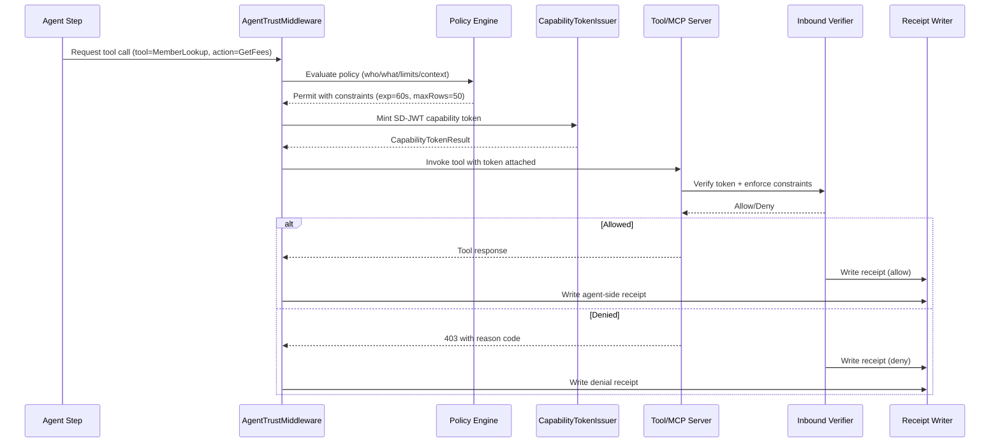
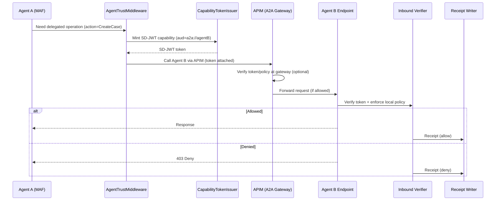

# Agent Trust Kit — MAF Middleware Integration Proposal

## Document Information

| Field      | Value                                                                    |
| ---------- | ------------------------------------------------------------------------ |
| Version    | 1.0.0                                                                    |
| Package    | `SdJwt.Net.AgentTrust.Maf`                                               |
| Status     | Draft Proposal                                                           |
| Created    | 2026-03-01                                                               |
| Depends On | `SdJwt.Net.AgentTrust.Core`, `SdJwt.Net.AgentTrust.Policy`, MAF SDK      |
| Related    | [Overview](agent-trust-kit-overview.md), [Core](agent-trust-kit-core.md) |

---

## Purpose

`SdJwt.Net.AgentTrust.Maf` integrates the Agent Trust Kit directly into the **Microsoft Agent Framework (MAF)** middleware pipeline. It intercepts agent tool calls and A2A requests to automatically mint scoped SD-JWT capability tokens before execution and emit audit receipts after completion.

---

## Design Justification

### Why MAF Middleware?

MAF reached **Release Candidate** status in February 2026, unifying Semantic Kernel and AutoGen into a production-ready agent framework. Its architecture provides three interception points via a chain-of-responsibility pattern:

1. **Before/after agent `run`** — Agent-level lifecycle
2. **Before/after function/tool call** — Tool execution lifecycle
3. **Before/after LLM interaction** — Model call lifecycle

Agent Trust Kit focuses on **point 2 (tool call interception)**, which is exactly where capability tokens should be minted and attached.

### Trade-off: MAF Middleware vs Standalone Interceptor

| Approach               | Pros                                      | Cons                                    |
| ---------------------- | ----------------------------------------- | --------------------------------------- |
| MAF Middleware         | Zero application code changes; composable | Couples to MAF version                  |
| Standalone Interceptor | Framework-agnostic                        | Requires manual integration per project |

**Decision:** Ship **both**. The core issuer/verifier in `SdJwt.Net.AgentTrust.Core` is framework-agnostic. This package adds the MAF-specific middleware adapter. Teams not using MAF use Core directly.

### MAF SDK Reference

| Package                          | Version | Purpose                        |
| -------------------------------- | ------- | ------------------------------ |
| `Microsoft.Extensions.AI`        | RC 1.0  | AI abstractions (tool calling) |
| `Microsoft.Extensions.AI.Agents` | RC 1.0  | Agent framework core           |
| `ModelContextProtocol.SDK`       | 1.x     | MCP .NET SDK for tool servers  |

---

## Component Design

### 1. Agent Trust Middleware (Pre/Post Tool Call)

```csharp
namespace SdJwt.Net.AgentTrust.Maf;

/// <summary>
/// MAF middleware that mints capability tokens before tool calls
/// and emits audit receipts after completion.
///
/// This middleware participates in the MAF chain-of-responsibility
/// pattern for function/tool call interception.
/// </summary>
public class AgentTrustMiddleware
{
    private readonly CapabilityTokenIssuer _issuer;
    private readonly IPolicyEngine _policyEngine;
    private readonly IReceiptWriter _receiptWriter;
    private readonly AgentTrustMiddlewareOptions _options;
    private readonly ILogger<AgentTrustMiddleware> _logger;

    public AgentTrustMiddleware(
        CapabilityTokenIssuer issuer,
        IPolicyEngine policyEngine,
        IReceiptWriter receiptWriter,
        AgentTrustMiddlewareOptions options,
        ILogger<AgentTrustMiddleware>? logger = null);

    /// <summary>
    /// Intercepts a tool/function call to mint and attach a capability token.
    /// </summary>
    /// <param name="context">The MAF function call context.</param>
    /// <param name="next">The next middleware in the chain.</param>
    public async Task InvokeAsync(
        FunctionCallContext context,
        Func<FunctionCallContext, Task> next);
}

/// <summary>
/// Configuration for the Agent Trust Middleware.
/// </summary>
public record AgentTrustMiddlewareOptions
{
    /// <summary>
    /// Agent identity (used as "iss" in capability tokens).
    /// </summary>
    public required string AgentId { get; init; }

    /// <summary>
    /// Default token lifetime for capability tokens.
    /// </summary>
    public TimeSpan DefaultTokenLifetime { get; init; } = TimeSpan.FromSeconds(60);

    /// <summary>
    /// Mapping of tool names to audience identifiers.
    /// Key: tool name as registered in MAF. Value: audience URI.
    /// </summary>
    public IReadOnlyDictionary<string, string> ToolAudienceMapping { get; init; }
        = new Dictionary<string, string>();

    /// <summary>
    /// HTTP header name for the capability token. Default: "Authorization".
    /// </summary>
    public string TokenHeaderName { get; init; } = "Authorization";

    /// <summary>
    /// Token header prefix. Default: "SdJwt".
    /// </summary>
    public string TokenHeaderPrefix { get; init; } = "SdJwt";

    /// <summary>
    /// Whether to emit audit receipts for all tool calls.
    /// </summary>
    public bool EmitReceipts { get; init; } = true;

    /// <summary>
    /// Whether to fail the tool call if token minting fails.
    /// Default: true (fail-closed).
    /// </summary>
    public bool FailOnMintError { get; init; } = true;
}
```

### 2. Middleware Registration Extensions

```csharp
namespace SdJwt.Net.AgentTrust.Maf;

/// <summary>
/// Extension methods for registering Agent Trust middleware in MAF agents.
/// </summary>
public static class AgentTrustExtensions
{
    /// <summary>
    /// Adds Agent Trust capability token middleware to the MAF agent pipeline.
    /// </summary>
    /// <param name="builder">The MAF agent builder.</param>
    /// <param name="configure">Configuration action.</param>
    /// <returns>The agent builder for chaining.</returns>
    public static IAgentBuilder UseAgentTrust(
        this IAgentBuilder builder,
        Action<AgentTrustMiddlewareOptions> configure);

    /// <summary>
    /// Adds Agent Trust services to the DI container.
    /// </summary>
    /// <param name="services">The service collection.</param>
    /// <param name="configure">Configuration action.</param>
    public static IServiceCollection AddAgentTrust(
        this IServiceCollection services,
        Action<AgentTrustServiceOptions> configure);
}

/// <summary>
/// DI registration options for Agent Trust services.
/// </summary>
public record AgentTrustServiceOptions
{
    /// <summary>
    /// Key custody provider type. Default: InMemoryKeyCustodyProvider.
    /// </summary>
    public Type KeyCustodyProviderType { get; init; } = typeof(InMemoryKeyCustodyProvider);

    /// <summary>
    /// Nonce store type. Default: MemoryNonceStore.
    /// </summary>
    public Type NonceStoreType { get; init; } = typeof(MemoryNonceStore);

    /// <summary>
    /// Receipt writer type. Default: LoggingReceiptWriter.
    /// </summary>
    public Type ReceiptWriterType { get; init; } = typeof(LoggingReceiptWriter);

    /// <summary>
    /// Policy engine type. Default: DefaultPolicyEngine.
    /// </summary>
    public Type PolicyEngineType { get; init; } = typeof(DefaultPolicyEngine);
}
```

### 3. MCP Tool Call Adapter

Adapts MCP tool server calls to attach capability tokens:

```csharp
namespace SdJwt.Net.AgentTrust.Maf;

/// <summary>
/// Adapter that wraps MCP tool server calls with capability token attachment.
/// Works with both local and hosted MCP servers.
/// </summary>
public class McpTrustAdapter
{
    private readonly CapabilityTokenIssuer _issuer;
    private readonly IPolicyEngine _policyEngine;
    private readonly ILogger<McpTrustAdapter> _logger;

    /// <summary>
    /// Wraps an MCP tool call with a capability token.
    /// </summary>
    /// <param name="toolName">The MCP tool name being called.</param>
    /// <param name="arguments">The tool call arguments.</param>
    /// <param name="context">The execution context.</param>
    /// <returns>The capability token to attach to the MCP request.</returns>
    public async Task<CapabilityTokenResult> MintForToolCallAsync(
        string toolName,
        IDictionary<string, object>? arguments,
        CapabilityContext context,
        CancellationToken cancellationToken = default);
}
```

---

## Workflow 2 — Agent-to-Tool Call (Core Flow)

### Sequence



### Implementation Flow (Plain English)

1. MAF dispatches a tool call through the middleware chain.
2. `AgentTrustMiddleware` intercepts **before** the call.
3. Policy Engine evaluates: Is this agent allowed to call this tool with this action?
4. If permitted, `CapabilityTokenIssuer` mints a short-lived SD-JWT with selective disclosure.
5. The token is attached to the outbound HTTP request (or MCP message).
6. The tool's `InboundVerifierMiddleware` (see ASP.NET Core proposal) verifies the token.
7. **After** the call completes, the middleware emits an audit receipt.

---

## Workflow 3 — Agent-to-Agent (A2A) Call with APIM

### Sequence



### Key Design Point

Trust can be enforced in **two places** for defense-in-depth:

- **At the gateway (APIM)** for centralized governance, throttling, and observability
- **At the agent endpoint** for local policy enforcement

---

## Usage Example

### Registering Agent Trust in a MAF Agent

```csharp
using SdJwt.Net.AgentTrust.Maf;

var builder = Host.CreateApplicationBuilder(args);

// Register Agent Trust services
builder.Services.AddAgentTrust(options =>
{
    options.KeyCustodyProviderType = typeof(InMemoryKeyCustodyProvider);
    options.NonceStoreType = typeof(MemoryNonceStore);
    options.ReceiptWriterType = typeof(LoggingReceiptWriter);
});

// Build MAF agent with trust middleware
var agent = builder.Services
    .AddAgent("procurement-agent")
    .UseAgentTrust(options =>
    {
        options.AgentId = "agent://procurement-service";
        options.DefaultTokenLifetime = TimeSpan.FromSeconds(60);
        options.ToolAudienceMapping = new Dictionary<string, string>
        {
            ["MemberLookup"] = "tool://member-lookup-service",
            ["FeeCalculator"] = "tool://fee-calculator-service"
        };
        options.EmitReceipts = true;
        options.FailOnMintError = true;
    })
    .Build();
```

---

## Dependencies

| Package                          | Version | Purpose                                |
| -------------------------------- | ------- | -------------------------------------- |
| `SdJwt.Net.AgentTrust.Core`      | 1.0.0   | Capability token issuance/verification |
| `SdJwt.Net.AgentTrust.Policy`    | 1.0.0   | Policy evaluation                      |
| `Microsoft.Extensions.AI`        | RC 1.0+ | MAF abstractions                       |
| `Microsoft.Extensions.AI.Agents` | RC 1.0+ | Agent framework core                   |

---

## Test Strategy

| Category                | Coverage | Examples                                          |
| ----------------------- | -------- | ------------------------------------------------- |
| Middleware interception | 100%     | Pre/post tool call, error handling                |
| Token attachment        | 100%     | Header format, token presence, MCP message format |
| Policy integration      | 90%      | Allow/deny/constrain paths                        |
| Receipt emission        | 100%     | Success receipts, failure receipts, correlation   |
| A2A flow                | 90%      | Gateway pass-through, dual verification           |
| DI registration         | 100%     | Service resolution, option validation             |

**Estimated test count:** 80-100 unit tests

---

## Estimated Effort

| Phase                        | Duration    |
| ---------------------------- | ----------- |
| MAF middleware adapter       | 1.5 weeks   |
| MCP tool call adapter        | 1 week      |
| DI registration + extensions | 0.5 weeks   |
| A2A flow support             | 1 week      |
| Testing + integration        | 1 week      |
| **Total**                    | **5 weeks** |
