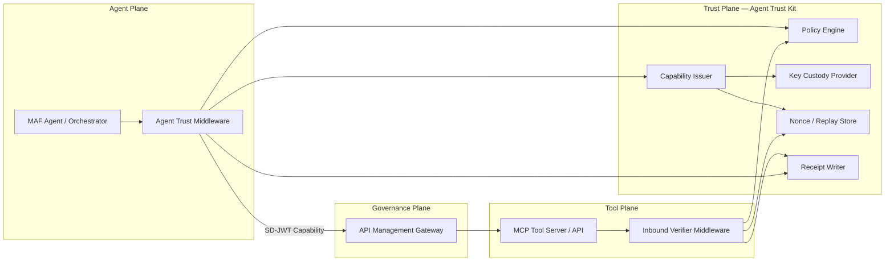

# Agent Trust Kit — Architecture Overview & Ecosystem Justification

## Document Information

| Field        | Value                                          |
| ------------ | ---------------------------------------------- |
| Version      | 1.1.0                                          |
| Author       | SD-JWT .NET Team                               |
| Status       | **Implemented**                                |
| Created      | 2026-03-01                                     |
| Last Updated | 2026-03-04                                     |
| Related      | [Enterprise Roadmap](../ENTERPRISE_ROADMAP.md) |

> [!NOTE]
> This document is the original design proposal. For the official reference, see the
> [Agent Trust Kits Deep Dive](../concepts/agent-trust-kits-deep-dive.md).

---

## Executive Summary

Agent Trust Kit extends the SD-JWT .NET ecosystem from **human-held verifiable credentials** to **machine-to-machine (M2M) agent capabilities**. It turns every AI agent action into a verifiable, least-privilege, auditable capability by minting scoped **SD-JWT capability tokens** before each tool or agent-to-agent (A2A) call, then verifying and enforcing policy at the receiver.

This proposal justifies why the ecosystem benefits from this expansion, describes the reference architecture, and maps each component to existing SD-JWT .NET building blocks.

---

## Why Agent Trust Kit? — Ecosystem Justification

### The Opportunity

AI agents (autonomous workflows, copilots, multi-agent orchestrations) are becoming first-class participants in enterprise systems. They call tools, invoke APIs, and delegate tasks to other agents. **Today there is no standardized trust artifact format for these interactions.**

Current approaches (long-lived API keys, OAuth2 client credentials with broad scopes) violate the principle of least privilege and produce poor audit trails.

### Strategic Alignment

| Factor                           | Value to Ecosystem                                                                                 |
| -------------------------------- | -------------------------------------------------------------------------------------------------- |
| **Reuse of core SD-JWT**         | The existing `SdJwt.Net` issuance/verification engine is directly reusable for capability tokens   |
| **Selective disclosure for M2M** | Agents disclose only the claims a tool needs (action, resource, limits) — a natural fit for SD-JWT |
| **Existing security hardening**  | RFC 9901 compliance, HAIP validation, algorithm enforcement, nonce/replay protection all transfer  |
| **Platform differentiation**     | No other .NET ecosystem offers SD-JWT-based agent trust; positions OWF Labs as the reference       |
| **Enterprise demand**            | Microsoft Agent Framework (MAF) and MCP adoption is accelerating; enterprises need pluggable trust |
| **Standards trajectory**         | IETF OAuth WG is actively standardizing token-based delegation; this positions the ecosystem early |

### Trade-off Analysis

| Decision                                  | Alternative                    | Rationale for Chosen Approach                                                                                    |
| ----------------------------------------- | ------------------------------ | ---------------------------------------------------------------------------------------------------------------- |
| SD-JWT as token format (vs plain JWT)     | Standard JWT or CBOR           | Selective disclosure allows tool servers to receive only the claims they need; cryptographic integrity preserved |
| Per-action capability tokens (vs session) | Long-lived session tokens      | Minimal blast radius; each token scoped to one tool+action; short expiry eliminates stale authorization          |
| MAF middleware integration (vs custom)    | Standalone SDK only            | MAF is the Microsoft standard for agent middleware; chain-of-responsibility pattern maps directly to trust logic |
| Expiry-based containment first (vs CRL)   | Full revocation infrastructure | Pragmatic PoC approach; capability tokens are short-lived (seconds to minutes); CRL adds complexity with low ROI |
| Optional APIM gateway (vs required)       | Mandatory gateway enforcement  | Allows incremental adoption: SDK-only for dev, sidecar for staging, gateway for production governance            |

---

## Reference Architecture

### Planes

The architecture separates concerns into four planes:

1. **Agent Plane** — MAF orchestrator, skills, tool routing
2. **Trust Plane** — Agent Trust Kit: mint, verify, policy, receipts
3. **Tool Plane** — MCP servers, APIs, other agents
4. **Governance Plane** — Optional APIM gateway for centralized policy

### How It Maps to Existing SD-JWT .NET

| Agent Trust Kit Component | Reuses From                         | New Logic Required                                    |
| ------------------------- | ----------------------------------- | ----------------------------------------------------- |
| Capability Issuer         | `SdIssuer` (core issuance)          | Capability claim profile, audience scoping            |
| Inbound Verifier          | `SdVerifier` (core verification)    | Capability claim validation, limits enforcement       |
| Policy Engine             | `SdJwt.Net.HAIP` patterns           | M2M policy rules, action-based constraints            |
| Key Custody               | `IKeyManager` (wallet architecture) | Agent identity binding, HSM/KeyVault integration      |
| Nonce/Replay Store        | Nonce validation in OID4VP          | Cache-backed replay prevention for short-lived tokens |
| Receipt Writer            | `ITransactionLogger` (wallet audit) | Append-only audit receipts with correlation tracking  |

---

## Trust Artifacts

### Artifact A — SD-JWT Capability Token (Per Action)

A short-lived SD-JWT whose disclosed claims are the minimum needed by the receiver.

**Claim set (conceptual, stable):**

| Claim | Type     | Description                                               |
| ----- | -------- | --------------------------------------------------------- |
| `iss` | Standard | Issuing agent identity                                    |
| `aud` | Standard | Target tool/agent audience                                |
| `iat` | Standard | Issued-at timestamp                                       |
| `exp` | Standard | Short expiry (seconds to minutes)                         |
| `jti` | Standard | Unique token identifier for replay prevention             |
| `cap` | Custom   | Capability object: `{ tool, action, resource?, limits? }` |
| `ctx` | Custom   | Context object: `{ correlationId, workflowId?, stepId? }` |
| `cnf` | Optional | Proof-of-possession key binding (sender constraint)       |

**Why SD-JWT over plain JWT:** Selective disclosure allows the tool server to verify the token's integrity while receiving only the claims it needs to enforce. For example, a tool needs `cap.action` and `cap.limits` but not `ctx.workflowId`.

### Artifact B — Delegation Token (Agent-to-Agent Chain)

Same structure as Artifact A, with additional delegation claims:

- `cap.delegatedBy` — Original agent identity
- `cap.delegationDepth` — Maximum delegation chain depth
- Policy constraints inherited from parent

### Artifact C — Audit Receipt (Post-Action)

Signed metadata produced after each action:

- Token `jti`, tool/action, timestamp, decision (allow/deny)
- Correlation ID for workflow tracing
- Optional request/response metadata hashes (no PII)

---

## Deployment Modes

### Mode 1 — SDK-Only (Fast Adoption)

Agent service references `SdJwt.Net.AgentTrust.Core` + `SdJwt.Net.AgentTrust.Policy`. Tool service references `SdJwt.Net.AgentTrust.AspNetCore`. Keys in app config or local dev store.

**Best for:** Development, PoC, small-scale deployments.

### Mode 2 — Sidecar Trust Daemon (Enterprise Hardening)

Agent and tool call a localhost sidecar to mint/verify/sign. Sidecar holds keys (or connects to key custody) and standardizes policy/audit across services.

**Best for:** Containerized environments, Kubernetes deployments, HSM integration.

### Mode 3 — Gateway Enforcement via APIM (Platform Governance)

APIM fronts tool endpoints and/or A2A agent endpoints. Centralized policy, throttling, observability. APIM supports importing A2A agent APIs and applying policies at A2A scope.

**Best for:** Enterprise-wide governance, multi-team agent deployments, compliance-heavy environments.

---

## Package Layout

| Package                           | Purpose                                                      | Dependencies                                                        |
| --------------------------------- | ------------------------------------------------------------ | ------------------------------------------------------------------- |
| `SdJwt.Net.AgentTrust.Core`       | SD-JWT capability issuance/verification + capability profile | `SdJwt.Net`                                                         |
| `SdJwt.Net.AgentTrust.Policy`     | Policy model + evaluator interfaces + default rule engine    | `SdJwt.Net.AgentTrust.Core`                                         |
| `SdJwt.Net.AgentTrust.Maf`        | MAF middleware/interceptors (pre/post tool execution)        | `SdJwt.Net.AgentTrust.Core`, `SdJwt.Net.AgentTrust.Policy`, MAF SDK |
| `SdJwt.Net.AgentTrust.AspNetCore` | ASP.NET Core inbound verification middleware + authorization | `SdJwt.Net.AgentTrust.Core`, `SdJwt.Net.AgentTrust.Policy`          |

### Runtime Stores

| Store         | Purpose                                | Default Implementation      |
| ------------- | -------------------------------------- | --------------------------- |
| Nonce/Replay  | Prevents replay for short-lived tokens | `IMemoryCache` (in-process) |
| Receipt Store | Append-only audit events               | `ILogger` + file/DB sink    |
| Token Cache   | Avoid re-signing in same workflow step | `IMemoryCache` (optional)   |

---

## Workflow Summary

Detailed workflows are described in the component-specific proposals. The high-level flows are:

| Workflow | Description                                   | Detailed In                     |
| -------- | --------------------------------------------- | ------------------------------- |
| WF-0     | Bootstrap (agent identity + key setup)        | `agent-trust-kit-core.md`       |
| WF-1     | Tool onboarding (MCP server becomes verifier) | `agent-trust-kit-aspnetcore.md` |
| WF-2     | Agent-to-tool call (core flow)                | `agent-trust-kit-maf.md`        |
| WF-3     | Agent-to-agent (A2A) with APIM governance     | `agent-trust-kit-maf.md`        |
| WF-4     | Delegation (multi-agent bounded authority)    | `agent-trust-kit-policy.md`     |
| WF-5     | Containment (revocation/expiry/rotation)      | `agent-trust-kit-core.md`       |

---

## How This Fits the Existing Roadmap

The Agent Trust Kit integration would be positioned as **Phase 6** in the Enterprise Roadmap, building on the complete foundation (Phases 1-5):

| Existing Phase | Status   | Agent Trust Kit Dependency                                |
| -------------- | -------- | --------------------------------------------------------- |
| Phase 1        | Complete | Core SD-JWT engine, HAIP, OID4VP — all directly reused    |
| Phase 2        | Complete | mdoc support — not directly required but complements      |
| Phase 3        | Planned  | DC API — orthogonal, different consumer (browser-facing)  |
| Phase 4        | Planned  | EUDIW — orthogonal, different consumer (EU compliance)    |
| Phase 5        | Planned  | Token Introspection — could eventually serve agent tokens |

**Key insight:** Agent Trust Kit is **additive** to the existing ecosystem, not a refactoring. It creates new packages that depend on the core but do not modify existing packages.

---

## Success Criteria

| Metric              | Target                                           |
| ------------------- | ------------------------------------------------ |
| PoC end-to-end test | Agent mints token, tool verifies, receipt logged |
| Unit test coverage  | >= 90% per package                               |
| Performance         | < 5ms to mint a capability token                 |
| Documentation       | All public APIs documented, tutorials created    |
| Interoperability    | Works with MAF RC and MCP .NET SDK               |
| No breaking changes | Zero impact on existing 11 packages              |

---

## References

| Reference                       | Source                                                                                                       |
| ------------------------------- | ------------------------------------------------------------------------------------------------------------ |
| RFC 9901 (SD-JWT)               | [IETF Datatracker](https://datatracker.ietf.org/doc/rfc9901/)                                                |
| Microsoft Agent Framework (MAF) | [Microsoft Learn](https://learn.microsoft.com/azure/ai-services/agents/)                                     |
| MCP .NET SDK                    | [GitHub modelcontextprotocol/csharp-sdk](https://github.com/modelcontextprotocol/csharp-sdk)                 |
| Azure APIM A2A                  | [Microsoft Learn — APIM](https://learn.microsoft.com/azure/api-management/)                                  |
| A2A Protocol                    | [Google A2A](https://github.com/google/A2A)                                                                  |
| MAF Middleware Model            | [Microsoft Learn — Agent Framework](https://learn.microsoft.com/dotnet/ai/microsoft-agent-framework/)        |
| IETF OAuth Transaction Tokens   | [draft-ietf-oauth-transaction-tokens](https://datatracker.ietf.org/doc/draft-ietf-oauth-transaction-tokens/) |
