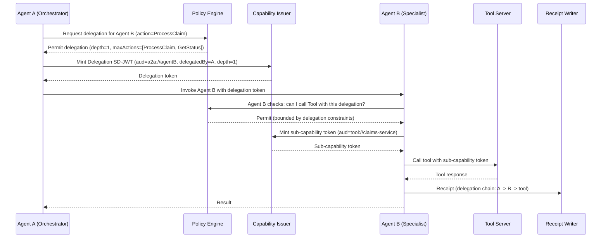

# Agent Trust Kit — Policy Engine Proposal

## Document Information

| Field      | Value                                                                    |
| ---------- | ------------------------------------------------------------------------ |
| Version    | 1.0.0                                                                    |
| Package    | `SdJwt.Net.AgentTrust.Policy`                                            |
| Status     | Draft Proposal                                                           |
| Created    | 2026-03-01                                                               |
| Depends On | `SdJwt.Net.AgentTrust.Core`                                              |
| Related    | [Overview](agent-trust-kit-overview.md), [Core](agent-trust-kit-core.md) |

---

## Purpose

`SdJwt.Net.AgentTrust.Policy` provides the policy evaluation engine that decides whether an agent is permitted to perform a specific action on a tool, and under what constraints. It supports action-level permissions, rate limits, delegation policies, and custom rule extensions.

---

## Design Justification

### Why a Separate Policy Package?

| Reason                     | Detail                                                                          |
| -------------------------- | ------------------------------------------------------------------------------- |
| **Pluggable policy logic** | Different enterprises have different authorization models                       |
| **Testable independently** | Policy rules can be unit-tested without token issuance/verification             |
| **Swappable engines**      | Default engine ships with the package; enterprises can plug in OPA, Cedar, etc. |
| **Reused by both sides**   | MAF middleware (mint-side) and ASP.NET middleware (verify-side) both use it     |

### Design Pattern: Strategy Pattern

The `IPolicyEngine` interface allows multiple implementations:

- **`DefaultPolicyEngine`** — Rule-based engine with in-memory configuration (ships with package)
- **`OpaPolicyEngine`** — Adapter for Open Policy Agent (future extension)
- **`CedarPolicyEngine`** — Adapter for AWS Cedar (future extension)
- Custom implementations for enterprise-specific authorization systems

---

## Component Design

### 1. Policy Engine Interface

```csharp
namespace SdJwt.Net.AgentTrust.Policy;

/// <summary>
/// Evaluates whether an agent action is permitted and returns any constraints.
/// </summary>
public interface IPolicyEngine
{
    /// <summary>
    /// Evaluates a policy request and returns the decision with constraints.
    /// </summary>
    Task<PolicyDecision> EvaluateAsync(
        PolicyRequest request,
        CancellationToken cancellationToken = default);
}

/// <summary>
/// A request to evaluate policy.
/// </summary>
public record PolicyRequest
{
    /// <summary>
    /// Identity of the requesting agent.
    /// </summary>
    public required string AgentId { get; init; }

    /// <summary>
    /// Target tool identifier.
    /// </summary>
    public required string Tool { get; init; }

    /// <summary>
    /// Requested action on the tool.
    /// </summary>
    public required string Action { get; init; }

    /// <summary>
    /// Optional resource scope.
    /// </summary>
    public string? Resource { get; init; }

    /// <summary>
    /// Execution context for policy evaluation.
    /// </summary>
    public CapabilityContext? Context { get; init; }

    /// <summary>
    /// Optional delegation chain for multi-agent scenarios.
    /// </summary>
    public DelegationChain? DelegationChain { get; init; }
}

/// <summary>
/// The result of a policy evaluation.
/// </summary>
public record PolicyDecision
{
    /// <summary>
    /// Whether the request is permitted.
    /// </summary>
    public required bool IsPermitted { get; init; }

    /// <summary>
    /// Denial reason if not permitted.
    /// </summary>
    public string? DenialReason { get; init; }

    /// <summary>
    /// Denial code for structured error handling.
    /// </summary>
    public string? DenialCode { get; init; }

    /// <summary>
    /// Constraints to apply if permitted (e.g., max token lifetime, limits).
    /// </summary>
    public PolicyConstraints? Constraints { get; init; }

    public static PolicyDecision Permit(PolicyConstraints? constraints = null);
    public static PolicyDecision Deny(string reason, string code);
}

/// <summary>
/// Constraints applied to a permitted action.
/// </summary>
public record PolicyConstraints
{
    /// <summary>
    /// Maximum token lifetime the issuer should use.
    /// </summary>
    public TimeSpan? MaxTokenLifetime { get; init; }

    /// <summary>
    /// Capability limits to embed in the token.
    /// </summary>
    public CapabilityLimits? Limits { get; init; }

    /// <summary>
    /// Claims that must be selectively disclosed (not hidden).
    /// </summary>
    public IReadOnlyList<string>? RequiredDisclosures { get; init; }
}
```

### 2. Default Policy Engine (Rule-Based)

```csharp
namespace SdJwt.Net.AgentTrust.Policy;

/// <summary>
/// Default rule-based policy engine. Evaluates in-memory rules
/// in order, using first-match semantics.
/// </summary>
public class DefaultPolicyEngine : IPolicyEngine
{
    private readonly IReadOnlyList<PolicyRule> _rules;
    private readonly ILogger<DefaultPolicyEngine> _logger;

    public DefaultPolicyEngine(
        IReadOnlyList<PolicyRule> rules,
        ILogger<DefaultPolicyEngine>? logger = null);

    public Task<PolicyDecision> EvaluateAsync(
        PolicyRequest request,
        CancellationToken cancellationToken = default);
}

/// <summary>
/// A single policy rule.
/// </summary>
public record PolicyRule
{
    /// <summary>
    /// Rule name for logging and debugging.
    /// </summary>
    public required string Name { get; init; }

    /// <summary>
    /// Agent ID pattern (supports wildcards). Use "*" for any agent.
    /// </summary>
    public required string AgentPattern { get; init; }

    /// <summary>
    /// Tool pattern (supports wildcards). Use "*" for any tool.
    /// </summary>
    public required string ToolPattern { get; init; }

    /// <summary>
    /// Action pattern (supports wildcards). Use "*" for any action.
    /// </summary>
    public required string ActionPattern { get; init; }

    /// <summary>
    /// Optional resource pattern.
    /// </summary>
    public string? ResourcePattern { get; init; }

    /// <summary>
    /// The effect of this rule.
    /// </summary>
    public required PolicyEffect Effect { get; init; }

    /// <summary>
    /// Constraints to apply if the effect is Allow.
    /// </summary>
    public PolicyConstraints? Constraints { get; init; }

    /// <summary>
    /// Rule priority (higher = evaluated first). Default: 0.
    /// </summary>
    public int Priority { get; init; }
}

public enum PolicyEffect
{
    /// <summary>
    /// Explicitly allow the action (with optional constraints).
    /// </summary>
    Allow,

    /// <summary>
    /// Explicitly deny the action.
    /// </summary>
    Deny
}
```

### 3. Policy Builder (Fluent Configuration)

```csharp
namespace SdJwt.Net.AgentTrust.Policy;

/// <summary>
/// Fluent builder for constructing policy rule sets.
/// </summary>
public class PolicyBuilder
{
    /// <summary>
    /// Adds a rule that allows an agent to call a tool action.
    /// </summary>
    public PolicyBuilder Allow(
        string agentPattern,
        string toolPattern,
        string actionPattern,
        Action<PolicyConstraintsBuilder>? constraints = null);

    /// <summary>
    /// Adds a rule that denies an agent from calling a tool action.
    /// </summary>
    public PolicyBuilder Deny(
        string agentPattern,
        string toolPattern,
        string actionPattern);

    /// <summary>
    /// Adds a delegation rule allowing agent-to-agent delegation.
    /// </summary>
    public PolicyBuilder AllowDelegation(
        string fromAgent,
        string toAgent,
        int maxDepth = 1,
        Action<DelegationConstraintsBuilder>? constraints = null);

    /// <summary>
    /// Builds the rule set.
    /// </summary>
    public IReadOnlyList<PolicyRule> Build();
}
```

### 4. Delegation Model

```csharp
namespace SdJwt.Net.AgentTrust.Policy;

/// <summary>
/// Represents a delegation chain in multi-agent orchestrations.
/// </summary>
public record DelegationChain
{
    /// <summary>
    /// Original delegating agent identity.
    /// </summary>
    public required string DelegatedBy { get; init; }

    /// <summary>
    /// Current depth in the delegation chain (0 = direct, 1 = one hop, etc).
    /// </summary>
    public required int Depth { get; init; }

    /// <summary>
    /// Maximum allowed delegation depth.
    /// </summary>
    public required int MaxDepth { get; init; }

    /// <summary>
    /// Actions that the delegatee is permitted to perform.
    /// </summary>
    public IReadOnlyList<string>? AllowedActions { get; init; }

    /// <summary>
    /// The parent delegation token JTI for chain verification.
    /// </summary>
    public string? ParentTokenId { get; init; }
}

/// <summary>
/// Options for minting a delegation token (agent-to-agent).
/// </summary>
public record DelegationTokenOptions : CapabilityTokenOptions
{
    /// <summary>
    /// The delegation chain metadata.
    /// </summary>
    public required DelegationChain Delegation { get; init; }
}
```

---

## Workflow 4 — Delegation (Multi-Agent Bounded Authority)

### Sequence



### Design Constraints

- **No lateral privilege escalation:** Agent B cannot mint tokens with broader scope than its delegation grants.
- **Depth limits enforced:** If `maxDepth=1`, Agent B cannot further delegate to Agent C.
- **Chain verifiable:** Each receipt includes the full delegation chain for audit reconstruction.

---

## Usage Example

### Configuring Policy Rules

```csharp
var policyRules = new PolicyBuilder()
    // Procurement agent can look up members and calculate fees
    .Allow(
        agentPattern: "agent://procurement-*",
        toolPattern: "MemberLookup",
        actionPattern: "*",
        constraints: c => c
            .WithMaxTokenLifetime(TimeSpan.FromSeconds(60))
            .WithMaxResults(100))

    // Procurement agent can calculate fees but not modify data
    .Allow(
        agentPattern: "agent://procurement-*",
        toolPattern: "FeeCalculator",
        actionPattern: "Calculate",
        constraints: c => c
            .WithMaxTokenLifetime(TimeSpan.FromSeconds(30)))

    // Block all agents from admin tools
    .Deny(
        agentPattern: "*",
        toolPattern: "AdminConsole",
        actionPattern: "*")

    // Allow orchestrator to delegate to specialist
    .AllowDelegation(
        fromAgent: "agent://orchestrator",
        toAgent: "agent://claims-specialist",
        maxDepth: 1,
        constraints: d => d
            .WithAllowedActions("ProcessClaim", "GetStatus"))

    .Build();

services.AddSingleton<IPolicyEngine>(sp =>
    new DefaultPolicyEngine(policyRules, sp.GetService<ILogger<DefaultPolicyEngine>>()));
```

---

## NuGet Package Configuration

```xml
<Project Sdk="Microsoft.NET.Sdk">
  <PropertyGroup>
    <TargetFrameworks>net8.0;net9.0;net10.0;netstandard2.1</TargetFrameworks>
    <PackageId>SdJwt.Net.AgentTrust.Policy</PackageId>
    <Description>Policy engine for SD-JWT agent capability evaluation.
        Rule-based authorization with delegation support.</Description>
    <PackageTags>sd-jwt;agent-trust;policy;authorization;delegation</PackageTags>
  </PropertyGroup>
  <ItemGroup>
    <ProjectReference Include="..\SdJwt.Net.AgentTrust.Core\SdJwt.Net.AgentTrust.Core.csproj" />
    <PackageReference Include="Microsoft.Extensions.Logging.Abstractions" Version="9.0.6" />
  </ItemGroup>
</Project>
```

---

## Test Strategy

| Category             | Coverage | Examples                                             |
| -------------------- | -------- | ---------------------------------------------------- |
| Rule evaluation      | 100%     | Exact match, wildcard, priority ordering             |
| Allow/Deny semantics | 100%     | First-match, explicit deny, default deny             |
| Constraints          | 100%     | Lifetime limits, result limits, required disclosures |
| Delegation           | 100%     | Depth limits, scope narrowing, chain verification    |
| Policy builder       | 100%     | Fluent construction, validation, empty rules         |
| Custom engine        | 90%      | Interface contract, async support                    |

**Estimated test count:** 80-100 unit tests

---

## Estimated Effort

| Phase                 | Duration      |
| --------------------- | ------------- |
| Interface + models    | 0.5 weeks     |
| Default rule engine   | 1.5 weeks     |
| Delegation model      | 1 week        |
| Policy builder        | 0.5 weeks     |
| Testing + integration | 1 week        |
| **Total**             | **4.5 weeks** |
