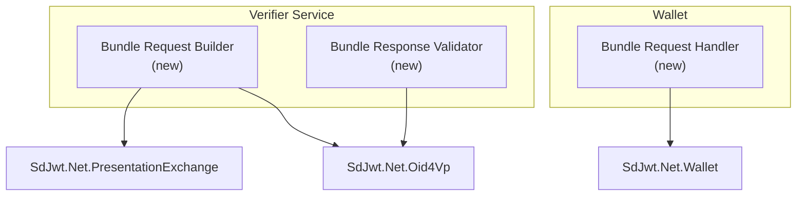
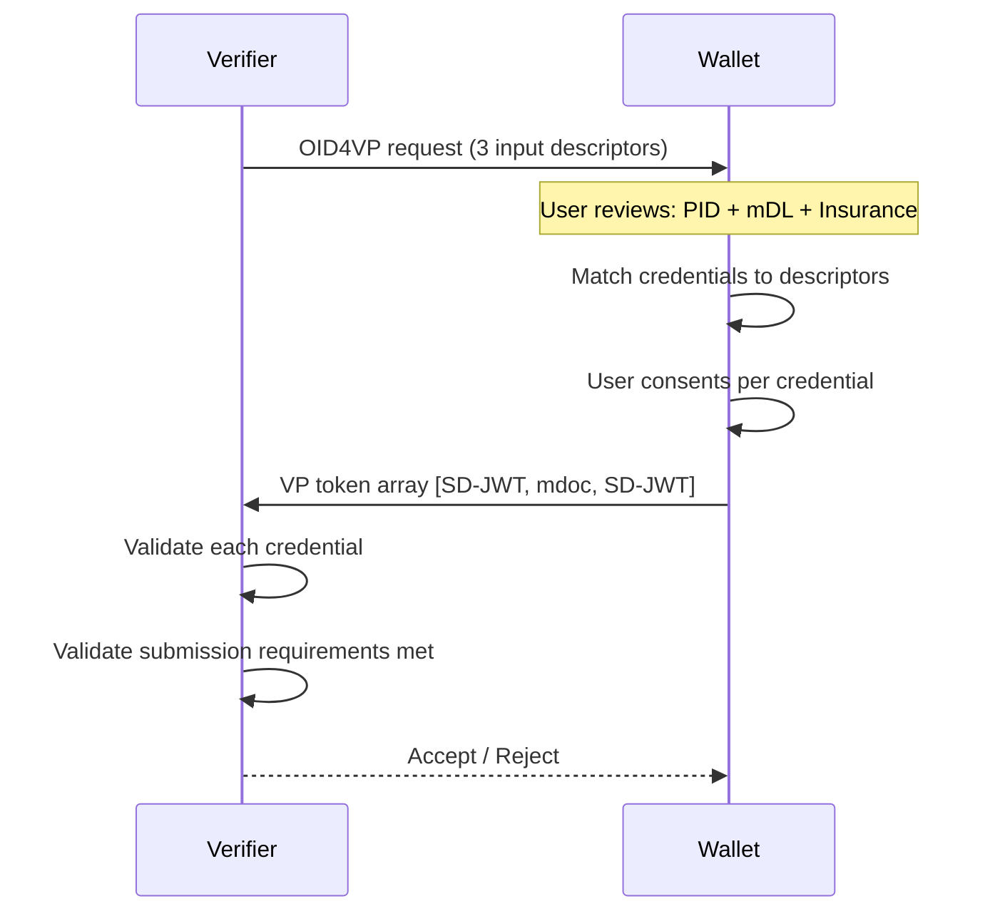

# Proposal: Bundles / Batch Credential Sessions

|                   |                                                                   |
| ----------------- | ----------------------------------------------------------------- |
| **Status**        | Proposed                                                          |
| **Author**        | SD-JWT .NET Team                                                  |
| **Created**       | 2026-03-04                                                        |
| **Package**       | `SdJwt.Net.Oid4Vp` + `SdJwt.Net.PresentationExchange` (extension) |
| **Specification** | OpenID4VP 1.0 + DIF PEX v2.1.1                                    |

---

## Context / Problem Statement

Real-world verification scenarios frequently require **multiple credentials** in a single transaction:

- **Airport check-in**: Boarding pass + passport + vaccination record
- **Financial onboarding**: Government ID + proof of address + income attestation
- **Healthcare**: Insurance card + professional license + patient consent
- **EUDIW age verification + mDL**: PID (age_over_18) + mDL (driving privileges)

Currently, `SdJwt.Net.Oid4Vp` supports requesting a single credential via OID4VP. Multi-credential requests require multiple sequential sessions, which creates friction, increases latency, and complicates consent UX.

---

## Goals

1. Request multiple credentials (mixed SD-JWT VC and mdoc) in a single OID4VP session
2. Validate all credentials atomically (all-or-nothing)
3. Support mixed format types within one presentation definition
4. Support credential-level consent (user can decline individual credentials)
5. Maintain backward compatibility with single-credential flows

## Non-Goals

- Cross-device credential aggregation (credentials from multiple wallets)
- Credential chaining (using one credential to unlock issuance of another)

---

## Proposed Design

### Architecture



### Component Design

#### `BundleRequestBuilder`

Extends the existing OID4VP builder to support multiple input descriptors:

```csharp
public class BundleRequestBuilder
{
    public BundleRequestBuilder AddCredentialRequest(
        string id,
        string format,      // "vc+sd-jwt" or "mso_mdoc"
        InputDescriptor descriptor);

    public BundleRequestBuilder WithSubmissionRequirement(
        SubmissionRequirement requirement); // "all", "pick N of M"

    public BundleRequestBuilder RequireAtomicSubmission(bool atomic);

    public AuthorizationRequest Build();
}
```

#### `BundleResponseValidator`

Validates that all requested credentials are present and valid:

```csharp
public class BundleResponseValidator
{
    public Task<BundleValidationResult> ValidateAsync(
        VpTokenResponse response,
        BundleValidationOptions options);
}

public class BundleValidationResult
{
    public bool IsValid { get; }
    public IReadOnlyList<CredentialValidationResult> Credentials { get; }
    public IReadOnlyList<string> MissingCredentials { get; }
}
```

### Sequence: Multi-Credential Request



---

## API Surface

```csharp
// Build multi-credential request
var bundle = new BundleRequestBuilder()
    .AddCredentialRequest(
        id: "pid",
        format: "vc+sd-jwt",
        descriptor: new InputDescriptor
        {
            Constraints = new Constraints
            {
                Fields = new[] { new Field { Path = new[] { "$.vct" }, Filter = PidFilter } }
            }
        })
    .AddCredentialRequest(
        id: "mdl",
        format: "mso_mdoc",
        descriptor: new InputDescriptor
        {
            Constraints = new Constraints
            {
                Fields = new[] { new Field { Path = new[] { "$.docType" }, Filter = MdlFilter } }
            }
        })
    .WithSubmissionRequirement(SubmissionRequirement.All())
    .RequireAtomicSubmission(true)
    .Build();

// Validate response
var validator = new BundleResponseValidator(vpTokenValidator, statusChecker);
var result = await validator.ValidateAsync(response, new BundleValidationOptions
{
    FailOnPartialSubmission = true,
    ValidateStatus = true
});

foreach (var cred in result.Credentials)
{
    Console.WriteLine($"{cred.DescriptorId}: {(cred.IsValid ? "Valid" : cred.Error)}");
}
```

---

## Security Considerations

| Concern                                   | Mitigation                                                                                                  |
| ----------------------------------------- | ----------------------------------------------------------------------------------------------------------- |
| Credential correlation across descriptors | Each credential verified independently; no cross-credential linking by verifier unless explicitly requested |
| Partial submission attacks                | `RequireAtomicSubmission` enforces all-or-nothing                                                           |
| Mixed format validation bypass            | Each format validated by its specific verifier (SD-JWT or mdoc)                                             |
| Consent fatigue                           | Wallet UX should clearly show what each credential discloses                                                |

---

## Estimated Effort

| Component                          | Effort      |
| ---------------------------------- | ----------- |
| `BundleRequestBuilder`             | 3 days      |
| `BundleResponseValidator`          | 3 days      |
| PEX multi-descriptor support       | 2 days      |
| Wallet-side `BundleRequestHandler` | 3 days      |
| Tests + documentation              | 3 days      |
| **Total**                          | **14 days** |

---

## Related Documentation

- [OpenID4VP Deep Dive](../concepts/openid4vp-deep-dive.md)
- [Presentation Exchange Deep Dive](../concepts/presentation-exchange-deep-dive.md)
- [Wallet Deep Dive](../concepts/wallet-deep-dive.md)
