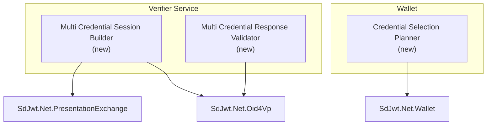
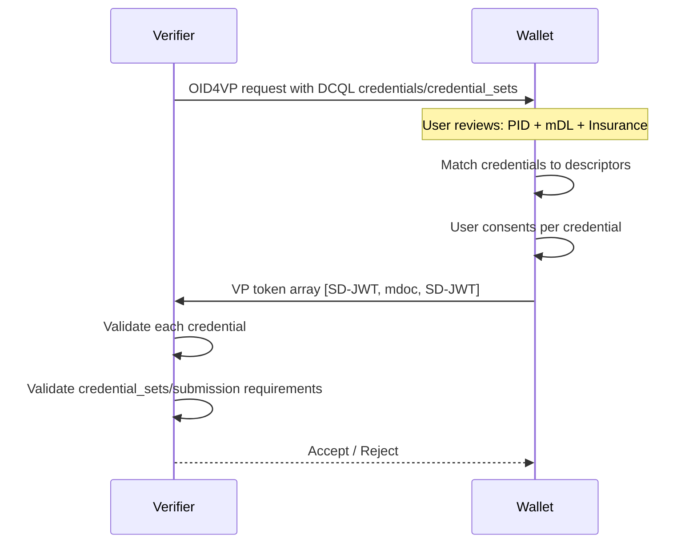

# Implementation Plan: Multi-Credential OID4VP Sessions

|                    |                                                                                                                |
| ------------------ | -------------------------------------------------------------------------------------------------------------- |
| **Status**         | Validated implementation plan                                                                                  |
| **Author**         | SD-JWT .NET Team                                                                                               |
| **Created**        | 2026-03-04                                                                                                     |
| **Reviewed**       | 2026-05-09                                                                                                     |
| **Packages**       | `SdJwt.Net.Oid4Vp`, `SdJwt.Net.PresentationExchange`, `SdJwt.Net.Wallet`                                       |
| **Specifications** | OpenID4VP 1.0 DCQL `credentials` / `credential_sets`, DIF Presentation Exchange v2.1.1 submission requirements |

---

## Context / Problem statement

Real-world verification scenarios frequently require **multiple credentials** in a single transaction:

- **Airport check-in**: Boarding pass + passport + vaccination record
- **Financial onboarding**: Government ID + proof of address + income attestation
- **Healthcare**: Insurance card + professional license + patient consent
- **EUDIW age verification + mDL**: PID (age_over_18) + mDL (driving privileges)

`SdJwt.Net.Oid4Vp` already models multi-credential OID4VP primitives: DCQL `credentials`, DCQL `credential_sets`, VP token arrays, and multiple Presentation Exchange descriptor mappings. `SdJwt.Net.PresentationExchange` also supports multiple input descriptors and submission requirements.

The remaining gap is not protocol support. The gap is an ergonomic verifier/wallet workflow for composing, matching, consenting to, and validating multi-credential sessions consistently across DCQL and Presentation Exchange.

---

## Goals

1. Request multiple credentials (mixed SD-JWT VC and mdoc) in a single OID4VP session
2. Validate all credentials atomically (all-or-nothing)
3. Support mixed format types within one presentation definition
4. Support credential-level consent (user can decline individual credentials)
5. Maintain backward compatibility with single-credential flows

## Non-Goals

- Cross-device credential aggregation (credentials from multiple wallets)
- Credential chaining (using one credential to unlock issuance of another)

---

## Direction

Do not add a separate "bundle" protocol. Implement a thin planning layer over OpenID4VP 1.0 and DIF PEX:

- Prefer DCQL for new OpenID4VP requests because it is the final OpenID4VP query language.
- Keep PEX support for ecosystems that still use `presentation_definition`.
- Treat "atomic" validation as an application policy layered over DCQL `credential_sets` or PEX submission requirements.
- Return standard OpenID4VP responses: VP token arrays for multiple credentials and `presentation_submission` where PEX is used.

---

## Implementation plan

### Architecture



### Component design

#### `MultiCredentialRequestBuilder`

Builds standard OpenID4VP requests using DCQL first and PEX where requested.

```csharp
public sealed class MultiCredentialRequestBuilder
{
    public MultiCredentialRequestBuilder AddDcqlCredential(
        string id,
        string format,
        IReadOnlyList<DcqlClaimsQuery> claims,
        bool multiple = false);

    public MultiCredentialRequestBuilder AddCredentialSet(
        string id,
        IReadOnlyList<IReadOnlyList<string>> options,
        bool required = true);

    public MultiCredentialRequestBuilder RequireAtomicSubmission(bool atomic = true);

    public AuthorizationRequest Build();
}
```

#### `MultiCredentialResponseValidator`

Validates that the standard OID4VP response satisfies the requested credential set policy.

```csharp
public sealed class MultiCredentialResponseValidator
{
    public Task<MultiCredentialValidationResult> ValidateAsync(
        AuthorizationResponse response,
        MultiCredentialValidationOptions options,
        CancellationToken cancellationToken = default);
}

public sealed class MultiCredentialValidationResult
{
    public bool IsValid { get; }
    public IReadOnlyList<CredentialValidationResult> Credentials { get; init; } = [];
    public IReadOnlyList<string> UnsatisfiedCredentialSets { get; init; } = [];
}
```

### Sequence: multi-credential request



---

## API surface

```csharp
// Build multi-credential request using DCQL
var request = new MultiCredentialRequestBuilder()
    .AddDcqlCredential(
        id: "pid",
        format: "dc+sd-jwt",
        claims: pidClaims)
    .AddDcqlCredential(
        id: "mdl",
        format: "mso_mdoc",
        claims: mdlClaims)
    .AddCredentialSet("identity-and-driving", [["pid", "mdl"]])
    .RequireAtomicSubmission(true)
    .Build();

// Validate response
var validator = new MultiCredentialResponseValidator(vpTokenValidator, statusChecker);
var result = await validator.ValidateAsync(response, new MultiCredentialValidationOptions
{
    FailOnPartialSubmission = true,
    ValidateStatus = true
});

foreach (var cred in result.Credentials)
{
    Console.WriteLine($"{cred.DescriptorId}: {(cred.IsValid ? "Valid" : cred.Error)}");
}
```

---

## Security considerations

| Concern                                   | Mitigation                                                                                                  |
| ----------------------------------------- | ----------------------------------------------------------------------------------------------------------- |
| Credential correlation across descriptors | Each credential verified independently; no cross-credential linking by verifier unless explicitly requested |
| Partial submission attacks                | `RequireAtomicSubmission` enforces all-or-nothing                                                           |
| Mixed format validation bypass            | Each format validated by its specific verifier (SD-JWT or mdoc)                                             |
| Consent fatigue                           | Wallet UX should clearly show what each credential discloses                                                |

---

## Estimated effort

| Component                                      | Effort      |
| ---------------------------------------------- | ----------- |
| Component                                      | Effort      |
| ---------------------------------------------- | ----------- |
| DCQL-first request builder                     | 2 days      |
| PEX compatibility path                         | 2 days      |
| Multi-credential response policy validator     | 3 days      |
| Wallet credential selection planner            | 3 days      |
| Tests for DCQL sets, VP token arrays, PEX maps | 3 days      |
| Documentation and samples                      | 2 days      |
| **Total**                                      | **15 days** |

---

## Related documentation

- [OpenID4VP Deep Dive](../concepts/openid4vp-deep-dive.md)
- [Presentation Exchange Deep Dive](../concepts/presentation-exchange-deep-dive.md)
- [Wallet Deep Dive](../concepts/wallet-deep-dive.md)
