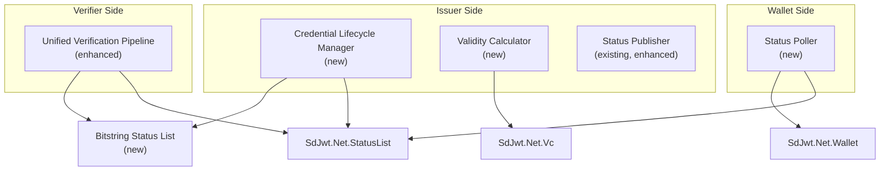
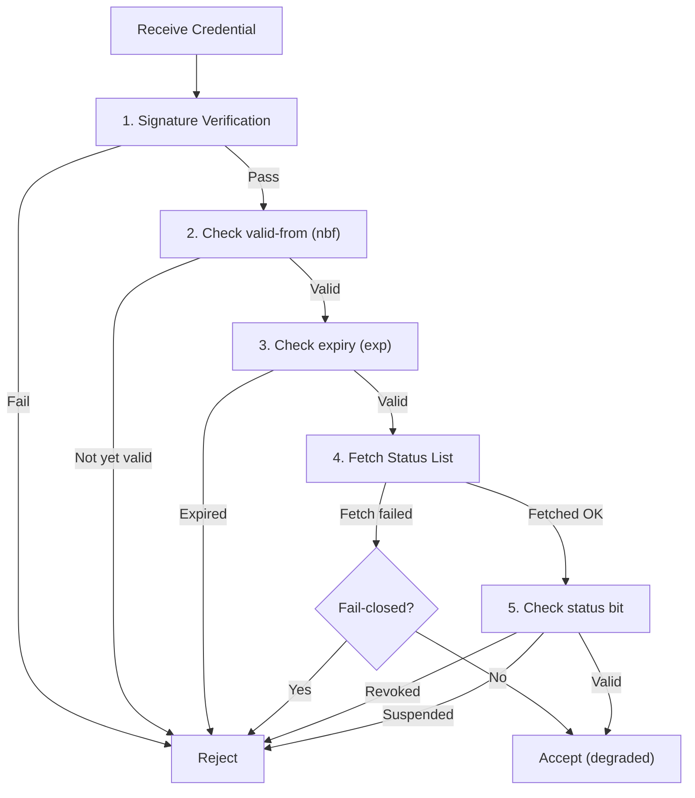

# Proposal: Credential Lifecycle Controls

|                    |                                                                                                                                                                             |
| ------------------ | --------------------------------------------------------------------------------------------------------------------------------------------------------------------------- |
| **Status**         | Proposed                                                                                                                                                                    |
| **Author**         | SD-JWT .NET Team                                                                                                                                                            |
| **Created**        | 2026-03-04                                                                                                                                                                  |
| **Packages**       | `SdJwt.Net.StatusList` (extension), `SdJwt.Net.Wallet` (extension)                                                                                                          |
| **Specifications** | [Token Status List draft-20](https://datatracker.ietf.org/doc/draft-ietf-oauth-status-list/), [Bitstring Status List v1.0](https://www.w3.org/TR/vc-bitstring-status-list/) |

---

## Context / Problem statement

The current `SdJwt.Net.StatusList` package provides basic status list creation and verification. Production deployments need richer lifecycle controls:

1. **Set Revocation & Suspension**: Programmatic APIs to revoke and suspend credentials with reason codes, audit trails, and batch operations
2. **Expiration & Validity Controls**: Configure `valid-from` / `expiry` windows dynamically via data functions, supporting rolling validity and time-boxed credentials
3. **Expiration & Revocation Checks**: Enforce both validity windows and status list checks during verification, with configurable fail-open / fail-closed behavior
4. **Credential Status Validation**: Wallet-side proactive checking of stored credentials against status lists
5. **Bitstring Status List v1.0**: W3C alternative to IETF Token Status List, used by some ecosystems

---

## Goals

1. Provide fluent APIs for credential revocation, suspension, and reinstatement
2. Support dynamic validity period calculation (data functions for `valid-from` / `expiry`)
3. Enforce both temporal validity and status list checks in a unified verification pipeline
4. Enable wallet-side background status polling with configurable intervals
5. Add Bitstring Status List v1.0 support alongside existing Token Status List

## Non-Goals

- CRL (Certificate Revocation List) support
- OCSP (Online Certificate Status Protocol) support
- Real-time push notification of revocation events to wallets

---

## Proposed design

### Architecture



### Component design

#### `CredentialLifecycleManager` (Issuer Side)

```csharp
public class CredentialLifecycleManager
{
    // Revoke with reason and audit
    public Task RevokeAsync(int statusIndex, RevocationReason reason, string operatorId);

    // Suspend (temporary, can be reinstated)
    public Task SuspendAsync(int statusIndex, string reason, string operatorId);

    // Reinstate a suspended credential
    public Task ReinstateAsync(int statusIndex, string operatorId);

    // Batch operations
    public Task BatchUpdateAsync(IEnumerable<StatusUpdate> updates, string operatorId);

    // Publish updated status list
    public Task<string> PublishAsync(PublishOptions options);
}

public enum RevocationReason
{
    Unspecified = 0,
    KeyCompromise = 1,
    AffiliationChanged = 2,
    Superseded = 3,
    PrivilegeWithdrawn = 4,
    CessationOfOperation = 5
}
```

#### `ValidityCalculator` (Dynamic Validity Windows)

```csharp
public class ValidityCalculator
{
    // Static validity period
    public static ValidityPeriod Fixed(DateTimeOffset validFrom, DateTimeOffset validUntil);

    // Rolling validity (e.g., "valid for 30 days from issuance")
    public static ValidityPeriod Rolling(TimeSpan duration);

    // Data-function driven (e.g., validity depends on credential type)
    public static ValidityPeriod DataDriven(Func<CredentialContext, ValidityPeriod> function);
}

public record ValidityPeriod(DateTimeOffset ValidFrom, DateTimeOffset ValidUntil);
```

#### `UnifiedVerificationPipeline` (Verifier Side)

```csharp
public class UnifiedVerificationPipeline
{
    public Task<VerificationResult> VerifyAsync(
        string credential,
        UnifiedVerificationOptions options);
}

public class UnifiedVerificationOptions
{
    public bool CheckExpiry { get; set; } = true;
    public bool CheckNotBefore { get; set; } = true;
    public bool CheckStatusList { get; set; } = true;
    public bool FailClosedOnStatusError { get; set; } = true;
    public TimeSpan ClockSkew { get; set; } = TimeSpan.FromSeconds(30);
    public TimeSpan MaxStatusListAge { get; set; } = TimeSpan.FromMinutes(15);
}
```

#### `StatusPoller` (Wallet Side)

```csharp
public class StatusPollerOptions
{
    public TimeSpan PollInterval { get; set; } = TimeSpan.FromHours(1);
    public bool NotifyOnRevocation { get; set; } = true;
    public bool RemoveRevokedCredentials { get; set; } = false;
}
```

### Verification flow



---

## Bitstring Status List v1.0

The [W3C Bitstring Status List v1.0](https://www.w3.org/TR/vc-bitstring-status-list/) specification provides an alternative to IETF Token Status List. Key differences:

| Feature       | IETF Token Status List            | W3C Bitstring Status List                |
| ------------- | --------------------------------- | ---------------------------------------- |
| Format        | JWT wrapping compressed bitstring | JSON-LD VerifiableCredential + bitstring |
| Ecosystem     | OpenID4VC, SD-JWT VC              | W3C VC Data Model, JSON-LD               |
| Compression   | ZLIB                              | GZIP                                     |
| Status values | 1/2/4/8-bit configurable          | 1-bit (per purpose) or multi-bit         |

The new `BitstringStatusList` module will share the same `IStatusChecker` interface, allowing verifiers to handle both formats transparently.

---

## Security considerations

| Concern                                               | Mitigation                                                                   |
| ----------------------------------------------------- | ---------------------------------------------------------------------------- |
| Status list staleness                                 | Configurable max age + TTL headers                                           |
| Privacy (verifier learns which credential is checked) | Status list download is unlinkable (verifier gets full list, checks locally) |
| Revocation racing                                     | Fail-closed by default; status list freshness validation                     |
| Unauthorized revocation                               | Lifecycle manager requires operator identity; audit trail                    |

---

## Estimated effort

| Component                     | Effort      |
| ----------------------------- | ----------- |
| `CredentialLifecycleManager`  | 3 days      |
| `ValidityCalculator`          | 2 days      |
| `UnifiedVerificationPipeline` | 3 days      |
| `StatusPoller` (wallet)       | 2 days      |
| Bitstring Status List v1.0    | 5 days      |
| Tests + documentation         | 3 days      |
| **Total**                     | **18 days** |

---

## Related documentation

- [Status List Deep Dive](../concepts/status-list-deep-dive.md) - Current implementation
- [Managing Revocation Guide](../guides/managing-revocation.md) - Current guide
- [Wallet Deep Dive](../concepts/wallet-deep-dive.md) - Wallet integration
