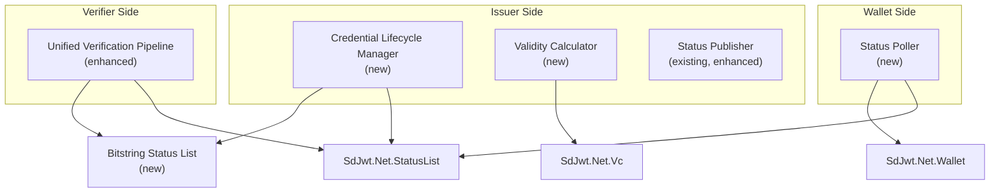
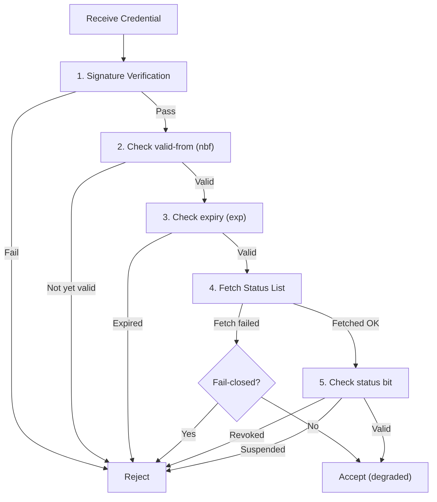

# Implementation Plan: Credential Lifecycle Controls

|                    |                                                                                                                                                                             |
| ------------------ | --------------------------------------------------------------------------------------------------------------------------------------------------------------------------- |
| **Status**         | Validated implementation plan                                                                                                                                               |
| **Author**         | SD-JWT .NET Team                                                                                                                                                            |
| **Created**        | 2026-03-04                                                                                                                                                                  |
| **Reviewed**       | 2026-05-09                                                                                                                                                                  |
| **Packages**       | `SdJwt.Net.StatusList` (extension), `SdJwt.Net.Wallet` (extension)                                                                                                          |
| **Specifications** | [Token Status List draft-20](https://datatracker.ietf.org/doc/draft-ietf-oauth-status-list/), [Bitstring Status List v1.0](https://www.w3.org/TR/vc-bitstring-status-list/) |

---

## Context / Problem statement

The current `SdJwt.Net.StatusList` package provides Token Status List creation, verification, freshness checks, and RFC 7662 token introspection. `SdJwt.Net.Wallet` also includes a status-list-backed document status resolver. `SdJwt.Net.VcDm` models W3C `BitstringStatusListEntry`, but it does not issue, publish, fetch, or validate Bitstring Status List credentials.

Remaining lifecycle work is focused on richer issuer controls and additional status formats:

1. **Set Revocation & Suspension**: Programmatic APIs to revoke and suspend credentials with reason codes, audit trails, and batch operations
2. **Expiration & Validity Controls**: Configure `valid-from` / `expiry` windows dynamically via data functions, supporting rolling validity and time-boxed credentials
3. **Expiration & Revocation Checks**: Enforce both validity windows and status list checks during verification, with configurable fail-open / fail-closed behavior
4. **Credential Status Polling**: Wallet-side background checking of stored credentials against status lists
5. **Bitstring Status List v1.0**: W3C alternative to IETF Token Status List, used by some ecosystems

---

## Goals

1. Provide fluent APIs for credential revocation, suspension, and reinstatement
2. Support dynamic validity period calculation (data functions for `valid-from` / `expiry`)
3. Enforce both temporal validity and status list checks in a unified verification pipeline
4. Enable wallet-side background status polling with configurable intervals
5. Add Bitstring Status List v1.0 support alongside existing Token Status List

## Non-Goals

- CRL (Certificate Revocation List) support
- OCSP (Online Certificate Status Protocol) support
- Real-time push notification of revocation events to wallets

---

## Direction

- Keep Token Status List and W3C Bitstring Status List as separate implementations behind a shared status-check abstraction.
- Do not make W3C Bitstring Status List a dependency of the SD-JWT VC-only path; keep it under VCDM/status integration.
- Preserve existing `StatusListVerifier`, `HybridStatusChecker`, and wallet document status resolver APIs.
- Treat issuer-side mutation APIs as storage-backed operations, not in-memory-only helpers.

---

## Implementation plan

### Architecture



### Component design

### Phase 1: Shared status-check contracts

Add package-local abstractions that can support Token Status List, Bitstring Status List, and token introspection without forcing callers to know the backing format.

```csharp
public interface ICredentialStatusChecker
{
    Task<CredentialStatusCheckResult> CheckAsync(
        CredentialStatusReference reference,
        CredentialStatusCheckOptions options,
        CancellationToken cancellationToken = default);
}
```

### Phase 2: Issuer lifecycle manager

```csharp
public sealed class CredentialLifecycleManager
{
    // Revoke with reason and audit
    public Task RevokeAsync(int statusIndex, RevocationReason reason, string operatorId);

    // Suspend (temporary, can be reinstated)
    public Task SuspendAsync(int statusIndex, string reason, string operatorId);

    // Reinstate a suspended credential
    public Task ReinstateAsync(int statusIndex, string operatorId);

    // Batch operations
    public Task BatchUpdateAsync(IEnumerable<StatusUpdate> updates, string operatorId);

    // Publish updated status list
    public Task<string> PublishAsync(PublishOptions options);
}

public enum RevocationReason
{
    Unspecified = 0,
    KeyCompromise = 1,
    AffiliationChanged = 2,
    Superseded = 3,
    PrivilegeWithdrawn = 4,
    CessationOfOperation = 5
}
```

### Phase 3: Validity calculator

```csharp
public sealed class ValidityCalculator
{
    // Static validity period
    public static ValidityPeriod Fixed(DateTimeOffset validFrom, DateTimeOffset validUntil);

    // Rolling validity (e.g., "valid for 30 days from issuance")
    public static ValidityPeriod Rolling(TimeSpan duration);

    // Data-function driven (e.g., validity depends on credential type)
    public static ValidityPeriod DataDriven(Func<CredentialContext, ValidityPeriod> function);
}

public record ValidityPeriod(DateTimeOffset ValidFrom, DateTimeOffset ValidUntil);
```

### Phase 4: Verification integration

```csharp
public sealed class UnifiedVerificationPipeline
{
    public Task<VerificationResult> VerifyAsync(
        string credential,
        UnifiedVerificationOptions options);
}

public class UnifiedVerificationOptions
{
    public bool CheckExpiry { get; set; } = true;
    public bool CheckNotBefore { get; set; } = true;
    public bool CheckStatusList { get; set; } = true;
    public bool FailClosedOnStatusError { get; set; } = true;
    public TimeSpan ClockSkew { get; set; } = TimeSpan.FromSeconds(30);
    public TimeSpan MaxStatusListAge { get; set; } = TimeSpan.FromMinutes(15);
}
```

### Phase 5: Wallet status polling

```csharp
public class StatusPollerOptions
{
    public TimeSpan PollInterval { get; set; } = TimeSpan.FromHours(1);
    public bool NotifyOnRevocation { get; set; } = true;
    public bool RemoveRevokedCredentials { get; set; } = false;
}
```

### Verification flow



---

### Phase 6: Bitstring Status List v1.0

The [W3C Bitstring Status List v1.0](https://www.w3.org/TR/vc-bitstring-status-list/) Recommendation provides an alternative to IETF Token Status List for W3C Verifiable Credentials. Key differences:

| Feature       | IETF Token Status List            | W3C Bitstring Status List                     |
| ------------- | --------------------------------- | --------------------------------------------- |
| Format        | JWT wrapping compressed bitstring | JSON-LD VerifiableCredential + bitstring      |
| Ecosystem     | OpenID4VC, SD-JWT VC              | W3C VC Data Model, JSON-LD                    |
| Compression   | ZLIB                              | GZIP                                          |
| Status values | 1/2/4/8-bit configurable          | 1-bit default; multi-bit with status messages |

The new `BitstringStatusList` module should build on `SdJwt.Net.VcDm` models and add encoding, publishing, fetching, and validation.

---

## Security considerations

| Concern                                               | Mitigation                                                                   |
| ----------------------------------------------------- | ---------------------------------------------------------------------------- |
| Status list staleness                                 | Configurable max age + TTL headers                                           |
| Privacy (verifier learns which credential is checked) | Status list download is unlinkable (verifier gets full list, checks locally) |
| Revocation racing                                     | Fail-closed by default; status list freshness validation                     |
| Unauthorized revocation                               | Lifecycle manager requires operator identity; audit trail                    |

---

## Estimated effort

| Component                                  | Effort      |
| ------------------------------------------ | ----------- |
| Component                                  | Effort      |
| ------------------------------------------ | ----------- |
| Shared status-check contracts              | 2 days      |
| `CredentialLifecycleManager`               | 3 days      |
| `ValidityCalculator`                       | 2 days      |
| Verification integration                   | 3 days      |
| `StatusPoller` (wallet)                    | 3 days      |
| Bitstring Status List v1.0 processor       | 6 days      |
| Tests + documentation                      | 4 days      |
| **Total**                                  | **23 days** |

---

## Related documentation

- [Status List](../concepts/status-list.md) - Current implementation
- [Managing Revocation Guide](../guides/managing-revocation.md) - Current guide
- [Wallet](../concepts/wallet.md) - Wallet integration
