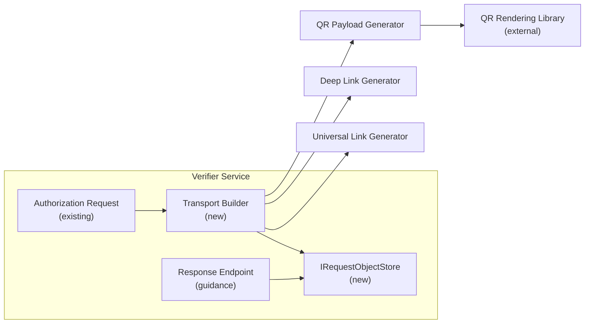
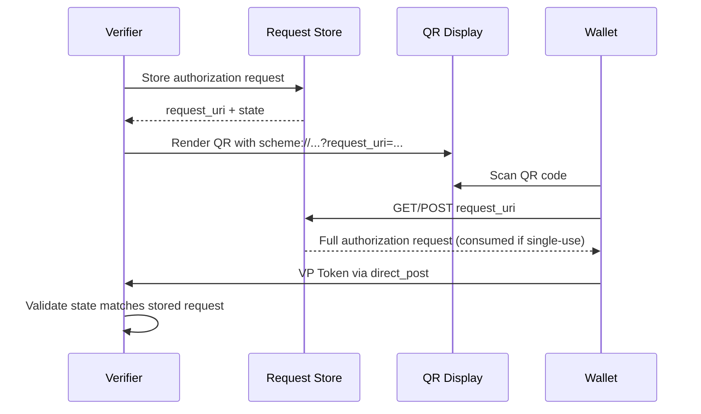
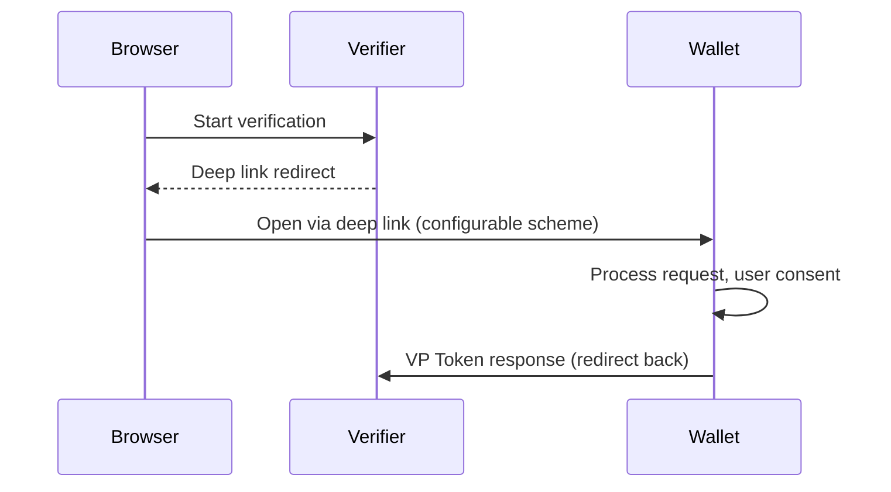

# Implementation Plan: OID4VP Delivery via QR Codes and Deep Links

|                   |                                            |
| ----------------- | ------------------------------------------ |
| **Status**        | Accepted                                   |
| **Priority**      | P0 - Implement first                       |
| **Author**        | SD-JWT .NET Team                           |
| **Created**       | 2026-03-04                                 |
| **Reviewed**      | 2026-05-09                                 |
| **Maturity**      | Stable                                     |
| **Package**       | `SdJwt.Net.Oid4Vp` (namespace: `Delivery`) |
| **New package?**  | No - new namespace within existing package |
| **Public API?**   | Yes                                        |
| **Specification** | OpenID4VP 1.0 request URI flows            |

---

## Context / Problem statement

OpenID4VP 1.0 defines same-device and cross-device flows, supports `request_uri`, and recommends `direct_post` with `request_uri` when an Authorization Request is passed across devices by QR code. In practice, verifiers still need helper APIs to produce transport-safe payloads:

- **QR codes** for cross-device flows (e.g., kiosk, point-of-sale, print media)
- **Deep links** for same-device flows (e.g., web page redirect, push notification)
- **Universal links** for platform-native invocation (iOS Universal Links, Android App Links)

`SdJwt.Net.Oid4Vp` already has low-level URI helpers for authorization requests and request-by-reference. The remaining gap is a supported transport helper that chooses request-by-value or request-by-reference, enforces payload limits, models expiry/single-use request storage, and produces QR/deep-link payloads without adding an image-rendering dependency.

---

## Goals

1. Generate QR code payloads from OID4VP authorization requests
2. Generate deep link / universal link URIs for same-device flows
3. Support both request-by-value and request-by-reference (`request_uri`)
4. Provide QR payload metadata suitable for external QR rendering libraries
5. Handle request size limits (QR capacity ~4,296 alphanumeric characters)
6. Provide `IRequestObjectStore` with request object expiry, single-use semantics, state/transaction correlation, and replay protection
7. Provide guidance for verifier response endpoints (`GET`/`POST` `request_uri`, `direct_post`, state/nonce validation)

## Non-Goals

- QR code image rendering (delegate to existing libraries like `QRCoder`)
- Push notification delivery (out of scope)
- Wallet-side QR scanning (wallet application responsibility)
- DC API browser-based flows (separate transport)

---

## Direction

- Keep the output as URI payloads, not QR bitmap images.
- Provide a configurable wallet invocation URI scheme. Use `openid4vp://` only as a default sample where appropriate. Wallet ecosystems often use claimed HTTPS links, app links, universal links, or ecosystem-specific schemes.
- Prefer request-by-reference for QR payloads because request objects can exceed QR capacity.
- Support `request_uri_method` values defined by OpenID4VP: `get` and `post`.
- Make request references short lived and optionally single use.
- Protect the response URI by checking that the received `state` corresponds to a recent authorization request, as recommended by OpenID4VP.

---

## Implementation plan

### Architecture



### Component design

#### `Oid4VpTransportBuilder`

Fluent API for generating transport-ready payloads on top of existing request URI helpers:

```csharp
public sealed class Oid4VpTransportBuilder
{
    public Oid4VpTransportBuilder WithAuthorizationRequest(AuthorizationRequest request);
    public Oid4VpTransportBuilder WithRequestUri(string requestUri);
    public Oid4VpTransportBuilder WithRequestUriMethod(string requestUriMethod);
    public Oid4VpTransportBuilder WithScheme(string scheme);
    public QrPayload BuildQrPayload(QrPayloadOptions options);
    public DeepLinkPayload BuildDeepLink(DeepLinkOptions options);
    public UniversalLinkPayload BuildUniversalLink(UniversalLinkOptions options);
}
```

#### `QrPayloadOptions`

```csharp
public class QrPayloadOptions
{
    public QrContentMode ContentMode { get; set; } = QrContentMode.RequestByReference;
    public int MaxPayloadSize { get; set; } = 4096;
    public TimeSpan RequestUriExpiry { get; set; } = TimeSpan.FromMinutes(5);
    public bool SingleUseRequestUri { get; set; } = true;
}

public enum QrContentMode
{
    RequestByValue,
    RequestByReference
}
```

#### `IRequestObjectStore`

```csharp
/// <summary>
/// Stores authorization request objects for request-by-reference flows
/// with expiry, single-use semantics, and state correlation.
/// </summary>
public interface IRequestObjectStore
{
    /// <summary>
    /// Stores an authorization request and returns a handle with the request URI.
    /// </summary>
    Task<RequestObjectHandle> StoreAsync(
        AuthorizationRequest request,
        RequestObjectStoreOptions options,
        CancellationToken ct = default);

    /// <summary>
    /// Retrieves and optionally consumes (single-use) a stored request.
    /// Returns null if not found, expired, or already consumed.
    /// </summary>
    Task<AuthorizationRequest?> TryConsumeAsync(
        string requestId,
        CancellationToken ct = default);
}

public sealed class RequestObjectStoreOptions
{
    public TimeSpan Expiry { get; set; } = TimeSpan.FromMinutes(5);
    public bool SingleUse { get; set; } = true;
    public string? State { get; set; }
    public string? Nonce { get; set; }
}

public sealed class RequestObjectHandle
{
    public required string RequestId { get; init; }
    public required string RequestUri { get; init; }
    public required DateTimeOffset ExpiresAt { get; init; }
    public required string State { get; init; }
}
```

### Sequence: cross-device QR flow



### Sequence: same-device deep link flow



### Verifier response endpoint guidance

The verifier must also implement the following endpoints:

| Endpoint                         | Purpose                                                         |
| -------------------------------- | --------------------------------------------------------------- |
| `GET` or `POST` at `request_uri` | Serves stored authorization request objects                     |
| `direct_post` response endpoint  | Receives VP Token responses from wallets                        |
| State validation                 | Checks `state` parameter matches a recent authorization request |
| Nonce validation                 | Ensures nonce freshness and single-use                          |
| Request expiry                   | Rejects requests past configured TTL                            |
| Single-use enforcement           | Returns error if request already consumed                       |

---

## API surface

```csharp
// Generate QR payload for cross-device
var transport = new Oid4VpTransportBuilder()
    .WithAuthorizationRequest(authzRequest)
    .WithScheme("openid4vp") // configurable; default
    .WithRequestUri("https://verifier.example.com/requests/" + requestId);

var qrPayload = transport.BuildQrPayload(new QrPayloadOptions
{
    ContentMode = QrContentMode.RequestByReference
});

// qrPayload.Content = "openid4vp://?request_uri=https%3A%2F%2F..."
// qrPayload.ContentLength = 156
// qrPayload.ContentMode = QrContentMode.RequestByReference
// Pass qrPayload.Content to QR rendering library

// Generate deep link for same-device
var deepLink = transport.BuildDeepLink(new DeepLinkOptions
{
    Scheme = "https",
    Host = "wallet.example.com",
    FallbackUrl = "https://wallet.example.com/download"
});
```

---

## Security considerations

| Concern                   | Mitigation                                                   |
| ------------------------- | ------------------------------------------------------------ |
| QR code screenshot replay | Request URI with short TTL (5 min default) + single-use flag |
| Request tampering         | JAR (JWT Authorization Request) with signed payload          |
| Phishing via malicious QR | Wallet validates issuer identity before displaying consent   |
| Deep link hijacking       | Universal links with domain verification                     |
| Response URI replay       | State parameter correlation with stored request              |
| Request URI replay        | Single-use consumption via `IRequestObjectStore`             |

---

## Acceptance criteria

```text
Given an authorization request larger than configured payload limit,
when QR payload is requested,
then request-by-reference is used and the stored request expires after configured TTL.

Given a request stored with single-use semantics,
when TryConsumeAsync is called twice,
then the second call returns null.

Given a stored request with state correlation,
when a direct_post response arrives with mismatched state,
then the verifier rejects the response.

Given a configurable URI scheme,
when the scheme is set to "https",
then the generated payload uses https:// as the scheme.

Given a request_uri with expired TTL,
when a wallet fetches the request_uri,
then the store returns null.
```

---

## Interop test requirements

- Wallet interop: verify payload consumed by at least one reference wallet implementation
- Negative test: oversized request-by-value rejected and falls back to request-by-reference
- Replay test: single-use request cannot be fetched twice
- Expiry test: expired request returns 404/null
- Scheme test: custom schemes produce valid URIs

---

## Estimated effort

| Component                                             | Effort     |
| ----------------------------------------------------- | ---------- |
| `Oid4VpTransportBuilder`                              | 2 days     |
| `QrPayload`, `DeepLinkPayload`, universal link models | 1 day      |
| `IRequestObjectStore` with expiry and single-use API  | 2 days     |
| Payload size policy and request-by-reference fallback | 1 day      |
| Tests + documentation                                 | 2 days     |
| **Total**                                             | **8 days** |

---

## Alternatives considered

| Alternative                          | Rejected Because                                                                                       |
| ------------------------------------ | ------------------------------------------------------------------------------------------------------ |
| Bundle QR rendering into the package | Adds image processing dependency; better to output payloads and let consumers choose rendering library |
| Custom URI scheme per implementation | Non-standard; use `openid4vp://` as default but allow configuration                                    |
| WebSocket-based delivery             | Over-engineered for most use cases; QR + deep links cover 95% of scenarios                             |

---

## Related documentation

- [OpenID4VP](../concepts/openid4vp.md) - Underlying verification protocol
- [DC API](../concepts/dc-api.md) - Browser-based alternative transport
- [Capability Matrix](../reference/capabilities.md) - Ecosystem feature coverage
