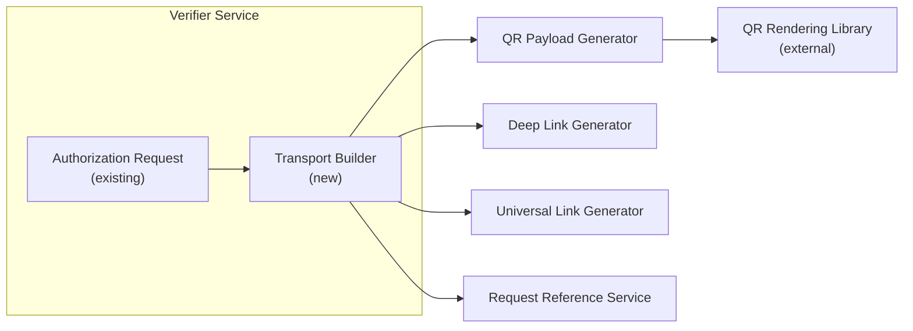
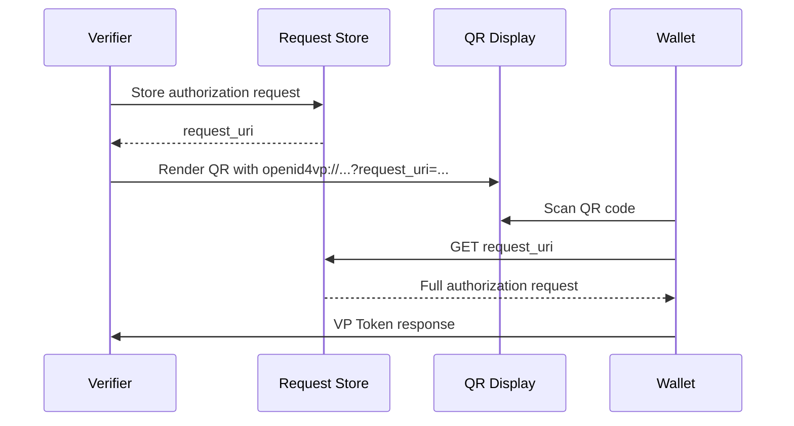
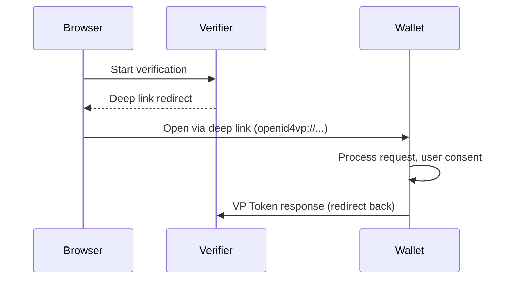

# Proposal: Delivery via QR Codes & Deep Links

|                   |                                 |
| ----------------- | ------------------------------- |
| **Status**        | Proposed                        |
| **Author**        | SD-JWT .NET Team                |
| **Created**       | 2026-03-04                      |
| **Package**       | `SdJwt.Net.Oid4Vp` (extension)  |
| **Specification** | OpenID4VP 1.0 Transport Binding |

---

## Context / Problem statement

OpenID4VP defines the verification protocol but leaves the **transport mechanism** underspecified. In practice, verifiers need to deliver authorization requests to wallets via:

- **QR codes** for cross-device flows (e.g., kiosk, point-of-sale, print media)
- **Deep links** for same-device flows (e.g., web page redirect, push notification)
- **Universal links** for platform-native invocation (iOS Universal Links, Android App Links)

Currently, `SdJwt.Net.Oid4Vp` creates authorization requests but does not provide built-in transport rendering. Developers must manually construct QR payloads, handle URI encoding, manage request-by-reference, and implement scanning UX.

---

## Goals

1. Generate QR code payloads from OID4VP authorization requests
2. Generate deep link / universal link URIs for same-device flows
3. Support both request-by-value and request-by-reference (`request_uri`)
4. Provide configurable QR rendering (format, size, error correction)
5. Handle request size limits (QR capacity ~4,296 alphanumeric characters)

## Non-Goals

- QR code image rendering (delegate to existing libraries like `QRCoder`)
- Push notification delivery (out of scope)
- Wallet-side QR scanning (wallet application responsibility)

---

## Proposed design

### Architecture



### Component design

#### `TransportBuilder`

Fluent API for generating transport-ready payloads:

```csharp
public class TransportBuilder
{
    public TransportBuilder WithAuthorizationRequest(AuthorizationRequest request);
    public TransportBuilder WithRequestUri(string requestUri);
    public TransportBuilder WithScheme(string scheme); // "openid4vp://" or "haip://"
    public QrPayload BuildQrPayload(QrPayloadOptions options);
    public DeepLinkPayload BuildDeepLink(DeepLinkOptions options);
    public UniversalLinkPayload BuildUniversalLink(UniversalLinkOptions options);
}
```

#### `QrPayloadOptions`

```csharp
public class QrPayloadOptions
{
    public QrContentMode ContentMode { get; set; } = QrContentMode.RequestByReference;
    public int MaxPayloadSize { get; set; } = 4096;
    public TimeSpan RequestUriExpiry { get; set; } = TimeSpan.FromMinutes(5);
}

public enum QrContentMode
{
    RequestByValue,     // Full request in QR (small requests only)
    RequestByReference  // request_uri in QR, full request at URI
}
```

### Sequence: cross-device QR flow



### Sequence: same-device deep link flow



---

## API surface

```csharp
// Generate QR payload for cross-device
var transport = new TransportBuilder()
    .WithAuthorizationRequest(authzRequest)
    .WithRequestUri("https://verifier.example.com/requests/" + requestId);

var qrPayload = transport.BuildQrPayload(new QrPayloadOptions
{
    ContentMode = QrContentMode.RequestByReference
});

// qrPayload.Content = "openid4vp://?request_uri=https%3A%2F%2F..."
// qrPayload.ContentLength = 156
// Pass qrPayload.Content to QR rendering library

// Generate deep link for same-device
var deepLink = transport.BuildDeepLink(new DeepLinkOptions
{
    Scheme = "openid4vp",
    FallbackUrl = "https://wallet.example.com/download"
});

// deepLink.Uri = "openid4vp://?request=eyJ..."
```

---

## Security considerations

| Concern                   | Mitigation                                                   |
| ------------------------- | ------------------------------------------------------------ |
| QR code screenshot replay | Request URI with short TTL (5 min default) + single-use flag |
| Request tampering         | JAR (JWT Authorization Request) with signed payload          |
| Phishing via malicious QR | Wallet validates issuer identity before displaying consent   |
| Deep link hijacking       | Universal links with domain verification                     |

---

## Estimated effort

| Component                              | Effort     |
| -------------------------------------- | ---------- |
| `TransportBuilder`                     | 2 days     |
| `QrPayload` + `DeepLinkPayload` models | 1 day      |
| Request reference storage interface    | 1 day      |
| Tests + documentation                  | 2 days     |
| **Total**                              | **6 days** |

---

## Alternatives considered

| Alternative                          | Rejected Because                                                                                       |
| ------------------------------------ | ------------------------------------------------------------------------------------------------------ |
| Bundle QR rendering into the package | Adds image processing dependency; better to output payloads and let consumers choose rendering library |
| Custom URI scheme per implementation | Non-standard; `openid4vp://` is the specified scheme                                                   |
| WebSocket-based delivery             | Over-engineered for most use cases; QR + deep links cover 95% of scenarios                             |

---

## Related documentation

- [OpenID4VP Deep Dive](../concepts/openid4vp-deep-dive.md) - Underlying verification protocol
- [DC API Deep Dive](../concepts/dc-api-deep-dive.md) - Browser-based alternative transport
- [Capability Matrix](../capabilities.md) - Ecosystem feature coverage
