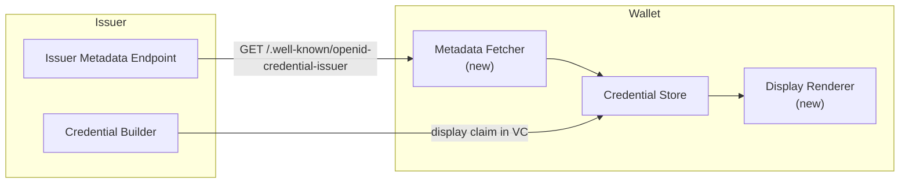
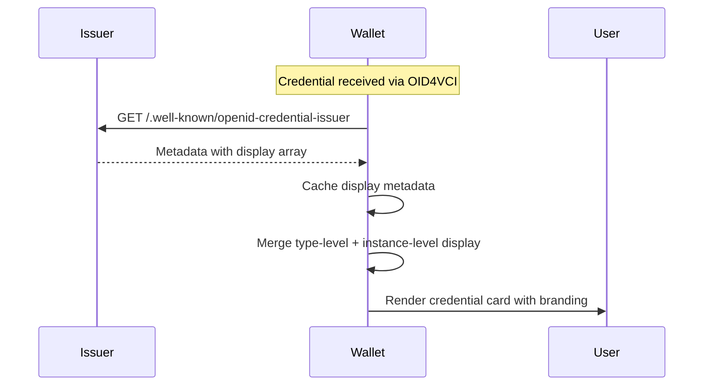

# Proposal: Issuer Metadata & Display Data

|                    |                                                                                                                                             |
| ------------------ | ------------------------------------------------------------------------------------------------------------------------------------------- |
| **Status**         | Proposed                                                                                                                                    |
| **Author**         | SD-JWT .NET Team                                                                                                                            |
| **Created**        | 2026-03-04                                                                                                                                  |
| **Packages**       | `SdJwt.Net.Oid4Vci` (extension), `SdJwt.Net.Wallet` (extension)                                                                             |
| **Specifications** | [OpenID4VCI 1.0 Section 11.2](https://openid.net/specs/openid-4-verifiable-credential-issuance-1_0.html), OID4VCI Credential Issuer Display |

---

## Context / Problem statement

Wallets display credentials to users, but currently there is no standard way for issuers to communicate **how** their credentials should appear. This leads to:

1. **Inconsistent branding**: Same credential type looks different across wallets
2. **Missing context**: Users cannot distinguish credential variants (e.g., gold vs silver membership)
3. **No localization**: Display text is hardcoded in the wallet, not provided by the issuer
4. **Poor user trust**: Credentials without recognizable branding are less trustworthy to end users

Two complementary capabilities are needed:

- **Issuer Metadata**: Credential-type-level branding (logo, color, description, background image) published by the issuer in their OID4VCI metadata
- **Embedded Display Data**: Per-instance display hints embedded in the credential itself (e.g., event ticket with seat number, tier badge, expiry countdown)

---

## Goals

1. Parse and store OID4VCI credential issuer display metadata
2. Render credential cards in wallets with issuer-provided branding
3. Support per-credential-instance display hints (embedded in the VC)
4. Support localization (multi-language display metadata)
5. Support both SD-JWT VC and mdoc credential formats

## Non-Goals

- Define wallet UI rendering engine (wallet-specific)
- Require issuers to provide display metadata (optional enhancement)
- Support animated or interactive display elements

---

## Proposed design

### Architecture



### Component design

#### `CredentialDisplayMetadata` (From OID4VCI Metadata)

```csharp
public class CredentialDisplayMetadata
{
    public string Name { get; set; }
    public string Description { get; set; }
    public string Locale { get; set; }
    public string LogoUri { get; set; }
    public string LogoAltText { get; set; }
    public string BackgroundColor { get; set; }   // Hex color
    public string TextColor { get; set; }          // Hex color
    public string BackgroundImageUri { get; set; }
}
```

#### `CredentialInstanceDisplay` (Embedded in VC)

```csharp
public class CredentialInstanceDisplay
{
    public string Title { get; set; }          // e.g., "Gold Membership"
    public string Subtitle { get; set; }       // e.g., "Valid through 2026"
    public string BadgeUri { get; set; }       // Tier badge image
    public Dictionary<string, string> Labels { get; set; } // Claim display labels
}
```

#### `IssuerMetadataService` (Fetcher)

```csharp
public class IssuerMetadataService
{
    public Task<CredentialIssuerMetadata> FetchAsync(string issuerUrl);
    public Task<CredentialDisplayMetadata> GetDisplayAsync(
        string issuerUrl, string credentialType, string locale = "en");
}
```

### Sequence: credential display resolution



---

## API surface

```csharp
// Issuer side: Add display hints to credential
var credential = new VerifiableCredentialBuilder()
    .WithType("GoldMembership")
    .WithClaim("member_name", "Alice Johnson")
    .WithClaim("tier", "Gold")
    .WithDisplayHint(new CredentialInstanceDisplay
    {
        Title = "Gold Membership",
        Subtitle = "Since 2024",
        Labels = new() { ["member_name"] = "Member Name", ["tier"] = "Tier" }
    })
    .Build();

// Wallet side: Fetch and merge display metadata
var metadataService = new IssuerMetadataService(httpClient);
var display = await metadataService.GetDisplayAsync(
    issuerUrl: "https://issuer.example.com",
    credentialType: "GoldMembership",
    locale: "en");

// display.Name = "Example Corp Membership"
// display.LogoUri = "https://issuer.example.com/logo.png"
// display.BackgroundColor = "#1a1a2e"
// display.TextColor = "#f5f5f5"
```

---

## Security considerations

| Concern                    | Mitigation                                                                    |
| -------------------------- | ----------------------------------------------------------------------------- |
| Malicious logo/image URI   | Wallet validates URI scheme (HTTPS only), caches images, optionally uses CSP  |
| Display metadata spoofing  | Metadata fetched from issuer's well-known endpoint, validated with issuer key |
| Excessive metadata size    | Size limits on logos (configurable), image dimensions capped                  |
| Tracking via logo requests | Wallet caches logos and uses opaque fetch (no cookies/referrer)               |

---

## Estimated effort

| Component                          | Effort      |
| ---------------------------------- | ----------- |
| `CredentialDisplayMetadata` models | 1 day       |
| `CredentialInstanceDisplay` models | 1 day       |
| `IssuerMetadataService`            | 2 days      |
| `DisplayRenderer` abstraction      | 2 days      |
| OID4VCI metadata parsing extension | 2 days      |
| Tests + documentation              | 2 days      |
| **Total**                          | **10 days** |

---

## Related documentation

- [OpenID4VCI Deep Dive](../concepts/openid4vci-deep-dive.md) - Issuance protocol
- [Wallet Deep Dive](../concepts/wallet-deep-dive.md) - Wallet architecture
- [Capability Matrix](../capabilities.md) - Feature coverage
