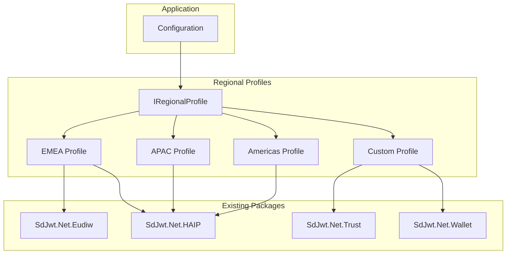

# Proposal: Regional Alignment

|              |                                                                                      |
| ------------ | ------------------------------------------------------------------------------------ |
| **Status**   | Proposed                                                                             |
| **Author**   | SD-JWT .NET Team                                                                     |
| **Created**  | 2026-03-04                                                                           |
| **Packages** | `SdJwt.Net.Eudiw` (extension), `SdJwt.Net.Trust` (new), `SdJwt.Net.HAIP` (extension) |

---

## Context / Problem Statement

Digital identity ecosystems are emerging globally, each with distinct regulatory requirements, trust frameworks, credential formats, and deployment timelines. Organizations operating across regions need a unified library that adapts to local requirements without maintaining separate codebases.

The SD-JWT .NET ecosystem currently has deep support for EU (via `SdJwt.Net.Eudiw`) but lacks:

- Pluggable regional profile abstraction
- APAC framework adapters (NZ DISTF, Australia, Thailand, Japan)
- Americas framework adapters (US, Canada, Brazil)
- Configuration-driven ecosystem alignment without code changes

---

## Goals

1. Define a regional profile abstraction (`IRegionalProfile`) that encapsulates per-region requirements
2. Implement profiles for EMEA, APAC, Americas, and custom ecosystems
3. Allow configuration-driven profile selection (no code changes to switch regions)
4. Map each region's requirements to existing ecosystem packages
5. Provide compliance validation per regional profile

## Non-Goals

- Implement region-specific wallet UX
- Manage regional certificate authorities
- Provide legal compliance advice (this is a technical framework, not legal counsel)

---

## Proposed Design

### Architecture



### Regional Profile Interface

```csharp
public interface IRegionalProfile
{
    string RegionId { get; }
    string DisplayName { get; }

    // Credential format requirements
    IReadOnlyList<string> SupportedFormats { get; }

    // Algorithm requirements
    IReadOnlyList<string> AllowedAlgorithms { get; }
    int MinimumHaipLevel { get; }

    // Trust framework
    ITrustResolver GetTrustResolver();

    // Compliance validation
    Task<ComplianceResult> ValidateComplianceAsync(ComplianceContext context);
}
```

### Regional Landscape

#### EMEA

| Framework             | Region         | Status              | Standards                          | SD-JWT .NET Support             |
| --------------------- | -------------- | ------------------- | ---------------------------------- | ------------------------------- |
| **eIDAS 2.0 / EUDIW** | EU 27 + EEA    | Mandatory by 2026   | ARF, OpenID4VC, HAIP               | `SdJwt.Net.Eudiw` (implemented) |
| **EBSI**              | EU 27          | Operational         | DID, VC, Blockchain anchoring      | Proposed (`SdJwt.Net.Trust`)    |
| **Swiss SWIYU**       | Switzerland    | In development      | SD-JWT VC, OpenID4VC, custom trust | Profile adapter needed          |
| **UK DIATF**          | United Kingdom | Framework published | Trust framework, rules-based       | Profile adapter needed          |

#### APAC

| Framework          | Region      | Status         | Standards                                    | SD-JWT .NET Support    |
| ------------------ | ----------- | -------------- | -------------------------------------------- | ---------------------- |
| **NZ DISTF**       | New Zealand | Published 2024 | Digital Identity Services Trust Framework    | Profile adapter needed |
| **myGovID / TDIF** | Australia   | Operational    | Trusted Digital Identity Framework           | Profile adapter needed |
| **Thailand PDPA**  | Thailand    | Enacted        | Personal Data Protection Act + digital ID    | Profile adapter needed |
| **Japan mynumber** | Japan       | Operational    | Individual Number Card, digital certificates | Profile adapter needed |

#### Americas

| Framework              | Region        | Status                 | Standards                                | SD-JWT .NET Support            |
| ---------------------- | ------------- | ---------------------- | ---------------------------------------- | ------------------------------ |
| **US mDL (AAMVA)**     | United States | Deployed in 10+ states | ISO 18013-5, AAMVA extensions            | `SdJwt.Net.Mdoc` (implemented) |
| **Pan-Canadian Trust** | Canada        | Published              | PCTF, Digital ID + Authentication        | Profile adapter needed         |
| **ICP-Brasil**         | Brazil        | Operational            | PKI infrastructure, digital certificates | Profile adapter needed         |

---

## API Surface

```csharp
// Configuration-driven profile selection
var profile = RegionalProfileFactory.Create("emea-eidas2");

// Or custom profile
var custom = new CustomRegionalProfile()
    .WithFormats("vc+sd-jwt", "mso_mdoc")
    .WithAlgorithms("ES256", "ES384")
    .WithMinimumHaipLevel(2)
    .WithTrustResolver(new EidasTrustListAdapter(lotlUrl))
    .Build();

// Compliance check
var result = await profile.ValidateComplianceAsync(new ComplianceContext
{
    Credential = credential,
    IssuerIdentifier = "https://issuer.example.de",
    CredentialType = "eu.europa.ec.eudi.pid.1"
});

// result.IsCompliant = true
// result.Profile = "emea-eidas2"
// result.Details = ["Algorithm: ES256 (compliant)", "Trust: LOTL resolved", ...]
```

---

## Security Considerations

| Concern                            | Mitigation                                           |
| ---------------------------------- | ---------------------------------------------------- |
| Incorrect profile selection        | Explicit configuration required; no auto-detection   |
| Cross-region credential acceptance | Profile validation rejects non-compliant credentials |
| Regulatory changes                 | Profiles versioned; updates via package updates      |

---

## Estimated Effort

| Component                            | Effort      |
| ------------------------------------ | ----------- |
| `IRegionalProfile` abstraction       | 2 days      |
| EMEA profile (extend existing EUDIW) | 3 days      |
| APAC profile (NZ DISTF + AU TDIF)    | 5 days      |
| Americas profile (US mDL + CA PCTF)  | 4 days      |
| Custom profile builder               | 2 days      |
| Compliance validator                 | 3 days      |
| Tests + documentation                | 3 days      |
| **Total**                            | **22 days** |

---

## Related Documentation

- [EUDIW Deep Dive](../concepts/eudiw-deep-dive.md) - EU-specific implementation
- [HAIP Deep Dive](../concepts/haip-deep-dive.md) - Security profiles
- [Trust Registries Proposal](trust-registries-qtsp.md) - Trust infrastructure
- [Capability Matrix](../capabilities.md) - Feature coverage
