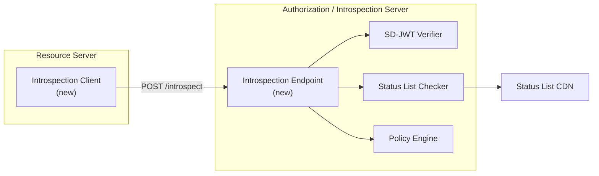
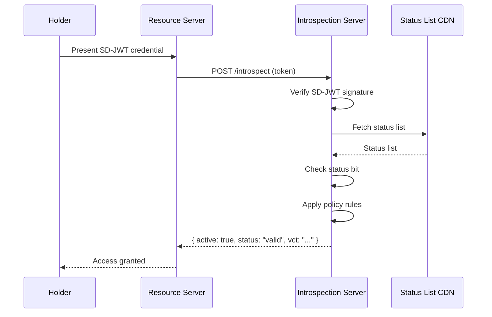

# Proposal: token introspection enhancement

|                    |                                                                                                                                                                                         |
| ------------------ | --------------------------------------------------------------------------------------------------------------------------------------------------------------------------------------- |
| **Status**         | Proposed                                                                                                                                                                                |
| **Author**         | SD-JWT .NET Team                                                                                                                                                                        |
| **Created**        | 2026-03-04                                                                                                                                                                              |
| **Package**        | `SdJwt.Net.Introspection` (new)                                                                                                                                                         |
| **Specifications** | [RFC 7662](https://datatracker.ietf.org/doc/html/rfc7662), [draft-ietf-oauth-jwt-introspection-response](https://datatracker.ietf.org/doc/draft-ietf-oauth-jwt-introspection-response/) |

---

## Context / problem statement

Token introspection (RFC 7662) allows resource servers to query an authorization server about the state of a token. In the context of SD-JWT credentials, introspection enables:

1. **Real-time status checks** without downloading and parsing full status lists
2. **Centralized policy enforcement** at the authorization server level
3. **Centralized audit trails** by centralizing all verification decisions
4. **Bridge to legacy systems** that expect OAuth2-style token validation

The current ecosystem validates tokens locally (offline verification) which is ideal for privacy and performance. However, enterprise deployments often require centralized verification for compliance, audit, and governance reasons.

---

## Goals

1. Implement an SD-JWT introspection endpoint (server side)
2. Implement an introspection client for resource servers
3. Support JWT introspection responses (structured, signed)
4. Integrate with existing `SdJwt.Net.StatusList` for status resolution
5. Support policy-based introspection decisions

## Non-goals

- Replace local verification (introspection is complementary)
- Full OAuth2 authorization server implementation
- Token exchange (RFC 8693)

---

## Proposed design

### Architecture



### Component design

#### Introspection endpoint (server side)

```csharp
public class SdJwtIntrospectionEndpoint
{
    public Task<IntrospectionResponse> IntrospectAsync(
        IntrospectionRequest request);
}

public class IntrospectionRequest
{
    public string Token { get; set; }
    public string TokenTypeHint { get; set; }  // "sd-jwt" or "sd-jwt+vc"
    public string Audience { get; set; }
}

public class IntrospectionResponse
{
    public bool Active { get; set; }
    public string Scope { get; set; }
    public string ClientId { get; set; }
    public string TokenType { get; set; }
    public long? Exp { get; set; }
    public long? Iat { get; set; }
    public string Iss { get; set; }
    public string Sub { get; set; }
    public string Aud { get; set; }

    // SD-JWT specific
    public string Vct { get; set; }
    public string Status { get; set; }       // "valid", "revoked", "suspended"
    public string[] DisclosedClaims { get; set; }

    // JWT response (signed)
    public string JwtResponse { get; set; }
}
```

#### Introspection client (resource server side)

```csharp
public class SdJwtIntrospectionClient
{
    public SdJwtIntrospectionClient(
        string introspectionEndpoint,
        HttpClient httpClient,
        IntrospectionClientOptions options);

    public Task<IntrospectionResponse> IntrospectAsync(string token);
}

public class IntrospectionClientOptions
{
    public string ClientId { get; set; }
    public string ClientSecret { get; set; }
    public bool RequireJwtResponse { get; set; } = true;
    public TimeSpan CacheDuration { get; set; } = TimeSpan.FromMinutes(1);
    public bool FailClosedOnError { get; set; } = true;
}
```

### Introspection flow



---

## Security considerations

| Concern                                         | Mitigation                                             |
| ----------------------------------------------- | ------------------------------------------------------ |
| Introspection endpoint DoS                      | Rate limiting, client authentication required          |
| Token exposure to introspection server          | Server already has trust relationship; TLS in transit  |
| Response tampering                              | JWT introspection response (signed by server)          |
| Privacy (server learns all verification events) | Trade-off: use only when centralized audit is required |
| Cache poisoning                                 | Short cache TTL, cryptographic response validation     |

---

## Estimated effort

| Component                       | Effort      |
| ------------------------------- | ----------- |
| `SdJwtIntrospectionEndpoint`    | 4 days      |
| `SdJwtIntrospectionClient`      | 3 days      |
| JWT response signing/validation | 2 days      |
| ASP.NET Core integration        | 3 days      |
| Status list integration         | 2 days      |
| Tests + documentation           | 3 days      |
| **Total**                       | **17 days** |

---

## Alternatives considered

| Alternative                         | Rejected Because                                      |
| ----------------------------------- | ----------------------------------------------------- |
| Status list only (no introspection) | Doesn't satisfy enterprise need for centralized audit |
| OCSP protocol                       | Different trust model; RFC 7662 is OAuth-native       |
| Custom validation API               | Non-standard; RFC 7662 has broad tooling support      |

---

## Related documentation

- [Status List Deep Dive](../concepts/status-list-deep-dive.md) - Current status management
- [Ecosystem Architecture](../concepts/ecosystem-architecture.md) - Package relationships
- [Enterprise Roadmap](../ENTERPRISE_ROADMAP.md) - Phase 5 context
