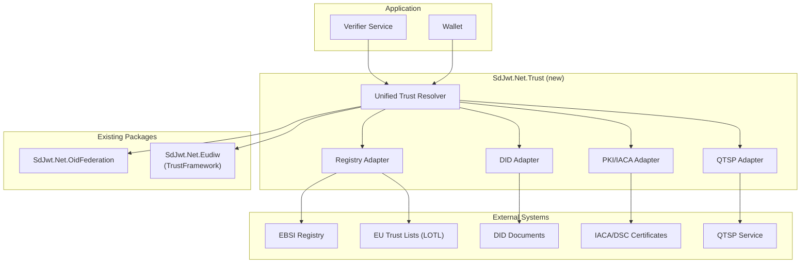
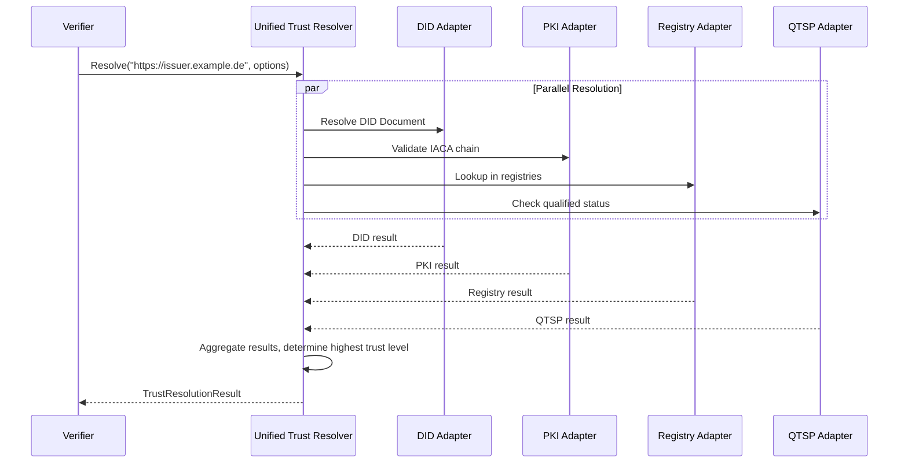

# Proposal: trust registries & QTSP integration

|                    |                                                                                                                                                                                                                                |
| ------------------ | ------------------------------------------------------------------------------------------------------------------------------------------------------------------------------------------------------------------------------ |
| **Status**         | Proposed                                                                                                                                                                                                                       |
| **Author**         | SD-JWT .NET Team                                                                                                                                                                                                               |
| **Created**        | 2026-03-04                                                                                                                                                                                                                     |
| **Packages**       | `SdJwt.Net.Trust` (new), `SdJwt.Net.Eudiw` (extension)                                                                                                                                                                         |
| **Specifications** | [eIDAS 2.0](https://eur-lex.europa.eu/eli/reg/2024/1183), [EBSI DID Registry](https://ec.europa.eu/digital-building-blocks/wikis/display/EBSI/), [ETSI TS 119 612](https://www.etsi.org/deliver/etsi_ts/119600_119699/119612/) |

---

## Context / problem statement

Trust in verifiable credentials depends on the ability to answer three questions:

1. **Is this issuer legitimate?** (Issuer trust validation)
2. **Is this issuer authorized to issue this type of credential?** (Scope validation)
3. **Are the issuer's signatures legally binding?** (Qualified signature support)

Currently, issuer trust validation is partially addressed:

- `SdJwt.Net.OidFederation` resolves trust chains via OpenID Federation
- `SdJwt.Net.Eudiw` resolves issuers against EU Trust Lists

But several gaps remain:

- **No unified trust resolver** that works across multiple trust frameworks
- **No DID-based issuer validation** (DID Documents / `did:web`)
- **No PKI chain validation** (IACA-DSC certificate chains for mdoc)
- **No trust registry abstraction** (pluggable for EBSI, eIDAS, custom)
- **No QTSP integration** for qualified electronic signatures/seals

---

## Goals

1. Define a unified `ITrustResolver` interface that abstracts over trust frameworks
2. Implement pluggable trust registry adapters (eIDAS2, EBSI, custom)
3. Support DID-based issuer validation (DID Documents with verification methods)
4. Support PKI chain validation (X.509 IACA-DSC for mdoc)
5. Support Qualified Trust Service Provider (QTSP) signature verification
6. Maintain backward compatibility with existing `SdJwt.Net.OidFederation` and `SdJwt.Net.Eudiw`

## Non-goals

- Operating a trust registry (this is an integration, not a registry service)
- DID method resolution beyond `did:web` (extensible via plugins)
- Certificate issuance or management

---

## Proposed design

### Architecture



### Component design

#### `ITrustResolver` (unified interface)

```csharp
public interface ITrustResolver
{
    Task<TrustResolutionResult> ResolveAsync(
        string issuerIdentifier,
        TrustResolutionOptions options);
}

public class TrustResolutionResult
{
    public bool IsTrusted { get; }
    public TrustLevel TrustLevel { get; }
    public string TrustFramework { get; }     // "eidas2", "ebsi", "did", "pki", "custom"
    public string IssuerName { get; }
    public IReadOnlyList<string> AuthorizedCredentialTypes { get; }
    public X509Certificate2 IssuerCertificate { get; }
    public DateTimeOffset ResolvedAt { get; }
}

public enum TrustLevel
{
    Unknown,
    SelfAsserted,     // DID Document, no external validation
    Registered,       // Listed in a trust registry
    Qualified         // QTSP with qualified certificate
}
```

#### Trust registry adapters

```csharp
// EBSI DID Registry adapter
public class EbsiRegistryAdapter : ITrustRegistryAdapter
{
    public Task<RegistryEntry> LookupAsync(string issuerDid);
}

// eIDAS2 Trust List adapter (extends existing EUDIW)
public class EidasTrustListAdapter : ITrustRegistryAdapter
{
    public Task<RegistryEntry> LookupAsync(string issuerIdentifier);
}

// Custom registry adapter (for non-EU ecosystems)
public class CustomRegistryAdapter : ITrustRegistryAdapter
{
    public CustomRegistryAdapter(string registryUrl, IRegistryProtocol protocol);
    public Task<RegistryEntry> LookupAsync(string issuerIdentifier);
}
```

#### QTSP integration

```csharp
public class QtspSignatureValidator
{
    // Validate that a credential is signed with a qualified certificate
    public Task<QtspValidationResult> ValidateQualifiedSignatureAsync(
        string credential,
        QtspValidationOptions options);
}

public class QtspValidationResult
{
    public bool IsQualified { get; }
    public string Provider { get; }
    public string CertificateSubject { get; }
    public TrustServiceType ServiceType { get; }  // QualifiedSeal, QualifiedSignature
    public DateTimeOffset CertificateExpiry { get; }
}
```

### Trust resolution flow



---

## Security considerations

| Concern                             | Mitigation                                           |
| ----------------------------------- | ---------------------------------------------------- |
| Trust list poisoning                | LOTL signature verification; HTTPS-only fetching     |
| DID Document tampering              | Cryptographic verification of DID Document integrity |
| Stale trust data                    | Configurable cache TTL with forced refresh option    |
| QTSP certificate expiry             | Certificate validity checked at verification time    |
| Man-in-the-middle on registry fetch | TLS pinning for well-known registries                |

---

## Estimated effort

| Component                                 | Effort      |
| ----------------------------------------- | ----------- |
| `ITrustResolver` interface + orchestrator | 3 days      |
| DID adapter (`did:web`)                   | 3 days      |
| PKI/IACA adapter                          | 4 days      |
| EBSI registry adapter                     | 3 days      |
| eIDAS Trust List adapter (extend EUDIW)   | 2 days      |
| Custom registry adapter                   | 2 days      |
| QTSP signature validator                  | 4 days      |
| Tests + documentation                     | 4 days      |
| **Total**                                 | **25 days** |

---

## Alternatives considered

| Alternative                      | Rejected Because                                          |
| -------------------------------- | --------------------------------------------------------- |
| Extend `SdJwt.Net.Eudiw` only    | Too EU-specific; need cross-ecosystem support             |
| Use Universal Registrar/Resolver | Adds external dependency; prefer self-contained library   |
| Support all DID methods          | Scope creep; start with `did:web`, extensible via plugins |

---

## Related documentation

- [EUDIW Deep Dive](../concepts/eudiw-deep-dive.md) - Existing EU trust infrastructure
- [HAIP Deep Dive](../concepts/haip-deep-dive.md) - Security compliance profiles
- [Ecosystem Architecture](../concepts/ecosystem-architecture.md) - Package relationships
