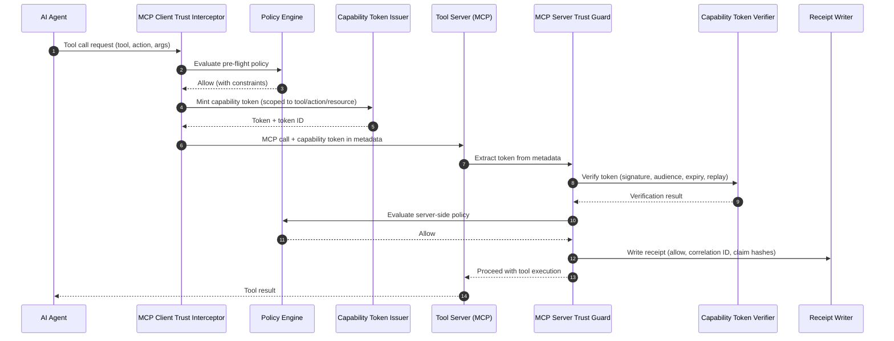
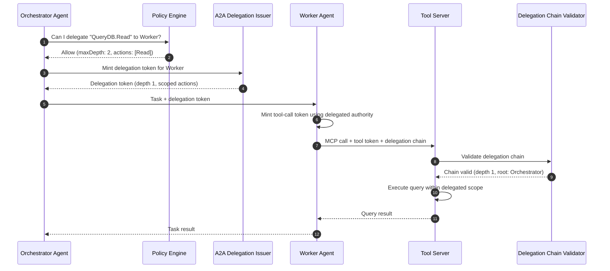
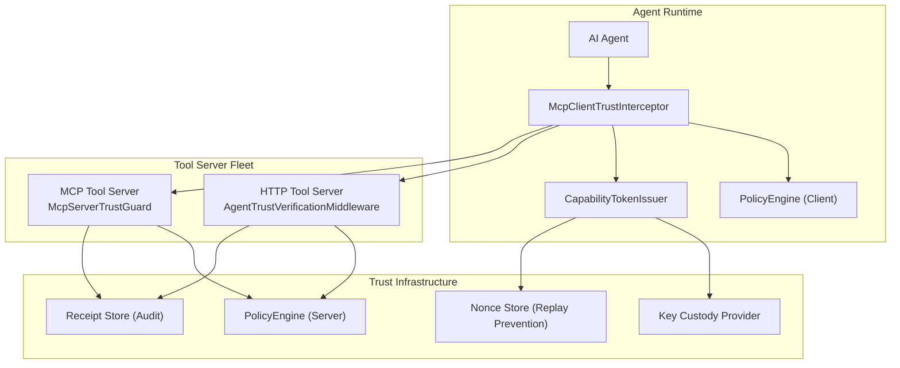

# AI Agent Authorization: Scoped Capability Tokens for Enterprise Tool-Call Governance

> **Pattern type:** Preview extension
> **Maturity:** Preview -- Agent Trust packages are under active development. APIs may change between releases.
> **Boundary:** Not a turnkey agent platform. You supply the agent framework, orchestration runtime, policy rules, and LLM integration.

> **Quick Facts**
>
> |              |                                                                                                                                                       |
> | ------------ | ----------------------------------------------------------------------------------------------------------------------------------------------------- |
> | Industry     | Enterprise AI / Platform Engineering / Security Operations                                                                                            |
> | Complexity   | Medium                                                                                                                                                |
> | Key Packages | `SdJwt.Net.AgentTrust.Core`, `SdJwt.Net.AgentTrust.Policy`, `SdJwt.Net.AgentTrust.AspNetCore`, `SdJwt.Net.AgentTrust.Mcp`, `SdJwt.Net.AgentTrust.A2A` |
> | Sample       | [04-UseCases](https://github.com/openwallet-foundation-labs/sd-jwt-dotnet/tree/main/samples/SdJwt.Net.Samples/04-UseCases)                            |

## Executive summary

Enterprise AI agents are moving from demos to production. Agents that book travel, process invoices, query databases, and coordinate with other agents are being deployed across finance, HR, IT, and operations. But the authorization model has not kept up.

The problem is straightforward: when an AI agent calls a tool, what proves it is allowed to? Today, most agent frameworks use ambient API keys, shared service accounts, or no authorization at all for tool calls. This creates unacceptable risk in enterprise environments where audit, least privilege, and blast-radius containment are required.

The preview Agent Trust Kit in the SD-JWT .NET ecosystem provides a capability-oriented pattern for controlled pilots and architecture evaluation:

- **Capability tokens** (SD-JWT format) scope each tool call to a specific tool, action, resource, and time window.
- **Policy engine** evaluates whether a token should be minted based on rules (agent identity, tool, action, context).
- **MCP integration** can intercept tool calls in Model Context Protocol pipelines, minting and verifying scoped tokens as an adapter-specific control.
- **Agent-to-agent delegation** enables multi-agent workflows with depth-limited, action-scoped capability transfer.
- **Audit receipts**: The kit can emit structured decision receipts when configured and persisted durably, with correlation IDs for incident review.

---

## In plain English

AI agents in enterprises are moving from demos to production. When an agent books travel or queries a database, it needs to prove exactly what it is allowed to do. Today, most agents use broad API keys or OAuth tokens that grant too much access. Agent Trust provides a preview reference pattern for giving each agent a scoped capability token - an SD-JWT that lists exactly which tools the agent can call, with what parameters, and for how long. The tool verifies the token before executing. If the agent's permissions are too broad, the token is rejected.

## What SD-JWT .NET provides

**Provides:** Capability token minting and verification (`AgentTrust.Core`), rule-based policy evaluation (`AgentTrust.Policy`), ASP.NET Core middleware for inbound verification (`AgentTrust.AspNetCore`), MCP tool call interception (`AgentTrust.Mcp`), and agent-to-agent delegation (`AgentTrust.A2A`).

**Does not provide:** An orchestration runtime, an agent framework, LLM integration, or production-ready policy definitions. Your application defines the policies; the library enforces them.

## Risks and limitations

- Agent Trust packages are preview extensions under active development
- APIs may change between releases
- Policy definitions are application-specific; the library provides the engine, not the rules
- Delegation chain depth should be bounded to prevent authorization chain attacks

---

## 1) Why this matters now: AI agents are outpacing authorization infrastructure

### The authorization gap

AI agent adoption is accelerating. Gartner projects that by 2028, **33% of enterprise software applications** will include agentic AI. McKinsey estimates AI agents could automate **60-70% of worker tasks** in certain domains (McKinsey, The economic potential of generative AI, 2023).

But the authorization model for most agent deployments is fundamentally weak:

| Current pattern                | Risk                                                                |
| ------------------------------ | ------------------------------------------------------------------- |
| Shared API keys per tool       | Any agent with the key has full access; no per-call scoping         |
| Service account per agent      | Broad permissions; no tool/action/resource granularity              |
| No authorization on tool calls | Agent can call any tool with any parameters; no governance          |
| OAuth scopes per agent         | Too coarse; "read:database" does not distinguish which query or row |
| Trust the orchestrator         | Single compromise point; orchestrator controls all tool access      |

These patterns fail three enterprise requirements:

1. **Least privilege**: Each tool call should be authorized for exactly the scope needed.
2. **Auditability**: Security teams must trace which agent called which tool, with what parameters, and why.
3. **Blast-radius containment**: A compromised agent should not escalate to tools beyond its immediate scope.

### Real-world failure modes

- **Prompt injection escalation**: An attacker injects instructions that cause an agent to call tools it should not access. Without per-call authorization, there is no enforcement boundary.
- **Agent confusion**: A poorly configured agent calls a write tool when it should only read. Without capability scoping, the tool server cannot distinguish intent.
- **Delegation abuse**: Agent A delegates to Agent B, which delegates to Agent C. Without depth limits and action scoping, the delegation chain becomes an uncontrolled privilege escalation path.
- **Stale permissions**: An agent's role changes but its tool access persists. Without short-lived tokens and status checks, permissions drift.

---

## 2) The solution pattern: SD-JWT capability tokens for tool-call authorization

### Core concept

Instead of ambient credentials, mint a short-lived, scoped capability token for each tool call. The token is an SD-JWT containing:

- **Who**: The agent identity (issuer, agent ID)
- **What**: The capability (tool name, action, resource)
- **When**: Validity window (issued at, expires at)
- **Where**: Audience (the specific tool server)
- **Context**: Correlation ID, workflow ID, tenant ID (for audit and multi-tenancy)
- **Limits**: Operational constraints (max results, max calls, rate limits)
- **Binding**: Proof-of-possession (DPoP or mTLS) so tokens cannot be replayed by other agents

### Why SD-JWT format?

SD-JWT provides selective disclosure for capability tokens. This matters because:

- Tool servers see only the claims they need to make an authorization decision.
- Context metadata (workflow, tenant) can be disclosed selectively based on trust level.
- Audit receipts record disclosed-claim hashes without storing raw sensitive context.

---

## 3) Reference architecture

### Diagram A: Single-agent tool-call authorization

### Diagram B: Multi-agent delegation chain

### Diagram C: Enterprise deployment topology

---

## 4) Policy rules: what agents can do

The policy engine uses pattern-matching rules to authorize token minting and verification.

### Example policy configuration

| Rule | Agent pattern        | Tool pattern    | Action pattern | Effect | Constraints                                 |
| ---- | -------------------- | --------------- | -------------- | ------ | ------------------------------------------- |
| 1    | `procurement-*`      | `MemberLookup`  | `GetFees`      | Allow  | maxTokenLifetime: 5min, maxResults: 100     |
| 2    | `procurement-*`      | `MemberLookup`  | `UpdateFees`   | Deny   | -                                           |
| 3    | `finance-reconciler` | `LedgerService` | `Read`         | Allow  | maxTokenLifetime: 10min                     |
| 4    | `finance-reconciler` | `LedgerService` | `Write`        | Allow  | requiredDisclosures: [tenantId, workflowId] |
| 5    | `*`                  | `AuditLog`      | `Read`         | Allow  | maxResults: 50                              |
| 6    | `*`                  | `*`             | `*`            | Deny   | - (default deny)                            |

**Key principle**: Default deny. Every tool call must match an explicit Allow rule. Rules are evaluated by descending priority; first match wins. Wildcard patterns (`*`) enable broad rules with explicit exceptions.

### Delegation constraints

| Delegation rule | Delegator pattern | Delegatee pattern | Allowed actions | Max depth | Effect |
| --------------- | ----------------- | ----------------- | --------------- | --------- | ------ |
| 1               | `orchestrator-*`  | `worker-*`        | `Read`          | 2         | Allow  |
| 2               | `orchestrator-*`  | `worker-*`        | `Write`         | 1         | Allow  |
| 3               | `*`               | `*`               | `*`             | 0         | Deny   |

---

## 5) How the SD-JWT .NET packages fit

| Requirement                       | Package(s)                                                                   | How it helps                                                                          |
| --------------------------------- | ---------------------------------------------------------------------------- | ------------------------------------------------------------------------------------- |
| Mint scoped capability tokens     | [AgentTrust.Core](../../src/SdJwt.Net.AgentTrust.Core/README.md)             | `CapabilityTokenIssuer.Mint()` creates SD-JWT tokens with tool/action scope           |
| Verify tokens on tool servers     | [AgentTrust.Core](../../src/SdJwt.Net.AgentTrust.Core/README.md)             | `CapabilityTokenVerifier.VerifyAsync()` validates signature, audience, expiry, replay |
| Rule-based authorization          | [AgentTrust.Policy](../../src/SdJwt.Net.AgentTrust.Policy/README.md)         | `PolicyEngine.EvaluateAsync()` evaluates wildcard rules with constraints              |
| HTTP tool server middleware       | [AgentTrust.AspNetCore](../../src/SdJwt.Net.AgentTrust.AspNetCore/README.md) | `AgentTrustVerificationMiddleware` + `RequireCapabilityAttribute` for ASP.NET Core    |
| MCP tool-call interception        | [AgentTrust.Mcp](../../src/SdJwt.Net.AgentTrust.Mcp/README.md)               | `McpClientTrustInterceptor` (client) + `McpServerTrustGuard` (server)                 |
| Agent-to-agent delegation         | [AgentTrust.A2A](../../src/SdJwt.Net.AgentTrust.A2A/README.md)               | `A2ADelegationIssuer` + `DelegationChainValidator` for depth-limited delegation       |
| MAF/function pipeline integration | [AgentTrust.Maf](../../src/SdJwt.Net.AgentTrust.Maf/README.md)               | `AgentTrustMiddleware` for Microsoft Agent Framework and function call pipelines      |

---

## 6) Business value

### Security outcomes

| Risk                        | Without capability tokens                              | With capability tokens                                               |
| --------------------------- | ------------------------------------------------------ | -------------------------------------------------------------------- |
| Prompt injection escalation | Agent calls any tool; no enforcement boundary          | Token scoped to declared tool/action; tool server rejects mismatches |
| Credential theft and replay | Shared API key usable by any attacker                  | Short-lived token + nonce + proof-of-possession binding              |
| Delegation abuse            | No visibility into multi-agent permission chains       | Depth limits, action scoping, chain validation                       |
| Audit gap                   | No per-call authorization record                       | Receipt per decision with correlation ID and claim hashes            |
| Permission drift            | Stale service account permissions persist indefinitely | Short-lived tokens; policy changes take effect immediately           |

### Operational outcomes

| Metric                      | Current state                            | With Agent Trust Kit                             |
| --------------------------- | ---------------------------------------- | ------------------------------------------------ |
| Authorization granularity   | Per-agent or per-API-key                 | Per tool call (tool + action + resource)         |
| Time to revoke access       | Service account rotation (hours to days) | Policy update effective on next token mint       |
| Incident investigation time | Reconstruct from scattered logs          | Query receipts by correlation ID or agent ID     |
| Multi-agent governance      | None or manual review                    | Automated delegation chain validation            |
| Compliance evidence         | Manual access review spreadsheets        | Cryptographic receipts with decision audit trail |

---

## 7) Implementation checklist

- Define a capability policy with explicit Allow rules per agent/tool/action combination and a default Deny rule.
- Configure `McpClientTrustInterceptor` in agent runtimes to mint tokens before each tool call.
- Deploy `McpServerTrustGuard` or `AgentTrustVerificationMiddleware` on tool servers to verify inbound tokens.
- Set token lifetime constraints (recommendation: 1-10 minutes depending on tool latency).
- Enable proof-of-possession binding (DPoP or mTLS) for high-value tools.
- Configure `INonceStore` for replay prevention (use distributed cache for multi-instance deployments).
- Set up `IReceiptWriter` to persist audit receipts to a durable store.
- For multi-agent workflows, configure `A2ADelegationIssuer` with explicit depth limits and action scoping.
- Define incident playbooks for compromised agent keys (revoke key, update policy, trace receipts).
- Monitor token mint/verify metrics using `AgentTrust.OpenTelemetry` for operational visibility.

---

## 8) Deployment scenarios

### Scenario A: Internal enterprise agent platform

An enterprise deploys AI agents for finance, HR, and IT operations. Each agent has a defined tool set. The Agent Trust Kit can provide a scoped capability and audit layer between agent runtimes and internal tool servers.

- Policy is managed centrally by the platform security team.
- Tokens use workload identity (Entra, SPIFFE, Kubernetes) for agent authentication.
- Receipts feed into the enterprise SIEM for correlation with other security events.

### Scenario B: Multi-tenant SaaS with agent capabilities

A SaaS platform exposes AI agents to customers. Each tenant's agents must be isolated. The capability context includes `tenantId` for multi-tenant enforcement.

- Policy rules include tenant scoping.
- Delegation depth is limited to prevent cross-tenant escalation.
- Status lists track agent deactivation when tenants offboard.

### Scenario C: Agent marketplace / MCP ecosystem

A marketplace connects agent runtimes with third-party MCP tool servers. Neither party fully trusts the other. The Agent Trust Kit can add capability scoping and audit context alongside the marketplace's chosen MCP authorization model.

- Agents mint tokens identifying themselves to tool servers.
- Tool servers verify tokens and enforce their own policy rules.
- `AgentCard` discovery enables dynamic trust establishment between agents.

---

## Related use cases

| Use Case                                        | Relationship                                                     |
| ----------------------------------------------- | ---------------------------------------------------------------- |
| [Financial AI](financial-ai.md)                 | Application - verified context gate uses Agent Trust underneath  |
| [Automated Compliance](automated-compliance.md) | Foundation - policy-first governance pattern for tool-call rules |
| [Incident Response](incident-response.md)       | Complementary - agent key compromise containment                 |

---

## Public references

- Gartner: By 2028, 33% of enterprise software applications will include agentic AI (October 2024 press release)
- McKinsey: The economic potential of generative AI (2023): <https://www.mckinsey.com/capabilities/mckinsey-digital/our-insights/the-economic-potential-of-generative-ai-the-next-productivity-frontier>
- Model Context Protocol specification: <https://modelcontextprotocol.io/>
- OWASP Top 10 for LLM Applications (prompt injection, excessive agency): <https://owasp.org/www-project-top-10-for-large-language-model-applications/>
- RFC 9901 (SD-JWT): <https://www.rfc-editor.org/rfc/rfc9901.html>

---

_Disclaimer: This article is informational and not security advice. For production AI agent deployments, validate your threat model and authorization architecture with your security team._
