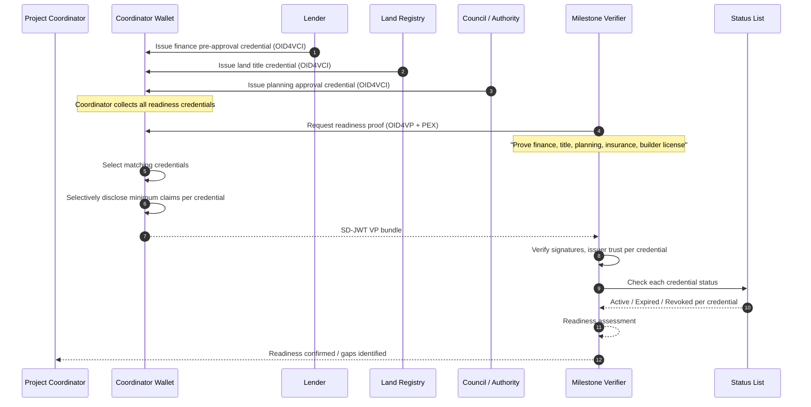

# Construction / Property Build Readiness Passport

> **Pattern type:** Reference architecture
> **Maturity:** Stable primitives
> **Boundary:** Not a turnkey product or compliance certification

> **Quick Facts**
>
> |              |                                                                                                                   |
> | ------------ | ----------------------------------------------------------------------------------------------------------------- |
> | Industry     | Construction / Property Development / Government                                                                  |
> | Complexity   | High                                                                                                              |
> | Key Packages | `SdJwt.Net.Vc`, `SdJwt.Net.Oid4Vci`, `SdJwt.Net.Oid4Vp`, `SdJwt.Net.PresentationExchange`, `SdJwt.Net.StatusList` |

## 30-second pitch

Stop chasing PDFs across finance, land, builder, and council systems. Verify readiness claims instead. A construction project requires clearances from multiple independent authorities before work can start. This pattern shows how each authority can issue verifiable credentials that the project coordinator collects and presents as a verified readiness portfolio.

## Problem

Construction project readiness depends on approvals from many independent parties. Today, proving readiness means collecting paper or PDF evidence from each:

- **Finance**: Pre-approval letters, draw-down confirmations, guarantees
- **Land**: Title searches, zoning confirmations, easement clearances
- **Planning**: Development applications, conditions of consent, variation approvals
- **Insurance**: Builder's warranty, public liability, workers compensation
- **Builder registration**: License status, scope of work, expiry
- **Council / authority**: Site access permits, environmental clearances, utility connections

Each party has its own verification process, document format, and validity window. The project coordinator manually collects, tracks, and re-verifies these documents at each milestone.

### Common failure modes

| Current approach               | Risk                                                  |
| ------------------------------ | ----------------------------------------------------- |
| PDF collection from each party | No issuer verification; forgery risk; manual tracking |
| Email confirmation chains      | No audit trail; version confusion; easy to fabricate  |
| Point-in-time checks           | Status changes between check and construction start   |
| Spreadsheet tracking           | No real-time status; human error in expiry tracking   |
| Separate portal per authority  | Fragmented; no single view of readiness               |

## Reference pattern

Each authority issues a verifiable credential for its domain. The project coordinator (developer, builder, or project manager) collects these into a wallet. At each milestone gate, the coordinator presents the required credentials to the relevant verifier (council, lender, insurer) who checks issuer trust, credential status, and minimum claims.

### Readiness credential types

| Credential type            | Issuer              | Key claims (selectively disclosable)                   |
| -------------------------- | ------------------- | ------------------------------------------------------ |
| Finance pre-approval       | Lender              | Approval amount, conditions, expiry, borrower match    |
| Land title                 | Land registry       | Title reference, ownership, encumbrances, zoning       |
| Planning approval          | Planning authority  | DA number, conditions, approved scope, expiry          |
| Builder insurance          | Insurer             | Policy type, coverage, validity, builder match         |
| Builder registration       | Licensing authority | License number, scope, status, expiry                  |
| Site access permit         | Local council       | Permit number, conditions, valid dates, site reference |
| Inspection / defect report | Certified inspector | Inspection type, result, date, inspector ID            |

### Flow

### Milestone gates

The readiness passport is not a one-time check. Different milestones require different credential combinations:

| Milestone        | Required credentials                                               |
| ---------------- | ------------------------------------------------------------------ |
| Pre-construction | Finance, title, planning approval, builder registration, insurance |
| Site access      | Site access permit, insurance, builder registration                |
| Foundation       | Inspection (site prep), finance draw-down, insurance current       |
| Frame            | Inspection (foundation), finance draw-down                         |
| Lock-up          | Inspection (frame), insurance current                              |
| Completion       | Final inspection, all credentials current, defect report           |

## How SD-JWT .NET fits

| Package                          | Role                                                                             |
| -------------------------------- | -------------------------------------------------------------------------------- |
| `SdJwt.Net.Vc`                   | Verifiable credential format for readiness credentials                           |
| `SdJwt.Net.Oid4Vci`              | Issuance protocol for authorities to issue credentials                           |
| `SdJwt.Net.Oid4Vp`               | Presentation protocol for readiness verification at each milestone               |
| `SdJwt.Net.PresentationExchange` | Structured requirements for which credentials each milestone needs               |
| `SdJwt.Net.StatusList`           | Real-time status checking (insurance lapsed, permit expired, approval withdrawn) |

## What remains your responsibility

- Project management platform and milestone workflow
- Authority onboarding and issuer trust framework
- Wallet application for project coordinators
- Credential schema design for each readiness document type
- Legal and regulatory compliance (building codes, planning law, financial regulation)
- Integration with existing council, lender, and registry systems
- User experience for credential collection and milestone presentation
- Dispute resolution for rejected or contested credentials
- Operational monitoring and alerting for credential expiry

## Target outcomes to validate

- Reduced time from approval to construction start (verified credentials vs. manual document collection)
- Real-time visibility of readiness status across all stakeholders
- Lower risk of construction starting with expired or invalid approvals
- Audit-ready evidence trail for regulatory compliance and dispute resolution
- Reduced administrative cost for re-verification at each milestone

## Try it

- [OpenID4VCI issuance guide](../tutorials/)
- [Presentation Exchange guide](../guides/)
- [SD-JWT VC package](https://www.nuget.org/packages/SdJwt.Net.Vc)
