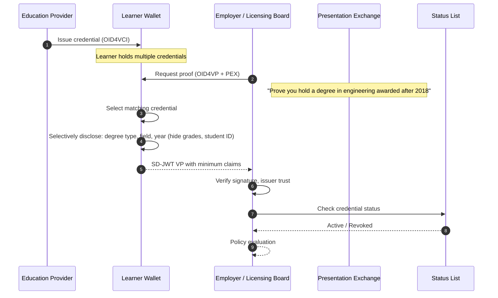

# Education and Skills Passport

> **Pattern type:** Reference architecture
> **Maturity:** Stable primitives
> **Boundary:** Not a turnkey product or compliance certification

> **Quick Facts**
>
> |              |                                                                                                                   |
> | ------------ | ----------------------------------------------------------------------------------------------------------------- |
> | Industry     | Education / Workforce / Professional Development                                                                  |
> | Complexity   | Medium                                                                                                            |
> | Key Packages | `SdJwt.Net.Vc`, `SdJwt.Net.Oid4Vci`, `SdJwt.Net.Oid4Vp`, `SdJwt.Net.PresentationExchange`, `SdJwt.Net.StatusList` |

## 30-second pitch

Prove the qualification, not the whole transcript. Learners hold verifiable credentials for degrees, micro-credentials, training certificates, and professional accreditations. Verifiers ask for the minimum claims they need. The holder decides what to share.

## Problem

Education and skills verification is slow, expensive, and over-shares personal information:

- **Transcript requests**: Verifying a degree often means requesting a full academic transcript, exposing grades, courses, and personal details irrelevant to the verification.
- **Manual checks**: Employers, licensing boards, and institutions call or email to confirm credentials. Round-trip time: days to weeks.
- **Credential fragmentation**: A professional's qualifications span universities, training providers, industry bodies, and employers. No single system holds everything.
- **Micro-credential explosion**: Short courses, bootcamps, and professional development produce credentials that have no standardized verification path.
- **Fraud**: Diploma mills and resume fabrication are persistent problems. Manual verification cannot scale to catch every case.

### Common failure modes

| Current approach              | Risk                                                      |
| ----------------------------- | --------------------------------------------------------- |
| Transcript request by mail    | Slow; over-shares; no real-time status                    |
| Employer phone verification   | Manual; inconsistent; no audit trail                      |
| LinkedIn / self-reported      | No issuer verification; fraud exposure                    |
| PDF certificates              | Easily forged; no revocation or status checking           |
| Proprietary verification APIs | Lock-in; fragmented across providers; no interoperability |

## Reference pattern

Education providers issue verifiable credentials using OpenID4VCI. Learners store credentials in a wallet. When a verifier (employer, licensing board, institution) needs proof, they request specific claims via a presentation exchange. The learner selectively discloses only what is needed.

### Credential types

| Credential type            | Issuer                   | Key claims (selectively disclosable)                   |
| -------------------------- | ------------------------ | ------------------------------------------------------ |
| Degree                     | University               | Degree type, field, year awarded, institution, honours |
| Micro-credential           | Training provider        | Skill name, level, completion date, provider           |
| Training certificate       | Employer / training body | Course name, competency, validity period               |
| Professional accreditation | Professional body        | Accreditation type, status, expiry, CPD hours          |
| Employment history         | Employer                 | Role title, period, department                         |

### Flow

## How SD-JWT .NET fits

| Package                          | Role                                                      |
| -------------------------------- | --------------------------------------------------------- |
| `SdJwt.Net.Vc`                   | Verifiable credential format for education credentials    |
| `SdJwt.Net.Oid4Vci`              | Issuance protocol for education providers                 |
| `SdJwt.Net.Oid4Vp`               | Presentation protocol for credential verification         |
| `SdJwt.Net.PresentationExchange` | Structured queries for specific qualifications and claims |
| `SdJwt.Net.StatusList`           | Revocation for expired or withdrawn credentials           |

## What remains your responsibility

- Wallet application for learners
- Education provider issuance infrastructure
- Verifier application and policy rules
- Credential schema design (what claims each credential type carries)
- Issuer trust framework (which institutions are accepted)
- Legal and regulatory compliance (data protection, recognition of qualifications)
- User experience for credential selection and consent
- Integration with existing student information systems and HR platforms

## Target outcomes to validate

- Reduced verification time (cryptographic proof vs. manual confirmation)
- Minimized personal data exposure per verification request
- Real-time credential status for revoked or expired qualifications
- Portable credentials across employers and jurisdictions
- Lower operational cost for education providers responding to verification requests

## Try it

- [OpenID4VCI issuance guide](../tutorials/)
- [Presentation Exchange guide](../guides/)
- [SD-JWT VC package](https://www.nuget.org/packages/SdJwt.Net.Vc)
