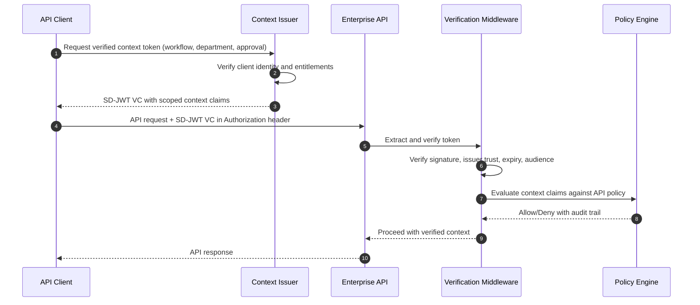

# Enterprise API Access with Verifiable Client Context

> **Pattern type:** Reference architecture
> **Maturity:** Stable primitives
> **Boundary:** Not a turnkey product or compliance certification

> **Quick Facts**
>
> |              |                                                                                                            |
> | ------------ | ---------------------------------------------------------------------------------------------------------- |
> | Industry     | Enterprise / Platform Engineering / Integration                                                            |
> | Complexity   | Medium                                                                                                     |
> | Key Packages | `SdJwt.Net`, `SdJwt.Net.Vc`, `SdJwt.Net.Oid4Vp`, `SdJwt.Net.StatusList`, `SdJwt.Net.AgentTrust.AspNetCore` |

## 30-second pitch

OAuth says who the client is. SD-JWT can prove which verified context the API should trust for this request. This pattern shows how to pass verified client and workflow context into enterprise APIs without overloading OAuth scopes.

## Problem

Enterprise APIs increasingly need authorization decisions that go beyond identity:

- **Which department** is making this request?
- **Which workflow** authorized this data access?
- **Which approval** was granted for this transaction?
- **Which compliance status** does this client hold?

OAuth scopes are too coarse for these decisions. A scope like `read:customer-data` does not distinguish between a compliance audit query and a marketing analytics query. Teams work around this with custom headers, metadata fields, and ad-hoc context passing, none of which are verifiable or auditable.

### Common failure modes

| Current approach          | Risk                                                                  |
| ------------------------- | --------------------------------------------------------------------- |
| Broad OAuth scopes        | No per-request context; any client with the scope has full access     |
| Custom headers            | Unverifiable; easily spoofed by any client with network access        |
| API keys per use case     | Key sprawl; difficult to rotate; no contextual scoping                |
| Trust the caller metadata | No cryptographic proof; metadata can be modified in transit           |
| Post-hoc log analysis     | Detects misuse after the fact; no enforcement at the request boundary |

## Reference pattern

Attach a short-lived SD-JWT VC or capability token to API requests that carries verified context claims. The API middleware verifies the token before processing the request.

### Flow

### Context token structure

The SD-JWT VC carries selectively disclosable context claims:

- **Department/business unit** of the requesting client
- **Workflow ID** that authorized this specific request
- **Approval reference** for transactions requiring sign-off
- **Compliance status** of the client organization
- **Data classification** level the client is cleared for
- **Validity window** (short-lived, per-request or per-session)

## How SD-JWT .NET fits

| Package                           | Role                                                   |
| --------------------------------- | ------------------------------------------------------ |
| `SdJwt.Net`                       | Core SD-JWT creation and verification                  |
| `SdJwt.Net.Vc`                    | Verifiable credential format for context tokens        |
| `SdJwt.Net.Oid4Vp`                | Presentation protocol for context token exchange       |
| `SdJwt.Net.StatusList`            | Revocation and lifecycle for context tokens            |
| `SdJwt.Net.AgentTrust.AspNetCore` | ASP.NET Core middleware for inbound token verification |

## What remains your responsibility

- API gateway integration and routing
- Context issuer service and entitlement management
- Policy rules for which context claims authorize which API operations
- Key management and rotation
- Audit log storage and retention
- Integration with existing identity providers (Entra ID, Okta, etc.)
- Operational monitoring and alerting

## Target outcomes to validate

- Reduced scope of API access per request (verifiable context vs. broad scopes)
- Audit trail that maps each API call to verified business context
- Faster policy change deployment (update context requirements, not API code)
- Reduced API key sprawl across integration points

## Good for

- Azure API Management
- Internal enterprise APIs
- B2B integrations with partner organizations
- Workflow-driven authorization (approval chains, compliance gates)
- Audit-heavy integration systems (finance, healthcare, government)

## Try it

- [SD-JWT .NET core package](https://www.nuget.org/packages/SdJwt.Net)
- [SD-JWT VC package](https://www.nuget.org/packages/SdJwt.Net.Vc)
- [Getting started guide](../getting-started/)
