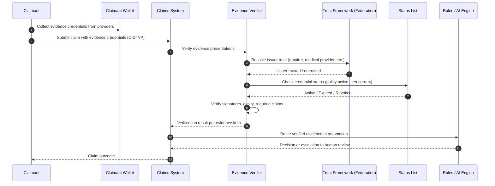

# Insurance Claims Evidence Verification

> **Pattern type:** Reference architecture
> **Maturity:** Stable primitives
> **Boundary:** Not a turnkey product or compliance certification

> **Quick Facts**
>
> |              |                                                                                                                         |
> | ------------ | ----------------------------------------------------------------------------------------------------------------------- |
> | Industry     | Insurance / Claims Management                                                                                           |
> | Complexity   | Medium-High                                                                                                             |
> | Key Packages | `SdJwt.Net.Vc`, `SdJwt.Net.StatusList`, `SdJwt.Net.PresentationExchange`, `SdJwt.Net.Oid4Vp`, `SdJwt.Net.OidFederation` |

## 30-second pitch

Claims automation fails when evidence is untrusted. Verify the evidence before AI or rules engines act. This pattern shows how claimants can present verifiable evidence credentials so that claims systems can trust the inputs before processing.

## Problem

Insurance claims processing relies on evidence from multiple parties, and the evidence itself is difficult to verify:

- **Document authenticity**: Repair quotes, medical certificates, police reports, and property valuations arrive as PDFs, scans, or emails. Are they genuine?
- **Stale evidence**: A policy may have lapsed between the event and the claim. Employment status may have changed. Evidence validity is point-in-time.
- **Fraud vectors**: Inflated repair quotes, fabricated medical certificates, staged events, and duplicate claims across insurers.
- **Automation blockers**: AI and rules engines can process claims faster, but only if the inputs are trustworthy. Unverified evidence requires human review, negating automation gains.
- **Multi-party coordination**: A single claim may involve the insured, a repairer, a medical provider, an employer, and a government agency. Each provides separate evidence with no common verification standard.

### Common failure modes

| Current approach            | Risk                                                                |
| --------------------------- | ------------------------------------------------------------------- |
| PDF / scan upload           | Forgery risk; no issuer verification; manual review bottleneck      |
| Phone verification          | Expensive; slow; inconsistent; no audit trail                       |
| Third-party fraud detection | Post-hoc detection; does not prevent submission of invalid evidence |
| Self-declaration forms      | No proof; relies on claimant honesty                                |
| Siloed insurer databases    | No cross-insurer fraud detection; duplicate claims slip through     |

## Reference pattern

Evidence providers (repairers, medical providers, employers, government agencies) issue verifiable credentials for the facts they attest to. Claimants present these credentials to the insurer as part of the claim submission. The claims system verifies issuer trust, credential status, and claim values before routing to automation or human review.

### Evidence credential types

| Credential type     | Issuer                    | Key claims (selectively disclosable)                   |
| ------------------- | ------------------------- | ------------------------------------------------------ |
| Policy active       | Insurer                   | Policy number, coverage type, status, effective dates  |
| Event report        | Police / authority        | Report number, event type, date, location              |
| Repair quote        | Licensed repairer         | Item description, cost, repairer ID, quote date        |
| Medical certificate | Healthcare provider       | Diagnosis category, treatment type, dates, provider ID |
| Employment status   | Employer                  | Employment status, role, period                        |
| Property ownership  | Land registry / authority | Property ID, ownership status, valuation date          |

### Flow

## How SD-JWT .NET fits

| Package                          | Role                                                                        |
| -------------------------------- | --------------------------------------------------------------------------- |
| `SdJwt.Net.Vc`                   | Verifiable credential format for evidence credentials                       |
| `SdJwt.Net.StatusList`           | Lifecycle checks (policy active, certificate current, quote valid)          |
| `SdJwt.Net.PresentationExchange` | Structured requirements for which evidence is needed per claim type         |
| `SdJwt.Net.Oid4Vp`               | Presentation protocol for evidence submission                               |
| `SdJwt.Net.OidFederation`        | Dynamic issuer trust resolution across evidence providers and jurisdictions |

## What remains your responsibility

- Claims management system and workflow engine
- Evidence provider onboarding and issuer trust policies
- AI / rules engine for claims processing
- Fraud detection and investigation workflows
- Credential schema design for each evidence type
- Legal and regulatory compliance (insurance regulation, privacy)
- Claimant communication and wallet adoption
- Integration with existing policy administration systems
- Human review workflows for escalated or disputed claims

## Target outcomes to validate

- Higher straight-through processing rate for claims with verified evidence
- Reduced fraud exposure through issuer-verified evidence
- Faster claims cycle time (verified evidence skips manual document review)
- Audit-ready evidence trail for regulatory and reinsurance review
- Lower cost per claim for evidence verification

## Try it

- [Presentation Exchange guide](../guides/)
- [OpenID Federation tutorial](../tutorials/)
- [SD-JWT VC package](https://www.nuget.org/packages/SdJwt.Net.Vc)
