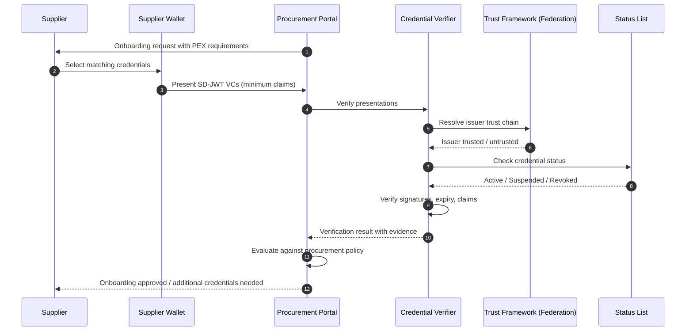

# Verified Supplier Onboarding and Procurement

> **Pattern type:** Reference architecture
> **Maturity:** Stable primitives
> **Boundary:** Not a turnkey product or compliance certification

> **Quick Facts**
>
> |              |                                                                                                                         |
> | ------------ | ----------------------------------------------------------------------------------------------------------------------- |
> | Industry     | Procurement / Supply Chain / Enterprise Operations                                                                      |
> | Complexity   | Medium                                                                                                                  |
> | Key Packages | `SdJwt.Net.Vc`, `SdJwt.Net.Oid4Vp`, `SdJwt.Net.PresentationExchange`, `SdJwt.Net.StatusList`, `SdJwt.Net.OidFederation` |

## 30-second pitch

Verify suppliers without collecting every PDF again. Suppliers present verifiable credentials for business registration, tax status, insurance, and certifications. Verifiers check issuer trust, credential status, and minimum claims -- without building bespoke document review pipelines for each supplier.

## Problem

Supplier onboarding is document-heavy, fraud-prone, and audit-heavy:

- **Document collection**: Suppliers submit PDFs of business registration, tax certificates, insurance policies, safety certifications, and ESG declarations. Each document must be manually reviewed.
- **Verification lag**: Checking authenticity often requires phone calls, registry lookups, and back-and-forth email. Onboarding cycles stretch to weeks.
- **Document expiry**: Certificates expire, insurance lapses, and registrations change. Periodic re-verification creates ongoing operational cost.
- **Fraud exposure**: Forged certificates, expired insurance presented as current, and shell companies exploiting weak checks.
- **Audit burden**: Procurement teams must prove due diligence in supplier selection. Paper-based audit trails are difficult to reconstruct.

### Common failure modes

| Current approach              | Risk                                                    |
| ----------------------------- | ------------------------------------------------------- |
| PDF upload and manual review  | Forgery risk; no issuer verification; review bottleneck |
| Supplier self-declaration     | No proof of claims; compliance risk                     |
| Third-party background checks | Expensive; point-in-time; no lifecycle tracking         |
| Registry API lookups          | Fragmented across jurisdictions; availability varies    |
| Spreadsheet tracking          | No real-time status; audit trail gaps                   |

## Reference pattern

Suppliers hold verifiable credentials issued by authoritative sources (government registries, insurers, certification bodies). During onboarding, suppliers present only the minimum claims needed for procurement eligibility. The procurement system verifies issuer trust, credential status, and claim values.

### Supplier credential types

| Credential type                  | Issuer                  | Key claims (selectively disclosable)                   |
| -------------------------------- | ----------------------- | ------------------------------------------------------ |
| Business registration            | Government registry     | Entity name, registration number, status, jurisdiction |
| Tax compliance certificate       | Tax authority           | Tax ID, compliance status, reporting period            |
| Bank account ownership           | Financial institution   | Account holder match, bank name, verification date     |
| Insurance certificate            | Insurance provider      | Policy type, coverage amount, validity period, status  |
| Safety certification             | Certification body      | Certification type, scope, expiry, auditor             |
| ESG / modern slavery declaration | Industry body / auditor | Declaration type, reporting period, compliance level   |

### Flow

## How SD-JWT .NET fits

| Package                          | Role                                                                          |
| -------------------------------- | ----------------------------------------------------------------------------- |
| `SdJwt.Net.Vc`                   | Verifiable credential format for supplier credentials                         |
| `SdJwt.Net.Oid4Vp`               | Presentation protocol for credential exchange                                 |
| `SdJwt.Net.PresentationExchange` | Structured requirements for which credentials and claims are needed           |
| `SdJwt.Net.StatusList`           | Lifecycle checks (active, suspended, revoked) for insurance, certifications   |
| `SdJwt.Net.OidFederation`        | Dynamic issuer trust resolution across jurisdictions and certification bodies |

## What remains your responsibility

- Procurement portal and supplier management system
- Onboarding workflow and approval logic
- Policy rules for which credentials satisfy procurement requirements
- Integration with existing ERP and vendor management systems
- Issuer relationship management (government registries, insurers, certification bodies)
- Legal review of credential acceptance policies
- Supplier communication and wallet adoption support
- Audit reporting and compliance documentation

## Target outcomes to validate

- Reduced onboarding cycle time (verifiable credentials vs. manual document review)
- Lower fraud exposure through issuer-verified credentials
- Real-time supplier status monitoring via status lists
- Audit-ready evidence trail for procurement due diligence
- Reduced re-verification cost for credential renewals

## Try it

- [Presentation Exchange guide](../guides/)
- [OID4VP tutorial](../tutorials/)
- [SD-JWT VC package](https://www.nuget.org/packages/SdJwt.Net.Vc)
