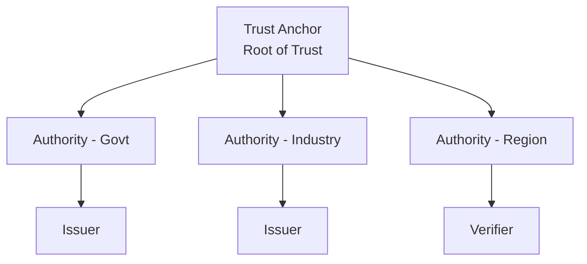

# Tutorial: OpenID Federation

Establish trust between issuers, holders, and verifiers using OpenID Federation.

**Time:** 25 minutes  
**Level:** Advanced  
**Sample:** `samples/SdJwt.Net.Samples/03-Advanced/01-OpenIdFederation.cs`

## What you will learn

- Trust chain concept and structure
- Entity statements and metadata
- Resolving and validating trust

## The trust problem

How does a verifier know to trust an issuer?

- Self-asserted metadata can be spoofed
- Manual trust lists don't scale
- Certificate authorities are complex

OpenID Federation addresses this by creating hierarchical trust anchors.

## Trust hierarchy



## Step 1: Trust anchor configuration

The trust anchor publishes its entity configuration:

```csharp
using SdJwt.Net.OidFederation.Models;

var trustAnchorConfig = new EntityConfiguration
{
    Issuer = "https://federation.example.gov",
    Subject = "https://federation.example.gov",
    IssuedAt = DateTimeOffset.UtcNow.ToUnixTimeSeconds(),
    ExpiresAt = DateTimeOffset.UtcNow.AddYears(1).ToUnixTimeSeconds(),
    Jwks = new JsonWebKeySet { Keys = { trustAnchorPublicKey } },
    Metadata = new EntityMetadata
    {
        FederationEntity = new FederationEntityMetadata
        {
            FederationFetchEndpoint = "https://federation.example.gov/fetch",
            FederationListEndpoint = "https://federation.example.gov/list"
        }
    }
};
```

## Step 2: Subordinate entity statement

The trust anchor issues a statement about a subordinate:

```csharp
var subordinateStatement = new EntityStatement
{
    Issuer = "https://federation.example.gov",           // Trust Anchor
    Subject = "https://university.example.edu",          // Subordinate
    IssuedAt = DateTimeOffset.UtcNow.ToUnixTimeSeconds(),
    ExpiresAt = DateTimeOffset.UtcNow.AddMonths(6).ToUnixTimeSeconds(),
    Jwks = new JsonWebKeySet { Keys = { universityPublicKey } },
    MetadataPolicy = new MetadataPolicy
    {
        // Constrain what the university can claim
        CredentialIssuer = new PolicyConstraints
        {
            AllowedCredentialTypes = new[] { "UniversityDegree", "StudentID" }
        }
    }
};

// Sign with trust anchor key
var signedStatement = SignEntityStatement(subordinateStatement, trustAnchorKey);
```

## Step 3: Entity configuration (leaf)

The issuer publishes its own configuration:

```csharp
var issuerConfig = new EntityConfiguration
{
    Issuer = "https://university.example.edu",
    Subject = "https://university.example.edu",
    IssuedAt = DateTimeOffset.UtcNow.ToUnixTimeSeconds(),
    ExpiresAt = DateTimeOffset.UtcNow.AddDays(7).ToUnixTimeSeconds(),
    Jwks = new JsonWebKeySet { Keys = { universityPublicKey } },
    AuthorityHints = new[] { "https://federation.example.gov" },
    Metadata = new EntityMetadata
    {
        CredentialIssuer = new CredentialIssuerMetadata
        {
            CredentialIssuer = "https://university.example.edu",
            CredentialEndpoint = "https://university.example.edu/credential"
        }
    }
};
```

## Step 4: Build trust chain

```csharp
using SdJwt.Net.OidFederation.Logic;

// Configure trust anchors (public keys you trust)
var trustAnchors = new Dictionary<string, SecurityKey>
{
    ["https://federation.example.gov"] = trustAnchorPublicKey
};

var resolver = new TrustChainResolver(
    httpClient,
    trustAnchors,
    options: new TrustChainResolverOptions
    {
        MaxPathLength = 10,
        EnableCaching = true,
        CacheDurationMinutes = 60
    });

// Resolve trust chain from issuer to trust anchor
var trustChainResult = await resolver.ResolveAsync(
    "https://university.example.edu");

// Trust chain contains:
// [0] Leaf entity configuration (self-signed)
// [1] Subordinate statement (signed by intermediate or anchor)
// [2] ... more intermediates if present ...
// [n] Trust anchor configuration (self-signed)
```

## Step 5: Use resolved trust chain

```csharp
if (trustChainResult.IsValid)
{
    Console.WriteLine("Trust chain is valid");
    // Access the resolved metadata and keys from the trust chain
}
else
{
    Console.WriteLine($"Trust validation failed: {string.Join(", ", trustChainResult.Errors)}");
}
```

## Step 6: Integrate with verification

```csharp
public async Task<SecurityKey> ResolveIssuerKey(string issuer)
{
    // 1. Resolve trust chain
    var trustChainResult = await resolver.ResolveAsync(issuer);

    // 2. Check result
    if (!trustChainResult.IsValid)
    {
        throw new SecurityException(
            $"Issuer not trusted: {string.Join(", ", trustChainResult.Errors)}");
    }

    // 3. Return issuer's key from validated chain
    return trustChainResult.ResolvedKeys.First();
}

// Use in verification
var verifier = new SdVerifier(ResolveIssuerKey);
var result = await verifier.VerifyAsync(presentation, params);
```

## Metadata policies

Intermediates can constrain subordinates:

```csharp
var policy = new MetadataPolicy
{
    CredentialIssuer = new PolicyConstraints
    {
        // Restrict allowed credential types
        AllowedCredentialTypes = new[] { "DriverLicense" },

        // Require certain metadata
        RequiredMetadata = new[] { "logo_uri", "policy_uri" },

        // Constrain values
        AllowedAlgorithms = new[] { "ES256", "ES384" }
    }
};
```

## Multiple trust anchors

Support multiple federations:

```csharp
var trustedAnchors = new[]
{
    "https://federation.example.gov",
    "https://industry-trust.example.org"
};

foreach (var anchor in trustedAnchors)
{
    try
    {
        var chain = await resolver.ResolveAsync(issuer, anchor);
        if (validator.Validate(chain, GetAnchorKey(anchor)).IsValid)
        {
            return chain;  // Found valid trust path
        }
    }
    catch { /* Try next anchor */ }
}

throw new Exception("No valid trust path found");
```

## Run the sample

```bash
cd samples/SdJwt.Net.Samples
dotnet run -- 3.1
```

## Next steps

- [HAIP Compliance](02-haip-compliance.md) - HAIP Final flows and credential profiles
- [Multi-Credential Flow](03-multi-credential-flow.md) - Complex presentations

## Key takeaways

1. OpenID Federation establishes hierarchical trust
2. Trust chains link entities to trust anchors
3. Metadata policies constrain subordinate capabilities
4. Verifiers resolve trust before accepting credentials
