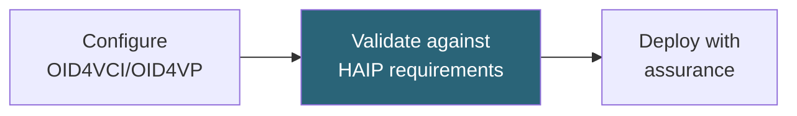

# Tutorial: HAIP Profile Validation

Validate OpenID4VC HAIP 1.0 Final flow and credential profile capabilities.

**Time:** 20 minutes  
**Level:** Advanced  
**Sample:** `samples/SdJwt.Net.Samples/03-Advanced/02-HaipCompliance.cs`

## What you will learn

- How HAIP Final selects flows and credential profiles
- How to validate SD-JWT VC and ISO mdoc capability declarations
- How to inspect the requirement catalog for audit evidence
- Why the legacy Level 1/2/3 helpers are not HAIP Final conformance tiers

## Simple explanation

HAIP narrows the OpenID4VC option space to a fixed set of algorithms, formats, and flows. This tutorial validates that your configuration meets HAIP Final requirements.

## Packages used

| Package          | Purpose                                |
| ---------------- | -------------------------------------- |
| `SdJwt.Net.HAIP` | HAIP Final flow and profile validation |

## Where this fits



## Step 1: Select HAIP Final scope

```csharp
using SdJwt.Net.HAIP;

var options = new HaipProfileOptions();
options.Flows.Add(HaipFlow.Oid4VciIssuance);
options.Flows.Add(HaipFlow.Oid4VpRedirectPresentation);
options.CredentialProfiles.Add(HaipCredentialProfile.SdJwtVc);
```

## Step 2: Declare supported formats and cryptography

```csharp
options.SupportedCredentialFormats.Add(HaipConstants.SdJwtVcFormat);
options.SupportedJoseAlgorithms.Add(HaipConstants.RequiredJoseAlgorithm);
options.SupportedHashAlgorithms.Add(HaipConstants.RequiredHashAlgorithm);
```

HAIP Final requires `ES256` validation support and SHA-256 digest support. The SD-JWT VC profile uses `dc+sd-jwt`; the ISO mdoc profile uses `mso_mdoc`.

## Step 3: Declare OID4VCI support

```csharp
options.SupportsAuthorizationCodeFlow = true;
options.EnforcesPkceS256 = true;
options.SupportsPushedAuthorizationRequests = true;
options.SupportsDpop = true;
options.SupportsDpopNonce = true;
options.ValidatesWalletAttestation = true;
options.ValidatesKeyAttestation = true;
```

These switches represent implementation capabilities. They do not replace the concrete OAuth, DPoP, nonce, wallet attestation, and key attestation validators in your issuer.

## Step 4: Declare OID4VP and SD-JWT VC support

```csharp
options.SupportsDcql = true;
options.SupportsSignedPresentationRequests = true;
options.ValidatesVerifierAttestation = true;
options.SupportsSdJwtVcCompactSerialization = true;
options.UsesCnfJwkForSdJwtVcHolderBinding = true;
options.RequiresKbJwtForHolderBoundSdJwtVc = true;
options.SupportsStatusListClaim = true;
options.SupportsSdJwtVcIssuerX5c = true;
```

## Step 5: Validate

```csharp
using SdJwt.Net.HAIP.Validators;

var result = new HaipProfileValidator().Validate(options);

if (!result.IsCompliant)
{
    foreach (var violation in result.Violations)
    {
        Console.WriteLine($"{violation.Description}: {violation.RecommendedAction}");
    }
}
```

## Step 6: Record applicable requirements

```csharp
foreach (var requirement in HaipRequirementCatalog.GetRequirements(options))
{
    Console.WriteLine($"{requirement.Id}: {requirement.Title}");
}
```

The validator also writes applicable requirement IDs to `result.Metadata["applicable_requirements"]`.

## mdoc Digital Credentials API profile

```csharp
var mdocOptions = new HaipProfileOptions();
mdocOptions.Flows.Add(HaipFlow.Oid4VpDigitalCredentialsApiPresentation);
mdocOptions.CredentialProfiles.Add(HaipCredentialProfile.MsoMdoc);
mdocOptions.SupportedCredentialFormats.Add(HaipConstants.MsoMdocFormat);
mdocOptions.SupportedJoseAlgorithms.Add(HaipConstants.RequiredJoseAlgorithm);
mdocOptions.SupportedCoseAlgorithms.Add(-7);
mdocOptions.SupportedHashAlgorithms.Add(HaipConstants.RequiredHashAlgorithm);
mdocOptions.SupportsDigitalCredentialsApi = true;
mdocOptions.SupportsDcql = true;
mdocOptions.ValidatesMdocDeviceSignature = true;
mdocOptions.ValidatesMdocX5Chain = true;
```

## Run the sample

```bash
cd samples/SdJwt.Net.Samples
dotnet run -- 3.2
```

## Expected output

```
HAIP validation: all requirements met
Credential profile: dc+sd-jwt with ES256
Flow: OID4VCI authorization code
Algorithm check: ES256 (pass), ES384 (pass)
```

## Demo vs production

Run HAIP validation at application startup and in CI. Failed validation should block deployment, not just warn.

## Common mistakes

- Using the word "compliance" to mean HAIP validation (this library validates technical requirements; regulatory compliance is a separate concern)
- Using MD5 or SHA-1 (blocked by HAIP; use SHA-256 or stronger)

## Key takeaways

1. HAIP Final is flow/profile based, not Level 1/2/3 based.
2. `HaipProfileValidator` is a fail-closed capability and policy gate.
3. Concrete OID4VCI, OID4VP, SD-JWT VC, and mdoc validators still perform the actual protocol and cryptographic verification.
4. The requirement catalog gives stable IDs for documentation and audit trails.
