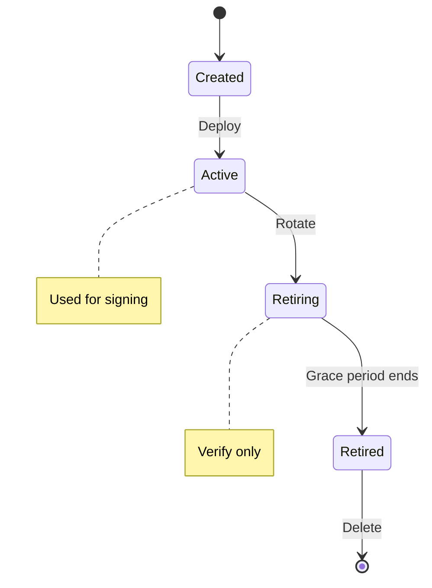

# Tutorial: Key rotation

Manage cryptographic key lifecycle for issuers and holders.

**Time:** 20 minutes  
**Level:** Advanced  
**Sample:** `samples/SdJwt.Net.Samples/03-Advanced/04-KeyRotation.cs`

## What you will learn

- Key rotation strategies
- Publishing new keys
- Validating during transition periods

## Simple explanation

Cryptographic keys have a lifecycle. This tutorial covers rotating issuer keys so that new credentials use fresh keys while existing credentials remain verifiable under their original keys.

### Rotation vs compromise

| Scenario         | Action                                                                                 | Credential impact                   |
| ---------------- | -------------------------------------------------------------------------------------- | ----------------------------------- |
| Planned rotation | Add new key, keep old key in JWKS, retire after grace period                           | Existing credentials remain valid   |
| Key compromise   | Revoke old key immediately, revoke all credentials issued under it, issue replacements | Existing credentials become invalid |

## Packages used

| Package        | Purpose                            |
| -------------- | ---------------------------------- |
| `SdJwt.Net`    | Key management for SD-JWT issuance |
| `SdJwt.Net.Vc` | Credential re-issuance             |

## Where this fits


## Why rotate keys?

- Limit exposure from potential compromise
- Comply with security policies
- Upgrade to stronger algorithms

## Key lifecycle



## Step 1: Generate new key

```csharp
using Microsoft.IdentityModel.Tokens;
using System.Security.Cryptography;

// Generate new signing key
var newKey = ECDsa.Create(ECCurve.NamedCurves.nistP256);
var newSecurityKey = new ECDsaSecurityKey(newKey)
{
    KeyId = $"key-{DateTimeOffset.UtcNow:yyyyMMdd}-{Guid.NewGuid():N}"
};
```

## Step 2: Publish updated JWKS

```csharp
// Maintain both old and new keys during transition
var jwks = new JsonWebKeySet();

// Add new key (will be used for signing)
var newJwk = JsonWebKeyConverter.ConvertFromECDsaSecurityKey(newSecurityKey);
newJwk.Use = "sig";
newJwk.Alg = SecurityAlgorithms.EcdsaSha256;
jwks.Keys.Add(newJwk);

// Keep old key for verification during transition
var oldJwk = JsonWebKeyConverter.ConvertFromECDsaSecurityKey(oldSecurityKey);
oldJwk.Use = "sig";
oldJwk.Alg = SecurityAlgorithms.EcdsaSha256;
jwks.Keys.Add(oldJwk);

// Publish at /.well-known/jwks.json
var jwksJson = JsonSerializer.Serialize(jwks);
```

## Step 3: Update issuer to use new key

```csharp
public class KeyRotatingIssuer
{
    private SecurityKey _activeSigningKey;
    private readonly List<SecurityKey> _validationKeys = new();

    public void RotateKey(SecurityKey newKey)
    {
        // Move current key to validation-only
        if (_activeSigningKey != null)
        {
            _validationKeys.Add(_activeSigningKey);
        }

        // Set new active signing key
        _activeSigningKey = newKey;

        // Publish updated JWKS
        PublishJwks();
    }

    public string Issue(Dictionary<string, object> payload, SdIssuanceOptions options)
    {
        var issuer = new SdIssuer(_activeSigningKey, SecurityAlgorithms.EcdsaSha256);
        return issuer.Issue(payload, options).Issuance;
    }
}
```

## Step 4: Verifier handles multiple keys

```csharp
public class KeyResolvingVerifier
{
    private readonly HttpClient _httpClient;
    private readonly Dictionary<string, JsonWebKeySet> _keyCache = new();

    public async Task<SecurityKey> ResolveKey(string issuer, string keyId)
    {
        // Fetch JWKS (with caching)
        if (!_keyCache.TryGetValue(issuer, out var jwks))
        {
            var jwksUrl = $"{issuer}/.well-known/jwks.json";
            var jwksJson = await _httpClient.GetStringAsync(jwksUrl);
            jwks = JsonSerializer.Deserialize<JsonWebKeySet>(jwksJson);
            _keyCache[issuer] = jwks;
        }

        // Find key by ID
        var key = jwks.Keys.FirstOrDefault(k => k.KeyId == keyId);
        if (key == null)
        {
            // Refresh cache in case of rotation
            var jwksUrl = $"{issuer}/.well-known/jwks.json";
            var jwksJson = await _httpClient.GetStringAsync(jwksUrl);
            jwks = JsonSerializer.Deserialize<JsonWebKeySet>(jwksJson);
            _keyCache[issuer] = jwks;

            key = jwks.Keys.FirstOrDefault(k => k.KeyId == keyId)
                ?? throw new SecurityException($"Unknown key: {keyId}");
        }

        return JsonWebKeyConverter.ConvertToSecurityKey(key);
    }
}
```

## Step 5: Holder key rotation

```csharp
public class HolderKeyManager
{
    private ECDsaSecurityKey _currentKey;
    private readonly List<ECDsaSecurityKey> _previousKeys = new();

    public void RotateHolderKey()
    {
        // Archive current key
        if (_currentKey != null)
        {
            _previousKeys.Add(_currentKey);
        }

        // Generate new key
        var ecdsa = ECDsa.Create(ECCurve.NamedCurves.nistP256);
        _currentKey = new ECDsaSecurityKey(ecdsa)
        {
            KeyId = $"holder-{Guid.NewGuid():N}"
        };
    }

    public ECDsaSecurityKey GetKeyForCredential(string credentialKeyId)
    {
        // Check if credential uses current key
        if (_currentKey.KeyId == credentialKeyId)
        {
            return _currentKey;
        }

        // Search previous keys
        return _previousKeys.FirstOrDefault(k => k.KeyId == credentialKeyId)
            ?? throw new InvalidOperationException("Key not found for credential");
    }
}
```

## Rotation strategies

### Time-based rotation

```csharp
public class ScheduledKeyRotation
{
    private readonly TimeSpan _rotationInterval = TimeSpan.FromDays(90);
    private DateTimeOffset _lastRotation;

    public bool ShouldRotate()
    {
        return DateTimeOffset.UtcNow - _lastRotation > _rotationInterval;
    }

    public async Task RotateIfNeeded()
    {
        if (ShouldRotate())
        {
            await PerformRotation();
            _lastRotation = DateTimeOffset.UtcNow;
        }
    }
}
```

### Usage-based rotation

```csharp
public class UsageBasedRotation
{
    private int _signatureCount = 0;
    private const int MaxSignatures = 1_000_000;

    public bool ShouldRotate()
    {
        return _signatureCount >= MaxSignatures;
    }

    public void RecordSignature()
    {
        Interlocked.Increment(ref _signatureCount);
    }
}
```

## Transition timeline

```mermaid
gantt
    title Key Rotation Timeline
    dateFormat  X
    axisFormat  Day %s

    section Key Transition
    Generate new key, add to JWKS        :done, 0, 1
    Start signing with new key           :active, 1, 2
    Grace period (both keys in JWKS)     :2, 30
    Remove old key from JWKS             :30, 31
    Securely destroy old key             :60, 61
```



## Emergency rotation

If a key is compromised:

```csharp
public async Task EmergencyRotation(string compromisedKeyId)
{
    // 1. Immediately remove compromised key from JWKS
    await RemoveKeyFromJwks(compromisedKeyId);

    // 2. Generate and publish new key
    var newKey = GenerateNewKey();
    await PublishKey(newKey);

    // 3. Revoke all credentials signed with compromised key
    await RevokeCredentials(compromisedKeyId);

    // 4. Log incident for audit
    _auditLog.RecordKeyCompromise(compromisedKeyId, DateTimeOffset.UtcNow);

    // 5. Notify affected holders
    await NotifyCredentialReissuance(compromisedKeyId);
}
```

## Run the sample

```bash
cd samples/SdJwt.Net.Samples
dotnet run -- 3.4
```

## Best practices

1. Always include key IDs — enable verifiers to select the correct key
2. Overlap transition periods — keep old keys valid during rotation
3. Automate rotation — reduce human error in key management
4. Secure key storage — use HSM or key vault for production
5. Audit key usage — track signatures per key for compliance

## Expected output

```
Current key: key-2024-v1 (active)
New key generated: key-2024-v2
JWKS updated: 2 keys published
New credential issued with key-2024-v2
Old credentials still verify against key-2024-v1
```

## Demo vs production

Key rotation in production must be coordinated with JWKS endpoint caching. Verifiers cache the issuer's JWKS; the old key must remain published until all caches expire.

## Common mistakes

- Removing the old key from JWKS immediately (existing credentials become unverifiable)
- Confusing key rotation (planned) with key compromise (requires immediate revocation of all credentials issued under the compromised key)

## Key takeaways

1. Key rotation limits exposure from compromise
2. Transition periods allow credential verification continuity
3. JWKS enables dynamic key discovery
4. Emergency procedures should be documented and tested
