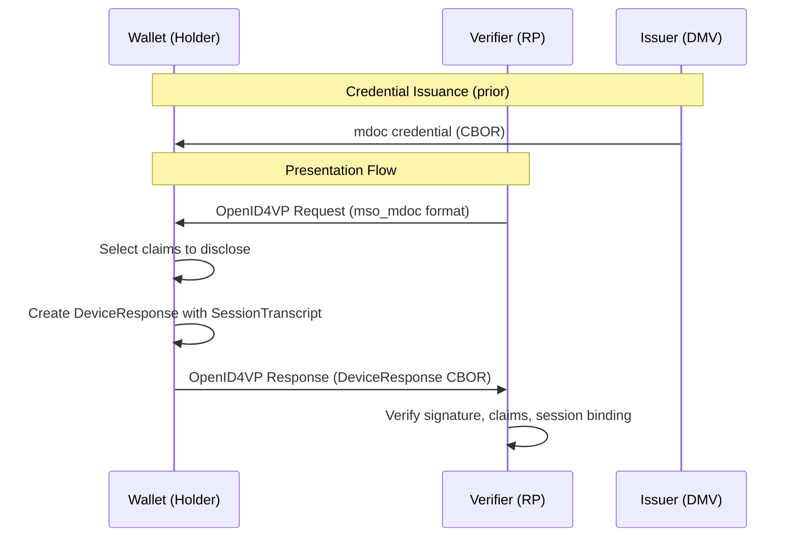

# Tutorial: mdoc OpenID4VP Integration

Build complete mdoc presentation flows with OpenID4VP for production verification.

**Time:** 25 minutes  
**Level:** Advanced  
**Sample:** `samples/SdJwt.Net.Samples/03-Advanced/05-MdocIntegration.cs`

## What You Will Learn

- How to integrate mdoc with OpenID4VP presentation requests
- How to create session transcripts for different flows
- How to verify mdoc presentations
- How to combine mdoc with SD-JWT VC in multi-credential scenarios

## Prerequisites

- Completed [mdoc Issuance](../intermediate/06-mdoc-issuance.md)
- Completed [OpenID4VP](../intermediate/04-openid4vp.md)
- Understanding of presentation protocols

## OpenID4VP mdoc Flow Overview



## Session Transcripts

### OpenID4VP Redirect Flow

```csharp
using SdJwt.Net.Mdoc.Handover;

// Standard redirect-based flow (same-device or cross-device)
var transcript = SessionTranscript.ForOpenId4Vp(
    clientId: "https://verifier.example.com",
    nonce: "xyz789-nonce",
    mdocGeneratedNonce: null, // Optional device nonce
    responseUri: "https://verifier.example.com/callback");

// Serialize for inclusion in DeviceResponse
byte[] transcriptCbor = transcript.ToCbor();
```

### OpenID4VP DC API Flow (Browser)

```csharp
// W3C Digital Credentials API flow (browser-based)
var dcApiTranscript = SessionTranscript.ForOpenId4VpDcApi(
    origin: "https://verifier.example.com",
    nonce: "browser-session-nonce",
    clientId: null); // Defaults to origin
```

### Custom Handover Construction

```csharp
using SdJwt.Net.Mdoc.Handover;

// Manual handover creation for flexibility
var handover = OpenId4VpHandover.Create(
    clientId: "https://verifier.example.com",
    responseUri: "https://verifier.example.com/response",
    nonce: "verifier-nonce",
    mdocGeneratedNonce: "wallet-generated-nonce");

var transcript = new SessionTranscript
{
    DeviceEngagement = null,  // Not used in OID4VP
    EReaderKeyPub = null,     // Not used in OID4VP
    Handover = handover
};
```

## Creating DeviceResponse

### Build Presentation Response

```csharp
using SdJwt.Net.Mdoc.Models;

// Assume we have an issued mdoc
var document = /* previously issued Document */;

// Create device response for presentation
var deviceResponse = new DeviceResponse
{
    Version = "1.0",
    Documents = new List<Document> { document },
    Status = 0 // Success
};

// Serialize for transmission
byte[] responseBytes = deviceResponse.ToCbor();
```

### Selective Disclosure in mdoc

Unlike SD-JWT where disclosures are selective at issuance, mdoc selective disclosure happens at presentation time. The holder creates a DeviceResponse containing only the namespaces and elements they wish to disclose.

```csharp
// Create response with selected elements only
// (Implementation depends on your presentation logic)
var selectiveDocument = new Document
{
    DocType = originalDoc.DocType,
    IssuerSigned = new IssuerSigned
    {
        NameSpaces = FilterNamespaces(
            originalDoc.IssuerSigned.NameSpaces,
            requestedElements),
        IssuerAuth = originalDoc.IssuerSigned.IssuerAuth
    }
};
```

## Verifying mdoc Presentations

### Basic Verification

```csharp
using SdJwt.Net.Mdoc.Verifier;

var verifier = new MdocVerifier();

var options = new MdocVerificationOptions
{
    ValidateExpiry = true,
    ExpectedDocType = "org.iso.18013.5.1.mDL",
    RequiredNamespace = MdlNamespace.Namespace,
    RequiredElements = new[]
    {
        MdlDataElement.FamilyName.ToElementIdentifier(),
        MdlDataElement.AgeOver21.ToElementIdentifier()
    }
};

var result = verifier.Verify(document, options);

if (result.IsValid)
{
    Console.WriteLine("Verification successful");

    // Access verified claims
    foreach (var claim in result.VerifiedClaims)
    {
        Console.WriteLine($"{claim.Key}: {claim.Value}");
    }
}
else
{
    Console.WriteLine($"Verification failed: {result.Error}");
}
```

### Full Verification Pipeline

```csharp
public class MdocVerificationService
{
    private readonly MdocVerifier _verifier = new();

    public async Task<VerificationOutcome> VerifyPresentationAsync(
        byte[] presentationBytes,
        string expectedNonce,
        string verifierClientId)
    {
        // Parse device response
        var response = DeviceResponse.FromCbor(presentationBytes);

        // Verify response status
        if (response.Status != 0)
        {
            return VerificationOutcome.Failed($"Device error: {response.Status}");
        }

        var outcomes = new List<DocumentVerification>();

        foreach (var doc in response.Documents)
        {
            var options = new MdocVerificationOptions
            {
                ValidateExpiry = true,
                ExpectedDocType = doc.DocType
            };

            var result = _verifier.Verify(doc, options);

            outcomes.Add(new DocumentVerification
            {
                DocType = doc.DocType,
                IsValid = result.IsValid,
                Claims = result.VerifiedClaims,
                Error = result.Error
            });
        }

        return new VerificationOutcome
        {
            Success = outcomes.All(o => o.IsValid),
            Documents = outcomes
        };
    }
}
```

## Multi-Credential Flows

### Combined SD-JWT VC and mdoc

```csharp
using SdJwt.Net.Oid4Vp;
using SdJwt.Net.PresentationExchange;

// Create presentation definition requesting both formats
var presentationDefinition = new PresentationDefinition
{
    Id = "multi-credential-request",
    InputDescriptors = new[]
    {
        // SD-JWT VC credential
        new InputDescriptor
        {
            Id = "employment-proof",
            Format = new Dictionary<string, object>
            {
                ["vc+sd-jwt"] = new { alg = new[] { "ES256" } }
            },
            Constraints = new Constraints
            {
                Fields = new[]
                {
                    new Field { Path = new[] { "$.vct" }, Filter = new Filter { Const = "EmploymentCredential" } }
                }
            }
        },
        // mdoc credential
        new InputDescriptor
        {
            Id = "age-verification",
            Format = new Dictionary<string, object>
            {
                ["mso_mdoc"] = new { alg = new[] { "ES256" } }
            },
            Constraints = new Constraints
            {
                Fields = new[]
                {
                    new Field
                    {
                        Path = new[] { "$['org.iso.18013.5.1']['age_over_21']" },
                        Filter = new Filter { Const = true }
                    }
                }
            }
        }
    }
};
```

### Processing Multi-Format Response

```csharp
public class MultiFormatVerifier
{
    private readonly VpTokenValidator _sdJwtValidator;
    private readonly MdocVerifier _mdocVerifier;

    public async Task<CombinedResult> VerifyMultiFormatAsync(
        AuthorizationResponse response)
    {
        var results = new CombinedResult();

        foreach (var vpToken in response.VpTokens)
        {
            if (vpToken.Format == "vc+sd-jwt")
            {
                // Verify SD-JWT VC
                var sdJwtResult = await _sdJwtValidator.ValidateAsync(
                    vpToken.Token,
                    new VpValidationParameters { /* ... */ });
                results.SdJwtCredentials.Add(sdJwtResult);
            }
            else if (vpToken.Format == "mso_mdoc")
            {
                // Verify mdoc
                var mdocBytes = Convert.FromBase64String(vpToken.Token);
                var document = Document.FromCbor(mdocBytes);
                var mdocResult = _mdocVerifier.Verify(document, new MdocVerificationOptions());
                results.MdocCredentials.Add(mdocResult);
            }
        }

        return results;
    }
}
```

## HAIP Compliance

### Level 2+ Requirements

```csharp
using SdJwt.Net.HAIP;
using SdJwt.Net.Mdoc.Cose;

// HAIP Level 2 requires ES384 or stronger
var haipValidator = new HaipCryptoValidator(HaipLevel.Level2_VeryHigh);

// Validate mdoc algorithm compliance
var algorithmCheck = haipValidator.ValidateAlgorithm(CoseAlgorithm.ES384);
if (!algorithmCheck.IsCompliant)
{
    throw new SecurityException("Algorithm does not meet HAIP Level 2 requirements");
}

// Issue with HAIP-compliant settings
using var issuerKey = ECDsa.Create(ECCurve.NamedCurves.nistP384); // P-384 for ES384

var mdoc = await new MdocIssuerBuilder()
    .WithDocType("org.iso.18013.5.1.mDL")
    .WithIssuerKey(CoseKey.FromECDsa(issuerKey))
    .WithDeviceKey(deviceKey)
    .WithAlgorithm(CoseAlgorithm.ES384) // HAIP Level 2 compliant
    .AddMdlElement(MdlDataElement.FamilyName, "Smith")
    // ... other elements
    .BuildAsync(cryptoProvider);
```

## Complete Integration Example

```csharp
public class MdocOpenId4VpService
{
    private readonly HttpClient _httpClient;
    private readonly MdocVerifier _verifier;

    public async Task<OpenId4VpOutcome> ProcessMdocPresentationAsync(
        string authorizationRequestUri,
        Document holderMdoc,
        ECDsa devicePrivateKey)
    {
        // 1. Fetch and parse authorization request
        var authRequest = await FetchAuthorizationRequestAsync(authorizationRequestUri);

        // 2. Create session transcript
        var transcript = SessionTranscript.ForOpenId4Vp(
            clientId: authRequest.ClientId,
            nonce: authRequest.Nonce,
            mdocGeneratedNonce: GenerateNonce(),
            responseUri: authRequest.ResponseUri);

        // 3. Create device response
        var deviceResponse = new DeviceResponse
        {
            Version = "1.0",
            Documents = new List<Document> { holderMdoc },
            Status = 0
        };

        // 4. Submit response
        var responseBytes = deviceResponse.ToCbor();
        var result = await SubmitPresentationAsync(
            authRequest.ResponseUri,
            Convert.ToBase64String(responseBytes));

        return result;
    }

    private string GenerateNonce()
    {
        var bytes = new byte[16];
        RandomNumberGenerator.Fill(bytes);
        return Convert.ToBase64String(bytes);
    }
}
```

## Run the Sample

```bash
cd samples/SdJwt.Net.Samples
dotnet run -- 3.5
```

## Next Steps

- [ISO 18013-5 Cross-Border](../../use-cases/mdoc-identity-verification.md) - Real-world scenarios
- [HAIP Compliance](02-haip-compliance.md) - Security levels for mdoc
- [mdoc Deep Dive](../../concepts/mdoc-deep-dive.md) - Technical deep dive

## Key Concepts

| Concept           | Description                                   |
| ----------------- | --------------------------------------------- |
| SessionTranscript | CBOR binding between request and response     |
| DeviceResponse    | Holder's presentation response container      |
| OpenID4VP         | Standard protocol for credential presentation |
| DC API            | W3C Digital Credentials API for browsers      |
| Multi-format      | Combining SD-JWT VC and mdoc credentials      |
