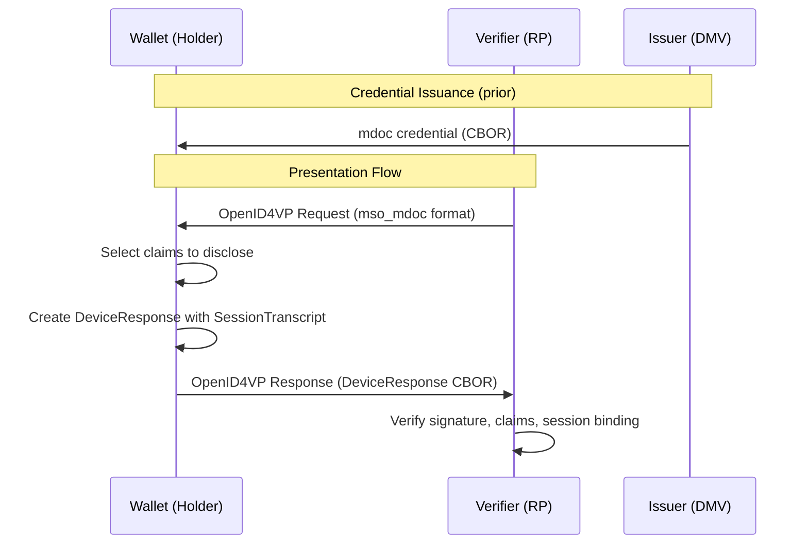

# Tutorial: mdoc OpenID4VP integration

Build complete mdoc presentation flows with OpenID4VP for production verification.

**Time:** 25 minutes  
**Level:** Advanced  
**Sample:** `samples/SdJwt.Net.Samples/03-Advanced/05-MdocIntegration.cs`

## What you will learn

- How to integrate mdoc with OpenID4VP presentation requests
- How to create session transcripts for different flows
- How to verify mdoc presentations
- How to combine mdoc with SD-JWT VC in multi-credential scenarios

## Prerequisites

- Completed [mdoc Issuance](../intermediate/06-mdoc-issuance.md)
- Completed [OpenID4VP](../intermediate/04-openid4vp.md)
- Understanding of presentation protocols

## OpenID4VP mdoc flow overview


```mermaid
sequenceDiagram
    participant Wallet as Wallet (Holder)
    participant Verifier as Verifier (RP)
    participant Issuer as Issuer (DMV)

    Note over Wallet,Issuer: Credential Issuance (prior)
    Issuer->>Wallet: mdoc credential (CBOR)

    Note over Wallet,Verifier: Presentation Flow
    Verifier->>Wallet: OpenID4VP Request (mso_mdoc format)
    Wallet->>Wallet: Select claims to disclose
    Wallet->>Wallet: Create DeviceResponse with SessionTranscript
    Wallet->>Verifier: OpenID4VP Response (DeviceResponse CBOR)
    Verifier->>Verifier: Verify signature, claims, session binding
```

## Session transcripts

### OpenID4VP redirect flow

```csharp
using SdJwt.Net.Mdoc.Handover;

// Standard redirect-based flow (same-device or cross-device)
var transcript = SessionTranscript.ForOpenId4Vp(
    clientId: "https://verifier.example.com",
    nonce: "xyz789-nonce",
    mdocGeneratedNonce: null, // Optional device nonce
    responseUri: "https://verifier.example.com/callback");

// Serialize for inclusion in DeviceResponse
byte[] transcriptCbor = transcript.ToCbor();
```

### OpenID4VP DC API flow (browser)

```csharp
// W3C Digital Credentials API flow (browser-based)
var dcApiTranscript = SessionTranscript.ForOpenId4VpDcApi(
    origin: "https://verifier.example.com",
    nonce: "browser-session-nonce",
    clientId: null); // Defaults to origin
```

### Custom handover construction

```csharp
using SdJwt.Net.Mdoc.Handover;

// Manual handover creation for flexibility
var handover = OpenId4VpHandover.Create(
    clientId: "https://verifier.example.com",
    responseUri: "https://verifier.example.com/response",
    nonce: "verifier-nonce",
    mdocGeneratedNonce: "wallet-generated-nonce");

var transcript = new SessionTranscript
{
    DeviceEngagement = null,  // Not used in OID4VP
    EReaderKeyPub = null,     // Not used in OID4VP
    Handover = handover
};
```

## Creating DeviceResponse

### Build presentation response

```csharp
using SdJwt.Net.Mdoc.Models;

// Assume we have an issued mdoc
var document = /* previously issued Document */;

// Create device response for presentation
var deviceResponse = new DeviceResponse
{
    Version = "1.0",
    Documents = new List<Document> { document },
    Status = 0 // Success
};

// Serialize for transmission
byte[] responseBytes = deviceResponse.ToCbor();
```

### Selective disclosure in mdoc

Unlike SD-JWT where disclosures are selective at issuance, mdoc selective disclosure happens at presentation time. The holder creates a DeviceResponse containing only the namespaces and elements they wish to disclose.

```csharp
// Create response with selected elements only
// (Implementation depends on your presentation logic)
var selectiveDocument = new Document
{
    DocType = originalDoc.DocType,
    IssuerSigned = new IssuerSigned
    {
        NameSpaces = FilterNamespaces(
            originalDoc.IssuerSigned.NameSpaces,
            requestedElements),
        IssuerAuth = originalDoc.IssuerSigned.IssuerAuth
    }
};
```

## Verifying mdoc presentations

### Basic verification

```csharp
using SdJwt.Net.Mdoc.Verifier;

var verifier = new MdocVerifier();

var options = new MdocVerificationOptions
{
    VerifyValidity = true,
    VerifyCertificateChain = true,
    VerifyDeviceSignature = true,
    AllowedDocTypes = new List<string> { "org.iso.18013.5.1.mDL" },
    ClockSkewTolerance = TimeSpan.FromMinutes(5)
};

var result = verifier.VerifyDocument(document);

if (result.IsValid)
{
    Console.WriteLine("Verification successful");

    // Access verified claims (namespace -> element -> value)
    foreach (var ns in result.VerifiedClaims)
    {
        foreach (var element in ns.Value)
        {
            Console.WriteLine($"{ns.Key}/{element.Key}: {element.Value}");
        }
    }
}
else
{
    Console.WriteLine($"Verification failed:");
    foreach (var error in result.Errors)
    {
        Console.WriteLine($"  - {error}");
    }
}
```

### Full verification pipeline

```csharp
public class MdocVerificationService
{
    private readonly MdocVerifier _verifier = new();

    public async Task<VerificationOutcome> VerifyPresentationAsync(
        byte[] presentationBytes,
        string expectedNonce,
        string verifierClientId)
    {
        // Parse device response
        var response = DeviceResponse.FromCbor(presentationBytes);

        // Verify response status
        if (response.Status != 0)
        {
            return VerificationOutcome.Failed($"Device error: {response.Status}");
        }

        var outcomes = new List<DocumentVerification>();

        foreach (var doc in response.Documents)
        {
            var options = new MdocVerificationOptions
            {
                VerifyValidity = true,
                VerifyCertificateChain = true,
                AllowedDocTypes = new List<string> { doc.DocType }
            };

            var result = _verifier.VerifyDocument(doc);

            outcomes.Add(new DocumentVerification
            {
                DocType = doc.DocType,
                IsValid = result.IsValid,
                Claims = result.VerifiedClaims,
                Errors = result.Errors
            });
        }

        return new VerificationOutcome
        {
            Success = outcomes.All(o => o.IsValid),
            Documents = outcomes
        };
    }
}
```

## Multi-credential flows

### Combined SD-JWT VC and mdoc

```csharp
using SdJwt.Net.Oid4Vp;
using SdJwt.Net.PresentationExchange;

// Create presentation definition requesting both formats
var presentationDefinition = new PresentationDefinition
{
    Id = "multi-credential-request",
    InputDescriptors = new[]
    {
        // SD-JWT VC credential
        new InputDescriptor
        {
            Id = "employment-proof",
            Format = new Dictionary<string, object>
            {
                ["dc+sd-jwt"] = new { alg = new[] { "ES256" } }
            },
            Constraints = new Constraints
            {
                Fields = new[]
                {
                    new Field { Path = new[] { "$.vct" }, Filter = new Filter { Const = "EmploymentCredential" } }
                }
            }
        },
        // mdoc credential
        new InputDescriptor
        {
            Id = "age-verification",
            Format = new Dictionary<string, object>
            {
                ["mso_mdoc"] = new { alg = new[] { "ES256" } }
            },
            Constraints = new Constraints
            {
                Fields = new[]
                {
                    new Field
                    {
                        Path = new[] { "$['org.iso.18013.5.1']['age_over_21']" },
                        Filter = new Filter { Const = true }
                    }
                }
            }
        }
    }
};
```

### Processing multi-format response

```csharp
public class MultiFormatVerifier
{
    private readonly VpTokenValidator _sdJwtValidator;
    private readonly MdocVerifier _mdocVerifier;

    public async Task<CombinedResult> VerifyMultiFormatAsync(
        AuthorizationResponse response)
    {
        var results = new CombinedResult();

        foreach (var vpToken in response.VpTokens)
        {
            if (vpToken.Format == "dc+sd-jwt")
            {
                // Verify SD-JWT VC
                var sdJwtResult = await _sdJwtValidator.ValidateAsync(
                    vpToken.Token,
                    new VpValidationParameters { /* ... */ });
                results.SdJwtCredentials.Add(sdJwtResult);
            }
            else if (vpToken.Format == "mso_mdoc")
            {
                // Verify mdoc
                var mdocBytes = Convert.FromBase64String(vpToken.Token);
                var document = Document.FromCbor(mdocBytes);
                var mdocResult = _mdocVerifier.Verify(document, new MdocVerificationOptions());
                results.MdocCredentials.Add(mdocResult);
            }
        }

        return results;
    }
}
```

## HAIP Final compliance

HAIP Final validates mdoc support by selected flow and credential profile. For mdoc presentations, declare the OID4VP flow, the `mso_mdoc` profile, COSE ES256 support, SHA-256 support, device signature validation, and x5chain trust validation where x5chain is used.

```csharp
using SdJwt.Net.HAIP;
using SdJwt.Net.HAIP.Validators;
using SdJwt.Net.Mdoc.Cose;

var options = new HaipProfileOptions();
options.Flows.Add(HaipFlow.Oid4VpDigitalCredentialsApiPresentation);
options.CredentialProfiles.Add(HaipCredentialProfile.MsoMdoc);
options.SupportedCredentialFormats.Add(HaipConstants.MsoMdocFormat);
options.SupportedJoseAlgorithms.Add(HaipConstants.RequiredJoseAlgorithm);
options.SupportedCoseAlgorithms.Add((int)CoseAlgorithm.ES256);
options.SupportedHashAlgorithms.Add(HaipConstants.RequiredHashAlgorithm);
options.SupportsDigitalCredentialsApi = true;
options.SupportsDcql = true;
options.ValidatesMdocDeviceSignature = true;
options.ValidatesMdocX5Chain = true;

var haipResult = new HaipProfileValidator().Validate(options);
if (!haipResult.IsCompliant)
{
    throw new SecurityException("mdoc profile does not meet HAIP Final requirements");
}

// Issue with HAIP Final minimum COSE support
using var issuerKey = ECDsa.Create(ECCurve.NamedCurves.nistP256);

var mdoc = await new MdocIssuerBuilder()
    .WithDocType("org.iso.18013.5.1.mDL")
    .WithIssuerKey(CoseKey.FromECDsa(issuerKey))
    .WithDeviceKey(deviceKey)
    .WithAlgorithm(CoseAlgorithm.ES256)
    .AddMdlElement(MdlDataElement.FamilyName, "Smith")
    // ... other elements
    .BuildAsync(cryptoProvider);
```

## Complete integration example

```csharp
public class MdocOpenId4VpService
{
    private readonly HttpClient _httpClient;
    private readonly MdocVerifier _verifier;

    public async Task<OpenId4VpOutcome> ProcessMdocPresentationAsync(
        string authorizationRequestUri,
        Document holderMdoc,
        ECDsa devicePrivateKey)
    {
        // 1. Fetch and parse authorization request
        var authRequest = await FetchAuthorizationRequestAsync(authorizationRequestUri);

        // 2. Create session transcript
        var transcript = SessionTranscript.ForOpenId4Vp(
            clientId: authRequest.ClientId,
            nonce: authRequest.Nonce,
            mdocGeneratedNonce: GenerateNonce(),
            responseUri: authRequest.ResponseUri);

        // 3. Create device response
        var deviceResponse = new DeviceResponse
        {
            Version = "1.0",
            Documents = new List<Document> { holderMdoc },
            Status = 0
        };

        // 4. Submit response
        var responseBytes = deviceResponse.ToCbor();
        var result = await SubmitPresentationAsync(
            authRequest.ResponseUri,
            Convert.ToBase64String(responseBytes));

        return result;
    }

    private string GenerateNonce()
    {
        var bytes = new byte[16];
        RandomNumberGenerator.Fill(bytes);
        return Convert.ToBase64String(bytes);
    }
}
```

## Run the sample

```bash
cd samples/SdJwt.Net.Samples
dotnet run -- 3.5
```

## Next steps

- [ISO 18013-5 Cross-Border](../../use-cases/mdoc-identity-verification.md) - Real-world scenarios
- [HAIP Compliance](02-haip-compliance.md) - HAIP Final flows and credential profiles
- [mdoc](../../concepts/mdoc.md) - Technical deep dive

## Key concepts

| Concept           | Description                                   |
| ----------------- | --------------------------------------------- |
| SessionTranscript | CBOR binding between request and response     |
| DeviceResponse    | Holder's presentation response container      |
| OpenID4VP         | Standard protocol for credential presentation |
| DC API            | W3C Digital Credentials API for browsers      |
| Multi-format      | Combining SD-JWT VC and mdoc credentials      |
