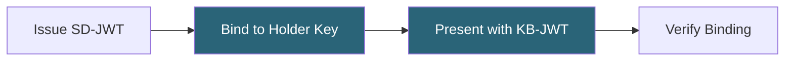

# Tutorial: Holder binding

Prove cryptographic ownership of a credential with Key Binding JWT.

**Time:** 10 minutes  
**Level:** Beginner  
**Sample:** `samples/SdJwt.Net.Samples/01-Beginner/03-HolderBinding.cs`

## What you will learn

- Why holder binding matters for security
- How to embed holder keys in credentials
- How to create Key Binding JWTs (KB-JWT)

## Simple explanation

Holder binding proves that the person presenting a credential is the person it was issued to. Without it, anyone who intercepts the SD-JWT could present it.

### How holder binding differs from selective disclosure

Selective disclosure controls _what_ is revealed. Holder binding controls _who_ can reveal it. They are independent features that work together.

## Packages used

| Package     | Purpose                          |
| ----------- | -------------------------------- |
| `SdJwt.Net` | Core SD-JWT with key binding JWT |

## Where this fits



## The problem

Without holder binding, anyone who obtains an SD-JWT can present it. Holder binding ensures only the legitimate holder can use the credential.

## How it works

1. **Issuance**: Holder's public key is embedded in the credential (`cnf` claim)
2. **Presentation**: Holder signs a KB-JWT with their private key
3. **Verification**: Verifier checks both the SD-JWT and KB-JWT signatures

## Step 1: Generate holder keys

```csharp
using var holderEcdsa = ECDsa.Create(ECCurve.NamedCurves.nistP256);
var holderPrivateKey = new ECDsaSecurityKey(holderEcdsa) { KeyId = "holder-key" };
var holderJwk = JsonWebKeyConverter.ConvertFromSecurityKey(holderPrivateKey);
```

## Step 2: Issue with holder binding

Pass the holder's public key during issuance:

```csharp
var result = issuer.Issue(claims, options, holderPublicKey: holderJwk);
```

The SD-JWT now contains a `cnf` (confirmation) claim with the holder's public key.

## Step 3: Create bound presentation

When presenting, the holder creates a Key Binding JWT:

```csharp
var presentation = holder.CreatePresentation(
    disclosure => disclosure.ClaimName == "given_name",
    kbJwtPayload: new JwtPayload
    {
        ["aud"] = "https://verifier.example.com",
        ["iat"] = DateTimeOffset.UtcNow.ToUnixTimeSeconds(),
        ["nonce"] = "verifier-provided-nonce-12345"
    },
    kbJwtSigningKey: holderPrivateKey,
    kbJwtSigningAlgorithm: SecurityAlgorithms.EcdsaSha256
);
```

## KB-JWT contents

| Claim     | Purpose                                       |
| --------- | --------------------------------------------- |
| `aud`     | Intended verifier (prevents replay to others) |
| `iat`     | Issuance time (freshness)                     |
| `nonce`   | Verifier-provided value (prevents replay)     |
| `sd_hash` | Hash of the presentation (auto-added)         |

## Step 4: Verify with key binding

```csharp
var sdJwtValidation = new TokenValidationParameters
{
    ValidateIssuer = true,
    ValidIssuer = "https://issuer.example.com",
    ValidateAudience = false,
    ValidateLifetime = true
};

var kbJwtValidation = new TokenValidationParameters
{
    ValidateIssuer = false,
    ValidateAudience = true,
    ValidAudience = "https://verifier.example.com",
    ValidateLifetime = false
};

var result = await verifier.VerifyAsync(
    presentation,
    sdJwtValidation,
    kbJwtValidation,
    expectedKbJwtNonce: "verifier-provided-nonce-12345"
);

Console.WriteLine($"Key binding verified: {result.KeyBindingVerified}");
```

## Security benefits

### Prevents credential theft

Even if an attacker steals the SD-JWT issuance string, they cannot create valid presentations without the holder's private key.

### Prevents replay attacks

The nonce and audience claims ensure presentations cannot be replayed:

- Different verifiers have different audience values
- Each request uses a fresh nonce

### Proves liveness

The KB-JWT proves the holder actively created this presentation, not that it was pre-generated.

## Complete flow

```csharp
// 1. Holder generates keys
using var holderEcdsa = ECDsa.Create(ECCurve.NamedCurves.nistP256);
var holderKey = new ECDsaSecurityKey(holderEcdsa);
var holderJwk = JsonWebKeyConverter.ConvertFromSecurityKey(holderKey);

// 2. Issuer creates bound credential
var result = issuer.Issue(claims, options, holderJwk);

// 3. Holder creates bound presentation
var holder = new SdJwtHolder(result.Issuance);
var presentation = holder.CreatePresentation(
    d => true,  // Disclose all
    kbJwtPayload: new JwtPayload
    {
        ["aud"] = "https://verifier.example",
        ["nonce"] = "abc123"
    },
    kbJwtSigningKey: holderKey,
    kbJwtSigningAlgorithm: SecurityAlgorithms.EcdsaSha256
);

// 4. Verifier validates both signatures
var verified = await verifier.VerifyAsync(
    presentation, sdJwtParams, kbJwtParams, "abc123"
);
```

## Run the sample

```bash
cd samples/SdJwt.Net.Samples
dotnet run -- 1.3
```

## Expected output

```
SD-JWT with holder binding created
KB-JWT nonce: verifier-nonce-123
Presentation includes key binding proof
```

## Demo vs production

The verifier must provide a fresh nonce for each presentation request. Reusing nonces allows replay attacks.

## Common mistakes

- Confusing the issuer key with the holder key (the issuer signs the SD-JWT; the holder signs the KB-JWT)
- Omitting the nonce in the KB-JWT (required for replay protection)

## Next steps

- [Verification Flow](04-verification-flow.md) - Complete end-to-end implementation
- [HAIP Profile Validation](../advanced/02-haip-compliance.md) - High-assurance requirements

## Key takeaways

1. Holder binding prevents unauthorized credential use
2. The `cnf` claim embeds the holder's public key
3. KB-JWT proves the presenter owns the credential
4. Nonces prevent replay attacks
