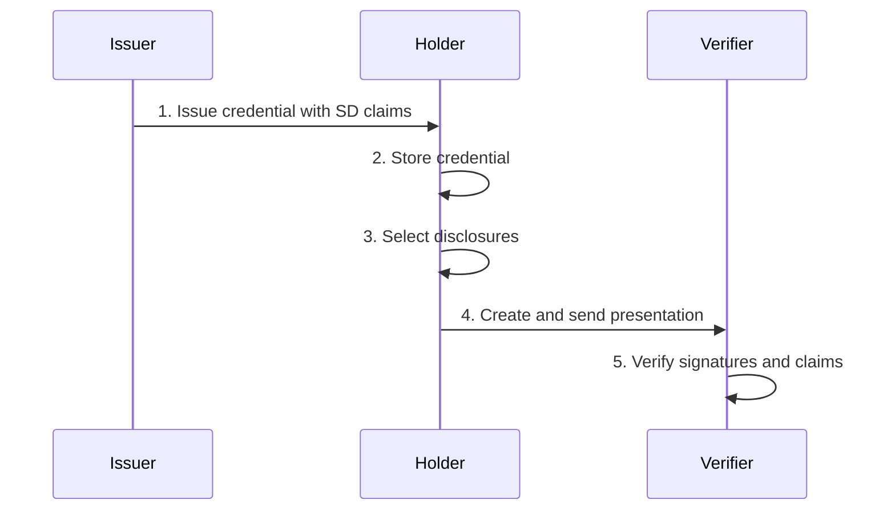

# Tutorial: Verification flow

Implement the complete issuer-holder-verifier credential flow.

**Time:** 15 minutes  
**Level:** Beginner  
**Sample:** `samples/SdJwt.Net.Samples/01-Beginner/04-VerificationFlow.cs`

## What you will learn

- Complete end-to-end SD-JWT workflow
- Best practices for each actor
- Error handling and validation

## Simple explanation

This tutorial walks through the complete cycle: an issuer creates a credential, a holder selects what to share, and a verifier checks everything. This is the end-to-end flow that all real systems implement.

## Packages used

| Package     | Purpose                                  |
| ----------- | ---------------------------------------- |
| `SdJwt.Net` | Issuance, presentation, and verification |

## Where this fits


## The complete flow



## Phase 1: Issuer creates credential

```csharp
// Setup issuer infrastructure
using var issuerEcdsa = ECDsa.Create(ECCurve.NamedCurves.nistP256);
var issuerKey = new ECDsaSecurityKey(issuerEcdsa) { KeyId = "issuer-2024" };
var issuer = new SdIssuer(issuerKey, SecurityAlgorithms.EcdsaSha256);

// Define credential claims
var claims = new JwtPayload
{
    ["iss"] = "https://university.example.edu",
    ["sub"] = "student-12345",
    ["iat"] = DateTimeOffset.UtcNow.ToUnixTimeSeconds(),
    ["exp"] = DateTimeOffset.UtcNow.AddYears(4).ToUnixTimeSeconds(),
    ["given_name"] = "Alice",
    ["family_name"] = "Johnson",
    ["degree"] = "Computer Science",
    ["graduation_year"] = 2025,
    ["gpa"] = 3.85
};

// Configure selective disclosure
var options = new SdIssuanceOptions
{
    DisclosureStructure = new
    {
        given_name = true,
        family_name = true,
        gpa = true  // Sensitive - can be hidden
    }
};

// Issue with holder binding
var issuance = issuer.Issue(claims, options, holderJwk);
```

## Phase 2: Holder stores and prepares

```csharp
// Holder receives and stores the credential
var holder = new SdJwtHolder(issuance.Issuance);

// Holder can inspect available disclosures
Console.WriteLine("Available claims to disclose:");
foreach (var disclosure in holder.AllDisclosures)
{
    Console.WriteLine($"  - {disclosure.ClaimName}");
}
```

## Phase 3: Verifier requests credential

The verifier sends a request with:

- Expected audience (their identifier)
- Fresh nonce (prevents replay)
- Required claims (what they need)

```csharp
// Verifier's request
var verifierRequest = new
{
    Audience = "https://employer.example.com",
    Nonce = Guid.NewGuid().ToString(),
    RequiredClaims = new[] { "given_name", "family_name", "degree" }
};
```

## Phase 4: Holder creates presentation

```csharp
// Holder decides what to disclose based on request
var presentation = holder.CreatePresentation(
    disclosure =>
        disclosure.ClaimName == "given_name" ||
        disclosure.ClaimName == "family_name",
        // Note: NOT disclosing GPA
    kbJwtPayload: new JwtPayload
    {
        ["aud"] = verifierRequest.Audience,
        ["iat"] = DateTimeOffset.UtcNow.ToUnixTimeSeconds(),
        ["nonce"] = verifierRequest.Nonce
    },
    kbJwtSigningKey: holderPrivateKey,
    kbJwtSigningAlgorithm: SecurityAlgorithms.EcdsaSha256
);
```

## Phase 5: Verifier validates

```csharp
// Create verifier with issuer key resolver
var verifier = new SdVerifier(async jwt =>
{
    // In production: resolve key from issuer metadata or trust registry
    var issuer = jwt.Issuer;
    if (issuer == "https://university.example.edu")
        return issuerPublicKey;
    throw new SecurityTokenException($"Unknown issuer: {issuer}");
});

// Configure validation
var sdJwtParams = new TokenValidationParameters
{
    ValidateIssuer = true,
    ValidIssuers = new[] { "https://university.example.edu" },
    ValidateAudience = false,
    ValidateLifetime = true,
    ClockSkew = TimeSpan.FromMinutes(5)
};

var kbJwtParams = new TokenValidationParameters
{
    ValidateIssuer = false,
    ValidateAudience = true,
    ValidAudience = verifierRequest.Audience,
    ValidateLifetime = false
};

// Verify
var result = await verifier.VerifyAsync(
    presentation,
    sdJwtParams,
    kbJwtParams,
    expectedKbJwtNonce: verifierRequest.Nonce
);

// Process verified claims
if (result.KeyBindingVerified)
{
    Console.WriteLine("Verification successful!");
    Console.WriteLine("Disclosed claims:");
    foreach (var claim in result.ClaimsPrincipal.Claims)
    {
        Console.WriteLine($"  {claim.Type}: {claim.Value}");
    }
}
```

## Error handling

```csharp
try
{
    var result = await verifier.VerifyAsync(presentation, sdJwtParams);
}
catch (SecurityTokenExpiredException)
{
    Console.WriteLine("Credential has expired");
}
catch (SecurityTokenInvalidSignatureException)
{
    Console.WriteLine("Invalid signature - credential may be tampered");
}
catch (SecurityTokenException ex)
{
    Console.WriteLine($"Verification failed: {ex.Message}");
}
```

## Best practices

### For issuers

- Use strong algorithms (ES256, ES384, EdDSA)
- Set appropriate expiration times
- Include holder binding for sensitive credentials

### For holders

- Store credentials securely
- Only disclose minimum necessary claims
- Use fresh nonces for each presentation

### For verifiers

- Always validate issuer signatures
- Verify key binding for high-value credentials
- Check nonce freshness
- Validate expected audience

## Run the sample

```bash
cd samples/SdJwt.Net.Samples
dotnet run -- 1.4
```

> **Important:** Non-disclosed claims are not deleted or removed. They exist as SHA-256 digests in the JWT payload. The verifier cannot recover the original values without the corresponding disclosure.

## Expected output

```
Issuer: SD-JWT created with 4 disclosures
Holder: Presenting 2 of 4 claims
Verifier: Signature valid
Verifier: Disclosed claims: given_name, email
Verifier: Non-disclosed claims are not visible
```

## Demo vs production

This example uses a single process for all three roles. In production, each role runs on a separate system and credentials are exchanged via protocols like OID4VCI and OID4VP.

## Common mistakes

- Forgetting to validate the issuer's public key against a trust list
- Assuming non-disclosed claims are deleted (they exist as digests in the JWT; the verifier just cannot see the values)

## Next steps

Continue to intermediate tutorials:

- [Verifiable Credentials](../intermediate/01-verifiable-credentials.md)
- [Status List](../intermediate/02-status-list.md)

## Summary

| Phase | Actor    | Action                               |
| ----- | -------- | ------------------------------------ |
| 1     | Issuer   | Creates SD-JWT with selective claims |
| 2     | Holder   | Stores credential                    |
| 3     | Verifier | Sends request with nonce             |
| 4     | Holder   | Creates selective presentation       |
| 5     | Verifier | Validates signatures and claims      |
