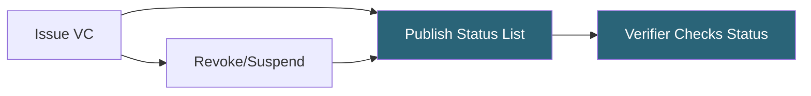
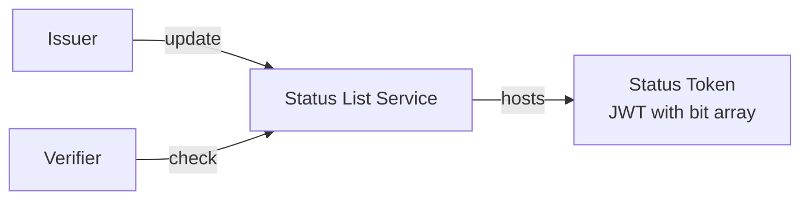

# Tutorial: Status list

Implement credential revocation and suspension with Token Status Lists.

**Time:** 15 minutes  
**Level:** Intermediate  
**Sample:** `samples/SdJwt.Net.Samples/02-Intermediate/02-StatusList.cs`

## What you will learn

- How credential status works
- Creating and managing status lists
- Checking credential validity

## Simple explanation

Credentials need to be revocable. Status lists let an issuer mark a credential as revoked or suspended without contacting the holder. The verifier fetches the status list and checks locally - the issuer never learns which credential was checked.

## Packages used

| Package                | Purpose                               |
| ---------------------- | ------------------------------------- |
| `SdJwt.Net`            | Base SD-JWT token format              |
| `SdJwt.Net.Vc`         | Credential with status reference      |
| `SdJwt.Net.StatusList` | Status list creation and verification |

## Where this fits



## Why status lists?

Credentials may need to be invalidated before expiration:

- Employee leaves company
- License suspended
- Credential compromised

## Status list architecture



## Step 1: Create status list manager

```csharp
using SdJwt.Net.StatusList.Issuer;
using SdJwt.Net.StatusList.Models;
using Microsoft.IdentityModel.Tokens;

// Create a StatusListManager with your signing key
var statusManager = new StatusListManager(
    signingKey,
    SecurityAlgorithms.EcdsaSha256);
```

## Step 2: Issue credential with status reference

```csharp
var statusIndex = 42;  // Unique index for this credential

var payload = new SdJwtVcPayload
{
    Issuer = "https://issuer.example.com",
    Subject = "holder-123",
    AdditionalData = new Dictionary<string, object>
    {
        ["given_name"] = "Alice",
        ["status"] = new
        {
            status_list = new
            {
                idx = statusIndex,
                uri = "https://issuer.example.com/.well-known/status/1"
            }
        }
    }
};
```

## Step 3: Publish status list token

```csharp
// Create the initial status values byte array
// Each credential starts as Valid (0x00)
var statusValues = new byte[100000];

// Create the Status List Token (signed JWT)
var statusListToken = await statusManager.CreateStatusListTokenAsync(
    subject: "https://issuer.example.com/.well-known/status/1",
    statusValues: statusValues,
    bits: 1);

// Host at: https://issuer.example.com/.well-known/status/1
```

## Step 4: Check credential status (verifier)

```csharp
using SdJwt.Net.StatusList.Verifier;
using SdJwt.Net.StatusList.Models;

var statusVerifier = new StatusListVerifier(httpClient);

// Build the status claim from the credential's status reference
var statusClaim = new StatusClaim
{
    StatusList = new StatusListReference
    {
        Index = 42,
        Uri = "https://issuer.example.com/.well-known/status/1"
    }
};

// Check the credential's status
var statusResult = await statusVerifier.CheckStatusAsync(
    statusClaim,
    issuerKeyProvider: async iss => await FetchIssuerKey(iss));

if (!statusResult.IsValid)
{
    throw new Exception("Credential has been revoked or suspended");
}
```

## Step 5: Revoke a credential (issuer)

```csharp
// Revoke the credential at index 42
var updatedToken = await statusManager.RevokeTokensAsync(
    existingStatusListToken,
    new[] { 42 });

// Publish the updated status list token to the CDN
await PublishStatusListToken(updatedToken);
```

## Status types

| Status                | Value | Use Case                |
| --------------------- | ----- | ----------------------- |
| `Valid`               | 0x00  | Credential is active    |
| `Invalid`             | 0x01  | Permanently invalidated |
| `Suspended`           | 0x02  | Temporarily invalid     |
| `ApplicationSpecific` | 0x03  | Custom application use  |

## Suspension vs revocation

```csharp
// Suspend temporarily (can be undone)
var suspendedToken = await statusManager.SuspendTokensAsync(
    existingToken, new[] { 42 });

// Later: reinstate
var reinstatedToken = await statusManager.ReinstateTokensAsync(
    suspendedToken, new[] { 42 });

// Revoke permanently
var revokedToken = await statusManager.RevokeTokensAsync(
    existingToken, new[] { 42 });
```

## Complete verification flow

```csharp
// 1. Verify SD-JWT signature
var vcResult = await vcVerifier.VerifyAsync(presentation, validationParameters);

// 2. Extract status reference from the verified payload
var statusClaim = new StatusClaim
{
    StatusList = new StatusListReference
    {
        Index = vcResult.SdJwtVcPayload.Status?.StatusList?.Index ?? 0,
        Uri = vcResult.SdJwtVcPayload.Status?.StatusList?.Uri ?? ""
    }
};

// 3. Check credential status via StatusListVerifier
var statusVerifier = new StatusListVerifier(httpClient);
var statusResult = await statusVerifier.CheckStatusAsync(
    statusClaim,
    issuerKeyProvider: async iss => await FetchIssuerKey(iss));

if (!statusResult.IsValid)
{
    throw new Exception("Credential has been revoked or suspended");
}

// 4. Continue with verified credential
Console.WriteLine("Credential is valid and not revoked");
```

## Caching considerations

```csharp
// Status lists can be cached with appropriate TTL
var statusListToken = await httpClient.GetStringAsync(statusUri);
var payload = ParseJwtPayload(statusListToken);
var expiresAt = DateTimeOffset.FromUnixTimeSeconds(payload.Exp);

// Cache until expiration or shorter interval
var cacheDuration = TimeSpan.FromMinutes(15);
```

## Run the sample

```bash
cd samples/SdJwt.Net.Samples
dotnet run -- 2.2
```

## Next steps

- [OpenID4VCI](03-openid4vci.md) - Issue credentials via protocol
- [OpenID4VP](04-openid4vp.md) - Present credentials via protocol

## Key takeaways

1. Status lists enable revocation without credential recall
2. Each credential has a unique index in the list
3. Verifiers must check status before accepting credentials

## Expected output

```
Status list created with 10000 entries
Credential at index 42: VALID
After revocation at index 42: REVOKED
Compressed status list size: 1.2 KB
```

## Demo vs production

Configure TTL-based caching for the status list endpoint. Frequent fetching creates load; infrequent fetching delays revocation visibility. A 5-minute TTL is a common starting point.

## Common mistakes

- Setting fail-open when fail-closed is required (if the status list is unreachable, should the credential be accepted or rejected?)
- Forgetting to compress the status list (uncompressed lists for thousands of credentials waste bandwidth)

4. Suspension allows temporary invalidation
