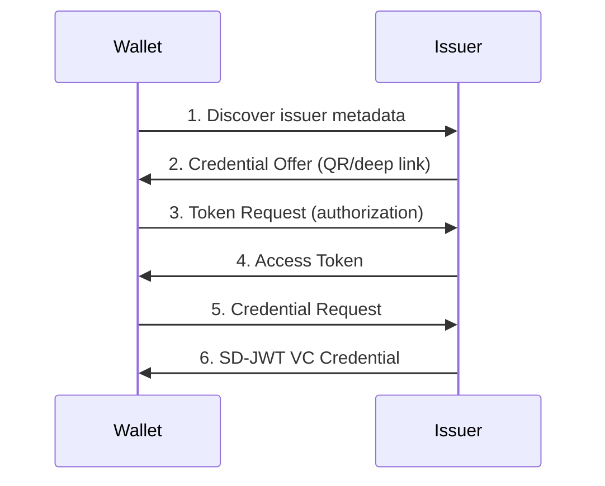

# Tutorial: OpenID4VCI

Implement credential issuance using the OpenID for Verifiable Credential Issuance protocol.

**Time:** 20 minutes  
**Level:** Intermediate  
**Sample:** `samples/SdJwt.Net.Samples/02-Intermediate/03-OpenId4Vci.cs`

## What you will learn

- OpenID4VCI protocol flow
- Credential offer and request structures
- Token exchange for credentials

## Simple explanation

OID4VCI is the protocol for putting a credential into a wallet. The issuer advertises what credentials it offers, the wallet requests authorization, proves it holds a key, and receives the bound credential.

One-sentence flow: Offer --> Metadata --> Authorization --> Proof of Possession --> Credential Response

## Packages used

| Package             | Purpose                                |
| ------------------- | -------------------------------------- |
| `SdJwt.Net.Oid4Vci` | OID4VCI protocol models and validation |
| `SdJwt.Net.Vc`      | Credential creation                    |

## Where this fits


## Protocol overview



## Step 1: Issuer metadata

The issuer publishes metadata at `/.well-known/openid-credential-issuer`:

```csharp
using SdJwt.Net.Oid4Vci.Models;

var metadata = new CredentialIssuerMetadata
{
    CredentialIssuer = "https://issuer.example.com",
    CredentialEndpoint = "https://issuer.example.com/credential",
    CredentialConfigurationsSupported = new Dictionary<string, CredentialConfiguration>
    {
        ["UniversityDegree"] = new CredentialConfiguration
        {
            Format = "dc+sd-jwt",
            Vct = "https://credentials.example.edu/UniversityDegree",
            Claims = new Dictionary<string, ClaimMetadata>
            {
                ["given_name"] = new ClaimMetadata { Display = "First Name" },
                ["family_name"] = new ClaimMetadata { Display = "Last Name" },
                ["degree"] = new ClaimMetadata { Display = "Degree" }
            }
        }
    }
};
```

## Step 2: Create credential offer

```csharp
var offer = new CredentialOffer
{
    CredentialIssuer = "https://issuer.example.com",
    CredentialConfigurationIds = new[] { "UniversityDegree" },
    Grants = new Dictionary<string, Grant>
    {
        ["urn:ietf:params:oauth:grant-type:pre-authorized_code"] = new PreAuthorizedCodeGrant
        {
            PreAuthorizedCode = "SplxlOBeZQQYbYS6WxSbIA",
            TxCode = new TxCodeSpec
            {
                InputMode = "numeric",
                Length = 6
            }
        }
    }
};

// Generate QR code or deep link
var offerUri = $"openid-credential-offer://?credential_offer={Uri.EscapeDataString(JsonSerializer.Serialize(offer))}";
```

## Step 3: Wallet requests token

```csharp
// Wallet exchanges pre-authorized code for access token
var tokenRequest = new TokenRequest
{
    GrantType = "urn:ietf:params:oauth:grant-type:pre-authorized_code",
    PreAuthorizedCode = "SplxlOBeZQQYbYS6WxSbIA",
    TxCode = "123456"  // User-entered PIN
};

// POST to token endpoint
var tokenResponse = await RequestToken(tokenRequest);
```

## Step 4: Request credential

```csharp
// Create proof of possession
var proofJwt = CreateProofJwt(walletKey, tokenResponse.CNonce);

var credentialRequest = new CredentialRequest
{
    Format = "dc+sd-jwt",
    Vct = "https://credentials.example.edu/UniversityDegree",
    Proof = new CredentialProof
    {
        ProofType = "jwt",
        Jwt = proofJwt
    }
};

// POST to credential endpoint with access token
var credential = await RequestCredential(credentialRequest, tokenResponse.AccessToken);
```

## Step 5: Issuer processes request

```csharp
// Issuer validates request and issues credential
var vcIssuer = new SdJwtVcIssuer(issuerKey, SecurityAlgorithms.EcdsaSha256);

var payload = new SdJwtVcPayload
{
    Issuer = "https://issuer.example.com",
    Subject = "did:example:holder123",
    IssuedAt = DateTimeOffset.UtcNow.ToUnixTimeSeconds(),
    AdditionalData = new Dictionary<string, object>
    {
        ["given_name"] = "Alice",
        ["family_name"] = "Smith",
        ["degree"] = "Computer Science"
    }
};

var options = new SdIssuanceOptions
{
    DisclosureStructure = new
    {
        given_name = true,
        family_name = true
    }
};

// Extract holder's public key from proof JWT
var holderJwk = ExtractHolderKeyFromProof(credentialRequest.Proof.Jwt);

var credential = vcIssuer.Issue(
    "https://credentials.example.edu/UniversityDegree",
    payload,
    options,
    holderJwk
);

// Return credential response
return new CredentialResponse
{
    Format = "dc+sd-jwt",
    Credential = credential.Issuance
};
```

## Grant types

### Pre-authorized code

User already authenticated (e.g., at university portal):

```csharp
var grant = new PreAuthorizedCodeGrant
{
    PreAuthorizedCode = "abc123",
    TxCode = new TxCodeSpec { InputMode = "numeric", Length = 6 }
};
```

### Authorization code

Standard OAuth2 flow:

```csharp
var grant = new AuthorizationCodeGrant
{
    IssuerState = "tracking-state-123"
};
```

## Run the sample

```bash
cd samples/SdJwt.Net.Samples
dotnet run -- 2.3
```

## Next steps

- [OpenID4VP](04-openid4vp.md) - Present credentials
- [Presentation Exchange](05-presentation-exchange.md) - Define requirements

## Expected output

```
Issuer metadata loaded: 2 credential configurations
Authorization code received
Proof of possession created
Credential issued: IdentityCredential
```

## Demo vs production

This tutorial simulates the HTTP exchange in-process. In production, OID4VCI involves real HTTP endpoints, TLS, and OAuth 2.0 authorization servers. `SdJwt.Net.Oid4Vci` provides the protocol models; your application provides the HTTP layer.

## Common mistakes

- Confusing OID4VCI (issuance: issuer to wallet) with OID4VP (presentation: wallet to verifier)
- Expecting `SdJwt.Net.Oid4Vci` to provide HTTP endpoints (the package provides protocol models and validation; see `SdJwt.Net.Oid4Vci.AspNetCore` for the reference server)

## Key takeaways

1. OpenID4VCI standardizes credential issuance
2. Pre-authorized code enables offline issuance
3. Proof of possession binds credential to holder
4. Metadata describes available credentials
