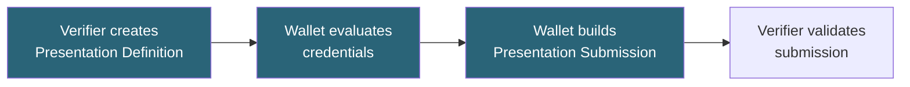

# Tutorial: Presentation Exchange

Define credential requirements using DIF Presentation Exchange v2.1.1.

**Time:** 15 minutes  
**Level:** Intermediate  
**Sample:** `samples/SdJwt.Net.Samples/02-Intermediate/05-PresentationExchange.cs`

## What you will learn

- Presentation Definition structure
- Field constraints and filters
- Submission requirements

## Simple explanation

Presentation Exchange is a checklist that a verifier uses to describe what credentials and claims it needs. Think of it as a form: the verifier defines the fields, and the wallet fills them in with matching credentials.

## Packages used

| Package                          | Purpose                                           |
| -------------------------------- | ------------------------------------------------- |
| `SdJwt.Net.PresentationExchange` | DIF PEX v2.1.1 definition and submission matching |

## Where this fits



## What is Presentation Exchange?

A query language for specifying:

- What credentials are needed
- Which fields must be present
- What values are acceptable

## Basic Presentation Definition

```csharp
using SdJwt.Net.PresentationExchange.Models;

var definition = new PresentationDefinition
{
    Id = "age-verification",
    Name = "Age Verification",
    Purpose = "Verify you are over 21",
    InputDescriptors = new[]
    {
        new InputDescriptor
        {
            Id = "age-credential",
            Name = "Age Proof",
            Constraints = new Constraints
            {
                Fields = new[]
                {
                    new Field
                    {
                        Path = new[] { "$.age_over_21" },
                        Filter = new FieldFilter
                        {
                            Type = "boolean",
                            Const = true
                        }
                    }
                }
            }
        }
    }
};
```

## Field path syntax

Use JSONPath expressions:

```csharp
// Root-level claim
new Field { Path = new[] { "$.given_name" } }

// Nested claim
new Field { Path = new[] { "$.address.city" } }

// Alternative paths (first match wins)
new Field { Path = new[] { "$.birthdate", "$.date_of_birth" } }
```

## Filter types

### Exact match

```csharp
new FieldFilter
{
    Type = "string",
    Const = "United States"
}
```

### Enum (any of)

```csharp
new FieldFilter
{
    Type = "string",
    Enum = new object[] { "US", "CA", "MX" }
}
```

### Pattern (regex)

```csharp
new FieldFilter
{
    Type = "string",
    Pattern = "^[A-Z]{2}-[0-9]{6}$"  // License format
}
```

### Numeric range

```csharp
new FieldFilter
{
    Type = "integer",
    Minimum = 21,
    Maximum = 120
}
```

## Requiring selective disclosure

```csharp
var descriptor = new InputDescriptor
{
    Id = "id-credential",
    Constraints = new Constraints
    {
        LimitDisclosure = "required",  // Must use SD-JWT
        Fields = new[] { ... }
    }
};
```

## Multiple credentials

Request several credentials:

```csharp
var definition = new PresentationDefinition
{
    Id = "loan-application",
    InputDescriptors = new[]
    {
        new InputDescriptor
        {
            Id = "identity",
            Name = "Government ID",
            Constraints = new Constraints
            {
                Fields = new[]
                {
                    new Field { Path = new[] { "$.vct" }, Filter = new FieldFilter { Const = "GovernmentID" } },
                    new Field { Path = new[] { "$.given_name" } },
                    new Field { Path = new[] { "$.family_name" } }
                }
            }
        },
        new InputDescriptor
        {
            Id = "income",
            Name = "Income Verification",
            Constraints = new Constraints
            {
                Fields = new[]
                {
                    new Field { Path = new[] { "$.annual_income" }, Filter = new FieldFilter { Type = "number", Minimum = 50000 } }
                }
            }
        }
    }
};
```

## Submission requirements

Specify how many descriptors must be satisfied:

```csharp
var definition = new PresentationDefinition
{
    Id = "flexible-verification",
    InputDescriptors = new[]
    {
        new InputDescriptor { Id = "passport", Group = new[] { "identity" }, ... },
        new InputDescriptor { Id = "drivers-license", Group = new[] { "identity" }, ... },
        new InputDescriptor { Id = "national-id", Group = new[] { "identity" }, ... }
    },
    SubmissionRequirements = new[]
    {
        new SubmissionRequirement
        {
            Rule = "pick",
            Count = 1,          // Only need one
            From = "identity"   // From identity group
        }
    }
};
```

## Presentation submission

Wallet responds with submission mapping:

```csharp
var submission = new PresentationSubmission
{
    Id = Guid.NewGuid().ToString(),
    DefinitionId = "loan-application",
    DescriptorMap = new[]
    {
        new DescriptorMapEntry
        {
            Id = "identity",
            Format = "dc+sd-jwt",
            Path = "$.verifiableCredential[0]"
        },
        new DescriptorMapEntry
        {
            Id = "income",
            Format = "dc+sd-jwt",
            Path = "$.verifiableCredential[1]"
        }
    }
};
```

## Validating a submission

```csharp
using Microsoft.Extensions.Logging.Abstractions;
using SdJwt.Net.PresentationExchange.Services;

var jsonPathEvaluator = new JsonPathEvaluator(NullLogger<JsonPathEvaluator>.Instance);
var fieldFilterEvaluator = new FieldFilterEvaluator(NullLogger<FieldFilterEvaluator>.Instance);
var constraintEvaluator = new ConstraintEvaluator(
    NullLogger<ConstraintEvaluator>.Instance,
    jsonPathEvaluator,
    fieldFilterEvaluator);
var submissionValidator = new PresentationSubmissionValidator(
    NullLogger<PresentationSubmissionValidator>.Instance,
    jsonPathEvaluator,
    constraintEvaluator);

var result = await submissionValidator.ValidateAsync(
    definition,
    submission,
    verifiedClaims);

if (!result.IsValid)
{
    throw new InvalidOperationException(result.Errors[0].Message);
}
```

## Run the sample

```bash
cd samples/SdJwt.Net.Samples
dotnet run -- 2.5
```

## Next steps

- [OpenID Federation](../advanced/01-openid-federation.md) - Trust management
- [Multi-Credential Flow](../advanced/03-multi-credential-flow.md) - Combined presentations

## Key takeaways

1. Presentation Exchange defines credential requirements
2. Field paths use JSONPath syntax
3. Filters constrain acceptable values
4. Presentation submissions bind descriptor maps to submitted credentials
5. OID4VP verifiers should evaluate PEX constraints against verified disclosed claims

## Expected output

```
Presentation definition: 2 input descriptors
Credential evaluation: 1 matching credential found
Submission: descriptor_map contains 1 entry
Validation: submission satisfies definition
```

## Demo vs production

Presentation definitions can use JSONPath or simple path syntax for field constraints. Test definitions against sample credentials before deploying to production.

## Common mistakes

- Confusing presentation definitions (what the verifier wants) with presentation submissions (what the wallet sends)
- Using incorrect JSONPath syntax in field constraints
