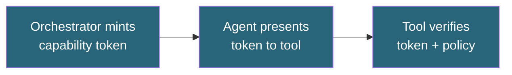
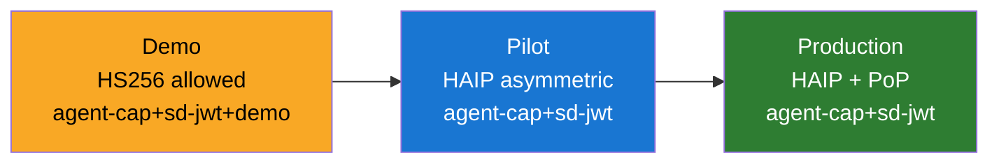

# Tutorial: Agent Trust Kits

> **Preview:** Agent Trust packages are preview trust extensions under active development. APIs may change between releases.

Build a bounded agent-to-tool trust flow using capability SD-JWTs.

**Time:** 25 minutes  
**Level:** Intermediate  
**Sample:** `samples/SdJwt.Net.Samples/02-Intermediate/07-AgentTrustKits.cs`

## What you will learn

- How to mint capability tokens for tool calls
- How to enforce policy-based allow/deny decisions
- How to verify capability tokens in ASP.NET Core
- How MAF middleware and MCP adapter fit into the flow

## Simple explanation

Agent Trust lets an AI agent prove what it is allowed to do. Instead of a broad API key, the agent presents a capability token (an SD-JWT) that specifies exactly which tools it can call, with what parameters, until what time.

## Packages used

| Package                       | Purpose                                   |
| ----------------------------- | ----------------------------------------- |
| `SdJwt.Net.AgentTrust.Core`   | Capability token minting and verification |
| `SdJwt.Net.AgentTrust.Policy` | Rule-based policy evaluation              |

## Where this fits



## Step 1: Install packages

```bash
dotnet add package SdJwt.Net.AgentTrust.Core
dotnet add package SdJwt.Net.AgentTrust.Policy
dotnet add package SdJwt.Net.AgentTrust.AspNetCore
dotnet add package SdJwt.Net.AgentTrust.Maf
```

## Step 2: Define policy rules

```csharp
using SdJwt.Net.AgentTrust.Core;
using SdJwt.Net.AgentTrust.Policy;

var rules = new PolicyBuilder()
    .Deny("*", "billing", "Delete")
    .Allow("agent://finance-*", "billing", "Read", c =>
    {
        c.MaxLifetime(TimeSpan.FromSeconds(60));
        c.Limits(new CapabilityLimits { MaxResults = 50 });
    })
    .Build();

var policyEngine = new DefaultPolicyEngine(rules);
```

## Step 3: Mint a capability token

```csharp
using Microsoft.IdentityModel.Tokens;
using SdJwt.Net.AgentTrust.Core;
using SdJwt.Net.AgentTrust.Maf;
using System.Security.Cryptography;

var signingKey = new SymmetricSecurityKey(RandomNumberGenerator.GetBytes(32));
var nonceStore = new MemoryNonceStore();
var issuer = new CapabilityTokenIssuer(
    signingKey,
    SecurityAlgorithms.HmacSha256,
    nonceStore);

var adapter = new McpTrustAdapter(
    issuer,
    policyEngine,
    "agent://finance-eu",
    new Dictionary<string, string> { ["billing"] = "https://tools.example.com" });

var tokenResult = await adapter.MintForToolCallAsync(
    "billing",
    new Dictionary<string, object> { ["action"] = "Read" },
    new CapabilityContext { CorrelationId = Guid.NewGuid().ToString("N") });
```

## Step 4: Verify in ASP.NET Core tool API

```csharp
using Microsoft.IdentityModel.Tokens;
using SdJwt.Net.AgentTrust.AspNetCore;

builder.Services.AddAgentTrustVerification(options =>
{
    options.Audience = "https://tools.example.com";
    options.TrustedIssuers = new Dictionary<string, SecurityKey>
    {
        ["agent://finance-eu"] = signingKey
    };
});

app.UseAgentTrustVerification();
```

Protect endpoint:

```csharp
[RequireCapability("billing", "Read")]
[HttpGet("invoices/{id}")]
public IActionResult GetInvoice(string id) => Ok();
```

## Step 5: Send request with token

Set request header:

```text
Authorization: Bearer <tokenResult.Token>
```

## Expected output

```
Capability token minted for agent: data-reader
Scopes: ["storage:read", "storage:list"]
Expiry: 300 seconds
Policy evaluation: ALLOW
```

## Demo vs production

Use asymmetric keys (ECDSA P-256) for capability tokens in production. Symmetric keys are acceptable for development but do not provide non-repudiation.

Agent Trust supports three security modes via `AgentTrustSecurityMode`:



## Common mistakes

- Using overly broad scopes (grant minimum required permissions per action)
- Setting long expiry times on capability tokens (short-lived tokens limit blast radius)

````

If verification and policy checks pass, the request continues to your endpoint.

Run the runnable sample:

```bash
cd samples/SdJwt.Net.Samples
dotnet run -- 2.7
````

## Troubleshooting

1. `401 Unauthorized`: missing or malformed header/token.
2. `403 Forbidden`: token invalid, expired, or policy denied.
3. Replay rejection: same token reused with replay prevention enabled.
4. Audience mismatch: `aud` does not equal configured `options.Audience`.

## Next steps

- [Agent Trust Integration Guide](../../guides/agent-trust-integration.md) - OPA, MCP, A2A, and OTel integration
- [Agent Trust Kits](../../concepts/agent-trust-kits.md)
- [Agent Trust End-to-End Example](../../examples/agent-trust-end-to-end.md)

### Extended packages

After completing this tutorial, explore the extended Agent Trust ecosystem:

| Package                              | What it adds                                                                                                             |
| ------------------------------------ | ------------------------------------------------------------------------------------------------------------------------ |
| `SdJwt.Net.AgentTrust.OpenTelemetry` | Spec Section 24.1 metrics (`agent_trust.capability.minted`, etc.) and `TelemetryReceiptWriter` for metric-based auditing |
| `SdJwt.Net.AgentTrust.Policy.Opa`    | Externalize policy to Open Policy Agent via HTTP; fail-closed by default                                                 |
| `SdJwt.Net.AgentTrust.Mcp`           | `McpClientTrustInterceptor` attaches tokens to MCP tool calls; `McpServerTrustGuard` verifies them                       |
| `SdJwt.Net.AgentTrust.A2A`           | `DelegationChainValidator` + `AttenuationValidator` enforce bounded delegation with attenuation rules                    |
