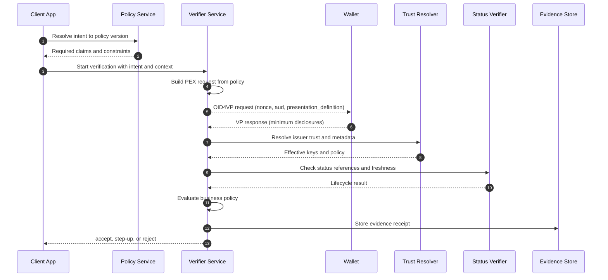

# Automated Compliance for Selective Disclosure: Policy-First Data Minimization with SD-JWT

> **Quick Facts**
>
> | | |
> |---|---|
> | Industry | Cross-industry (Finance, Healthcare, Government) |
> | Complexity | Medium |
> | Key Packages | `SdJwt.Net.PresentationExchange`, `SdJwt.Net.Oid4Vp`, `SdJwt.Net.StatusList` |
> | Sample | [AutomatedComplianceScenario.cs](../../samples/SdJwt.Net.Samples/RealWorld/Advanced/AutomatedComplianceScenario.cs) |

## Executive summary

Most compliance failures in credential ecosystems are not cryptographic failures. They are policy failures:

- Teams request more claims than required for a business intent.
- Reviewers cannot explain why each claim was necessary.
- Controls are implemented inconsistently across products and channels.

A production-grade approach is to make disclosure policy the first control, not the last check.

In this model:

- Transaction intent is mapped to an approved minimum-claim policy.
- The verifier request is generated from policy (not handwritten).
- Presentation verification enforces trust, freshness, and status.
- Evidence receipts prove what was requested, what was disclosed, and why a decision was made.

This article explains that workflow, how to implement it with the sd-jwt-dotnet ecosystem, and what evidence to retain for audits and incident response.

---

## 1) Why this matters: minimization fails in operations

In large organizations, over-disclosure usually happens through operational drift:

1. A team ships a "temporary" claim request to solve a support issue.
2. The request template is copied into other flows.
3. Governance reviews happen later, after the pattern is entrenched.

This creates real risk:

- Regulatory risk: weak purpose limitation and data minimization controls.
- Security risk: larger PII blast radius in logs, analytics, and AI pipelines.
- Operational risk: inconsistent outcomes and difficult audit trails.

The fix is to move from template-driven requests to policy-driven requests.

---

## 2) Current solutions teams use today (and why they fall short)

Most teams begin with reasonable controls:

- Static request templates in verifier services.
- Manual legal/compliance review before major releases.
- Post-release audits over request logs.

These controls are necessary but insufficient at scale:

- Template sprawl creates hidden over-requesting over time.
- Manual review cycles lag behind product and regulation changes.
- Post-hoc audits detect exposure after data has already moved through systems.

Evidence point: data minimization and purpose limitation are explicit legal principles in GDPR Article 5, so control drift becomes both a security and compliance issue.

---

## 3) Target operating model: policy-first disclosure governance

Treat disclosure policy as a first-class control plane.

### Control boundaries

- Policy owner defines approved claim sets by intent.
- Request builder converts policy into Presentation Exchange constraints.
- Verifier enforces cryptographic, trust, and lifecycle checks.
- Decision engine applies business logic only after verification passes.
- Audit sink records immutable evidence artifacts.

### Deterministic rule

If intent cannot be mapped to an approved policy version, fail closed.

---

## 4) End-to-end workflow: intent to evidence receipt



### Workflow explanation

1. **Intent resolution**: map user action to an approved policy artifact.
2. **Request construction**: generate PEX constraints from that artifact.
3. **Minimum disclosure**: wallet discloses only claims required by constraints.
4. **Cryptographic verification**: verify signatures and disclosure integrity.
5. **Trust verification**: resolve issuer trust (allow-list or federation).
6. **Lifecycle verification**: enforce status and freshness rules.
7. **Policy decision**: apply business rules after verification.
8. **Evidence persistence**: store immutable verification and decision artifacts.

---

## 5) Evidence model: what reviewers will ask for

A policy-first system is only defensible if evidence is complete.

| Review question               | Required evidence artifact                                            |
| ----------------------------- | --------------------------------------------------------------------- |
| Why was this claim requested? | `intent_code`, `policy_version`, generated PEX definition hash        |
| Was minimization enforced?    | Requested claim list vs disclosed claim hash set                      |
| Was issuer trust validated?   | Trust result, trust source, key identifiers, policy evaluation result |
| Was lifecycle checked?        | Status token hash, status value, freshness metadata                   |
| Why was decision X made?      | Decision code, rule version, reason codes                             |
| Can this be reproduced?       | Correlation ID, timestamp, verifier instance/build metadata           |

Recommended immutable evidence fields:

- `correlation_id`
- `intent_code`
- `policy_version`
- `presentation_definition_hash`
- `issuer_id` and key identifiers
- `status_result` and status token digest
- `disclosed_claim_hashes`
- `decision` and `reason_codes`
- `timestamp_utc`

---

## 6) How the SD-JWT ecosystem helps resolve this

### When to apply this architecture

Use this full pattern when all of the following are true:

- The same intent is served by multiple channels or products.
- You need deterministic, explainable data minimization decisions.
- You must produce audit evidence for \"why this claim was requested\".
- Trust and lifecycle checks (issuer trust, revocation/suspension) are required before decisions.

For simpler cases (single issuer, low-risk flow), you can start with `SdJwt.Net` + `SdJwt.Net.Vc` and add PEX/federation/status as requirements grow.

### How the packages work together

| Workflow step                      | Package(s)                                                                                                                                     | How it helps                                                                                      |
| ---------------------------------- | ---------------------------------------------------------------------------------------------------------------------------------------------- | ------------------------------------------------------------------------------------------------- |
| Build a request from policy        | [SdJwt.Net.PresentationExchange](../../src/SdJwt.Net.PresentationExchange/README.md), [SdJwt.Net.Oid4Vp](../../src/SdJwt.Net.Oid4Vp/README.md) | Converts policy constraints into a concrete, machine-evaluable verifier request.                  |
| Verify selective disclosures       | [SdJwt.Net](../../src/SdJwt.Net/README.md), [SdJwt.Net.Vc](../../src/SdJwt.Net.Vc/README.md)                                                   | Verifies signature, disclosure integrity, and VC structure so policy evaluates trusted data only. |
| Enforce issuer trust               | [SdJwt.Net.OidFederation](../../src/SdJwt.Net.OidFederation/README.md)                                                                         | Resolves trust chains and metadata policies in multi-issuer ecosystems.                           |
| Enforce credential lifecycle       | [SdJwt.Net.StatusList](../../src/SdJwt.Net.StatusList/README.md)                                                                               | Validates status references and freshness to prevent using revoked/suspended artifacts.           |
| Apply assurance profile (optional) | [SdJwt.Net.HAIP](../../src/SdJwt.Net.HAIP/README.md)                                                                                           | Adds high-assurance constraints where stronger interoperability and controls are required.        |

### Practical integration pattern

1. Resolve intent to approved policy version.
2. Generate PEX/OID4VP request from policy.
3. Verify SD-JWT VC presentation cryptographically.
4. Validate trust and status before business decisioning.
5. Persist evidence receipt with policy version, request hash, disclosed claim hashes, and decision codes.

### Relevant samples

- [AutomatedComplianceScenario.cs](../../samples/SdJwt.Net.Samples/RealWorld/Advanced/AutomatedComplianceScenario.cs)
- [PresentationExchangeExample.cs](../../samples/SdJwt.Net.Samples/Standards/PresentationExchange/PresentationExchangeExample.cs)
- [OpenId4VpExample.cs](../../samples/SdJwt.Net.Samples/Standards/OpenId/OpenId4VpExample.cs)
- [StatusListExample.cs](../../samples/SdJwt.Net.Samples/Standards/VerifiableCredentials/StatusListExample.cs)

These examples are application-level patterns around package primitives, which is exactly where policy orchestration should live.

---

## 7) Application-layer workflow example

```csharp
// Illustrative application service pattern.
public async Task<VerificationOutcome> EvaluateIntentAsync(
    string intentCode,
    VerificationContext context,
    CancellationToken ct)
{
    // 1) Resolve approved policy for this intent.
    var policy = await _policyStore.GetApprovedPolicyAsync(intentCode, ct)
        ?? throw new InvalidOperationException("No approved policy for intent.");

    // 2) Build constrained request from policy.
    var definition = _pexFactory.Create(policy);

    // 3) Run OID4VP flow and verify SD-JWT VC presentation.
    var vpResult = await _vpVerifier.VerifyAsync(context.Presentation, definition, ct);

    // 4) Enforce status and trust before business decision.
    var trustResult = await _trustEvaluator.EvaluateAsync(vpResult, ct);
    var statusResult = await _statusEvaluator.EvaluateAsync(vpResult, ct);

    var decision = _decisionEngine.Evaluate(policy, vpResult, trustResult, statusResult);

    // 5) Persist immutable evidence receipt.
    await _evidenceStore.WriteAsync(new EvidenceReceipt
    {
        CorrelationId = context.CorrelationId,
        IntentCode = intentCode,
        PolicyVersion = policy.Version,
        Decision = decision.Code,
        ReasonCodes = decision.ReasonCodes
    }, ct);

    return decision;
}
```

---

## 8) Rollout model and measurable outcomes

### Suggested rollout

1. Start with a high-volume intent that has clear claim requirements.
2. Define policy versioning and evidence schema before production cutover.
3. Deploy fail-closed policy resolution and monitor rejection reasons.
4. Expand intent catalog with change-control workflow.

### Metrics to track

- Reduction in average claims requested per intent.
- Percentage of requests generated from approved policy artifacts.
- Policy-resolution failure rate.
- Evidence completeness rate.
- Audit exception rate.

---

## Public references (URLs)

- RFC 9901 (SD-JWT): <https://www.rfc-editor.org/rfc/rfc9901.html>
- SD-JWT VC draft: <https://datatracker.ietf.org/doc/draft-ietf-oauth-sd-jwt-vc/>
- OAuth Token Status List draft: <https://datatracker.ietf.org/doc/draft-ietf-oauth-status-list/>
- OpenID4VP 1.0: <https://openid.net/specs/openid-4-verifiable-presentations-1_0.html>
- OpenID Federation 1.0: <https://openid.net/specs/openid-federation-1_0.html>
- DIF Presentation Exchange v2.1.1: <https://identity.foundation/presentation-exchange/spec/v2.1.1/>
- GDPR Article 5 principles (official text): <https://eur-lex.europa.eu/eli/reg/2016/679/oj/eng>

---

## Related Use Cases

| Use Case | Relationship |
|----------|-------------|
| [Incident Response](incident-response.md) | Complementary - containment after policy breach |
| [Financial AI](financial-ai.md) | Application - policy-first AI in finance |
| [Cross-Border Government](crossborder.md) | Application - EU data minimization requirements |

_Disclaimer: This article is informational and not legal advice. For regulated deployments, validate obligations with your legal/compliance teams and the latest official guidance._
