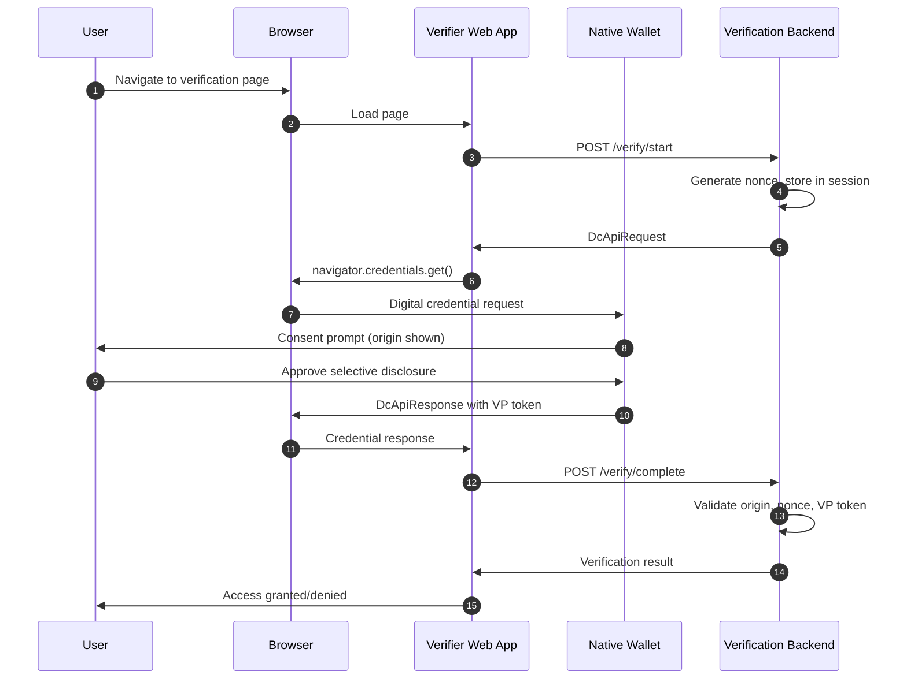
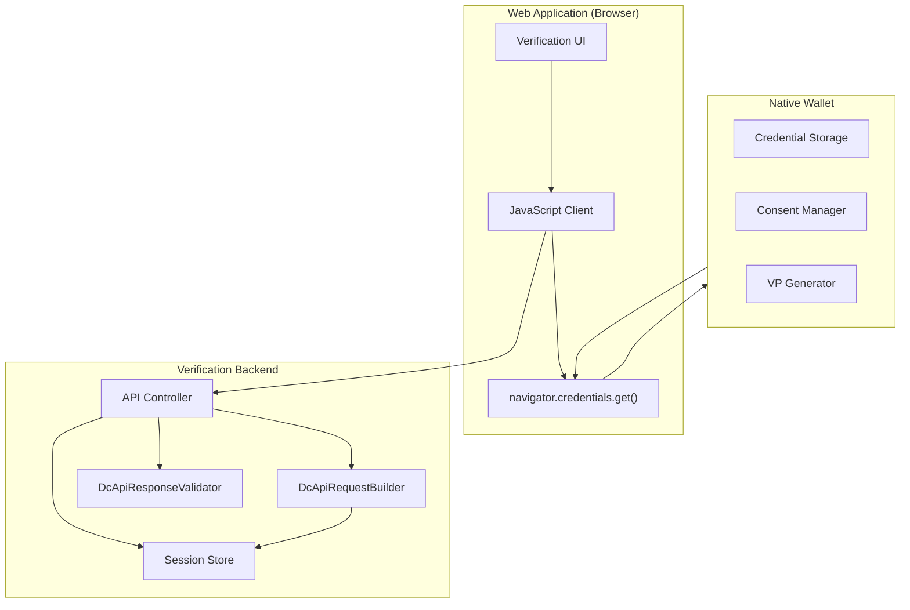
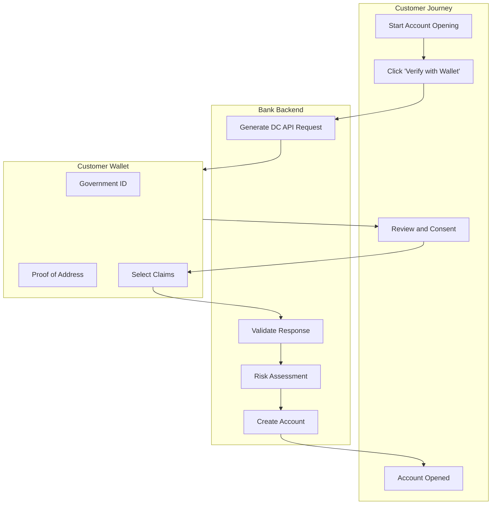

# Browser-Based Credential Verification with Digital Credentials API

> **Quick Facts**
>
> |              |                                                                                                                                                              |
> | ------------ | ------------------------------------------------------------------------------------------------------------------------------------------------------------ |
> | Industry     | E-Commerce / Financial Services / Healthcare / Government                                                                                                    |
> | Complexity   | Medium                                                                                                                                                       |
> | Key Packages | `SdJwt.Net.Oid4Vp`, `SdJwt.Net.PresentationExchange`, `SdJwt.Net.HAIP`                                                                                       |
> | Sample       | [DcApiVerification.cs](https://github.com/openwallet-foundation-labs/sd-jwt-dotnet/tree/main/samples/SdJwt.Net.Samples/04-UseCases/Web/DcApiVerification.cs) |

## Executive Summary

The W3C Digital Credentials API (DC API) transforms how web applications verify digital credentials. Instead of QR codes and app switching, users seamlessly present credentials from their native wallet through browser-integrated flows.

This creates an immediate business opportunity: web applications can verify age, identity, professional licenses, and other credentials without friction, improving conversion rates while maintaining security.

Key capabilities:

- **Seamless UX**: No QR codes or app switching required
- **Origin binding**: Built-in protection against phishing and CSRF
- **Multi-format support**: Works with SD-JWT VC and mdoc credentials
- **Privacy-preserving**: Selective disclosure reduces data exposure
- **HAIP compliance**: Meets high assurance security requirements

---

## 1) Why This Matters Now: Web Identity is Evolving

Web-based identity verification has historically relied on:

- Manual document uploads (error-prone, slow)
- Video verification calls (expensive, scaling challenges)
- Third-party identity services (privacy concerns, vendor lock-in)

The Digital Credentials API enables a new model where:

1. Users already have verified credentials in their digital wallet
2. Websites request only the specific claims needed
3. Verification happens instantly via cryptographic proof
4. Origin binding prevents credential theft and phishing

**Market drivers:**

- EU Digital Identity Wallet mandating wallet-based verification by 2026
- US states issuing mobile driving licenses accepted by TSA
- Growing privacy legislation limiting data collection
- Consumer demand for frictionless digital experiences

---

## 2) Architecture Pattern: Browser-Mediated Verification

### Diagram A: Complete DC API Verification Flow



### Diagram B: System Component Architecture



---

## 3) Use Case 1: Age Verification for E-Commerce

**Scenario**: Online retailer selling age-restricted products needs to verify customers are 21+ without collecting full birthdate.

### Business Requirements

- Verify age without storing sensitive PII
- Minimize checkout friction (reduce cart abandonment)
- Comply with state/federal regulations
- Audit trail for compliance

### Implementation

```csharp
using SdJwt.Net.Oid4Vp.DcApi;
using SdJwt.Net.Oid4Vp.Models;
using SdJwt.Net.PresentationExchange;

public class AgeVerificationService
{
    private readonly DcApiResponseValidator _validator;
    private readonly ISessionStore _sessions;

    public async Task<DcApiRequest> StartAgeVerification(string sessionId)
    {
        var nonce = GenerateSecureNonce();
        await _sessions.StoreAsync(sessionId, "nonce", nonce);

        // Request only age_over_21 claim - not full birthdate
        var presentationDefinition = new PresentationDefinition
        {
            Id = $"age-verification-{sessionId}",
            InputDescriptors = new[]
            {
                new InputDescriptor
                {
                    Id = "age_attestation",
                    Format = new Dictionary<string, InputDescriptorFormat>
                    {
                        ["vc+sd-jwt"] = new InputDescriptorFormat
                        {
                            Alg = new[] { "ES256" }
                        }
                    },
                    Constraints = new Constraints
                    {
                        LimitDisclosure = LimitDisclosure.Required,
                        Fields = new[]
                        {
                            new Field
                            {
                                Path = new[] { "$.vc.credentialSubject.age_over_21" },
                                Filter = new Filter
                                {
                                    Type = "boolean",
                                    Const = true
                                }
                            }
                        }
                    }
                }
            }
        };

        return new DcApiRequestBuilder()
            .WithClientId("https://retailer.example.com")
            .WithNonce(nonce)
            .WithPresentationDefinition(presentationDefinition)
            .Build();
    }

    public async Task<AgeVerificationResult> CompleteAgeVerification(
        string sessionId,
        DcApiResponse response)
    {
        var expectedNonce = await _sessions.GetAsync<string>(sessionId, "nonce");

        var result = await _validator.ValidateAsync(response, new DcApiValidationOptions
        {
            ExpectedOrigin = "https://retailer.example.com",
            ExpectedNonce = expectedNonce,
            ValidateOrigin = true,
            MaxAge = TimeSpan.FromMinutes(5)
        });

        if (!result.IsValid)
        {
            return AgeVerificationResult.Failed(result.ErrorCode);
        }

        // Extract the boolean age claim
        var ageOver21 = ExtractAgeClaim(result.Credentials);

        // Create audit record (without storing PII)
        await CreateAuditRecord(sessionId, ageOver21, result.CredentialIssuer);

        return new AgeVerificationResult
        {
            Verified = ageOver21,
            IssuerTrusted = await IsTrustedIssuer(result.CredentialIssuer)
        };
    }
}
```

### Frontend Integration

```javascript
class AgeVerificationClient {
  async verifyAge() {
    // Start verification session
    const response = await fetch("/api/age/start", { method: "POST" });
    const request = await response.json();

    // Request credential via DC API
    const credential = await navigator.credentials.get({
      digital: {
        providers: [
          {
            protocol: request.protocol,
            request: request.request,
          },
        ],
      },
    });

    if (!credential) {
      return { verified: false, reason: "user_cancelled" };
    }

    // Complete verification
    const result = await fetch("/api/age/complete", {
      method: "POST",
      headers: { "Content-Type": "application/json" },
      body: JSON.stringify(credential),
    });

    return await result.json();
  }
}
```

### Privacy Benefits

| Traditional Approach   | DC API Approach          |
| ---------------------- | ------------------------ |
| Collect full birthdate | Request only age_over_21 |
| Store PII in database  | No PII stored            |
| Data breach risk       | Nothing to breach        |
| Complex compliance     | Privacy by design        |

---

## 4) Use Case 2: Professional License Verification

**Scenario**: Healthcare platform needs to verify that practitioners have valid medical licenses before granting system access.

### Business Requirements

- Verify license is current and not revoked
- Confirm license jurisdiction matches service area
- Real-time verification (no multi-day delays)
- Integrate with existing SSO flow

### Implementation

```csharp
using SdJwt.Net.Oid4Vp.DcApi;
using SdJwt.Net.HAIP;

public class LicenseVerificationService
{
    private readonly DcApiResponseValidator _validator;
    private readonly HaipCryptoValidator _haipValidator;

    public async Task<DcApiRequest> StartLicenseVerification(
        string sessionId,
        string[] requiredJurisdictions)
    {
        var nonce = GenerateSecureNonce();

        var presentationDefinition = new PresentationDefinition
        {
            Id = $"license-verification-{sessionId}",
            InputDescriptors = new[]
            {
                new InputDescriptor
                {
                    Id = "medical_license",
                    Name = "Medical License",
                    Purpose = "Verify practitioner license for platform access",
                    Format = new Dictionary<string, InputDescriptorFormat>
                    {
                        ["vc+sd-jwt"] = new InputDescriptorFormat
                        {
                            Alg = new[] { "ES256", "ES384" }
                        }
                    },
                    Constraints = new Constraints
                    {
                        Fields = new[]
                        {
                            // License number
                            new Field
                            {
                                Path = new[] { "$.vc.credentialSubject.license_number" }
                            },
                            // License type (MD, DO, NP, etc.)
                            new Field
                            {
                                Path = new[] { "$.vc.credentialSubject.license_type" },
                                Filter = new Filter
                                {
                                    Type = "string",
                                    Enum = new[] { "MD", "DO", "NP", "PA" }
                                }
                            },
                            // Jurisdiction must be in service area
                            new Field
                            {
                                Path = new[] { "$.vc.credentialSubject.jurisdiction" },
                                Filter = new Filter
                                {
                                    Type = "string",
                                    Enum = requiredJurisdictions
                                }
                            },
                            // Expiration date must be in future
                            new Field
                            {
                                Path = new[] { "$.vc.credentialSubject.expiration_date" }
                            }
                        }
                    }
                }
            }
        };

        return new DcApiRequestBuilder()
            .WithClientId("https://healthplatform.example.com")
            .WithNonce(nonce)
            .WithPresentationDefinition(presentationDefinition)
            .WithResponseMode(DcApiResponseMode.DcApiJwt) // Encrypted for PII
            .Build();
    }

    public async Task<LicenseVerificationResult> CompleteLicenseVerification(
        string sessionId,
        DcApiResponse response)
    {
        var expectedNonce = await GetStoredNonce(sessionId);

        var result = await _validator.ValidateAsync(response, new DcApiValidationOptions
        {
            ExpectedOrigin = "https://healthplatform.example.com",
            ExpectedNonce = expectedNonce,
            ValidateOrigin = true
        });

        if (!result.IsValid)
        {
            return LicenseVerificationResult.Failed(result.ErrorCode);
        }

        // Validate HAIP compliance
        var haipResult = _haipValidator.ValidateAlgorithm(
            result.Algorithm,
            HaipSecurityLevel.Level2);

        if (!haipResult.IsValid)
        {
            return LicenseVerificationResult.Failed("insufficient_security");
        }

        // Check expiration
        var license = ExtractLicense(result.Credentials);
        if (license.ExpirationDate < DateTime.UtcNow)
        {
            return LicenseVerificationResult.Failed("license_expired");
        }

        // Verify issuer is a recognized licensing board
        if (!await IsRecognizedLicensingBoard(result.CredentialIssuer))
        {
            return LicenseVerificationResult.Failed("untrusted_issuer");
        }

        return LicenseVerificationResult.Success(license);
    }
}
```

---

## 5) Use Case 3: Financial Services KYC

**Scenario**: Bank needs to verify customer identity for account opening while minimizing PII collection.

### Diagram: KYC Flow with DC API



### Implementation with Multiple Credentials

```csharp
public class KycVerificationService
{
    public async Task<DcApiRequest> StartKycVerification(string sessionId)
    {
        var presentationDefinition = new PresentationDefinition
        {
            Id = $"kyc-{sessionId}",
            InputDescriptors = new[]
            {
                // Government-issued ID
                new InputDescriptor
                {
                    Id = "government_id",
                    Name = "Government ID",
                    Purpose = "Verify identity for account opening",
                    Group = new[] { "identity" },
                    Format = new Dictionary<string, InputDescriptorFormat>
                    {
                        ["vc+sd-jwt"] = new() { Alg = new[] { "ES256" } },
                        ["mso_mdoc"] = new()
                    },
                    Constraints = new Constraints
                    {
                        LimitDisclosure = LimitDisclosure.Required,
                        Fields = new[]
                        {
                            new Field { Path = new[] { "$.family_name", "$.vc.credentialSubject.family_name" } },
                            new Field { Path = new[] { "$.given_name", "$.vc.credentialSubject.given_name" } },
                            new Field { Path = new[] { "$.birth_date", "$.vc.credentialSubject.birth_date" } }
                        }
                    }
                },
                // Proof of address
                new InputDescriptor
                {
                    Id = "proof_of_address",
                    Name = "Proof of Address",
                    Purpose = "Verify residential address",
                    Group = new[] { "residence" },
                    Constraints = new Constraints
                    {
                        LimitDisclosure = LimitDisclosure.Required,
                        Fields = new[]
                        {
                            new Field { Path = new[] { "$.vc.credentialSubject.address.country" } },
                            new Field { Path = new[] { "$.vc.credentialSubject.address.locality" } }
                        }
                    }
                }
            },
            SubmissionRequirements = new[]
            {
                new SubmissionRequirement
                {
                    Rule = SubmissionRule.All,
                    From = "identity"
                },
                new SubmissionRequirement
                {
                    Rule = SubmissionRule.Pick,
                    Count = 1,
                    From = "residence"
                }
            }
        };

        return new DcApiRequestBuilder()
            .WithClientId("https://bank.example.com")
            .WithNonce(GenerateSecureNonce())
            .WithPresentationDefinition(presentationDefinition)
            .WithResponseMode(DcApiResponseMode.DcApiJwt)
            .Build();
    }
}
```

---

## 6) Security Considerations

### Origin Validation is Critical

Always validate the response origin against your expected client_id:

```csharp
var result = await _validator.ValidateAsync(response, new DcApiValidationOptions
{
    ExpectedOrigin = "https://yoursite.example.com",
    ValidateOrigin = true // Never set to false in production
});
```

**Why this matters:**

- Prevents attacker sites from using credentials requested from your site
- User sees the actual requesting origin in consent dialog
- Cryptographically bound in mdoc session transcript

### Use Encrypted Response Mode for Sensitive Data

```csharp
// For credentials containing PII
.WithResponseMode(DcApiResponseMode.DcApiJwt)
```

### Validate Credential Freshness

```csharp
var result = await _validator.ValidateAsync(response, new DcApiValidationOptions
{
    MaxAge = TimeSpan.FromMinutes(5),
    ClockSkew = TimeSpan.FromSeconds(30)
});
```

### Trust Framework Validation

Always verify the credential issuer is trusted for your use case:

```csharp
if (!await IsTrustedIssuer(result.CredentialIssuer, "age_verification"))
{
    return VerificationResult.Failed("untrusted_issuer");
}
```

---

## 7) Implementation Checklist

### Development

- [ ] Set up `DcApiRequestBuilder` with correct origin
- [ ] Implement nonce generation and storage
- [ ] Configure `DcApiResponseValidator` with VP token validation
- [ ] Create presentation definitions for your use cases
- [ ] Implement error handling for all validation failures
- [ ] Add frontend JavaScript integration

### Security

- [ ] Enable origin validation (never disable in production)
- [ ] Use encrypted response mode for sensitive credentials
- [ ] Validate credential freshness
- [ ] Verify issuer against trust framework
- [ ] Implement rate limiting on verification endpoints
- [ ] Add audit logging for compliance

### Testing

- [ ] Test with wallet emulators during development
- [ ] Verify error handling for user cancellation
- [ ] Test timeout scenarios
- [ ] Validate cross-browser behavior
- [ ] Test with both SD-JWT VC and mdoc credentials

---

## 8) Business Impact Summary

| Metric                | Traditional Verification | DC API Verification |
| --------------------- | ------------------------ | ------------------- |
| Verification time     | Minutes to days          | Seconds             |
| User drop-off         | 30-50%                   | <10%                |
| PII stored            | Full records             | Minimal/none        |
| Cost per verification | $1-10+                   | Infrastructure only |
| Compliance complexity | High                     | Built-in            |
| Fraud prevention      | Manual review            | Cryptographic proof |

---

## Related Documentation

- [DC API Deep Dive](../concepts/dc-api-deep-dive.md) - Technical implementation details
- [OpenID4VP Deep Dive](../concepts/openid4vp-deep-dive.md) - Underlying protocol
- [Presentation Exchange](../concepts/presentation-exchange-deep-dive.md) - Credential query language
- [mdoc Identity Verification](mdoc-identity-verification.md) - Mobile document verification

## References

- W3C Digital Credentials API: <https://wicg.github.io/digital-credentials/>
- OpenID4VP Specification: <https://openid.net/specs/openid-4-verifiable-presentations-1_0.html>
- HAIP Specification: <https://openid.net/specs/openid4vc-high-assurance-interoperability-profile-1_0.html>
