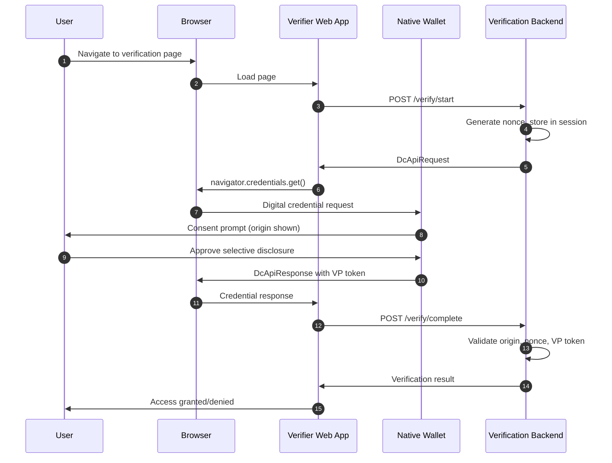
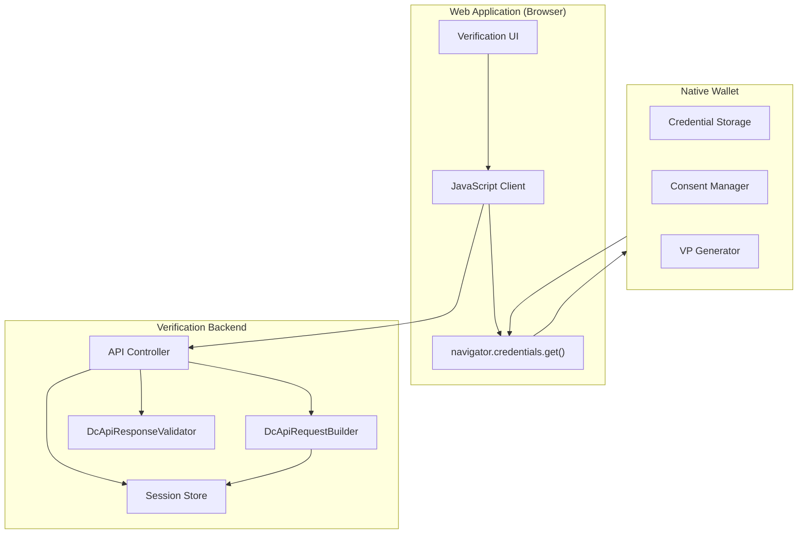
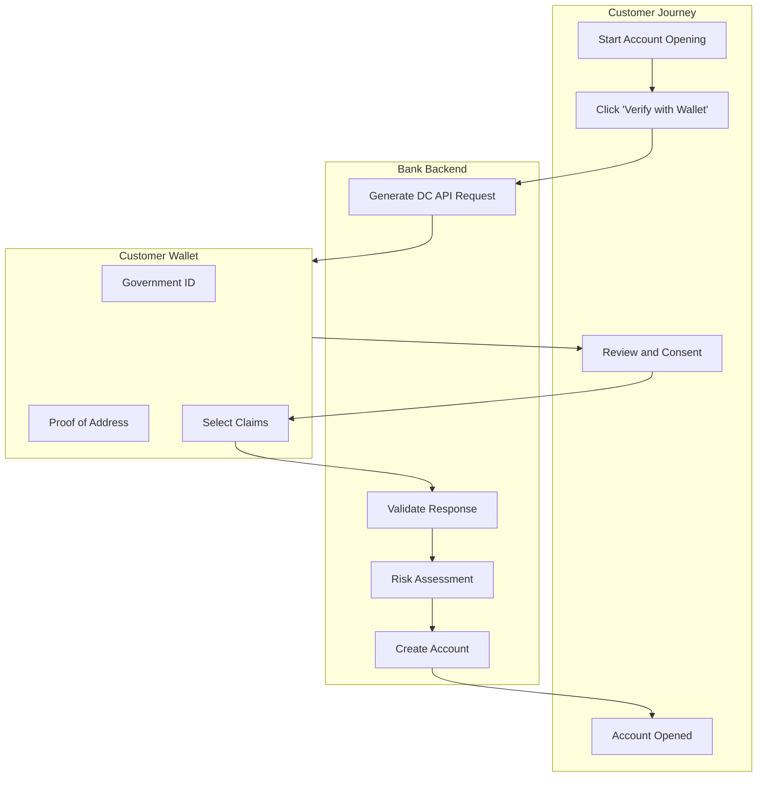

# Browser-Based Credential Verification with Digital Credentials API

> **Quick Facts**
>
> |              |                                                                                                                            |
> | ------------ | -------------------------------------------------------------------------------------------------------------------------- |
> | Industry     | E-Commerce / Financial Services / Healthcare / Government                                                                  |
> | Complexity   | Medium                                                                                                                     |
> | Key Packages | `SdJwt.Net.Oid4Vp`, `SdJwt.Net.PresentationExchange`, `SdJwt.Net.HAIP`                                                     |
> | Sample       | [04-UseCases](https://github.com/openwallet-foundation-labs/sd-jwt-dotnet/tree/main/samples/SdJwt.Net.Samples/04-UseCases) |

## Executive summary

The W3C Digital Credentials API (DC API) lets web applications verify digital credentials through the browser itself. Instead of QR codes and app switching, users present credentials directly from their native wallet through browser-integrated flows.

This gives web applications a direct path to verify age, identity, professional licenses, and other credentials without friction, improving conversion rates while maintaining security.

Key capabilities:

- **Browser-native UX**: No QR codes or app switching required
- **Origin binding**: Built-in protection against phishing and CSRF
- **Multi-format support**: Works with SD-JWT VC and mdoc credentials
- **Privacy-preserving**: Selective disclosure reduces data exposure
- **HAIP profile validation**: Validates selected HAIP Final flows and credential profiles

---

## In plain English

Websites today verify identity through uploaded documents or third-party redirects, both of which are friction-heavy and share more data than necessary. The W3C Digital Credentials API lets browsers natively present verifiable credentials - just like a password manager fills login forms, but for identity attributes. A website can request proof of age, professional license, or KYC status, and the browser handles the credential presentation securely. The user sees what will be shared and approves it, with no document uploads and no third-party redirects.

## What SD-JWT .NET provides

**Provides:** SD-JWT VC verification for credential responses, DCQL query construction for credential requests, HAIP profile validation for security requirements, and OID4VP protocol models for the presentation flow.

**Does not provide:** Browser-side JavaScript implementation, Digital Credentials API polyfills, wallet UI components, or browser extension code. The library handles server-side credential verification; your frontend code interacts with the browser API.

## Risks and limitations

- The Digital Credentials API is a W3C draft; browser support is limited to Chrome origin trials as of mid-2025
- Wallet availability varies by platform and region
- Server-side verification requires trust framework participation (trusted issuer lists)
- Progressive enhancement is essential: applications must work without credential API support

---

## 1) Why this matters now: web identity is evolving

Web-based identity verification has historically relied on manual document uploads, video verification calls, and third-party identity services. Each approach has well-known costs: slow turnaround, high expense, privacy exposure, or vendor lock-in.

The Digital Credentials API enables a different model:

1. Users already have verified credentials in their digital wallet.
2. Websites request only the specific claims needed.
3. Verification happens instantly via cryptographic proof.
4. Origin binding prevents credential theft and phishing.

Market drivers:

- EU Digital Identity Wallet mandating wallet-based verification by 2026
- US states issuing mobile driving licenses accepted by TSA
- Growing privacy legislation limiting data collection
- Consumer demand for frictionless digital experiences

---

## 2) Architecture pattern: browser-mediated verification

### Diagram A: Complete DC API verification flow


```mermaid
sequenceDiagram
    autonumber
    participant User as User
    participant Browser as Browser
    participant Verifier as Verifier Web App
    participant Wallet as Native Wallet
    participant Backend as Verification Backend

    User->>Browser: Navigate to verification page
    Browser->>Verifier: Load page
    Verifier->>Backend: POST /verify/start
    Backend->>Backend: Generate nonce, store in session
    Backend->>Verifier: DcApiRequest
    Verifier->>Browser: navigator.credentials.get()
    Browser->>Wallet: Digital credential request
    Wallet->>User: Consent prompt (origin shown)
    User->>Wallet: Approve selective disclosure
    Wallet->>Browser: DcApiResponse with VP token
    Browser->>Verifier: Credential response
    Verifier->>Backend: POST /verify/complete
    Backend->>Backend: Validate origin, nonce, VP token
    Backend->>Verifier: Verification result
    Verifier->>User: Access granted/denied
```

### Diagram B: System component architecture


```mermaid
flowchart TB
    subgraph Frontend["Web Application (Browser)"]
        UI["Verification UI"]
        JS["JavaScript Client"]
        DCAPI["navigator.credentials.get()"]
    end

    subgraph Backend["Verification Backend"]
        API["API Controller"]
        Builder["DcApiRequestBuilder"]
        Validator["DcApiResponseValidator"]
        Session["Session Store"]
    end

    subgraph Wallet["Native Wallet"]
        Storage["Credential Storage"]
        Consent["Consent Manager"]
        VP["VP Generator"]
    end

    UI --> JS
    JS --> DCAPI
    DCAPI --> Wallet
    Wallet --> DCAPI
    JS --> API
    API --> Builder
    API --> Validator
    API --> Session
    Builder --> Session
```

---

## 3) Use case 1: age verification for e-commerce

**Scenario**: Online retailer selling age-restricted products needs to verify customers are 21+ without collecting full birthdate.

### Business requirements

- Verify age without storing sensitive PII
- Minimize checkout friction (reduce cart abandonment)
- Comply with state/federal regulations
- Audit trail for compliance

### Implementation

```csharp
using SdJwt.Net.Oid4Vp.DcApi;
using SdJwt.Net.Oid4Vp.Models;
using SdJwt.Net.PresentationExchange;

public class AgeVerificationService
{
    private readonly DcApiResponseValidator _validator;
    private readonly ISessionStore _sessions;

    public async Task<DcApiRequest> StartAgeVerification(string sessionId)
    {
        var nonce = GenerateSecureNonce();
        await _sessions.StoreAsync(sessionId, "nonce", nonce);

        // Request only age_over_21 claim - not full birthdate
        var presentationDefinition = new PresentationDefinition
        {
            Id = $"age-verification-{sessionId}",
            InputDescriptors = new[]
            {
                new InputDescriptor
                {
                    Id = "age_attestation",
                    Format = new Dictionary<string, InputDescriptorFormat>
                    {
                        ["dc+sd-jwt"] = new InputDescriptorFormat
                        {
                            Alg = new[] { "ES256" }
                        }
                    },
                    Constraints = new Constraints
                    {
                        LimitDisclosure = LimitDisclosure.Required,
                        Fields = new[]
                        {
                            new Field
                            {
                                Path = new[] { "$.vc.credentialSubject.age_over_21" },
                                Filter = new Filter
                                {
                                    Type = "boolean",
                                    Const = true
                                }
                            }
                        }
                    }
                }
            }
        };

        return new DcApiRequestBuilder()
            .WithClientId("https://retailer.example.com")
            .WithNonce(nonce)
            .WithPresentationDefinition(presentationDefinition)
            .Build();
    }

    public async Task<AgeVerificationResult> CompleteAgeVerification(
        string sessionId,
        DcApiResponse response)
    {
        var expectedNonce = await _sessions.GetAsync<string>(sessionId, "nonce");

        var result = await _validator.ValidateAsync(response, new DcApiValidationOptions
        {
            ExpectedOrigin = "https://retailer.example.com",
            ExpectedNonce = expectedNonce,
            ValidateOrigin = true,
            MaxAge = TimeSpan.FromMinutes(5)
        });

        if (!result.IsValid)
        {
            return AgeVerificationResult.Failed(result.ErrorCode);
        }

        // Extract the boolean age claim
        var ageOver21 = ExtractAgeClaim(result.VerifiedCredentials);

        // Create audit record (without storing PII)
        await CreateAuditRecord(sessionId, ageOver21, result.CredentialIssuer);

        return new AgeVerificationResult
        {
            Verified = ageOver21,
            IssuerTrusted = await IsTrustedIssuer(result.CredentialIssuer)
        };
    }
}
```

### Frontend integration

```javascript
class AgeVerificationClient {
  async verifyAge() {
    // Start verification session
    const response = await fetch("/api/age/start", { method: "POST" });
    const request = await response.json();

    // Request credential via DC API
    const credential = await navigator.credentials.get(request);

    if (!credential) {
      return { verified: false, reason: "user_cancelled" };
    }

    // Complete verification
    const result = await fetch("/api/age/complete", {
      method: "POST",
      headers: { "Content-Type": "application/json" },
      body: JSON.stringify(credential),
    });

    return await result.json();
  }
}
```

### Privacy benefits

| Traditional Approach   | DC API Approach          |
| ---------------------- | ------------------------ |
| Collect full birthdate | Request only age_over_21 |
| Store PII in database  | No PII stored            |
| Data breach risk       | Nothing to breach        |
| Complex compliance     | Privacy by design        |

---

## 4) Use case 2: professional license verification

**Scenario**: Healthcare platform needs to verify that practitioners have valid medical licenses before granting system access.

### Requirements

- Verify license is current and not revoked
- Confirm license jurisdiction matches service area
- Real-time verification (no multi-day delays)
- Integrate with existing SSO flow

### Implementation

```csharp
using SdJwt.Net.Oid4Vp.DcApi;
using SdJwt.Net.HAIP;
using SdJwt.Net.HAIP.Validators;

public class LicenseVerificationService
{
    private readonly DcApiResponseValidator _validator;
    private readonly HaipProfileValidator _haipValidator = new();

    public async Task<DcApiRequest> StartLicenseVerification(
        string sessionId,
        string[] requiredJurisdictions)
    {
        var nonce = GenerateSecureNonce();

        var presentationDefinition = new PresentationDefinition
        {
            Id = $"license-verification-{sessionId}",
            InputDescriptors = new[]
            {
                new InputDescriptor
                {
                    Id = "medical_license",
                    Name = "Medical License",
                    Purpose = "Verify practitioner license for platform access",
                    Format = new Dictionary<string, InputDescriptorFormat>
                    {
                        ["dc+sd-jwt"] = new InputDescriptorFormat
                        {
                            Alg = new[] { "ES256", "ES384" }
                        }
                    },
                    Constraints = new Constraints
                    {
                        Fields = new[]
                        {
                            // License number
                            new Field
                            {
                                Path = new[] { "$.vc.credentialSubject.license_number" }
                            },
                            // License type (MD, DO, NP, etc.)
                            new Field
                            {
                                Path = new[] { "$.vc.credentialSubject.license_type" },
                                Filter = new Filter
                                {
                                    Type = "string",
                                    Enum = new[] { "MD", "DO", "NP", "PA" }
                                }
                            },
                            // Jurisdiction must be in service area
                            new Field
                            {
                                Path = new[] { "$.vc.credentialSubject.jurisdiction" },
                                Filter = new Filter
                                {
                                    Type = "string",
                                    Enum = requiredJurisdictions
                                }
                            },
                            // Expiration date must be in future
                            new Field
                            {
                                Path = new[] { "$.vc.credentialSubject.expiration_date" }
                            }
                        }
                    }
                }
            }
        };

        return new DcApiRequestBuilder()
            .WithClientId("https://healthplatform.example.com")
            .WithNonce(nonce)
            .WithPresentationDefinition(presentationDefinition)
            .WithResponseMode(DcApiResponseMode.DcApiJwt) // Encrypted for PII
            .Build();
    }

    public async Task<LicenseVerificationResult> CompleteLicenseVerification(
        string sessionId,
        DcApiResponse response)
    {
        var expectedNonce = await GetStoredNonce(sessionId);

        var result = await _validator.ValidateAsync(response, new DcApiValidationOptions
        {
            ExpectedOrigin = "https://healthplatform.example.com",
            ExpectedNonce = expectedNonce,
            ValidateOrigin = true
        });

        if (!result.IsValid)
        {
            return LicenseVerificationResult.Failed(result.ErrorCode);
        }

        var haipOptions = new HaipProfileOptions();
        haipOptions.Flows.Add(HaipFlow.Oid4VpDigitalCredentialsApiPresentation);
        haipOptions.CredentialProfiles.Add(HaipCredentialProfile.SdJwtVc);
        haipOptions.SupportedCredentialFormats.Add(HaipConstants.SdJwtVcFormat);
        haipOptions.SupportedJoseAlgorithms.Add(HaipConstants.RequiredJoseAlgorithm);
        haipOptions.SupportedHashAlgorithms.Add(HaipConstants.RequiredHashAlgorithm);
        haipOptions.SupportsDigitalCredentialsApi = true;
        haipOptions.SupportsDcql = true;
        haipOptions.SupportsSdJwtVcCompactSerialization = true;
        haipOptions.UsesCnfJwkForSdJwtVcHolderBinding = true;
        haipOptions.RequiresKbJwtForHolderBoundSdJwtVc = true;
        haipOptions.SupportsStatusListClaim = true;
        haipOptions.SupportsSdJwtVcIssuerX5c = true;

        var haipResult = _haipValidator.Validate(haipOptions);
        if (!haipResult.IsCompliant)
        {
            return LicenseVerificationResult.Failed("insufficient_security");
        }

        // Check expiration
        var license = ExtractLicense(result.VerifiedCredentials);
        if (license.ExpirationDate < DateTime.UtcNow)
        {
            return LicenseVerificationResult.Failed("license_expired");
        }

        // Verify issuer is a recognized licensing board
        if (!await IsRecognizedLicensingBoard(result.CredentialIssuer))
        {
            return LicenseVerificationResult.Failed("untrusted_issuer");
        }

        return LicenseVerificationResult.Success(license);
    }
}
```

---

## 5) Use case 3: financial services KYC

**Scenario**: Bank needs to verify customer identity for account opening while minimizing PII collection.

### Diagram: KYC flow with DC API


```mermaid
flowchart TB
    subgraph Customer["Customer Journey"]
        Start["Start Account Opening"]
        Verify["Click 'Verify with Wallet'"]
        Consent["Review and Consent"]
        Complete["Account Opened"]
    end

    subgraph Bank["Bank Backend"]
        Request["Generate DC API Request"]
        Validate["Validate Response"]
        Risk["Risk Assessment"]
        Create["Create Account"]
    end

    subgraph Wallet["Customer Wallet"]
        ID["Government ID"]
        Address["Proof of Address"]
        Select["Select Claims"]
    end

    Start --> Verify
    Verify --> Request
    Request --> Wallet
    Wallet --> Consent
    Consent --> Select
    Select --> Validate
    Validate --> Risk
    Risk --> Create
    Create --> Complete
```

### Implementation with multiple credentials

```csharp
public class KycVerificationService
{
    public async Task<DcApiRequest> StartKycVerification(string sessionId)
    {
        var presentationDefinition = new PresentationDefinition
        {
            Id = $"kyc-{sessionId}",
            InputDescriptors = new[]
            {
                // Government-issued ID
                new InputDescriptor
                {
                    Id = "government_id",
                    Name = "Government ID",
                    Purpose = "Verify identity for account opening",
                    Group = new[] { "identity" },
                    Format = new Dictionary<string, InputDescriptorFormat>
                    {
                        ["dc+sd-jwt"] = new() { Alg = new[] { "ES256" } },
                        ["mso_mdoc"] = new()
                    },
                    Constraints = new Constraints
                    {
                        LimitDisclosure = LimitDisclosure.Required,
                        Fields = new[]
                        {
                            new Field { Path = new[] { "$.family_name", "$.vc.credentialSubject.family_name" } },
                            new Field { Path = new[] { "$.given_name", "$.vc.credentialSubject.given_name" } },
                            new Field { Path = new[] { "$.birth_date", "$.vc.credentialSubject.birth_date" } }
                        }
                    }
                },
                // Proof of address
                new InputDescriptor
                {
                    Id = "proof_of_address",
                    Name = "Proof of Address",
                    Purpose = "Verify residential address",
                    Group = new[] { "residence" },
                    Constraints = new Constraints
                    {
                        LimitDisclosure = LimitDisclosure.Required,
                        Fields = new[]
                        {
                            new Field { Path = new[] { "$.vc.credentialSubject.address.country" } },
                            new Field { Path = new[] { "$.vc.credentialSubject.address.locality" } }
                        }
                    }
                }
            },
            SubmissionRequirements = new[]
            {
                new SubmissionRequirement
                {
                    Rule = SubmissionRule.All,
                    From = "identity"
                },
                new SubmissionRequirement
                {
                    Rule = SubmissionRule.Pick,
                    Count = 1,
                    From = "residence"
                }
            }
        };

        return new DcApiRequestBuilder()
            .WithClientId("https://bank.example.com")
            .WithNonce(GenerateSecureNonce())
            .WithPresentationDefinition(presentationDefinition)
            .WithResponseMode(DcApiResponseMode.DcApiJwt)
            .Build();
    }
}
```

---

## 6) Security considerations

### Origin validation is critical

Always validate the response origin against your expected client_id:

```csharp
var result = await _validator.ValidateAsync(response, new DcApiValidationOptions
{
    ExpectedOrigin = "https://yoursite.example.com",
    ValidateOrigin = true // Never set to false in production
});
```

Why this matters:

- Prevents attacker sites from using credentials requested from your site
- User sees the actual requesting origin in consent dialog
- Cryptographically bound in mdoc session transcript

### Use encrypted response mode for sensitive data

```csharp
// For credentials containing PII
.WithResponseMode(DcApiResponseMode.DcApiJwt)
```

### Validate credential freshness

```csharp
var result = await _validator.ValidateAsync(response, new DcApiValidationOptions
{
    MaxAge = TimeSpan.FromMinutes(5),
    ClockSkew = TimeSpan.FromSeconds(30)
});
```

### Trust framework validation

Always verify the credential issuer is trusted for your use case:

```csharp
if (!await IsTrustedIssuer(result.CredentialIssuer, "age_verification"))
{
    return VerificationResult.Failed("untrusted_issuer");
}
```

---

## 7) Implementation checklist

### Development

- [ ] Set up `DcApiRequestBuilder` with correct origin
- [ ] Implement nonce generation and storage
- [ ] Configure `DcApiResponseValidator` with VP token validation
- [ ] Create presentation definitions for your use cases
- [ ] Implement error handling for all validation failures
- [ ] Add frontend JavaScript integration

### Security

- [ ] Enable origin validation (never disable in production)
- [ ] Use encrypted response mode for sensitive credentials
- [ ] Validate credential freshness
- [ ] Verify issuer against trust framework
- [ ] Implement rate limiting on verification endpoints
- [ ] Add audit logging for compliance

### Testing

- [ ] Test with wallet emulators during development
- [ ] Verify error handling for user cancellation
- [ ] Test timeout scenarios
- [ ] Validate cross-browser behavior
- [ ] Test with both SD-JWT VC and mdoc credentials

---

## 8) Business impact summary

| Metric                | Traditional Verification | DC API Verification |
| --------------------- | ------------------------ | ------------------- |
| Verification time     | Minutes to days          | Seconds             |
| User drop-off         | 30-50%                   | <10%                |
| PII stored            | Full records             | Minimal/none        |
| Cost per verification | $1-10+                   | Infrastructure only |
| Compliance complexity | High                     | Built-in            |
| Fraud prevention      | Manual review            | Cryptographic proof |

---

## Related documentation

- [DC API](../concepts/dc-api.md) - Technical implementation details
- [OpenID4VP](../concepts/openid4vp.md) - Underlying protocol
- [Presentation Exchange](../concepts/presentation-exchange.md) - Credential query language
- [mdoc Identity Verification](mdoc-identity-verification.md) - Mobile document verification

## References

- W3C Digital Credentials API: <https://www.w3.org/TR/digital-credentials/>
- OpenID4VP Specification: <https://openid.net/specs/openid-4-verifiable-presentations-1_0.html>
- HAIP Specification: <https://openid.net/specs/openid4vc-high-assurance-interoperability-profile-1_0.html>
