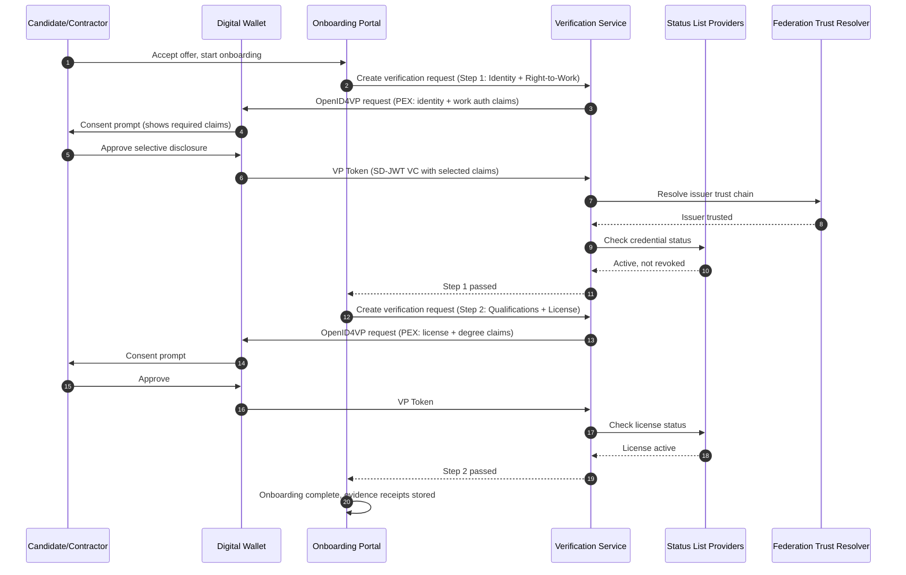
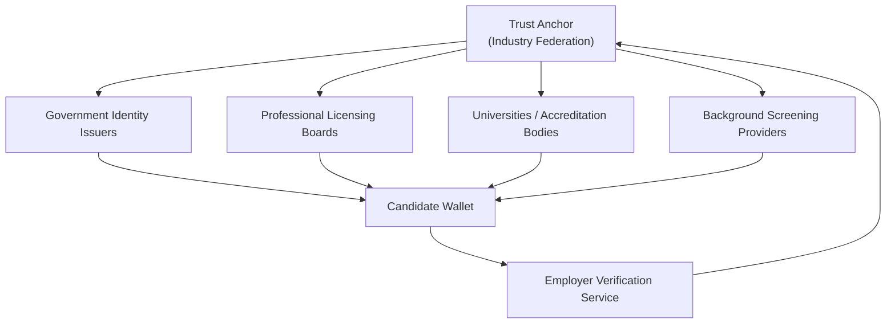
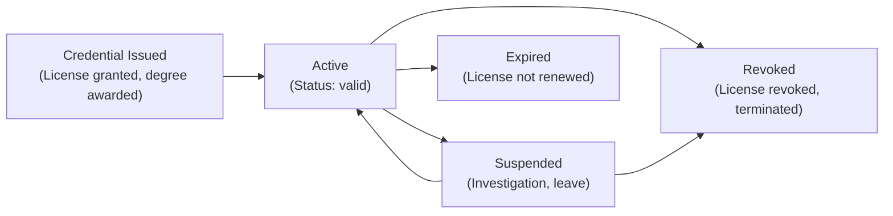

# Enterprise KYC and Workforce Onboarding: Verifiable Credentials for Identity, Right-to-Work, and Professional Licensing

> **Quick Facts**
>
> |              |                                                                                                                                              |
> | ------------ | -------------------------------------------------------------------------------------------------------------------------------------------- |
> | Industry     | Enterprise HR / Financial Services / Professional Services                                                                                   |
> | Complexity   | Medium                                                                                                                                       |
> | Key Packages | `SdJwt.Net.Vc`, `SdJwt.Net.Oid4Vci`, `SdJwt.Net.Oid4Vp`, `SdJwt.Net.PresentationExchange`, `SdJwt.Net.StatusList`, `SdJwt.Net.OidFederation` |
> | Sample       | [04-UseCases](https://github.com/openwallet-foundation-labs/sd-jwt-dotnet/tree/main/samples/SdJwt.Net.Samples/04-UseCases)                   |

## Executive summary

Employee and contractor onboarding is a process that every enterprise runs, yet it remains paper-heavy, slow, and riddled with fraud exposure. Verifying identity, right-to-work, professional qualifications, and background checks involves multiple parties, manual document review, and data over-collection.

The business impact is measurable:

- The average corporate onboarding process takes **5-10 business days** for document collection and verification alone.
- KYC/KYB compliance costs financial institutions **$60M-$500M annually** depending on size (Thomson Reuters, KYC Survey).
- **15% of job applications** contain material inaccuracies in credentials or employment history (HireRight Employment Screening Benchmark Report).
- Right-to-work violations carry penalties up to **$25,000 per worker** in the US (USCIS I-9 enforcement) and **20,000 GBP per worker** in the UK.

SD-JWT VC provides a standards-based approach to transform this:

- Issue verifiable employment, identity, and qualification credentials with selective disclosure.
- Present only the claims an employer or client actually needs for a specific onboarding step.
- Verify credential status in near-real-time (terminated employees, expired licenses, revoked certifications).
- Scale trust across organizational boundaries using OpenID Federation for multi-employer, multi-issuer ecosystems.

---

## 1) Why this matters now: onboarding is broken at scale

### The remote workforce problem

The shift to remote and hybrid work has amplified onboarding fraud:

- Employers verify identity remotely, often relying on document scans that are easy to forge.
- Hiring across jurisdictions means multiple right-to-work frameworks (I-9, right-to-work checks, EU residence permits).
- Contractor and gig economy workers onboard repeatedly across multiple platforms, re-submitting the same documents each time.
- Professional license verification requires manual checks against state/national board databases with no standard protocol.

### Regulatory drivers

| Jurisdiction | Regulation                      | Requirement                                               | Penalty for failure                                             |
| ------------ | ------------------------------- | --------------------------------------------------------- | --------------------------------------------------------------- |
| US           | I-9 / USCIS                     | Verify identity and work authorization within 3 days      | $252-$2,507 per form violation; $25,000+ for knowing violations |
| UK           | Right to Work (Immigration Act) | Verify right to work before employment starts             | Up to 20,000 GBP per worker (civil penalty)                     |
| EU           | eIDAS 2.0 / EUDIW               | Accept digital identity wallets for identity verification | Compliance deadline 2026                                        |
| Global       | AML/KYC (FATF Recommendations)  | Customer due diligence for financial services onboarding  | Regulatory fines, license revocation                            |
| US/EU        | GDPR / State Privacy Laws       | Data minimization for personal data collection            | Up to 4% annual turnover (GDPR)                                 |

### Why current solutions fall short

| Current approach              | Problem                                                          |
| ----------------------------- | ---------------------------------------------------------------- |
| Paper document review         | Slow, forgeable, no revocation check, requires physical presence |
| Scanned document upload       | Image quality issues, no cryptographic integrity, privacy risk   |
| Third-party background checks | Expensive ($30-$300/check), slow (3-14 days), stale results      |
| Manual license verification   | Board-by-board lookups, no standard API, days to confirm         |
| Centralized identity vaults   | Single point of breach, over-collection, vendor lock-in          |

---

## 2) The solution pattern: verifiable workforce credentials

### Credential types for enterprise onboarding

| Credential type               | Issuer                          | Key claims (selectively disclosable)                                                      |
| ----------------------------- | ------------------------------- | ----------------------------------------------------------------------------------------- |
| Government Identity           | Government / DMV                | `legal_name`, `date_of_birth`, `age_over_18`, `nationality`, `photo_hash`                 |
| Right-to-Work Authorization   | Immigration Authority           | `authorization_type`, `valid_from`, `valid_until`, `work_restrictions`, `country`         |
| Employment History Credential | Previous Employer               | `employer_name`, `role_title`, `employment_period`, `employment_type`                     |
| Professional License          | Licensing Board / Authority     | `license_type`, `license_number`, `specialty`, `jurisdiction`, `license_active`           |
| Academic Qualification        | University / Accreditation Body | `degree_type`, `field_of_study`, `institution`, `graduation_year`, `accreditation_status` |
| Background Check Result       | Authorized Screening Provider   | `check_type`, `result_status`, `check_date`, `valid_until`, `scope`                       |

### Selective disclosure in action

**Scenario: Contractor onboarding for a financial services client**

What the client actually needs:

- Contractor is authorized to work in the relevant jurisdiction (yes/no + type)
- Professional license is active for the required specialty
- Background check was completed within the required window and passed
- Contractor holds the required academic qualifications

What the client does NOT need:

- Contractor's home address
- Full date of birth (age confirmation sufficient)
- Detailed employment history from other clients
- Academic transcript details
- Background check raw data (only pass/fail + scope)

---

## 3) Reference architecture

### Diagram A: Multi-step onboarding verification flow

### Diagram B: Multi-issuer trust with OpenID Federation

### Diagram C: Credential lifecycle for workforce

---

## 4) Step-specific disclosure policies

| Onboarding step                   | Required claims                                                        | Optional claims   | Never disclose                           |
| --------------------------------- | ---------------------------------------------------------------------- | ----------------- | ---------------------------------------- |
| Identity verification             | `legal_name`, `photo_hash`, `nationality`, `age_over_18`               | `document_type`   | Full DOB, home address, SSN/national ID  |
| Right-to-work check               | `authorization_type`, `valid_until`, `work_restrictions`, `country`    | `visa_subclass`   | Passport number, entry date, sponsor     |
| Professional license verification | `license_type`, `license_active`, `jurisdiction`, `specialty`          | `license_number`  | Disciplinary history, personal details   |
| Academic qualification check      | `degree_type`, `field_of_study`, `institution`, `accreditation_status` | `graduation_year` | GPA, transcript, student ID              |
| Background check confirmation     | `check_type`, `result_status`, `check_date`, `valid_until`             | `scope`           | Raw findings, references, financial data |

---

## 5) How the SD-JWT .NET packages fit

| Onboarding requirement                                 | Package(s)                                                                                                   | How it helps                                                          |
| ------------------------------------------------------ | ------------------------------------------------------------------------------------------------------------ | --------------------------------------------------------------------- |
| Issue workforce credentials with selective disclosure  | [SdJwt.Net.Vc](../../src/SdJwt.Net.Vc/README.md), [SdJwt.Net.Oid4Vci](../../src/SdJwt.Net.Oid4Vci/README.md) | Credential issuance with per-claim disclosure control                 |
| Step-specific minimum claim verification requests      | [SdJwt.Net.PresentationExchange](../../src/SdJwt.Net.PresentationExchange/README.md)                         | Define PEX constraints per onboarding step                            |
| Wallet-to-verifier presentation protocol               | [SdJwt.Net.Oid4Vp](../../src/SdJwt.Net.Oid4Vp/README.md)                                                     | Standards-based credential presentation flow                          |
| License revocation and employment termination tracking | [SdJwt.Net.StatusList](../../src/SdJwt.Net.StatusList/README.md)                                             | Near-real-time lifecycle checks for expired/revoked credentials       |
| Multi-issuer trust across organizations                | [SdJwt.Net.OidFederation](../../src/SdJwt.Net.OidFederation/README.md)                                       | Scalable trust onboarding across government, boards, and institutions |

---

## 6) Business value

### Quantifiable outcomes

| Metric                            | Current state                            | With verifiable credentials                   |
| --------------------------------- | ---------------------------------------- | --------------------------------------------- |
| Onboarding document collection    | 5-10 business days                       | Minutes (wallet-based presentation)           |
| Professional license verification | 1-7 days (manual board lookup)           | Sub-second (cryptographic + status check)     |
| Background check validity         | Point-in-time, stale within weeks        | Continuous status monitoring via status lists |
| Data collected per onboarding     | 50+ fields across multiple forms         | 10-15 fields per step (selective disclosure)  |
| Re-onboarding for contractors     | Full re-verification each engagement     | Incremental verification (new claims only)    |
| Compliance evidence               | Paper files, manual audit reconstruction | Cryptographic evidence receipts, timestamped  |

### Cost drivers

- Reduced time-to-productivity for new hires (faster onboarding = earlier value delivery).
- Lower compliance risk from stale or forged credential checks.
- Reduced data storage liability (store verification receipts, not copies of personal documents).
- Eliminated redundant verification for contractors moving between engagements.
- Scalable cross-border onboarding without jurisdiction-specific manual processes.

---

## 7) Implementation checklist

- Define credential schemas for each workforce credential type (identity, right-to-work, license, qualification, background check).
- Map each onboarding step to a PEX definition with minimum claim requirements.
- Configure OpenID Federation trust chains for government, licensing board, and education institution issuers.
- Implement status list monitoring for license expiry, employment termination, and authorization revocation.
- Enforce freshness and replay controls (`nonce`, `aud`, credential age) for each verification step.
- Store evidence receipts with claim hashes, issuer IDs, policy versions, and timestamps.
- Define re-verification policies for periodic license and background check refreshes.
- Build degraded-mode behavior for offline or unavailable status list providers.

---

## Related use cases

| Use Case                                                        | Relationship                                                          |
| --------------------------------------------------------------- | --------------------------------------------------------------------- |
| [EUDIW Cross-Border](eudiw-cross-border-verification.md)        | Foundation - EU digital identity for cross-border worker verification |
| [Automated Compliance](automated-compliance.md)                 | Complementary - policy-first disclosure governance for HR processes   |
| [Healthcare Credentials](healthcare-credential-verification.md) | Adjacent - provider credential verification pattern                   |

---

## Public references

- Thomson Reuters Cost of Compliance Survey (2023)
- HireRight Global Benchmark Report (Employment Screening)
- USCIS Form I-9 (Employment Eligibility Verification)
- UK Right to Work Checks: <https://www.gov.uk/government/publications/right-to-work-checks-employers-guide>
- eIDAS 2.0 Regulation (2024/1183): <https://eur-lex.europa.eu/eli/reg/2024/1183>
- FATF Recommendations (Customer Due Diligence): <https://www.fatf-gafi.org/en/recommendations.html>
- RFC 9901 (SD-JWT): <https://www.rfc-editor.org/rfc/rfc9901.html>

---

_Disclaimer: This article is informational and not legal advice. For regulated onboarding processes, validate obligations with your legal/compliance teams and the latest employment and immigration guidance in your jurisdiction._
