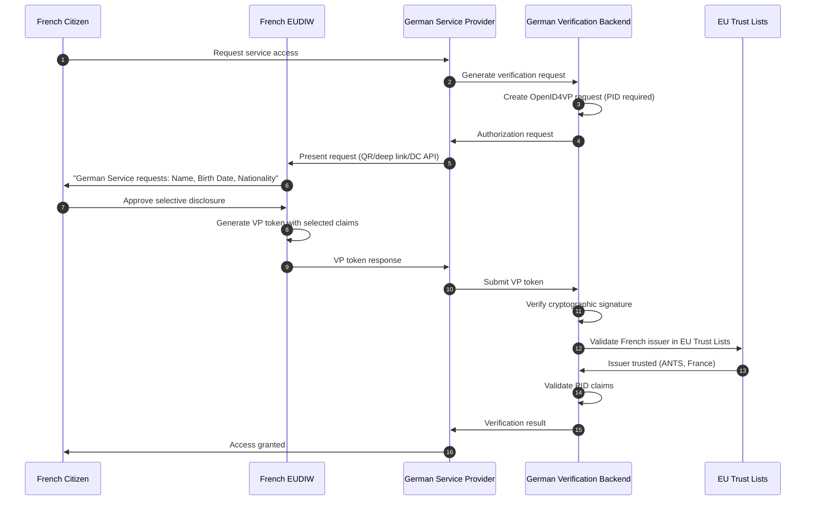
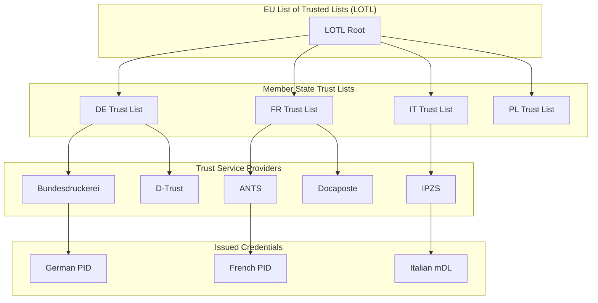
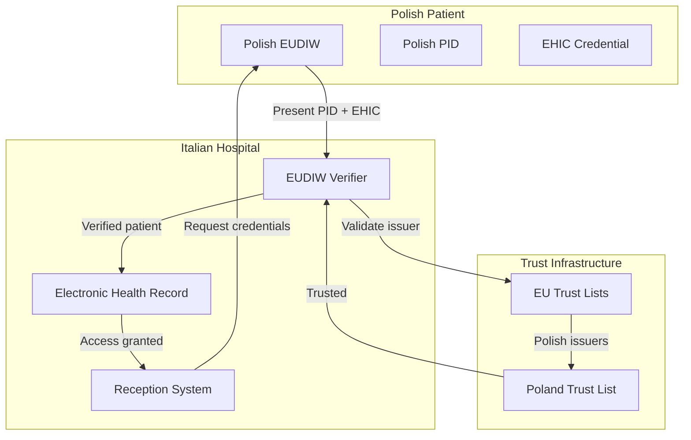

# Cross-Border Credential Verification with EU Digital Identity Wallet

> **Quick Facts**
>
> |              |                                                                                                                                                                     |
> | ------------ | ------------------------------------------------------------------------------------------------------------------------------------------------------------------- |
> | Industry     | Government / Financial Services / Healthcare / Travel / Education                                                                                                   |
> | Complexity   | High                                                                                                                                                                |
> | Key Packages | `SdJwt.Net.Eudiw`, `SdJwt.Net.Mdoc`, `SdJwt.Net.Oid4Vp`, `SdJwt.Net.HAIP`                                                                                           |
> | Sample       | [EudiwVerification.cs](https://github.com/openwallet-foundation-labs/sd-jwt-dotnet/tree/main/samples/SdJwt.Net.Samples/04-UseCases/Government/EudiwVerification.cs) |

## Executive Summary

The EU Digital Identity Wallet (EUDIW) is transforming how citizens interact with public and private services across the European Union. By 2026, all EU member states must accept EUDIW credentials, creating both a compliance requirement and a significant opportunity for service providers.

This creates a practical business imperative: organizations operating in the EU must implement EUDIW credential verification to maintain compliance and competitive relevance. The SD-JWT .NET ecosystem provides production-ready components for verifying Person Identification Data (PID), mobile driving licenses (mDL), and qualified attestations.

Key capabilities:

- **Cross-border acceptance**: A German verifier accepts French PID credentials seamlessly
- **Multi-format support**: Both mdoc (NFC/BLE) and SD-JWT VC (online) formats
- **Trust validation**: Integration with EU Trust Lists for issuer verification
- **Privacy compliance**: Selective disclosure meets GDPR requirements
- **HAIP security**: Cryptographic requirements for high-assurance scenarios

---

## 1) Why This Matters Now: Regulatory Mandate and Market Shift

### The Regulatory Environment

eIDAS 2.0 (Regulation 2024/1183) creates specific obligations:

| Requirement                          | Deadline | Impact                              |
| ------------------------------------ | -------- | ----------------------------------- |
| Member states issue EUDIW            | 2026     | Citizens get digital wallets        |
| Large private platforms accept EUDIW | 2026     | Banks, airlines, telcos must comply |
| Public services accept EUDIW         | 2026     | Government services go digital      |
| Cross-border recognition             | 2026     | Any EU wallet works anywhere in EU  |
| Qualified attestations               | 2027+    | Diplomas, licenses become digital   |

### Business Implications

**For Financial Services:**

- Banks must accept PID for account opening (KYC)
- Insurance companies verify credentials for claims
- Investment platforms onboard cross-border clients

**For Healthcare:**

- Hospitals verify patient identity cross-border
- Pharmacies accept digital prescriptions from any EU state
- Insurance claims processed with verified credentials

**For Travel and Hospitality:**

- Hotels verify guest identity at check-in
- Car rentals verify mDL cross-border
- Airlines implement seamless boarding

**For Education:**

- Universities verify prior credentials
- Employers verify qualifications
- Professional bodies validate memberships

---

## 2) Architecture Pattern: Multi-Country Credential Verification

### Diagram A: Cross-Border Verification Flow



### Diagram B: Trust Infrastructure



---

## 3) Use Case 1: Bank Account Opening (KYC)

**Scenario**: A German bank needs to verify identity for a French customer opening an account remotely.

### Requirements

- Verify customer is an EU citizen
- Collect mandatory KYC information (name, birth date, address)
- Validate credential issuer is authorized
- Meet regulatory audit requirements

### Implementation

```csharp
using SdJwt.Net.Eudiw.Arf;
using SdJwt.Net.Eudiw.Credentials;
using SdJwt.Net.Eudiw.TrustFramework;
using SdJwt.Net.Oid4Vp.Verifier;

public class EudiwKycService
{
    private readonly ArfProfileValidator _arfValidator;
    private readonly PidCredentialHandler _pidHandler;
    private readonly EuTrustListResolver _trustResolver;
    private readonly VpTokenValidator _vpValidator;

    public async Task<DcApiRequest> StartKycVerification(string sessionId)
    {
        var nonce = GenerateSecureNonce();

        // Request PID with mandatory KYC claims
        var presentationDefinition = new PresentationDefinition
        {
            Id = $"kyc-{sessionId}",
            Name = "Identity Verification for Account Opening",
            Purpose = "Verify your identity to open a bank account",
            InputDescriptors = new[]
            {
                new InputDescriptor
                {
                    Id = "pid_credential",
                    Name = "Person Identification Data",
                    Purpose = "Verify identity per EU regulations",
                    Format = new Dictionary<string, InputDescriptorFormat>
                    {
                        // Accept both mdoc and SD-JWT VC formats
                        ["mso_mdoc"] = new InputDescriptorFormat(),
                        ["vc+sd-jwt"] = new InputDescriptorFormat
                        {
                            Alg = new[] { "ES256", "ES384", "ES512" }
                        }
                    },
                    Constraints = new Constraints
                    {
                        LimitDisclosure = LimitDisclosure.Required,
                        Fields = new[]
                        {
                            // Mandatory KYC fields
                            new Field
                            {
                                Path = new[] { "$.family_name", "$.vc.credentialSubject.family_name" },
                                Intent_to_retain = true
                            },
                            new Field
                            {
                                Path = new[] { "$.given_name", "$.vc.credentialSubject.given_name" },
                                Intent_to_retain = true
                            },
                            new Field
                            {
                                Path = new[] { "$.birth_date", "$.vc.credentialSubject.birth_date" },
                                Intent_to_retain = true
                            },
                            new Field
                            {
                                Path = new[] { "$.issuing_country", "$.vc.credentialSubject.issuing_country" }
                            },
                            // Optional but useful
                            new Field
                            {
                                Path = new[] { "$.nationality", "$.vc.credentialSubject.nationality" },
                                Optional = true
                            }
                        }
                    }
                }
            }
        };

        return new DcApiRequestBuilder()
            .WithClientId("https://bank.example.de")
            .WithNonce(nonce)
            .WithPresentationDefinition(presentationDefinition)
            .WithResponseMode(DcApiResponseMode.DcApiJwt) // Encrypt PII
            .Build();
    }

    public async Task<KycResult> CompleteKycVerification(
        string sessionId,
        DcApiResponse response)
    {
        var expectedNonce = await GetStoredNonce(sessionId);

        // Step 1: Validate DC API response
        var dcResult = await _dcValidator.ValidateAsync(response, new DcApiValidationOptions
        {
            ExpectedOrigin = "https://bank.example.de",
            ExpectedNonce = expectedNonce,
            ValidateOrigin = true
        });

        if (!dcResult.IsValid)
        {
            return KycResult.Failed(dcResult.ErrorCode);
        }

        // Step 2: Validate algorithm is ARF-compliant
        if (!_arfValidator.ValidateAlgorithm(dcResult.Algorithm))
        {
            return KycResult.Failed("algorithm_not_compliant",
                "Credential uses non-ARF-compliant algorithm");
        }

        // Step 3: Validate credential type is PID
        var typeResult = _arfValidator.ValidateCredentialType(dcResult.CredentialType);
        if (!typeResult.IsValid || typeResult.CredentialType != ArfCredentialType.Pid)
        {
            return KycResult.Failed("invalid_credential_type",
                "Credential is not a valid EU PID");
        }

        // Step 4: Validate issuing country is EU member state
        var issuingCountry = ExtractClaim<string>(dcResult.Credentials, "issuing_country");
        if (!_arfValidator.ValidateMemberState(issuingCountry))
        {
            return KycResult.Failed("non_eu_issuer",
                $"Issuing country {issuingCountry} is not an EU member state");
        }

        // Step 5: Validate issuer against EU Trust Lists
        var trustResult = await _trustResolver.ValidateTrustChainAsync(
            dcResult.IssuerIdentifier,
            issuingCountry);

        if (!trustResult.IsValid)
        {
            return KycResult.Failed("untrusted_issuer",
                $"Issuer not found in EU Trust Lists: {trustResult.ErrorMessage}");
        }

        // Step 6: Validate mandatory PID claims
        var pidValidation = _pidHandler.Validate(dcResult.Credentials);
        if (!pidValidation.IsValid)
        {
            return KycResult.Failed("invalid_pid_claims",
                string.Join("; ", pidValidation.Errors));
        }

        // Step 7: Extract verified data
        var pidCredential = _pidHandler.ToPidCredential(dcResult.Credentials);

        // Create KYC record for compliance
        await CreateKycAuditRecord(sessionId, pidCredential, trustResult.TspName);

        return KycResult.Success(new VerifiedCustomer
        {
            FamilyName = pidCredential.FamilyName,
            GivenName = pidCredential.GivenName,
            BirthDate = pidCredential.BirthDate,
            IssuingCountry = pidCredential.IssuingCountry,
            VerificationTimestamp = DateTimeOffset.UtcNow,
            TrustServiceProvider = trustResult.TspName
        });
    }
}
```

### Compliance Record Structure

```csharp
public class KycAuditRecord
{
    public string SessionId { get; set; }
    public DateTimeOffset VerificationTimestamp { get; set; }
    public string CredentialType { get; set; } // "eu.europa.ec.eudi.pid.1"
    public string IssuingCountry { get; set; } // "FR"
    public string TrustServiceProvider { get; set; } // "ANTS"
    public string Algorithm { get; set; } // "ES256"
    public string[] DisclosedClaims { get; set; } // ["family_name", "given_name", "birth_date"]
    public bool TrustChainValid { get; set; }
    public string VerificationResult { get; set; } // "success" | "failed"
}
```

---

## 4) Use Case 2: Healthcare Cross-Border

**Scenario**: An Italian hospital needs to verify the identity of a Polish patient and access their European Health Insurance Card (EHIC) equivalent credential.

### Diagram: Healthcare Verification Flow



### Implementation

```csharp
using SdJwt.Net.Eudiw.Arf;
using SdJwt.Net.Oid4Vp.Models;

public class HealthcareVerificationService
{
    private readonly ArfProfileValidator _arfValidator;
    private readonly EuTrustListResolver _trustResolver;

    public async Task<DcApiRequest> CreatePatientVerificationRequest(
        string sessionId,
        bool requireEhic = true)
    {
        var descriptors = new List<InputDescriptor>
        {
            // Primary: Person Identification
            new InputDescriptor
            {
                Id = "patient_identity",
                Name = "Patient Identification",
                Purpose = "Verify patient identity for healthcare services",
                Group = new[] { "identity" },
                Format = new Dictionary<string, InputDescriptorFormat>
                {
                    ["mso_mdoc"] = new InputDescriptorFormat(),
                    ["vc+sd-jwt"] = new InputDescriptorFormat
                    {
                        Alg = new[] { "ES256", "ES384" }
                    }
                },
                Constraints = new Constraints
                {
                    Fields = new[]
                    {
                        new Field { Path = new[] { "$.family_name" } },
                        new Field { Path = new[] { "$.given_name" } },
                        new Field { Path = new[] { "$.birth_date" } },
                        new Field { Path = new[] { "$.issuing_country" } }
                    }
                }
            }
        };

        if (requireEhic)
        {
            descriptors.Add(new InputDescriptor
            {
                Id = "health_insurance",
                Name = "European Health Insurance Card",
                Purpose = "Verify health insurance coverage",
                Group = new[] { "insurance" },
                Constraints = new Constraints
                {
                    Fields = new[]
                    {
                        new Field { Path = new[] { "$.insurance_number" } },
                        new Field { Path = new[] { "$.insurance_provider" } },
                        new Field { Path = new[] { "$.coverage_country" } },
                        new Field { Path = new[] { "$.expiry_date" } }
                    }
                }
            });
        }

        var presentationDefinition = new PresentationDefinition
        {
            Id = $"healthcare-{sessionId}",
            InputDescriptors = descriptors.ToArray(),
            SubmissionRequirements = new[]
            {
                new SubmissionRequirement
                {
                    Rule = SubmissionRule.All,
                    From = "identity"
                },
                new SubmissionRequirement
                {
                    Rule = SubmissionRule.Pick,
                    Count = 1,
                    From = "insurance"
                }
            }
        };

        return new DcApiRequestBuilder()
            .WithClientId("https://hospital.example.it")
            .WithNonce(GenerateSecureNonce())
            .WithPresentationDefinition(presentationDefinition)
            .Build();
    }

    public async Task<PatientVerificationResult> VerifyPatient(
        string sessionId,
        string vpToken)
    {
        // Parse and validate VP token
        var vpResult = await _vpValidator.ValidateAsync(vpToken);
        if (!vpResult.IsValid)
        {
            return PatientVerificationResult.Failed(vpResult.ErrorMessage);
        }

        // Extract credentials from VP
        var credentials = vpResult.VerifiableCredentials;

        // Validate each credential
        foreach (var credential in credentials)
        {
            // Validate algorithm
            if (!_arfValidator.ValidateAlgorithm(credential.Algorithm))
            {
                return PatientVerificationResult.Failed(
                    $"Credential {credential.Type} uses non-compliant algorithm");
            }

            // Validate issuer
            var issuingCountry = credential.GetClaim<string>("issuing_country");
            if (!_arfValidator.ValidateMemberState(issuingCountry))
            {
                return PatientVerificationResult.Failed(
                    $"Credential from non-EU country: {issuingCountry}");
            }

            // Validate trust chain
            var trustResult = await _trustResolver.ValidateTrustChainAsync(
                credential.Issuer, issuingCountry);

            if (!trustResult.IsValid)
            {
                return PatientVerificationResult.Failed(
                    $"Untrusted issuer: {credential.Issuer}");
            }
        }

        // Extract patient data
        var pidCredential = credentials.First(c =>
            c.Type == EudiwConstants.Pid.DocType ||
            c.Type.StartsWith("eu.europa.ec.eudi.pid"));

        var ehic = credentials.FirstOrDefault(c =>
            c.Type.Contains("health_insurance"));

        return PatientVerificationResult.Success(new VerifiedPatient
        {
            FamilyName = pidCredential.GetClaim<string>("family_name"),
            GivenName = pidCredential.GetClaim<string>("given_name"),
            BirthDate = pidCredential.GetClaim<DateTime>("birth_date"),
            HomeCountry = pidCredential.GetClaim<string>("issuing_country"),
            InsuranceNumber = ehic?.GetClaim<string>("insurance_number"),
            InsuranceProvider = ehic?.GetClaim<string>("insurance_provider")
        });
    }
}
```

---

## 5) Use Case 3: Educational Credential Verification

**Scenario**: A multinational company needs to verify a job candidate's university diploma issued as a QEAA (Qualified Electronic Attestation of Attributes).

### Implementation

```csharp
using SdJwt.Net.Eudiw.Arf;
using SdJwt.Net.Eudiw.Credentials;

public class DiplomaVerificationService
{
    private readonly ArfProfileValidator _arfValidator;
    private readonly QeaaHandler _qeaaHandler;
    private readonly EuTrustListResolver _trustResolver;

    public async Task<DcApiRequest> CreateDiplomaVerificationRequest(string sessionId)
    {
        var presentationDefinition = new PresentationDefinition
        {
            Id = $"diploma-{sessionId}",
            Name = "Educational Credential Verification",
            Purpose = "Verify academic qualifications for employment",
            InputDescriptors = new[]
            {
                new InputDescriptor
                {
                    Id = "university_diploma",
                    Name = "University Diploma",
                    Purpose = "Verify highest academic qualification",
                    Format = new Dictionary<string, InputDescriptorFormat>
                    {
                        ["vc+sd-jwt"] = new InputDescriptorFormat
                        {
                            Alg = new[] { "ES256", "ES384" }
                        }
                    },
                    Constraints = new Constraints
                    {
                        LimitDisclosure = LimitDisclosure.Required,
                        Fields = new[]
                        {
                            new Field
                            {
                                Path = new[] { "$.vc.type" },
                                Filter = new Filter
                                {
                                    Type = "array",
                                    Contains = new Filter
                                    {
                                        Type = "string",
                                        Pattern = ".*Diploma.*|.*Degree.*"
                                    }
                                }
                            },
                            new Field
                            {
                                Path = new[] { "$.degree_type" },
                                Filter = new Filter
                                {
                                    Type = "string",
                                    Enum = new[] { "Bachelor", "Masters", "Doctorate", "PhD" }
                                }
                            },
                            new Field { Path = new[] { "$.field_of_study" } },
                            new Field { Path = new[] { "$.issuing_institution" } },
                            new Field { Path = new[] { "$.graduation_date" } },
                            new Field { Path = new[] { "$.issuing_country" } }
                        }
                    }
                },
                // Optionally request PID to link to candidate
                new InputDescriptor
                {
                    Id = "candidate_identity",
                    Name = "Candidate Identity",
                    Purpose = "Link diploma to candidate identity",
                    Optional = true,
                    Format = new Dictionary<string, InputDescriptorFormat>
                    {
                        ["vc+sd-jwt"] = new InputDescriptorFormat
                        {
                            Alg = new[] { "ES256" }
                        }
                    },
                    Constraints = new Constraints
                    {
                        LimitDisclosure = LimitDisclosure.Required,
                        Fields = new[]
                        {
                            new Field { Path = new[] { "$.family_name" } },
                            new Field { Path = new[] { "$.given_name" } }
                        }
                    }
                }
            }
        };

        return new DcApiRequestBuilder()
            .WithClientId("https://hr.enterprise.example.com")
            .WithNonce(GenerateSecureNonce())
            .WithPresentationDefinition(presentationDefinition)
            .Build();
    }

    public async Task<DiplomaVerificationResult> VerifyDiploma(
        string sessionId,
        DcApiResponse response)
    {
        // Validate response
        var result = await _dcValidator.ValidateAsync(response, options);
        if (!result.IsValid)
        {
            return DiplomaVerificationResult.Failed(result.ErrorCode);
        }

        // Validate credential type is QEAA
        var typeResult = _arfValidator.ValidateCredentialType(result.CredentialType);
        if (!typeResult.IsValid || typeResult.CredentialType != ArfCredentialType.Qeaa)
        {
            // Non-QEAA diplomas have lower trust level
            return DiplomaVerificationResult.Warning(
                "Diploma is EAA (non-qualified). Manual verification recommended.");
        }

        // Validate issuer is authorized to issue educational QEAAs
        var trustResult = await _trustResolver.ValidateTrustChainAsync(
            result.IssuerIdentifier,
            result.IssuingCountry,
            TrustServiceType.QualifiedCertificateIssuer);

        if (!trustResult.IsValid)
        {
            return DiplomaVerificationResult.Failed(
                "Issuer not authorized to issue qualified educational attestations");
        }

        // Validate QEAA-specific requirements
        var qeaaValidation = _qeaaHandler.Validate(
            result.Credentials,
            QeaaType.EducationalCredential);

        if (!qeaaValidation.IsValid)
        {
            return DiplomaVerificationResult.Failed(
                string.Join("; ", qeaaValidation.Errors));
        }

        // Extract diploma data
        return DiplomaVerificationResult.Success(new VerifiedDiploma
        {
            DegreeType = result.Credentials["degree_type"].ToString(),
            FieldOfStudy = result.Credentials["field_of_study"].ToString(),
            Institution = result.Credentials["issuing_institution"].ToString(),
            GraduationDate = DateTime.Parse(result.Credentials["graduation_date"].ToString()),
            IssuingCountry = result.Credentials["issuing_country"].ToString(),
            IsQualified = true,
            TrustServiceProvider = trustResult.TspName
        });
    }
}
```

---

## 6) Using EudiWallet for Holder Applications

When building wallet applications (holder side), use the `EudiWallet` class which provides built-in ARF compliance and EU Trust List integration:

### Basic Setup

```csharp
using SdJwt.Net.Eudiw;
using SdJwt.Net.Wallet.Storage;

// Create EUDI-compliant wallet
var store = new InMemoryCredentialStore();
var keyManager = new SoftwareKeyManager();

var options = new EudiWalletOptions
{
    WalletId = "citizen-wallet-001",
    EnforceArfCompliance = true,           // Enforce ARF algorithms
    MinimumHaipLevel = 2,                   // HAIP Level 2 (Very High)
    ValidateIssuerTrust = true,             // Validate against EU Trust Lists
    SupportedCredentialTypes = new[]
    {
        EudiwConstants.Pid.DocType,
        EudiwConstants.Mdl.DocType
    }
};

var wallet = new EudiWallet(store, keyManager, eudiOptions: options);
```

### Storing and Validating Credentials

```csharp
// Store credential with automatic ARF validation
try
{
    var stored = await wallet.StoreCredentialAsync(receivedCredential);
    Console.WriteLine($"Stored: {stored.Id}");
}
catch (ArfComplianceException ex)
{
    // Algorithm or format not ARF-compliant
    Console.WriteLine($"Rejected: {string.Join(", ", ex.Violations)}");
}
catch (EudiTrustException ex)
{
    // Issuer not in EU Trust Lists
    Console.WriteLine($"Untrusted issuer: {ex.Message}");
}
```

### Validating Member States

```csharp
// Validate issuer is from EU member state
if (wallet.ValidateMemberState("FR"))
{
    // French issuer - proceed
}
else if (wallet.ValidateMemberState("GB"))
{
    // UK issuer - reject (not EU)
}
```

### Finding Credentials by Type

```csharp
// Find all PID credentials
var pidCredentials = await wallet.FindPidCredentialsAsync();

// Find all mDL credentials
var mdlCredentials = await wallet.FindMdlCredentialsAsync();
```

### Creating Presentations

```csharp
// Create presentation with ARF enforcement
var presentation = await wallet.CreatePresentationAsync(
    credentialId: pidCredential.Id,
    disclosurePaths: new[] { "family_name", "birth_date", "age_over_18" },
    audience: "https://verifier.example.eu",
    nonce: "unique-nonce-123"
);
```

See [EUDI Wallet Integration Guide](../guides/eudi-wallet-integration.md) for complete wallet implementation details.

---

## 8) Implementation Checklist

### Regulatory Compliance

- [ ] Support all 27 EU member state issuers
- [ ] Integrate with EU Trust Lists (LOTL)
- [ ] Implement ARF algorithm validation
- [ ] Log verification for audit trail
- [ ] Handle cross-border data protection (GDPR)

### Technical Implementation

- [ ] Install `SdJwt.Net.Eudiw` package
- [ ] Configure `ArfProfileValidator`
- [ ] Set up `EuTrustListResolver` with caching
- [ ] Implement `PidCredentialHandler` for KYC
- [ ] Add `QeaaHandler` for attestation verification
- [ ] Configure RP registration validation

### Security

- [ ] Use ARF-compliant algorithms only (ES256, ES384, ES512)
- [ ] Validate issuer against EU Trust Lists
- [ ] Implement selective disclosure (request only needed claims)
- [ ] Use encrypted response mode for PII
- [ ] Validate credential freshness

### Testing

- [ ] Test with credentials from multiple member states
- [ ] Verify trust chain validation works
- [ ] Test algorithm rejection for non-compliant credentials
- [ ] Validate error handling for expired credentials
- [ ] Test with both mdoc and SD-JWT VC formats

---

## 9) Business Impact Summary

| Metric                | Manual Verification   | EUDIW Verification  |
| --------------------- | --------------------- | ------------------- |
| Verification time     | Hours to days         | Seconds             |
| Cross-border support  | Complex legal process | Built-in            |
| Fraud prevention      | Document inspection   | Cryptographic proof |
| Compliance audit      | Paper trail           | Digital, immutable  |
| Customer experience   | Friction, drop-off    | Seamless            |
| Cost per verification | High (manual labor)   | Infrastructure only |

---

## Related Documentation

- [EUDIW Deep Dive](../concepts/eudiw-deep-dive.md) - Technical implementation details
- [HAIP Compliance](../concepts/haip-compliance.md) - Security requirements
- [mdoc Deep Dive](../concepts/mdoc-deep-dive.md) - Mobile document verification
- [OpenID4VP Deep Dive](../concepts/openid4vp-deep-dive.md) - Presentation protocol

## References

- eIDAS 2.0 Regulation: <https://eur-lex.europa.eu/legal-content/EN/TXT/?uri=CELEX%3A32024R1183>
- Architecture Reference Framework: <https://digital-strategy.ec.europa.eu/en/library/european-digital-identity-wallet-architecture-and-reference-framework>
- EU Trust Lists Browser: <https://eidas.ec.europa.eu/efda/tl-browser/>
- EUDIW Large-Scale Pilots: <https://digital-strategy.ec.europa.eu/en/policies/eudi-wallet-pilots>
- PID Rulebook: <https://github.com/eu-digital-identity-wallet/eudi-doc-architecture-and-reference-framework>
