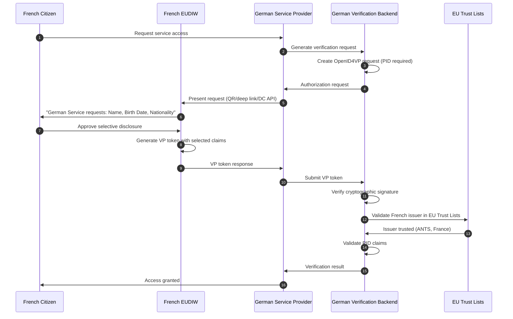
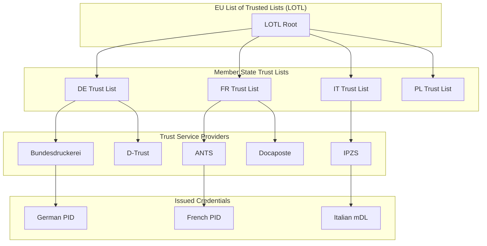
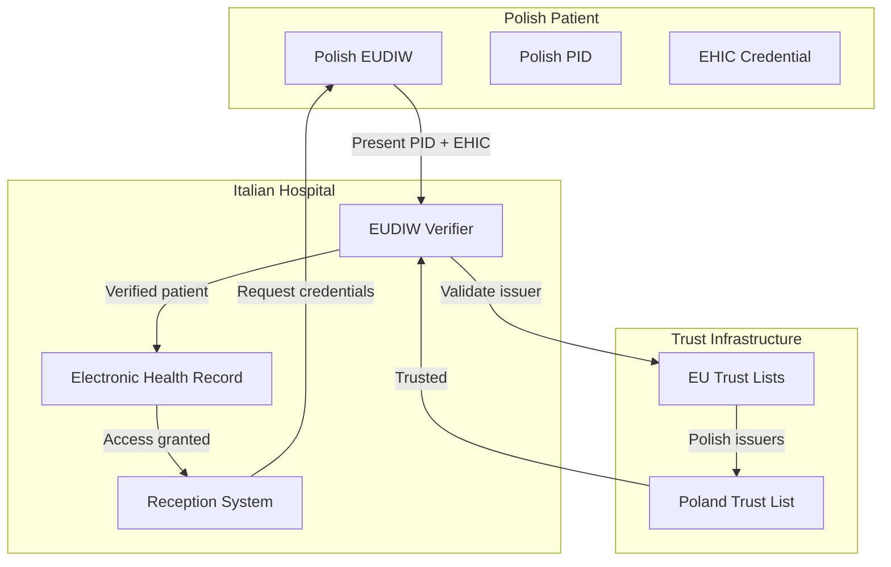

# Cross-Border Credential Verification with EU Digital Identity Wallet

> **Quick Facts**
>
> |              |                                                                                                                                                                         |
> | ------------ | ----------------------------------------------------------------------------------------------------------------------------------------------------------------------- |
> | Industry     | Government / Financial Services / Healthcare / Travel / Education                                                                                                       |
> | Complexity   | High                                                                                                                                                                    |
> | Key Packages | `SdJwt.Net.Eudiw`, `SdJwt.Net.Mdoc`, `SdJwt.Net.Oid4Vp`, `SdJwt.Net.HAIP`                                                                                               |
> | Sample       | [CrossBorderIdentity.cs](https://github.com/openwallet-foundation-labs/sd-jwt-dotnet/tree/main/samples/SdJwt.Net.Samples/04-UseCases/Government/CrossBorderIdentity.cs) |

## Executive summary

The EU Digital Identity Wallet (EUDIW) is changing how citizens interact with public and private services across the European Union. By 2026, all EU member states must accept EUDIW credentials, creating a compliance requirement and a direct opportunity for service providers.

Organizations operating in the EU need to implement EUDIW credential verification to stay compliant and relevant. The SD-JWT .NET ecosystem provides the components needed for verifying Person Identification Data (PID), mobile driving licenses (mDL), and qualified attestations.

Key capabilities:

- **Cross-border acceptance**: A German verifier accepts French PID credentials without additional configuration
- **Multi-format support**: Both mdoc (NFC/BLE) and SD-JWT VC (online) formats
- **Trust validation**: Integration with EU Trust Lists for issuer verification
- **Privacy compliance**: Selective disclosure meets GDPR requirements
- **HAIP security**: Cryptographic requirements for high-assurance scenarios

---

## In plain English

The EU Digital Identity Wallet (EUDIW) will let European citizens present identity credentials across borders - proving qualifications, insurance status, or identity to services in other member states. But building a verifier that works across 27 member states, multiple credential formats, and evolving regulations is complex. This use case shows how SD-JWT .NET's EUDIW reference models, HAIP profile validation, and OID4VP protocol support help developers build cross-border verification services.

## What SD-JWT .NET provides

**Provides:** EUDIW/ARF reference wallet models (`SdJwt.Net.Eudiw`), HAIP profile validation for interoperability requirements, OID4VP for presentation protocol, OID4VCI for credential issuance, and SD-JWT VC / mdoc dual-format handling.

**Does not provide:** Certified EUDIW wallet components, eIDAS 2.0 conformity assessment, member state trust list infrastructure, or regulatory certification. The `SdJwt.Net.Eudiw` package provides reference models for experimentation and prototyping, not certified production components.

## Risks and limitations

- EUDIW/ARF specifications are evolving; the reference models track the current drafts
- Member state trust lists and accredited issuers are not yet fully deployed
- Cross-border credential acceptance depends on bilateral and multilateral agreements
- The `SdJwt.Net.Eudiw` package is a reference implementation, not a certified wallet SDK
- Section numbering in this document skips from 6 to 8; this is intentional (section 7 was reserved for future content)

> **Reference boundary:** The `SdJwt.Net.Eudiw` package provides reference models aligned with the current EUDIW Architecture Reference Framework (ARF). These models are designed for prototyping and experimentation. Production EUDIW deployments require certified wallet SDKs and accredited issuers per the applicable eIDAS 2.0 implementing acts.

---

## 1) Why this matters now: regulatory mandate and market shift

### The regulatory environment

eIDAS 2.0 (Regulation 2024/1183) creates specific obligations:

| Requirement                          | Deadline | Impact                              |
| ------------------------------------ | -------- | ----------------------------------- |
| Member states issue EUDIW            | 2026     | Citizens get digital wallets        |
| Large private platforms accept EUDIW | 2026     | Banks, airlines, telcos must comply |
| Public services accept EUDIW         | 2026     | Government services go digital      |
| Cross-border recognition             | 2026     | Any EU wallet works anywhere in EU  |
| Qualified attestations               | 2027+    | Diplomas, licenses become digital   |

### Business implications

**For financial services:** Banks must accept PID for account opening (KYC). Insurance companies verify credentials for claims. Investment platforms onboard cross-border clients.

**For healthcare:** Hospitals verify patient identity cross-border. Pharmacies accept digital prescriptions from any EU state. Insurance claims are processed with verified credentials.

**For travel and hospitality:** Hotels verify guest identity at check-in. Car rentals verify mDL cross-border. Airlines implement wallet-based boarding.

**For education:** Universities verify prior credentials. Employers verify qualifications. Professional bodies validate memberships.

---

## 2) Architecture pattern: multi-country credential verification

### Diagram A: Cross-border verification flow


```mermaid
sequenceDiagram
    autonumber
    participant French as French Citizen
    participant Wallet as French EUDIW
    participant German as German Service Provider
    participant Backend as German Verification Backend
    participant Trust as EU Trust Lists

    French->>German: Request service access
    German->>Backend: Generate verification request
    Backend->>Backend: Create OpenID4VP request (PID required)
    Backend->>German: Authorization request
    German->>Wallet: Present request (QR/deep link/DC API)
    Wallet->>French: "German Service requests: Name, Birth Date, Nationality"
    French->>Wallet: Approve selective disclosure
    Wallet->>Wallet: Generate VP token with selected claims
    Wallet->>German: VP token response
    German->>Backend: Submit VP token
    Backend->>Backend: Verify cryptographic signature
    Backend->>Trust: Validate French issuer in EU Trust Lists
    Trust->>Backend: Issuer trusted (ANTS, France)
    Backend->>Backend: Validate PID claims
    Backend->>German: Verification result
    German->>French: Access granted
```

### Diagram B: Trust infrastructure


```mermaid
flowchart TB
    subgraph LOTL["EU List of Trusted Lists (LOTL)"]
        Master["LOTL Root"]
    end

    subgraph MemberStates["Member State Trust Lists"]
        DE["DE Trust List"]
        FR["FR Trust List"]
        IT["IT Trust List"]
        PL["PL Trust List"]
    end

    subgraph TSPs["Trust Service Providers"]
        DE_TSP1["Bundesdruckerei"]
        DE_TSP2["D-Trust"]
        FR_TSP1["ANTS"]
        FR_TSP2["Docaposte"]
        IT_TSP1["IPZS"]
    end

    Master --> DE
    Master --> FR
    Master --> IT
    Master --> PL
    DE --> DE_TSP1
    DE --> DE_TSP2
    FR --> FR_TSP1
    FR --> FR_TSP2
    IT --> IT_TSP1

    subgraph Credentials["Issued Credentials"]
        PID_DE["German PID"]
        PID_FR["French PID"]
        MDL_IT["Italian mDL"]
    end

    DE_TSP1 --> PID_DE
    FR_TSP1 --> PID_FR
    IT_TSP1 --> MDL_IT
```

---

## 3) Use case 1: bank account opening (KYC)

**Scenario**: A German bank needs to verify identity for a French customer opening an account remotely.

### Requirements

- Verify customer is an EU citizen
- Collect mandatory KYC information (name, birth date, address)
- Validate credential issuer is authorized
- Meet regulatory audit requirements

### KYC implementation

```csharp
using SdJwt.Net.Eudiw.Arf;
using SdJwt.Net.Eudiw.Credentials;
using SdJwt.Net.Eudiw.TrustFramework;
using SdJwt.Net.Oid4Vp.Verifier;

public class EudiwKycService
{
    private readonly ArfProfileValidator _arfValidator;
    private readonly PidCredentialHandler _pidHandler;
    private readonly EuTrustListResolver _trustResolver;
    private readonly VpTokenValidator _vpValidator;

    public async Task<DcApiRequest> StartKycVerification(string sessionId)
    {
        var nonce = GenerateSecureNonce();

        // Request PID with mandatory KYC claims
        var presentationDefinition = new PresentationDefinition
        {
            Id = $"kyc-{sessionId}",
            Name = "Identity Verification for Account Opening",
            Purpose = "Verify your identity to open a bank account",
            InputDescriptors = new[]
            {
                new InputDescriptor
                {
                    Id = "pid_credential",
                    Name = "Person Identification Data",
                    Purpose = "Verify identity per EU regulations",
                    Format = new Dictionary<string, InputDescriptorFormat>
                    {
                        // Accept both mdoc and SD-JWT VC formats
                        ["mso_mdoc"] = new InputDescriptorFormat(),
                        ["dc+sd-jwt"] = new InputDescriptorFormat
                        {
                            Alg = new[] { "ES256", "ES384", "ES512" }
                        }
                    },
                    Constraints = new Constraints
                    {
                        LimitDisclosure = LimitDisclosure.Required,
                        Fields = new[]
                        {
                            // Mandatory KYC fields
                            new Field
                            {
                                Path = new[] { "$.family_name", "$.vc.credentialSubject.family_name" },
                                Intent_to_retain = true
                            },
                            new Field
                            {
                                Path = new[] { "$.given_name", "$.vc.credentialSubject.given_name" },
                                Intent_to_retain = true
                            },
                            new Field
                            {
                                Path = new[] { "$.birth_date", "$.vc.credentialSubject.birth_date" },
                                Intent_to_retain = true
                            },
                            new Field
                            {
                                Path = new[] { "$.issuing_country", "$.vc.credentialSubject.issuing_country" }
                            },
                            // Optional but useful
                            new Field
                            {
                                Path = new[] { "$.nationality", "$.vc.credentialSubject.nationality" },
                                Optional = true
                            }
                        }
                    }
                }
            }
        };

        return new DcApiRequestBuilder()
            .WithClientId("https://bank.example.de")
            .WithNonce(nonce)
            .WithPresentationDefinition(presentationDefinition)
            .WithResponseMode(DcApiResponseMode.DcApiJwt) // Encrypt PII
            .Build();
    }

    public async Task<KycResult> CompleteKycVerification(
        string sessionId,
        DcApiResponse response)
    {
        var expectedNonce = await GetStoredNonce(sessionId);

        // Step 1: Validate DC API response
        var dcResult = await _dcValidator.ValidateAsync(response, new DcApiValidationOptions
        {
            ExpectedOrigin = "https://bank.example.de",
            ExpectedNonce = expectedNonce,
            ValidateOrigin = true
        });

        if (!dcResult.IsValid)
        {
            return KycResult.Failed(dcResult.ErrorCode);
        }

        // Step 2: Validate algorithm against ARF-oriented policy
        if (!_arfValidator.ValidateAlgorithm(dcResult.Algorithm))
        {
            return KycResult.Failed("algorithm_not_compliant",
                "Credential uses an algorithm that is not allowed by the configured ARF-oriented policy");
        }

        // Step 3: Validate credential type is PID
        var typeResult = _arfValidator.ValidateCredentialType(dcResult.CredentialType);
        if (!typeResult.IsValid || typeResult.CredentialType != ArfCredentialType.Pid)
        {
            return KycResult.Failed("invalid_credential_type",
                "Credential is not a valid EU PID");
        }

        // Step 4: Validate issuing country is EU member state
        var issuingCountry = ExtractClaim<string>(dcResult.Credentials, "issuing_country");
        if (!_arfValidator.ValidateMemberState(issuingCountry))
        {
            return KycResult.Failed("non_eu_issuer",
                $"Issuing country {issuingCountry} is not an EU member state");
        }

        // Step 5: Validate issuer against EU Trust Lists
        var trustResult = await _trustResolver.ValidateTrustChainAsync(
            dcResult.IssuerIdentifier,
            issuingCountry);

        if (!trustResult.IsValid)
        {
            return KycResult.Failed("untrusted_issuer",
                $"Issuer not found in EU Trust Lists: {trustResult.ErrorMessage}");
        }

        // Step 6: Validate mandatory PID claims
        var pidValidation = _pidHandler.Validate(dcResult.Credentials);
        if (!pidValidation.IsValid)
        {
            return KycResult.Failed("invalid_pid_claims",
                string.Join("; ", pidValidation.Errors));
        }

        // Step 7: Extract verified data
        var pidCredential = _pidHandler.ToPidCredential(dcResult.Credentials);

        // Create KYC record for compliance
        await CreateKycAuditRecord(sessionId, pidCredential, trustResult.TspName);

        return KycResult.Success(new VerifiedCustomer
        {
            FamilyName = pidCredential.FamilyName,
            GivenName = pidCredential.GivenName,
            BirthDate = pidCredential.BirthDate,
            IssuingCountry = pidCredential.IssuingCountry,
            VerificationTimestamp = DateTimeOffset.UtcNow,
            TrustServiceProvider = trustResult.TspName
        });
    }
}
```

### Compliance Record Structure

```csharp
public class KycAuditRecord
{
    public string SessionId { get; set; }
    public DateTimeOffset VerificationTimestamp { get; set; }
    public string CredentialType { get; set; } // "eu.europa.ec.eudi.pid.1"
    public string IssuingCountry { get; set; } // "FR"
    public string TrustServiceProvider { get; set; } // "ANTS"
    public string Algorithm { get; set; } // "ES256"
    public string[] DisclosedClaims { get; set; } // ["family_name", "given_name", "birth_date"]
    public bool TrustChainValid { get; set; }
    public string VerificationResult { get; set; } // "success" | "failed"
}
```

---

## 4) Use case 2: healthcare cross-border

**Scenario**: An Italian hospital needs to verify the identity of a Polish patient and access their European Health Insurance Card (EHIC) equivalent credential.

### Diagram: healthcare verification flow


```mermaid
flowchart TB
    subgraph Patient["Polish Patient"]
        Wallet["Polish EUDIW"]
        PID["Polish PID"]
        EHIC["EHIC Credential"]
    end

    subgraph Hospital["Italian Hospital"]
        Reception["Reception System"]
        Verifier["EUDIW Verifier"]
        EHR["Electronic Health Record"]
    end

    subgraph Trust["Trust Infrastructure"]
        LOTL["EU Trust Lists"]
        PL_List["Poland Trust List"]
    end

    Reception -->|Request credentials| Wallet
    Wallet -->|Present PID + EHIC| Verifier
    Verifier -->|Validate issuer| LOTL
    LOTL -->|Polish issuers| PL_List
    PL_List -->|Trusted| Verifier
    Verifier -->|Verified patient| EHR
    EHR -->|Access granted| Reception
```

### Healthcare implementation

```csharp
using SdJwt.Net.Eudiw.Arf;
using SdJwt.Net.Oid4Vp.Models;

public class HealthcareVerificationService
{
    private readonly ArfProfileValidator _arfValidator;
    private readonly EuTrustListResolver _trustResolver;

    public async Task<DcApiRequest> CreatePatientVerificationRequest(
        string sessionId,
        bool requireEhic = true)
    {
        var descriptors = new List<InputDescriptor>
        {
            // Primary: Person Identification
            new InputDescriptor
            {
                Id = "patient_identity",
                Name = "Patient Identification",
                Purpose = "Verify patient identity for healthcare services",
                Group = new[] { "identity" },
                Format = new Dictionary<string, InputDescriptorFormat>
                {
                    ["mso_mdoc"] = new InputDescriptorFormat(),
                    ["dc+sd-jwt"] = new InputDescriptorFormat
                    {
                        Alg = new[] { "ES256", "ES384" }
                    }
                },
                Constraints = new Constraints
                {
                    Fields = new[]
                    {
                        new Field { Path = new[] { "$.family_name" } },
                        new Field { Path = new[] { "$.given_name" } },
                        new Field { Path = new[] { "$.birth_date" } },
                        new Field { Path = new[] { "$.issuing_country" } }
                    }
                }
            }
        };

        if (requireEhic)
        {
            descriptors.Add(new InputDescriptor
            {
                Id = "health_insurance",
                Name = "European Health Insurance Card",
                Purpose = "Verify health insurance coverage",
                Group = new[] { "insurance" },
                Constraints = new Constraints
                {
                    Fields = new[]
                    {
                        new Field { Path = new[] { "$.insurance_number" } },
                        new Field { Path = new[] { "$.insurance_provider" } },
                        new Field { Path = new[] { "$.coverage_country" } },
                        new Field { Path = new[] { "$.expiry_date" } }
                    }
                }
            });
        }

        var presentationDefinition = new PresentationDefinition
        {
            Id = $"healthcare-{sessionId}",
            InputDescriptors = descriptors.ToArray(),
            SubmissionRequirements = new[]
            {
                new SubmissionRequirement
                {
                    Rule = SubmissionRule.All,
                    From = "identity"
                },
                new SubmissionRequirement
                {
                    Rule = SubmissionRule.Pick,
                    Count = 1,
                    From = "insurance"
                }
            }
        };

        return new DcApiRequestBuilder()
            .WithClientId("https://hospital.example.it")
            .WithNonce(GenerateSecureNonce())
            .WithPresentationDefinition(presentationDefinition)
            .Build();
    }

    public async Task<PatientVerificationResult> VerifyPatient(
        string sessionId,
        string vpToken)
    {
        // Parse and validate VP token
        var vpResult = await _vpValidator.ValidateAsync(vpToken);
        if (!vpResult.IsValid)
        {
            return PatientVerificationResult.Failed(vpResult.ErrorMessage);
        }

        // Extract credentials from VP
        var credentials = vpResult.VerifiableCredentials;

        // Validate each credential
        foreach (var credential in credentials)
        {
            // Validate algorithm
            if (!_arfValidator.ValidateAlgorithm(credential.Algorithm))
            {
                return PatientVerificationResult.Failed(
                    $"Credential {credential.Type} uses non-compliant algorithm");
            }

            // Validate issuer
            var issuingCountry = credential.GetClaim<string>("issuing_country");
            if (!_arfValidator.ValidateMemberState(issuingCountry))
            {
                return PatientVerificationResult.Failed(
                    $"Credential from non-EU country: {issuingCountry}");
            }

            // Validate trust chain
            var trustResult = await _trustResolver.ValidateTrustChainAsync(
                credential.Issuer, issuingCountry);

            if (!trustResult.IsValid)
            {
                return PatientVerificationResult.Failed(
                    $"Untrusted issuer: {credential.Issuer}");
            }
        }

        // Extract patient data
        var pidCredential = credentials.First(c =>
            c.Type == EudiwConstants.Pid.DocType ||
            c.Type.StartsWith("eu.europa.ec.eudi.pid"));

        var ehic = credentials.FirstOrDefault(c =>
            c.Type.Contains("health_insurance"));

        return PatientVerificationResult.Success(new VerifiedPatient
        {
            FamilyName = pidCredential.GetClaim<string>("family_name"),
            GivenName = pidCredential.GetClaim<string>("given_name"),
            BirthDate = pidCredential.GetClaim<DateTime>("birth_date"),
            HomeCountry = pidCredential.GetClaim<string>("issuing_country"),
            InsuranceNumber = ehic?.GetClaim<string>("insurance_number"),
            InsuranceProvider = ehic?.GetClaim<string>("insurance_provider")
        });
    }
}
```

---

## 5) Use case 3: educational credential verification

**Scenario**: A multinational company needs to verify a job candidate's university diploma issued as a QEAA (Qualified Electronic Attestation of Attributes).

### Diploma verification implementation

```csharp
using SdJwt.Net.Eudiw.Arf;
using SdJwt.Net.Eudiw.Credentials;

public class DiplomaVerificationService
{
    private readonly ArfProfileValidator _arfValidator;
    private readonly QeaaHandler _qeaaHandler;
    private readonly EuTrustListResolver _trustResolver;

    public async Task<DcApiRequest> CreateDiplomaVerificationRequest(string sessionId)
    {
        var presentationDefinition = new PresentationDefinition
        {
            Id = $"diploma-{sessionId}",
            Name = "Educational Credential Verification",
            Purpose = "Verify academic qualifications for employment",
            InputDescriptors = new[]
            {
                new InputDescriptor
                {
                    Id = "university_diploma",
                    Name = "University Diploma",
                    Purpose = "Verify highest academic qualification",
                    Format = new Dictionary<string, InputDescriptorFormat>
                    {
                        ["dc+sd-jwt"] = new InputDescriptorFormat
                        {
                            Alg = new[] { "ES256", "ES384" }
                        }
                    },
                    Constraints = new Constraints
                    {
                        LimitDisclosure = LimitDisclosure.Required,
                        Fields = new[]
                        {
                            new Field
                            {
                                Path = new[] { "$.vc.type" },
                                Filter = new Filter
                                {
                                    Type = "array",
                                    Contains = new Filter
                                    {
                                        Type = "string",
                                        Pattern = ".*Diploma.*|.*Degree.*"
                                    }
                                }
                            },
                            new Field
                            {
                                Path = new[] { "$.degree_type" },
                                Filter = new Filter
                                {
                                    Type = "string",
                                    Enum = new[] { "Bachelor", "Masters", "Doctorate", "PhD" }
                                }
                            },
                            new Field { Path = new[] { "$.field_of_study" } },
                            new Field { Path = new[] { "$.issuing_institution" } },
                            new Field { Path = new[] { "$.graduation_date" } },
                            new Field { Path = new[] { "$.issuing_country" } }
                        }
                    }
                },
                // Optionally request PID to link to candidate
                new InputDescriptor
                {
                    Id = "candidate_identity",
                    Name = "Candidate Identity",
                    Purpose = "Link diploma to candidate identity",
                    Optional = true,
                    Format = new Dictionary<string, InputDescriptorFormat>
                    {
                        ["dc+sd-jwt"] = new InputDescriptorFormat
                        {
                            Alg = new[] { "ES256" }
                        }
                    },
                    Constraints = new Constraints
                    {
                        LimitDisclosure = LimitDisclosure.Required,
                        Fields = new[]
                        {
                            new Field { Path = new[] { "$.family_name" } },
                            new Field { Path = new[] { "$.given_name" } }
                        }
                    }
                }
            }
        };

        return new DcApiRequestBuilder()
            .WithClientId("https://hr.enterprise.example.com")
            .WithNonce(GenerateSecureNonce())
            .WithPresentationDefinition(presentationDefinition)
            .Build();
    }

    public async Task<DiplomaVerificationResult> VerifyDiploma(
        string sessionId,
        DcApiResponse response)
    {
        // Validate response
        var result = await _dcValidator.ValidateAsync(response, options);
        if (!result.IsValid)
        {
            return DiplomaVerificationResult.Failed(result.ErrorCode);
        }

        // Validate credential type is QEAA
        var typeResult = _arfValidator.ValidateCredentialType(result.CredentialType);
        if (!typeResult.IsValid || typeResult.CredentialType != ArfCredentialType.Qeaa)
        {
            // Non-QEAA diplomas have lower trust level
            return DiplomaVerificationResult.Warning(
                "Diploma is EAA (non-qualified). Manual verification recommended.");
        }

        // Validate issuer is authorized to issue educational QEAAs
        var trustResult = await _trustResolver.ValidateTrustChainAsync(
            result.IssuerIdentifier,
            result.IssuingCountry,
            TrustServiceType.QualifiedCertificateIssuer);

        if (!trustResult.IsValid)
        {
            return DiplomaVerificationResult.Failed(
                "Issuer not authorized to issue qualified educational attestations");
        }

        // Validate QEAA-specific requirements
        var qeaaValidation = _qeaaHandler.Validate(
            result.Credentials,
            QeaaType.EducationalCredential);

        if (!qeaaValidation.IsValid)
        {
            return DiplomaVerificationResult.Failed(
                string.Join("; ", qeaaValidation.Errors));
        }

        // Extract diploma data
        return DiplomaVerificationResult.Success(new VerifiedDiploma
        {
            DegreeType = result.Credentials["degree_type"].ToString(),
            FieldOfStudy = result.Credentials["field_of_study"].ToString(),
            Institution = result.Credentials["issuing_institution"].ToString(),
            GraduationDate = DateTime.Parse(result.Credentials["graduation_date"].ToString()),
            IssuingCountry = result.Credentials["issuing_country"].ToString(),
            IsQualified = true,
            TrustServiceProvider = trustResult.TspName
        });
    }
}
```

---

## 6) Using EudiWallet for holder applications

When building wallet applications (holder side), use the `EudiWallet` class which provides built-in ARF compliance and EU Trust List integration:

### Basic setup

```csharp
using SdJwt.Net.Eudiw;
using SdJwt.Net.Wallet.Storage;

// Create an EUDIW-style reference wallet
var store = new InMemoryCredentialStore();
var keyManager = new SoftwareKeyManager();

var options = new EudiWalletOptions
{
    WalletId = "citizen-wallet-001",
    EnforceArfCompliance = true,           // Enforce ARF algorithms
    MinimumHaipLevel = 2,                   // Legacy local HAIP policy setting
    ValidateIssuerTrust = true,             // Validate against EU Trust Lists
    SupportedCredentialTypes = new[]
    {
        EudiwConstants.Pid.DocType,
        EudiwConstants.Mdl.DocType
    }
};

var wallet = new EudiWallet(store, keyManager, eudiOptions: options);
```

### Storing and validating credentials

```csharp
// Store credential with automatic ARF validation
try
{
    var stored = await wallet.StoreCredentialAsync(receivedCredential);
    Console.WriteLine($"Stored: {stored.Id}");
}
catch (ArfComplianceException ex)
{
    // Algorithm or format is not allowed by the configured ARF-oriented policy
    Console.WriteLine($"Rejected: {string.Join(", ", ex.Violations)}");
}
catch (EudiTrustException ex)
{
    // Issuer not in EU Trust Lists
    Console.WriteLine($"Untrusted issuer: {ex.Message}");
}
```

### Validating member states

```csharp
// Validate issuer is from EU member state
if (wallet.ValidateMemberState("FR"))
{
    // French issuer - proceed
}
else if (wallet.ValidateMemberState("GB"))
{
    // UK issuer - reject (not EU)
}
```

### Finding credentials by type

```csharp
// Find all PID credentials
var pidCredentials = await wallet.FindPidCredentialsAsync();

// Find all mDL credentials
var mdlCredentials = await wallet.FindMdlCredentialsAsync();
```

### Creating presentations

```csharp
// Create presentation with ARF enforcement
var presentation = await wallet.CreatePresentationAsync(
    credentialId: pidCredential.Id,
    disclosurePaths: new[] { "family_name", "birth_date", "age_over_18" },
    audience: "https://verifier.example.eu",
    nonce: "unique-nonce-123"
);
```

See [EUDI Wallet Integration Guide](../guides/eudi-wallet-integration.md) for complete wallet implementation details.

---

## 8) Implementation checklist

### Regulatory compliance

- [ ] Support all 27 EU member state issuers
- [ ] Integrate with EU Trust Lists (LOTL)
- [ ] Implement ARF algorithm validation
- [ ] Log verification for audit trail
- [ ] Handle cross-border data protection (GDPR)

### Technical implementation

- [ ] Install `SdJwt.Net.Eudiw` package
- [ ] Configure `ArfProfileValidator`
- [ ] Set up `EuTrustListResolver` with caching
- [ ] Implement `PidCredentialHandler` for KYC
- [ ] Add `QeaaHandler` for attestation verification
- [ ] Configure RP registration validation

### Security

- [ ] Use algorithms allowed by the configured ARF-oriented policy (ES256, ES384, ES512)
- [ ] Validate issuer against EU Trust Lists
- [ ] Implement selective disclosure (request only needed claims)
- [ ] Use encrypted response mode for PII
- [ ] Validate credential freshness

### Testing

- [ ] Test with credentials from multiple member states
- [ ] Verify trust chain validation works
- [ ] Test algorithm rejection for non-compliant credentials
- [ ] Validate error handling for expired credentials
- [ ] Test with both mdoc and SD-JWT VC formats

---

## 9) Business impact summary

| Metric                | Manual Verification   | EUDIW Verification  |
| --------------------- | --------------------- | ------------------- |
| Verification time     | Hours to days         | Seconds             |
| Cross-border support  | Complex legal process | Built-in            |
| Fraud prevention      | Document inspection   | Cryptographic proof |
| Compliance audit      | Paper trail           | Digital, immutable  |
| Customer experience   | Friction, drop-off    | Low-friction        |
| Cost per verification | High (manual labor)   | Infrastructure only |

---

## Related documentation

- [EUDIW](../concepts/eudiw.md) - Technical implementation details
- [HAIP Profile Validation](../concepts/haip-compliance.md) - Security requirements
- [mdoc](../concepts/mdoc.md) - Mobile document verification
- [OpenID4VP](../concepts/openid4vp.md) - Presentation protocol

## References

- eIDAS 2.0 Regulation: <https://eur-lex.europa.eu/legal-content/EN/TXT/?uri=CELEX%3A32024R1183>
- Architecture Reference Framework: <https://digital-strategy.ec.europa.eu/en/library/european-digital-identity-wallet-architecture-and-reference-framework>
- EU Trust Lists Browser: <https://eidas.ec.europa.eu/efda/tl-browser/>
- EUDIW Large-Scale Pilots: <https://digital-strategy.ec.europa.eu/en/policies/eudi-wallet-pilots>
- PID Rulebook: <https://github.com/eu-digital-identity-wallet/eudi-doc-architecture-and-reference-framework>
